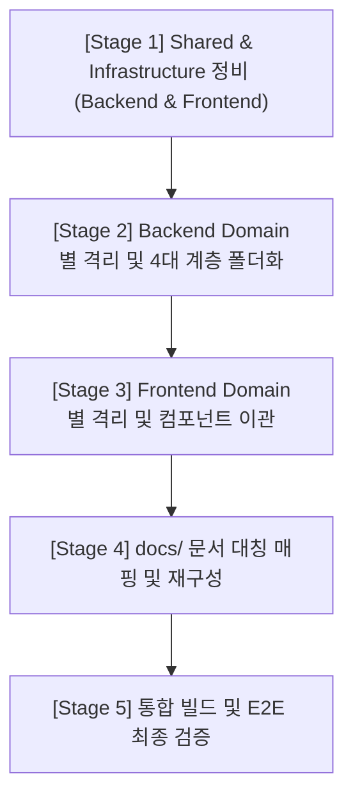

# Symmetrical Architecture Refactor Roadmap & Stage 1 Plan

본 문서는 DevHub 프로젝트의 소스코드(Backend/Frontend) 및 문서를 3대 레이어(Domain, Shared, Infrastructure) 및 도메인 내부 4대 계층 콘셉트에 맞게 대칭적으로 대개편하는 마스터 로드맵과 바로 진행할 **[Stage 1] 세부 작업 계획서**입니다.

---

## 1. 종합 작업 순서 (Overall Stages)

전체 작업은 의존성 복잡도와 빌드 안정성을 극대화하기 위해 다음과 같이 5단계로 점진적 이행합니다.

| 단계 | 작업 범위 | 핵심 성과 및 이관 대상 | 검증 수단 |
| --- | --- | --- | --- |
| **Stage 1** | Shared / Infrastructure | config, logger, utils, ui-foundation 공통 컴포넌트 | Go/Next.js 컴파일 검증 |
| **Stage 2** | Backend Domain | 10대 도메인별 폴더 신설, httpapi & store 파일 완전 격리 이관 | `go test -short ./...` |
| **Stage 3** | Frontend Domain | components/ 및 lib/ 서비스를 `@/domain/...` 으로 이관, App Router Thin Shell화 | `npx tsc --noEmit` & Build |
| **Stage 4** | Documents | docs/ 하위 파일을 domain/shared/infra 구조로 1:1 이관 정렬 | 마크다운 링크 린트 |
| **Stage 5** | 통합 검증 | 전체 아키텍처 연동 및 E2E 무결성 검증 | Playwright E2E Suite |

---

## 2. [Stage 1] 세부 작업 계획 (Stage 1 Detailed Plan)

* **목표**: 백엔드와 프론트엔드의 비즈니스 비종속 공통 요소(`Shared`) 및 구체 기술 연동 요소(`Infrastructure`)를 신규 물리 디렉토리로 안전하게 격리 이전하여 3대 레이어 구조의 뼈대를 안착시킵니다.
* **상태**: `done`

### 2.1 세부 작업 순서 및 체크리스트

#### [1단계] Go Backend Shared 및 Infrastructure 이관
- [x] `backend-core/internal/shared/` 디렉토리 생성
- [x] `backend-core/internal/config/` -> `backend-core/internal/shared/config/` 로 이동
- [x] `backend-core/internal/logger/` -> 표준 라이브러리 `log` 대체 검증 및 로컬 logger 부재 확인 (안전 제외)
- [x] `backend-core/internal/infrastructure/` 디렉토리 생성
- [x] `backend-core/internal/commandworker/` -> `backend-core/internal/infrastructure/commandworker/` 로 이동
- [x] `backend-core/internal/serviceaction/` -> `backend-core/internal/infrastructure/serviceaction/` 로 이동
- [x] `backend-core/internal/gitea/` -> `backend-core/internal/infrastructure/gitea/` 로 이동
- [x] `backend-core/internal/hrdb/` -> `backend-core/internal/infrastructure/hrdb/` 로 이동
- [x] 백엔드 전역 소스코드 내 `github.com/devhub/backend-core/internal/config` 등의 임포트 경로를 `github.com/devhub/backend-core/internal/shared/config` 와 `github.com/devhub/backend-core/internal/infrastructure/...` 로 일괄 전수 교정
- [x] **중간 검증**: `go build ./...` 및 `go test -short ./...` 컴파일 및 동작 무결성 패스 확보

#### [2단계] Next.js Frontend Shared 및 Infrastructure 이관
- [x] `frontend/tsconfig.json` 절대 경로 매핑에 `"@/shared/*": ["shared/*"]` 및 `"@/infrastructure/*": ["infrastructure/*"]` 설정 추가
- [x] `frontend/shared/` 및 `frontend/infrastructure/` 디렉토리 생성
- [x] `frontend/components/ui/` -> `frontend/shared/ui-foundation/components/` 로 이동
- [x] `frontend/components/layout/` -> `frontend/shared/ui-foundation/layout/` 로 이동
- [x] `frontend/lib/config/` -> `frontend/shared/config/` 로 이동
- [x] `frontend/lib/utils/` 및 `utils.ts` -> `frontend/shared/utils/` 로 이동
- [x] 프론트엔드 전역 소스코드의 `@/components/ui/...` 및 `@/lib/config/...` 임포트 구문을 신규 `@/shared/...` 로 일괄 전수 교정 및 node_modules 제외 정교화 치환 완료
- [x] **중간 검증**: `npx tsc --noEmit` 타입 검사 및 `npm run build` 정적 컴파일 무결성 패스 확보

---

## 3. 진척도 추적 (Progress Tracking)

* **Stage 1 시작일**: 2026-05-28
* **Stage 1 완료 목표일**: 2026-05-28 (실시간 이행)
* **Stage 1 진척률**: `100%` (완료)
