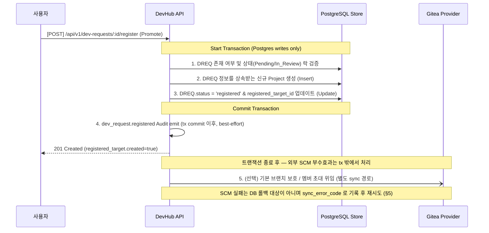

# platform-lifecycle 도메인 아키텍처

- 문서 목적: Platform 상세 대시보드(APPDASH) + Platform/Project lifecycle 관련 아키텍처를 정의한다.
- 범위: ARCH-APPDASH-01..06. Platform/Project/Repository 계층 운영 모델 자체는 `requirements.md` §2 + master `docs/architecture.md` §4.0 (SCM Adapter 원칙) + repository-integration architecture 참조.
- 대상 독자: backend / 프론트엔드 / DevOps, AI agent, 아키텍처 검토자.
- 상태: accepted
- 최종 수정일: 2026-05-29 (Phase 3 split, master `docs/architecture.md` §11 본문 이관)
- 관련 문서: [도메인 README](./README.md), [dashboard_concept](./dashboard_concept.md), [project_concept](./project_concept.md), [requirements.md](./requirements.md), [api.md](./api.md), [master architecture](../../architecture.md), [ADR-0011](../../adr/0011-rbac-row-scoping.md), [ADR-0013](../../adr/0013-dreq-rbac-row-scoping.md), [ADR-0014](../../adr/0014-application-project-lifecycle.md)

## 개요

Platform 상세 대시보드에서 제공해야 할 다차원 롤업 정보, 실시간 헬스 메트릭 및 요구사항-개발-배포 연계 추적을 처리하는 도메인. 컨셉 문서: [`./dashboard_concept.md`](./dashboard_concept.md). 요구사항: [`./requirements.md` §3 (APPDASH)](./requirements.md). Usecase: [`UC-APPDASH-01..07` (`system_usecases.md §2.15`)](../../planning/system_usecases.md).

## 1. 아키텍처 구조도 (ARCH-APPDASH-01)

```
                       +---------------------------------------+
                       |    Frontend: Platform Dashboard    |
                       +---------------------------------------+
                                           │
                                           │ (API Calls / WS Events)
                                           v
                       +---------------------------------------+
                       |          Go Core: HTTP API            |
                       |       (Platform Handlers)          |
                       +---------------------------------------+
                                           │
                        ┌──────────────────┴──────────────────┐
                        ▼                                     ▼
           +-------------------------+           +-------------------------+
           | ApplicationRollup Logic |           |    Promote Transaction  |
           +-------------------------+           +-------------------------+
                        │                                     │
                        │ (Aggregate / Cache)                 │ (Single Tx)
                        v                                     v
           +-------------------------+           +-------------------------+
           |  PostgreSQL / Redis     |           |  PostgreSQL / Gitea SCM |
           +-------------------------+           +-------------------------+
```

## 2. 헬스 및 품질 스코어 정규화 모형 (ARCH-APPDASH-02)

종합 코드 품질 스코어는 연결된 모든 리포지토리의 품질 상태를 반영하되, 지엽적인 코딩 룰 지표를 배제하고 다음 **5점 만점 정규화 모형**을 기반으로 산출합니다.

* **개별 리포지토리 점수 ($S_r$) 산출 공식**:
  $$S_r = w_1 \cdot \text{RatingScore} + w_2 \cdot (C \times 5.0) - w_3 \cdot (D \times 5.0)$$
  * $\text{RatingScore}$: SonarQube Quality Gate Rating (A: 5.0, B: 4.0, C: 3.0, D: 2.0, E: 1.0)
  * $C$: 테스트 커버리지율 (0.0 ~ 1.0)
  * $D$: 중복도 (0.0 ~ 1.0)
  * $w_1, w_2, w_3$: 기설정된 가중치 매트릭스 (기본값: $w_1 = 0.6, w_2 = 0.3, w_3 = 0.1$, 합산 1.0)
* **종합 품질 롤업 스코어 ($S_{\text{total}}$) 산출 공식**:
  $$S_{\text{total}} = \frac{\sum_{r} W_r \cdot S_r}{\sum_{r} W_r}$$
  * $W_r$: 리포지토리별 정의된 가중치 배분 비율 (`applied_weights` 기반)

## 3. 프로젝트 진척 및 리스크 분석 알고리즘 (ARCH-APPDASH-03)

하위 프로젝트 진행 상태와 지연 위험 요소를 계량적으로 분석하여 리스크 배지를 제공합니다.

* **기능적 프로젝트 진척율 ($P$) 산출 공식 (스토리 포인트 가중 방식)**:
  $$P = \frac{\sum SP_{\text{Completed}}}{\sum SP_{\text{Total}}} \times 100$$
* **지능형 지연 리스크 평가 공식 ($R$)**:
  $$R = \frac{\text{남은 작업 비율 (100 - P)}}{\text{남은 일정 비율 (잔여 기간 / 전체 기간)}}$$
  * **🟢 Healthy**: $R < 1.0$ (일정 대비 진척 상태 양호)
  * **🟡 Warning**: $1.0 \le R < 1.5$ 또는 $D\text{-Day} \le 14$ 이고 $P < 50\%$ (지연 위험 1단계)
  * **🔴 At Risk**: $R \ge 1.5$ 또는 $D\text{-Day} \le 7$ 이고 $P < 70\%$ (즉각 조치 필요)

## 4. DREQ 프로젝트 승격(Promote) 트랜잭션 보장 (ARCH-APPDASH-04)

대기 중인 개발 의뢰(DREQ)를 프로젝트(Project)로 격상시키는 흐름의 **Postgres write (신규 Project 생성 + DREQ status/target 갱신) 는 단일 데이터베이스 트랜잭션** (REQ-FR-DREQ-005, [ADR-0013](../../adr/0013-dreq-rbac-row-scoping.md) §5, [API-62 계약](../dev-request/api.md)) 으로 원자 처리한다. Gitea 등 외부 SCM 부수효과(기본 브랜치 보호·멤버 자동 초대)는 DB 롤백으로 되돌릴 수 없는 외부 side effect 이므로 **트랜잭션 밖**에서 처리한다 (provider 응답 대기 중 DB lock 점유 회피 + 비원자성 방지). SCM 실패는 DB 롤백 대상이 아니며 `PlatformRepository.sync_error_code` 로 기록 후 재시도하며, §5 의 Graceful Degradation 정책을 따른다.



## 5. 장애 격리 및 우아한 성능 저하 (ARCH-APPDASH-05)

다양한 SCM, CI, SonarQube 외부 연동 어댑터 장애 시 대시보드 롤업이 완전히 정지되는 현상을 방지하는 장애 격리 정책을 채택합니다.

* **동적 Data Gap 로깅**: 특정 연동 어댑터가 속도 제한(`rate_limited`), 자격 증명 만료(`auth_invalid`) 등으로 데이터를 수집하지 못하는 경우, 해당 수집 에러 코드를 `PlatformRepository.sync_error_code`에 상세 로깅하고 집계 시 제외합니다.
* **Fallback 롤업**: 가용한 리포지토리의 데이터만을 활용해 임시 롤업 품질/빌드 스코어를 산출하고, 대시보드 UI 상에 `[주의] 일부 데이터 제외 롤업됨 (2/3 연동 중)` 형태의 Data Gap 경고 배지를 함께 표출하여 화면 전체 붕괴를 예방합니다 (Graceful Degradation).

## 6. Audit action 카탈로그 (ARCH-APPDASH-06)

| action | target_type | payload | 트리거 |
| --- | --- | --- | --- |
| `dev_request.registered` | `dev_request` | `{ dreq_id, created_project_id, registered_target_type, created }` | DREQ의 프로젝트 승격(promote=register) 완료 시 — 기존 DREQ 도메인 ARCH-DREQ-06 / API-62 의 단일 action 재사용 (신규 `dev_request.promoted` 미도입 — `registered` 필터 consumer/테스트가 APPDASH 발 승격을 누락하지 않도록 source-of-truth 정합) |
| `application.weight_policy_updated` | `application` | `{ platform_id, old_policy, new_policy, updated_by }` | 리포지토리 가중치 변경 시 |

## 7. 변경 이력

| 일자 | 변경 |
| --- | --- |
| 2026-05-29 | Phase 3 split — master `docs/architecture.md` §11 (APPDASH 본문) 을 도메인 sub-document 로 이관. ID(ARCH-APPDASH-01..06) 보존, 신규 발급/삭제 없음. |
