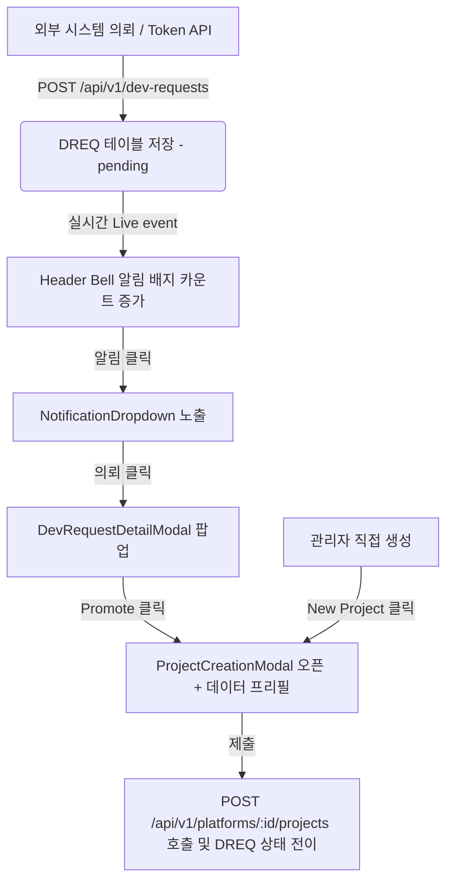

# [기획/설계] DREQ 의뢰 접수 알림 및 하이브리드 프로젝트 생성 연계 설계

- **문서 목적**: DevHub의 하이브리드 프로젝트 생성 모델(DREQ 의뢰 접수 경로 + 관리자 수동 생성 경로)을 정교화하고, 네비게이션 헤더의 알림 UI를 기반으로 한 의뢰-프로젝트 전환 UX 요구사항, 유스케이스, 설계를 명문화한다.
- **상태**: active
- **최종 수정일**: 2026-05-26
- **관련 요구사항**: `REQ-FR-DREQ-012` (실시간 의뢰 알림 배지), `REQ-FR-DREQ-013` (의뢰 상세 상세 Promote 연계), `REQ-FR-PROJ-001` (Application 범위 프로젝트 생성)
- **관련 유스케이스**: `UC-DREQ-11` (실시간 의뢰 알림 및 배지 수신), `UC-DREQ-12` (의뢰 Promote 및 프로젝트 자동 프리필 연계)

---

## 1. 하이브리드 프로젝트 생성 아키텍처 모델

프로젝트는 관리자가 직접 수동으로 생성할 수도 있으며, 현업 부서의 의뢰 접수(DREQ)로부터 연계되어 생성될 수도 있습니다. 이 두 가지 비즈니스 흐름을 완벽하게 지원하는 하이브리드 라이프사이클 모델을 설계합니다.

---

## 2. 세부 요구사항 정의

### 2.1 REQ-FR-DREQ-012: 실시간 의뢰 알림 및 배지
- **기능**: 시스템에 `pending` 상태의 새로운 DREQ 의뢰가 인입되면, 대시보드 상단 네비게이션의 알림 Bell 아이콘 우상단에 붉은색 알림 배지가 노출되어야 한다.
- **트리거**: `realtimeService`를 통해 `dev_request.created` 실시간 이벤트를 수신하면 배지 상태 및 DREQ 개수 카운트가 즉시 동기화되어야 한다.

### 2.2 REQ-FR-DREQ-013: 의뢰 상세 연동 및 Promote 전환 UX
- **기능**: 알림 드롭다운의 특정 DREQ 항목을 클릭하면, 기존 `DevRequestDetailModal`이 활성화되어 의뢰 정보를 상세조회할 수 있어야 한다.
- **전환**: 의뢰 상세에서 `System Admin` 또는 `PMO Manager` 권한을 가진 사용자에게만 **Promote (프로젝트 생성)** 버튼이 활성화된다.
- **프리필(Prefill)**: `Promote` 버튼 클릭 시 `DevRequestDetailModal`이 닫히며 동시에 `ProjectCreationModal`이 팝업된다. 이 때 의뢰 데이터(`Key`, `Name`, `Description`)가 프로젝트 생성 폼 필드에 자동으로 채워진 상태여야 한다.
- **통합**: `/projects` 과제 현황판의 `New Project` 버튼 클릭 시 트리거되는 수동 생성 흐름(`ProjectCreationModal`)과 의뢰 기반 생성 흐름이 단일 모달 컴포넌트를 공유하도록 설계하여 디자인 및 비즈니스 로직 일관성을 유지한다.

---

## 3. 핵심 유스케이스 정의

### 3.1 UC-DREQ-11: 실시간 의뢰 알림 및 배지 수신
- **액터**: 담당자 (System Admin / PMO Manager)
- **성공 조건**: `realtimeService`를 통해 `dev_request.created` 실시간 이벤트를 수신하여 Header Bell의 알림 배지 및 드롭다운 카운트가 즉시 반영됨.
- **기본 흐름**:
  1. 외부 시스템이 API를 통해 신규 DREQ를 등록함.
  2. 시스템은 실시간 이벤트 채널로 `dev_request.created` 이벤트를 브로드캐스트함.
  3. 프론트엔드 `Header` 컴포넌트의 이벤트 리스너가 이벤트를 감지함.
  4. 알림 Bell 아이콘 상단의 읽지 않은 대기 의뢰 카운트가 실시간 증가하고 배지가 붉은색으로 강조됨.

### 3.2 UC-DREQ-12: 의뢰 Promote 및 프로젝트 자동 프리필 연계
- **액터**: 담당자 (System Admin / PMO Manager)
- **성공 조건**: DREQ 상세 모달에서 Promote 클릭 시 `ProjectCreationModal`이 팝업되고 의뢰 메타데이터(Key, Name, Description)가 프리필됨.
- **기본 흐름**:
  1. 담당자가 Header Bell을 클릭하여 알림 드롭다운 목록을 활성화함.
  2. 목록에서 대기 중인 DREQ 아이템을 클릭함.
  3. `DevRequestDetailModal`이 팝업되며 의뢰 상세 정보가 렌더링됨.
  4. 담당자가 모달 내부의 **Promote to Project** 버튼을 클릭함.
  5. `DevRequestDetailModal`이 닫히고, 동시에 `ProjectCreationModal`이 열림.
  6. 모달 내부 폼 필드 중 `Project Key`, `Project Name`, `Description` 필드에 해당 DREQ의 `key`, `title`, `details` 내용이 자동으로 채워짐.
  7. 담당자가 나머지 필수 정보를 입력하고 저장 버튼을 누르면 단일 트랜잭션으로 프로젝트가 생성되고 DREQ 상태가 `registered`로 전이됨.

---

## 4. 컴포넌트 세부 설계

### 4.1 Header.tsx (Notification Bell 및 Dropdown)
- **Notification Bell**: 
  - `devRequestService.list({ status: ["pending", "in_review"] })` API를 통해 마운트 시 초기 개수를 세팅함.
  - WebSocket 또는 Server-Sent Events 기반 `realtimeService` 채널을 구독하여, 새로운 `dev_request.created` 수신 시 카운트를 동적으로 증가시킴.
- **NotificationDropdown**:
  - Bell 클릭 시 토글 노출.
  - 최근 5개의 미결 의뢰 정보를 카드 포맷으로 렌더링.
  - 각 카드 클릭 시 `onSelectRequest(reqId)` 이벤트 핸들러 호출하여 상세 모달 실행.
  - 하단에 "전체 의뢰 보기" 링크 배치 (`/dev-requests` 페이지 이동).

### 4.2 DevRequestDetailModal.tsx (Promote 인터페이스)
- PMO / System Admin 역할에 한해 **Promote** 버튼 노출.
- Promote 버튼 클릭 시 부모 컴포넌트(Header)에 `onPromote(requestData)` 콜백을 발생시켜 상세 모달을 언마운트하고 프로젝트 생성 모달을 마운트함.

### 4.3 ProjectCreationModal.tsx (하이브리드 프리필 입력 폼)
- 프론트엔드 상태 프로퍼티로 `prefillData?: { key: string; name: string; description: string; applicationId?: string }` 를 전달받음.
- 모달이 마운트될 때 `prefillData`가 존재하면 해당 값으로 폼 컨트롤러의 기본값(initialValues)을 채움.
- 폼 서브밋 시, DREQ 기반 생성인 경우 `devRequestService.promoteToProject(dreqId, projectPayload)` API를 호출하여 프로젝트 생성과 DREQ 상태 전이를 atomic하게 처리함.

---

## 5. Verification Plan (검증 및 E2E 테스트 시나리오)

실제 구현된 컴포넌트 간의 상호작용 및 라이프사이클 안정성을 보장하기 위해 Playwright 기반의 E2E 테스트 스위트를 구비합니다.

### 5.1 테스트 시나리오: DREQ 알림 - 상세 - Promote - 생성 연계 흐름
- **TC-DREQ-NOTI-01**: 실시간 신규 DREQ 인입 시 Header Bell 배지 카운트 실시간 업데이트 확인.
- **TC-DREQ-NOTI-02**: Bell 클릭 시 드롭다운 목록 노출 및 항목 정합성(Key, Name) 검증.
- **TC-DREQ-NOTI-03**: 드롭다운 항목 클릭 -> 상세 모달 팝업 -> Promote 버튼 클릭 -> 프로젝트 수동 생성 모달로 프리필 정보(Key, Name, Description) 전달 및 최종 프로젝트 생성 검증.

### 5.2 테스트 코드 구성 (`tests/e2e/admin-projects.spec.ts` 등)
- Playwright 테스트 환경에서 테스트용 DREQ 데이터를 외부 API 호출을 시뮬레이션하여 백엔드에 밀어넣음.
- Nginx basePath인 `/devhub` Context 하에서 정상적으로 Header 및 모달 요소들이 트리거되는지 Selector로 확인.
