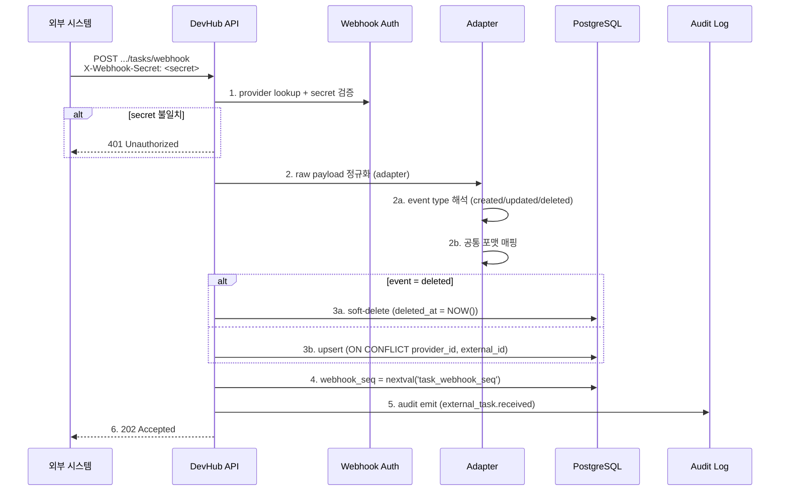

# integration-registry — Task Item Ingestion 아키텍처

- 문서 목적: 외부 ALM/SCM/Issue Tracker 작업 항목 수집 도메인의 컴포넌트·webhook 처리·pull adapter·SEQ gap·저장소 모델·접근 제어 아키텍처를 정의한다.
- 범위: ARCH-TASK-01..06. 일반 Integration architecture 는 `architecture.md` (ARCH-INT-01..07) 참조.
- 대상 독자: backend / 프론트엔드 / DevOps, AI agent, 아키텍처 검토자.
- 상태: accepted
- 최종 수정일: 2026-05-29 (Phase 3 split, master `docs/architecture.md` §12 본문 이관)
- 관련 문서: [도메인 README](./README.md), [컨셉](./task_ingestion_concept.md), [task_requirements.md](./task_requirements.md), [task_api.md](./task_api.md), [provider architecture](./architecture.md), [master architecture](../../architecture.md)

## 개요

외부 ALM/SCM/Issue Tracker 시스템의 작업 항목(task/issue/ticket)을 Webhook(실시간) + Pull(주기 동기화) 혼합 방식으로 수집하는 도메인. 컨셉 문서: [`./task_ingestion_concept.md`](./task_ingestion_concept.md). 요구사항: [`./task_requirements.md`](./task_requirements.md). Usecase: [`UC-TASK-01..06` (`system_usecases.md §2.16`)](../../planning/system_usecases.md).

## 1. 외부 Task Tracker 연동 모델 (ARCH-TASK-01)

기존 `integration_providers` 테이블을 확장하여 Task Tracker 를 등록한다.

| 항목 | 값 |
| --- | --- |
| `provider_type` | `"task_tracker"` (신규 type, 기존: alm/scm/ci_cd/doc/infra) |
| `capabilities` | `["task_item"]` 추가 |
| `webhook_secret` | 신규 필드. Webhook 수신 시 `X-Webhook-Secret` 헤더 검증. write-only (`api_token` 과 동일 패턴). |
| `pull_interval_seconds` | 신규 필드. Pull loop 주기. 기본 1800s. |
| `last_pulled_at` | 신규 필드. 마지막 Pull 동기화 시각. 증분 조회 기준. |

**Provider 생성 흐름**:
```
system_admin → PATCH /api/v1/integration/providers (기존 API-71)
  → provider_type="task_tracker", capabilities=["task_item"]
  → webhook_secret 설정 (write-only: api_token_set 패턴과 동일)
  → pull_interval_seconds 기본값 1800s
```

Binding(`integration_bindings`) 을 통해 Platform/Project 에 Provider 를 연결하면, 연결된 scope 의 task item 만 조회된다 (§6).

## 2. Webhook 수신 처리 흐름 (ARCH-TASK-02)



**Webhook SEQ 관리**: PostgreSQL sequence `task_webhook_seq` 를 사용해 monotonic 발급. Pull loop 가 `SELECT MAX(webhook_seq)` 로 현재까지 수신된 seq 확인. Gap 발견 시 `external_task_items` 의 `webhook_seq` interval 기반 보강 trigger.

## 3. Pull 동기화 Adapter 계약 (ARCH-TASK-03)

HomeLab adapter 패턴(`homelab.go` 의 `HomeLabPuller`/`HomeLabAdapter` 구조)을 재사용한다.

```go
// TaskItemPuller is the pull-based collector for external task trackers.
type TaskItemPuller interface {
    // FetchTaskItems pulls task items updated since the given timestamp.
    // Returns normalized ExternalTaskItem slice + optional cursor for pagination.
    FetchTaskItems(ctx context.Context, since time.Time, cursor string) ([]ExternalTaskItem, string, error)
}

// TaskItemPullAdapter wires a Puller + Store + metrics.
type TaskItemPullAdapter struct {
    ProviderID string
    Puller     TaskItemPuller
    Store      ExternalTaskStore
    Logger     *slog.Logger
}
```

**Pull Loop 실행 흐름**:

```mermaid
flowchart LR
    Ticker["ticker (@pull_interval_seconds)"] --> CheckGap["webhook_seq gap 탐지"]
    CheckGap --> ShouldPull{"gap > 0 OR<br/>last_pulled_at + interval<br/>경과?"}
    ShouldPull -->|Yes| Fetch["FetchTaskItems(since=last_pulled_at)"]
    Fetch --> Paginate["페이지네이션 루프"]
    Paginate --> Upsert["각 item upsert"]
    Upsert --> UpdateCursor["last_pulled_at 갱신"]
    UpdateCursor --> Metrics["metric emit"]
    Metrics --> NextTick["다음 tick 대기"]

    ShouldPull -->|No (gap 무, interval 내)| Skip["skip + metric zero"]
```

## 4. Webhook SEQ Gap 탐지 및 복구 (ARCH-TASK-04)

```go
type SeqGapDetector interface {
    // DetectGaps returns intervals of missing webhook_seq values.
    DetectGaps(ctx context.Context, providerID string) ([]SeqInterval, error)
}
```

**Gap 탐지 로직**:
1. `SELECT webhook_seq FROM external_task_items WHERE provider_id = $1 ORDER BY webhook_seq` → 수신된 seq 전체 목록
2. `generate_series(min, max)` 와 `LEFT JOIN` 으로 미수신 seq 식별
3. 미수신 seq 가 있으면 → audit 경고 emit + 보강 pull 트리거

**보강 Pull**: gap 에 해당하는 seq 의 예상 수신 시간 범위(`webhook_seq`의 시간적 의미는 없으므로 gap 발견 사실만 audit 하고 다음 정기 pull 에서 자연 수집. 단, 반복 gap 발생 시 provider 장애 의심 → alert)

## 5. 저장소 모델 (ARCH-TASK-05)

`external_task_items` 테이블 (별도 migration):

| 컬럼 | 타입 | 설명 |
| --- | --- | --- |
| `id` | UUID PK | 시스템 발급 |
| `provider_id` | UUID FK → integration_providers | CASCADE DELETE |
| `external_id` | TEXT | 외부 시스템의 ticket/issue key |
| `raw_status` | TEXT | 외부 시스템 원본 status |
| `normalized_status` | TEXT | DevHub 공통 enum (nullable) |
| `title` | TEXT | 제목 |
| `description` | TEXT | 상세 (markdown) |
| `priority` | TEXT | 우선순위 |
| `assignee` | TEXT | 담당자 식별자 |
| `reporter` | TEXT | 보고자 식별자 |
| `url` | TEXT | 원본 링크 |
| `labels` | TEXT[] | 태그/레이블 |
| `raw_payload` | JSONB | 원본 webhook/Pull 응답 |
| `webhook_seq` | BIGINT | monotonic sequence |
| `fetched_at` | TIMESTAMPTZ | 마지막 수집 시각 |
| `deleted_at` | TIMESTAMPTZ | soft-delete |
| UNIQUE | (provider_id, external_id) | 중복 방지 + upsert key |

`raw_payload` 보존으로 사후 재정규화(reprocess)와 정합성 검증이 가능하다.

## 6. Binding 기반 접근 제어 (ARCH-TASK-06)

`integration_bindings` 를 통해 Task Item 조회 scope 제어.

| 행위자 | 접근 가능한 Task Item |
|--------|----------------------|
| system_admin | 모든 provider 의 전체 task item |
| manager | 자신의 project/application 에 binding 된 provider 의 task item |
| developer | 자신의 application 에 binding 된 provider 의 task item |

조회 API 에서 `GET /api/v1/external-tasks` 호출 시:
1. 요청 actor 의 role 확인
2. system_admin → 필터 없이 전체 조회
3. manager/developer → `integration_bindings` LEFT JOIN 으로 scope matching
4. 자신의 scope 밖 provider 의 task item 은 자동 필터링

## 7. Audit action + Prometheus Metric 카탈로그 (ARCH-TASK-07, master §12.7)

### Audit actions

| action | target_type | payload | 트리거 |
| --- | --- | --- | --- |
| `external_task.received` | `external_task` | `{ provider_id, external_id, webhook_seq }` | Webhook 수신 성공 (created) |
| `external_task.updated` | `external_task` | `{ provider_id, external_id, webhook_seq }` | Webhook 수신 성공 (updated) |
| `external_task.deleted` | `external_task` | `{ provider_id, external_id, webhook_seq }` | Webhook 수신 성공 (deleted → soft-delete) |
| `external_task.auth_failed` | `external_task` | `{ provider_id, reason }` | Webhook secret 검증 실패 |
| `external_task.pull_started` | `external_task` | `{ provider_id }` | Pull 동기화 시작 |
| `external_task.pull_completed` | `external_task` | `{ provider_id, count, errors }` | Pull 동기화 완료 |
| `external_task.pull_failed` | `external_task` | `{ provider_id, error }` | Pull 동기화 실패 |
| `external_task.seq_gap_detected` | `external_task` | `{ provider_id, gaps }` | Webhook SEQ gap 발견 |

### Prometheus metrics

| Metric | Type | Labels | 설명 |
| --- | --- | --- | --- |
| `task_item_webhook_received_total` | Counter | provider, event | Webhook 수신 건수 |
| `task_item_webhook_errors_total` | Counter | provider, error_type | Webhook 처리 실패 건수 |
| `task_item_pull_duration_seconds` | Histogram | provider | Pull 동기화 소요 시간 |
| `task_item_pull_items_total` | Counter | provider | Pull 수집 항목 수 |
| `task_item_pull_errors_total` | Counter | provider, error_type | Pull 오류 건수 |
| `task_item_seq_gap_total` | Counter | provider | SEQ gap 발견 건수 |

## 8. 변경 이력

| 일자 | 변경 |
| --- | --- |
| 2026-05-29 | Phase 3 split — master `docs/architecture.md` §12 (Task Ingestion) 본문 그대로 이관. ID(ARCH-TASK-01..06; §12.7 catalog 는 본 문서 §7 로 ARCH-TASK-07 발급) 보존. master 원문에 §12.6 / §12.7 둘 다 "ARCH-TASK-06" 으로 라벨되어 있던 라벨 중복은 본 문서에서 §7 ARCH-TASK-07 로 분리 — semantic 변경 없음. |
