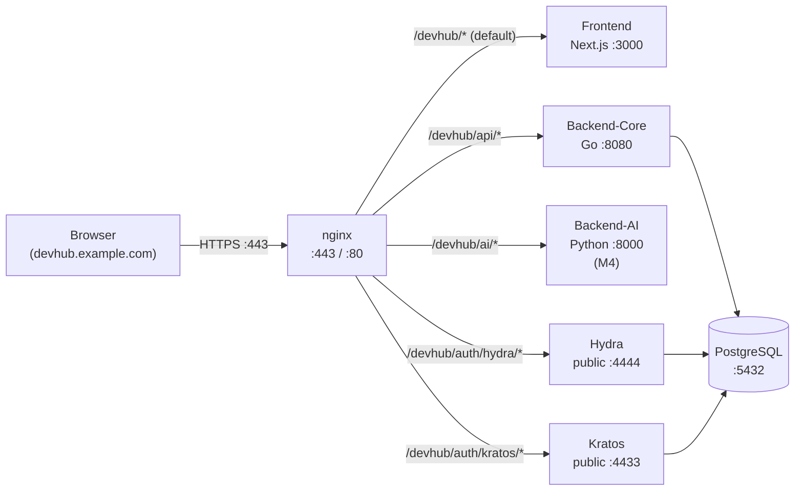

# Design 검토 — 단일 외부 포트 reverse proxy 구성 (`/devhub` prefix)

- 문서 목적: 외부 접속을 단일 포트로 통합하고 frontend 가 `/devhub` 대표 prefix 로 모든 트래픽을 받아 backend 들을 `/devhub/{backend}` sub-path 로 reverse proxy 하는 구성의 design 검토. 1차 산출물은 planning 단계 — 결정 후 ADR 승격은 별도 sprint.
- 범위: 외부 진입 + 경로 매핑 + OIDC redirect URI / cookie scope / CORS / 정적 자산 / local dev vs prod / CI E2E / 배포 / 관측 영향. 내부 process 구성 (5 process native, no-docker 정책) 자체는 유지.
- 대상 독자: 아키텍트, 운영자 (SRE), Backend / Frontend / IdP 담당자.
- 상태: accepted
- 최종 수정일: 2026-05-20
- 결정 근거 sprint: `adr0018-reverse-proxy` (본 sprint)
- 관련 문서: [ADR-0019 Keycloak 단일화 (현재 IdP)](../adr/0019-keycloak-only-idp.md), [ADR-0001 IdP selection (Hydra+Kratos, superseded)](../adr/0001-idp-selection.md), [ADR-0003 no-docker CI 정책](../adr/0003-no-docker-policy-ci-scope.md), [environment setup](../setup/environment-setup.md), [test-server-deployment](../setup/test-server-deployment.md), [docker-packaging-deployment-guide](../setup/docker-packaging-deployment-guide.md), [frontend endpoints 모듈](../../frontend/lib/config/endpoints.ts).

## 1. 컨텍스트 + 동기

### 1.1 현재 구성 (multi-port)

DevHub backend 는 native 5 process 로 구성 (ADR-0003 no-docker 정책):

| process | port | 외부 노출 후보 |
| --- | --- | --- |
| Frontend (Next.js) | 3000 | 사용자 진입점 |
| Backend-Core (Go) | 8080 | `/api/v1/*` |
| Backend-AI (Python placeholder) | 8000 (예약) | `/ai/*` (M4 도입 예정) |
| Ory Hydra (OIDC OAuth2 provider) | 4444 (public) / 4445 (admin) | OIDC code flow |
| Ory Kratos (identity / self-service) | 4433 (public) / 4434 (admin) | password flow |

frontend `next.config.ts` 의 rewrites 가 `/api/*` → backend-core 로 proxy ([endpoints.ts](../../frontend/lib/config/endpoints.ts) 의 `BACKEND_API_URL_SERVER`). 그러나 OIDC redirect 와 self-service flow 는 Hydra/Kratos public 의 절대 URL 을 사용 (예: `http://localhost:4444/oauth2/auth`, `http://localhost:4433/self-service/login/browser`).

### 1.2 multi-port 의 문제

- **외부 방화벽 / 보안 정책 충돌** — 운영 환경의 ingress 가 단일 포트 (80/443) 만 허용하는 경우 multi-port 구성 불가.
- **CORS / cookie scope 복잡도** — Hydra/Kratos cookie 가 별도 origin (port) 에서 set 되어 SameSite + cross-origin 정책 충돌 빈도 증가. PR #145 (외부 codex docker hardening) 가 정합한 `runtime-config + forwarded-header 신뢰 제거` 도 이런 multi-origin 환경의 회귀를 해소한 사례.
- **SSO / 외부 통합 UX** — 외부 reader 가 `http://host:4444/...` 같은 raw port URL 을 견 시 신뢰도 저하.
- **HTTPS 인증서 관리 부담** — port 마다 TLS 종료 또는 별도 reverse proxy 부담. nginx 1개로 통합 시 단일 cert chain 으로 simplify.

### 1.3 본 design 의 목표

1. **외부 단일 포트** (예: 80/443) 노출. 모든 트래픽이 `https://devhub.example.com/devhub/*` prefix 로 진입.
2. **내부 multi-process 유지** — backend / Hydra / Kratos / frontend 는 기존 5 process native (no-docker 정책 정합) 유지.
3. **OIDC 정합성** — Hydra public_url 과 redirect_uri 도 단일 호스트 + `/devhub/auth/hydra` prefix 정합.
4. **local dev 영향 최소** — 본 design 은 production / staging 진입을 가정. local dev 는 기존 multi-port 유지 가능 (env override).
5. **단계별 진입** — 본 sprint 는 Phase 1 문서만 (코드 변경 없음). Phase 2 staging 검증 + Phase 3 prod cutover 는 별도 sprint.

## 2. 후보 reverse proxy 비교

| 후보 | TLS 자동 | path rewrite | upstream LB | k8s 친화 | DevHub 적합 | 비고 |
| --- | --- | --- | --- | --- | --- | --- |
| **nginx** | ❌ (cert manual 또는 certbot) | ✅ (location + rewrite) | ✅ | ⭕ (ingress) | ⭐ **권장** | 가장 검증 + ops-monitoring 정합 (Prometheus nginx exporter). 이미 [docker-packaging-deployment-guide](../setup/docker-packaging-deployment-guide.md) 의 nginx config 사용 패턴. |
| Caddy | ✅ Let's Encrypt 자동 | ✅ (handle_path) | ✅ | ⭕ | ⭕ | TLS 자동이라 운영 부담 ↓. 그러나 ops 팀의 nginx 친숙도 + custom log 포맷 의존도 고려 시 nginx 우선. |
| Traefik | ✅ | ✅ | ✅ | ⭐ k8s 우선 | △ | k8s ingress 진입 시 재평가. 현재 native 환경에서는 over-engineered. |
| Next.js custom server | ❌ (frontend 자체) | ✅ (rewrites) | △ | ❌ | △ | rewrites 가 frontend 의 책임이라 frontend 장애 시 backend 도 도달 불가. blast radius 큼. |
| Go reverse proxy (httputil.ReverseProxy) | ❌ | ✅ | △ | ❌ | △ | 개발 부담 + custom code 유지보수. 보안 검증 책임 자체부담. |

**권장 = nginx**. 이유:
1. ops 팀의 nginx 친숙도 + ops-monitoring 패턴 (Prometheus nginx exporter) 정합
2. PR #133 의 `docker-compose.deploy.yml` + `infra/nginx/devhub.deploy.conf` 가 이미 nginx 패턴 활용
3. TLS 종료 책임을 별도 layer (nginx) 로 분리 → backend / Hydra / Kratos 는 HTTP 그대로 운영 (no-docker 정합)

## 3. 경로 매핑 설계

### 3.1 외부 URL 구조

```
https://devhub.example.com/devhub                   ← Frontend (Next.js, SPA + SSR)
https://devhub.example.com/devhub/api/v1/*          ← Backend-Core (Go, 8080)
https://devhub.example.com/devhub/ai/v1/*           ← Backend-AI (M4, placeholder)
https://devhub.example.com/devhub/auth/hydra/*      ← Hydra public (4444)
https://devhub.example.com/devhub/auth/kratos/*     ← Kratos public (4433)
https://devhub.example.com/metrics                  ← Prometheus scrape (admin only, IP allowlist)
```

**`/devhub` prefix 채택 이유**:
- 외부 도메인의 다른 path (예: `/marketing`, `/blog`) 와 충돌 회피.
- 운영 도메인 1개에 여러 internal tool 을 host 할 때 isolation 명확.
- frontend `next.config.ts` 의 `basePath: "/devhub"` 1회 설정으로 SPA route + static asset 모두 자동 prefix.

### 3.2 nginx config skeleton

```nginx
# /etc/nginx/sites-available/devhub.conf
upstream devhub_backend { server 127.0.0.1:8080; }
upstream devhub_ai      { server 127.0.0.1:8000; }   # M4 placeholder
upstream devhub_hydra   { server 127.0.0.1:4444; }
upstream devhub_kratos  { server 127.0.0.1:4433; }
upstream devhub_front   { server 127.0.0.1:3000; }

server {
    listen 443 ssl http2;
    server_name devhub.example.com;
    ssl_certificate     /etc/ssl/devhub/fullchain.pem;
    ssl_certificate_key /etc/ssl/devhub/privkey.pem;

    # Common security headers
    add_header Strict-Transport-Security "max-age=31536000; includeSubDomains" always;
    add_header X-Content-Type-Options "nosniff" always;
    add_header X-Frame-Options "DENY" always;

    # /devhub/api/* → backend-core (Go).
    # /devhub prefix 는 backend-core 가 보지 못하게 strip — backend 는 /api/v1/* 그대로 처리.
    location /devhub/api/ {
        proxy_pass http://devhub_backend/api/;
        include /etc/nginx/proxy_common.conf;
    }

    # /devhub/ai/* → backend-ai (M4)
    location /devhub/ai/ {
        proxy_pass http://devhub_ai/ai/;
        include /etc/nginx/proxy_common.conf;
    }

    # /devhub/auth/hydra/* → Hydra public.
    # Hydra 가 자체 path 처리하므로 prefix 만 strip.
    location /devhub/auth/hydra/ {
        proxy_pass http://devhub_hydra/;
        include /etc/nginx/proxy_common.conf;
    }

    # /devhub/auth/kratos/* → Kratos public.
    location /devhub/auth/kratos/ {
        proxy_pass http://devhub_kratos/;
        include /etc/nginx/proxy_common.conf;
    }

    # /devhub/* (그 외) → Frontend (Next.js).
    # SPA route + SSR + static asset 모두 frontend 가 처리. Next.js 의 basePath 가
    # /devhub 로 설정되어 있으므로 path 그대로 전달.
    location /devhub/ {
        proxy_pass http://devhub_front/devhub/;
        include /etc/nginx/proxy_common.conf;
        # SPA — WebSocket (realtime) 도 동일 path 로 받음.
        proxy_http_version 1.1;
        proxy_set_header Upgrade $http_upgrade;
        proxy_set_header Connection "upgrade";
    }

    # Root redirect (선택) — / 진입 시 /devhub/ 로 redirect.
    location = / {
        return 301 /devhub/;
    }
}
```

`/etc/nginx/proxy_common.conf` (재사용):

```nginx
proxy_set_header Host              $host;
proxy_set_header X-Real-IP         $remote_addr;
proxy_set_header X-Forwarded-For   $proxy_add_x_forwarded_for;
proxy_set_header X-Forwarded-Proto $scheme;
proxy_set_header X-Forwarded-Host  $host;
proxy_set_header X-Forwarded-Prefix /devhub;   # backend / Hydra / Kratos 인지용
proxy_connect_timeout 5s;
proxy_read_timeout    60s;
proxy_send_timeout    60s;
```

### 3.3 토폴로지 다이어그램



## 4. OIDC redirect URI / Hydra public_url 영향

### 4.1 현재 (multi-port)

- Hydra `urls.self.issuer` / `public` = `http://localhost:4444/`
- frontend `OIDC_AUTH_URL` = `http://localhost:4444/oauth2/auth`
- frontend `OIDC_REDIRECT_URI` = `http://localhost:3000/auth/callback`

### 4.2 본 design (단일 포트)

- Hydra `urls.self.issuer` = `https://devhub.example.com/devhub/auth/hydra/`
- Hydra `urls.self.public` = `https://devhub.example.com/devhub/auth/hydra/`
- frontend `OIDC_AUTH_URL` = `https://devhub.example.com/devhub/auth/hydra/oauth2/auth`
- frontend `OIDC_REDIRECT_URI` = `https://devhub.example.com/devhub/auth/callback`

### 4.3 결정 포인트

- **OAuth2 client redirect_uris** — Hydra 의 등록된 client 의 `redirect_uris` 가 새 URL 로 갱신되어야 한다. 운영자 SOP 에 명시 (Hydra admin API 또는 [agent token rotation SOP](../setup/homelab_agent_token_rotation.md) 패턴).
- **issuer drift 회귀** — issuer 가 변경되면 기존 발급 token 의 `iss` claim 과 mismatch → BearerTokenVerifier 가 reject. cutover 시 모든 활성 token revoke + 재발급 필요 (전체 사용자 재로그인). staging 1주 검증 후 prod cutover.
- **HTTPS 의무** — issuer 가 HTTPS 면 backend `BearerTokenVerifier` 의 Hydra introspection URL 도 HTTPS 정합. nginx upstream 의 `proxy_pass` 는 HTTP 그대로 유지 가능 (서버 내부 trust).

## 5. cookie scope / SameSite

### 5.1 영향 분석

- Hydra / Kratos cookie 는 `Path=/`, `SameSite=Lax`, `Secure=true` 로 set. 단일 포트 + `/devhub` prefix 환경에서:
  - **path scope** — cookie 가 `/` 로 set 되면 다른 path (`/marketing`) 까지 노출. **`Path=/devhub` 로 변경 권장** (cookie isolation).
  - **SameSite** — 단일 origin 이라 cross-site 충돌 없음 (multi-port 때보다 안전).
  - **Secure** — HTTPS 단일 포트라 강제 가능.

### 5.2 권장 설정

- Hydra `cookies.same_site_mode: "Lax"`, `domain: ""`, `path: "/devhub/auth/hydra"` (path 분리로 leak 차단).
- Kratos `session.cookie.path: "/devhub/auth/kratos"`, `domain: ""`, `same_site: "Lax"`.
- frontend `tokenStore` 는 sessionStorage 사용 — cookie 와 별개 (영향 없음). [feedback_e2e_oidc_flaky](../../../../C:/Users/sem/.claude/projects/D--yklee-repos-Devhub-example/memory/feedback_e2e_oidc_flaky.md) 의 sessionStorage Bearer 패턴 정합.

## 6. CORS

### 6.1 현재 (multi-port) 의 복잡도

- frontend (`localhost:3000`) → backend (`localhost:8080`) 가 다른 origin.
- `next.config.ts` 의 rewrites 가 frontend 의 same-origin path (`/api/*`) 를 backend 로 proxy 해 CORS 우회.
- Hydra/Kratos 호출은 frontend 가 직접 (`localhost:4444`, `localhost:4433`) — multi-origin.

### 6.2 본 design 의 단순화

- 모든 호출이 **same origin** (`devhub.example.com:443`). CORS 제거 가능.
- frontend `next.config.ts` 의 rewrites 도 **불필요** (nginx 가 직접 routing). frontend 는 client-side fetch 가 relative path (`/devhub/api/v1/*`) 만 사용.
- 단점: local dev 와 prod 의 구성이 비대칭 — local 은 multi-port + rewrites, prod 는 nginx single-port. env override 명시 필요.

## 7. 정적 자산 + SPA routing (Next.js `basePath`)

### 7.1 `next.config.ts` 갱신

```ts
const nextConfig: NextConfig = {
  basePath: process.env.NEXT_PUBLIC_BASE_PATH ?? "",  // 운영: "/devhub", 로컬: 비움
  output: process.env.NEXT_OUTPUT === "standalone" ? "standalone" : undefined,
  // local dev 의 rewrites 는 유지 (env 가 NEXT_PUBLIC_BASE_PATH 비어 있을 때만):
  async rewrites() {
    if (process.env.NEXT_PUBLIC_BASE_PATH) {
      return []; // production single-port — nginx 가 직접 routing
    }
    return [{ source: "/api/:path*", destination: `${BACKEND_API_URL_SERVER}/api/:path*` }];
  },
};
```

### 7.2 영향

- **static asset path** — `/devhub/_next/static/...` 자동 prefix.
- **SPA route** — `Link href="/admin/topology-v2"` 가 자동으로 `/devhub/admin/topology-v2` 로 렌더.
- **client-side fetch path** — `frontend/lib/config/endpoints.ts` 의 `API_BASE_URL` 이 빈 문자열이면 relative path 그대로. nginx 가 `/devhub/api/*` 를 backend 로 proxy → frontend 가 `fetch("/devhub/api/v1/auth/login")` 호출. **`basePath` 자동 prefix 가 fetch 에 적용 안 됨** — 명시 prefix 필요. 후속 carve out.

## 8. local dev vs production 비대칭

| 항목 | local dev (현재) | production (본 design) |
| --- | --- | --- |
| 외부 host | `localhost:3000` | `devhub.example.com:443` |
| frontend | `:3000` 직접 | `/devhub/*` via nginx |
| backend | `:8080` direct + Next rewrites | `/devhub/api/*` via nginx |
| Hydra public | `:4444` direct | `/devhub/auth/hydra/*` via nginx |
| Kratos public | `:4433` direct | `/devhub/auth/kratos/*` via nginx |
| OIDC redirect | `localhost:3000/auth/callback` | `devhub.example.com/devhub/auth/callback` |
| TLS | HTTP | HTTPS (nginx 종료) |
| basePath | 빈 문자열 | `/devhub` |

### 8.1 env 분기

- `.env.local` (개발) — `NEXT_PUBLIC_BASE_PATH=""`, `NEXT_PUBLIC_API_URL=""`, `NEXT_PUBLIC_OIDC_AUTH_URL="http://localhost:4444/oauth2/auth"` 등
- `.env.production` (운영) — `NEXT_PUBLIC_BASE_PATH="/devhub"`, `NEXT_PUBLIC_API_URL=""` (relative), `NEXT_PUBLIC_OIDC_AUTH_URL="/devhub/auth/hydra/oauth2/auth"` 등

env override 패턴은 [endpoints.ts](../../frontend/lib/config/endpoints.ts) 가 이미 지원. basePath 만 추가.

### 8.2 staging 의 위치

- staging 환경도 단일 포트 (`stage-devhub.example.com:443`) 로 진입 — Phase 2 검증 환경.
- local dev 는 staging 까지는 multi-port 그대로, prod 진입 시 단일 포트.

## 9. CI / E2E 영향

### 9.1 현재 CI

- GitHub Actions ubuntu-24.04 + native PG 15 + Hydra + Kratos + backend + frontend 5 process.
- E2E (Playwright) 가 `http://localhost:3000` 에서 시작 → OIDC flow → backend.

### 9.2 본 design 적용 시 CI 변경

옵션 A: **local dev 와 CI 는 현재 그대로 multi-port** — 본 design 은 production / staging 에만 적용. CI 영향 0. **권장**.

옵션 B: CI 에도 nginx 추가해 production 환경 simulation — CI runtime ↑ + 추가 보강 필요. M4 진입 시 재평가.

### 9.3 sprint -m 학습 정합

`page.request.*` OIDC propagation flaky 회피 패턴 (DOM data-XXX-id + page.evaluate fetch + sessionStorage Bearer) 은 단일 포트 환경에서도 동일하게 작동. 단일 포트로 인한 cookie/session 처리는 더 안정적 (same origin).

## 10. 배포 절차 (Phase 1 가이드 — Phase 2/3 별도 sprint)

본 Phase 1 은 design 문서만. Phase 2/3 시 다음 절차:

### 10.1 nginx 설치 + cert

```bash
sudo apt install nginx
sudo mkdir -p /etc/ssl/devhub
# certbot 또는 자체 CA 로 cert 발급, fullchain.pem + privkey.pem 배치
sudo cp devhub.conf /etc/nginx/sites-available/
sudo ln -s /etc/nginx/sites-available/devhub.conf /etc/nginx/sites-enabled/
sudo nginx -t  # syntax 검증
sudo systemctl reload nginx
```

### 10.2 frontend env

```
NEXT_PUBLIC_BASE_PATH=/devhub
NEXT_PUBLIC_OIDC_AUTH_URL=/devhub/auth/hydra/oauth2/auth
NEXT_PUBLIC_OIDC_REDIRECT_URI=https://devhub.example.com/devhub/auth/callback
NEXT_PUBLIC_KRATOS_PUBLIC_URL=/devhub/auth/kratos
```

### 10.3 backend env

backend-core 자체는 path 변경 영향 거의 없음 (nginx 가 `/devhub` strip 후 전달). 다만 `BearerTokenVerifier` 의 Hydra **admin** API 호출 (`/admin/oauth2/introspect`, `/admin/oauth2/auth/requests/*` 등 — `internal/auth/hydra_introspection.go` + `internal/httpapi/hydra_admin_client.go`) 은 admin endpoint 를 가리켜야 하므로 별도 path 또는 internal port 직접 사용 (codex hotfix #8 P1 #3).

**❌ 잘못된 안내 (이전 draft)**: `DEVHUB_HYDRA_ADMIN_URL=https://devhub.example.com/devhub/auth/hydra` — 이 path 는 §3 의 nginx config 에서 Hydra **public** (4444) 으로 가게 매핑되어 있어 admin API 호출이 public endpoint 로 가서 404/wrong-response → backend 의 token 검증/consent flow 실패.

**✅ 올바른 옵션 두 가지**:

옵션 A (권장) — admin endpoint 는 외부 노출 안 함 (security best practice). backend 가 internal 로 직접:

```
DEVHUB_HYDRA_ADMIN_URL=http://127.0.0.1:4445
```

옵션 B — nginx 에 별도 path 추가 (admin 노출이 필요한 경우, 운영팀이 IP allowlist + mTLS 같은 추가 가드 필수):

```nginx
location /devhub/auth/hydra-admin/ {
    # 운영팀 인지! admin endpoint 노출 = 보안 위험
    allow 10.0.0.0/8;          # 사내 운영망 IP 허용
    deny all;
    proxy_pass http://127.0.0.1:4445/;
    include /etc/nginx/proxy_common.conf;
}
```

```
DEVHUB_HYDRA_ADMIN_URL=https://devhub.example.com/devhub/auth/hydra-admin
```

§3 의 nginx config skeleton 의 `location /devhub/auth/hydra/` 는 **public 전용** — admin 호출은 옵션 A 또는 옵션 B 의 별도 path 가 처리.

같은 패턴이 Kratos 의 admin endpoint (`DEVHUB_KRATOS_ADMIN_URL` = `http://127.0.0.1:4434`) 에도 적용 — public 만 외부 노출, admin 은 internal-only (옵션 A 권장).

### 10.4 Hydra config 변경

```yaml
urls:
  self:
    issuer: https://devhub.example.com/devhub/auth/hydra/
    public: https://devhub.example.com/devhub/auth/hydra/
  login: https://devhub.example.com/devhub/auth/login
  consent: https://devhub.example.com/devhub/auth/consent
  logout: https://devhub.example.com/devhub/auth/logout
```

OAuth2 client 의 `redirect_uris` 갱신 (Hydra admin API):

```bash
hydra clients update <client-id> \
  --endpoint https://devhub.example.com/devhub/auth/hydra \
  --redirect-uri https://devhub.example.com/devhub/auth/callback
```

### 10.5 Kratos config 변경

```yaml
serve:
  public:
    base_url: https://devhub.example.com/devhub/auth/kratos/
  admin:
    base_url: http://127.0.0.1:4434/  # 내부 only — nginx 노출 안 함

selfservice:
  default_browser_return_url: https://devhub.example.com/devhub/
  allowed_return_urls:
    - https://devhub.example.com/devhub/
  flows:
    login:
      ui_url: https://devhub.example.com/devhub/auth/login
    settings:
      ui_url: https://devhub.example.com/devhub/account
    error:
      ui_url: https://devhub.example.com/devhub/auth/error
```

### 10.6 cutover 절차

1. **stage 검증** (Phase 2) — staging 환경에 nginx + 신규 env 적용. 모든 OIDC flow + audit + E2E 정합 1주 관찰.
2. **prod cutover 사전 작업** (Phase 3 D-1):
   - 운영 사용자 공지 (재로그인 필요)
   - 운영 자산 저장소 (ops-monitoring) 의 prometheus scrape 주소 갱신 — backend `/metrics` 가 nginx 뒤에 있으면 internal IP 직접 scrape 또는 nginx 도 `/metrics` proxy
   - Hydra 의 모든 활성 OAuth2 token revoke (issuer 변경 → introspection mismatch 예방)
3. **cutover 당일**:
   - nginx config swap + reload
   - frontend / backend / Hydra / Kratos env 갱신 + 재시작
   - Hydra client redirect_uris 갱신
   - E2E smoke (1차 login + 1차 API 호출 + 1차 logout)
4. **roll-back 시나리오** — DNS / nginx config 만 이전 상태로 reload + 사용자 재로그인.

## 11. 관측 (metrics + log)

- nginx access log = nginx 운영 자산 저장소에서 별도 관리 ([prometheus_alertmanager_setup.md](../setup/prometheus_alertmanager_setup.md) §2 정합).
- nginx exporter (`nginxinc/nginx-prometheus-exporter`) 도입 — Prometheus scrape + Grafana panel 추가 후보.
- backend / Hydra / Kratos 의 access log 는 기존 그대로 — 단, source_ip 가 nginx 의 `X-Real-IP` / `X-Forwarded-For` 에서 추출되도록 backend `requireRequestID` middleware 의 IP 추출 정합 확인 ([ADR-0004 X-Devhub-Actor](../adr/0004-x-devhub-actor-deprecation.md) 정합).

## 12. 보안 점검

- **TLS 종료 위치** = nginx. backend / Hydra / Kratos 는 HTTP 그대로 (서버 내부 trust).
- **HSTS** = nginx 가 강제 (`Strict-Transport-Security` header).
- **CSRF** — Kratos 의 self-service flow 가 CSRF token 사용 — 단일 origin 환경에서 더 안전.
- **request_id propagation** — nginx 가 `X-Request-ID` header 가 없으면 자체 생성 + backend 에 전달 ([PR #91](https://github.com/ykylee/Devhub_example/pull/91) 의 `requireRequestID` 정합).
- **forwarded-header 신뢰 제거** = PR #145 (codex docker hardening) 의 결정 — backend 가 `X-Forwarded-For` 를 무조건 신뢰하지 않고 `DEVHUB_TRUSTED_PROXIES=127.0.0.1` 같은 명시 trust 목록 사용.

## 13. 단계별 진입 + 결정 후 ADR 승격

### Phase 1 (본 sprint) — design 문서만

- ✅ 본 문서 (`docs/infrastructure/deployment-automation/single_port_reverse_proxy.md`)
- 결정 안 됨 — 후보 nginx 권장 + 영향 분석만

### Phase 2 — staging 검증 (별도 sprint)

- ADR 승격 (ADR-0018 후보) — design 결정 명문화
- staging 환경에 nginx config 적용 + 1주 관찰 (E2E + 운영 측 검증)
- 운영 자산 저장소 의 prometheus scrape + nginx exporter 설정 갱신

### Phase 3 — prod cutover (별도 sprint)

- 사용자 공지 + token revoke + cutover + roll-back 시나리오 검증

### Phase 4 — local dev 단일화 (선택, 별도 sprint)

- 운영자가 원하면 local dev 도 nginx + 단일 포트 로 통일 (option). 현재 multi-port 가 더 dev 친화 적이라 **권장 안 함**.

## 14. 잔여 carve out / open question

- **(carve)** Backend-AI (M4) 의 `/devhub/ai/*` 경로 — backend-ai placeholder 만 있고 실 service 미진입. M4 RM-M4-04 (AI Gardener gRPC) 진입 시 결정.
- **(carve)** WebSocket (`/devhub/api/v1/realtime/ws`) — nginx `proxy_http_version 1.1 + Upgrade` 명시 했지만 sticky session 운영 결정은 carve out (multi-instance 진입 시).
- **(carve)** `/devhub/_next/static/*` 의 캐시 정책 — nginx 의 `Cache-Control: max-age=31536000, immutable` 권장. CDN front 는 별도.
- **(open)** `/metrics` 엔드포인트의 외부 노출 정책 — IP allowlist (운영자 / Prometheus pull 만) 또는 별도 internal port. ADR-0016 §6 의 5 carve out (push 경로 알림) 과 연계.
- **(open)** docker 환경 (외부 사용자) 의 `docker-compose.deploy.yml` 정합 — PR #133/#145 의 nginx config 와 본 design 의 정합 확인. 운영자 환경별 docker compose 자체는 git 추적 외 (CLAUDE.md 정합).

## 15. 결정 후보 (Phase 2 진입 시 ADR-0018 후보)

본 문서가 Phase 2 진입 시 ADR 승격 후보:
- **ADR-0018**: 외부 단일 포트 reverse proxy 정책 (nginx 채택 + `/devhub` prefix + OIDC URL 정합 + cookie scope + local dev / staging / prod 분기)

ADR §3 검토 옵션 표 + §4 결정 + §6 carve out 은 본 §2/§13 의 비교 표 + §14 잔여 항목을 그대로 승격.

## 16. 변경 이력

| 일자 | 변경 | sprint |
| --- | --- | --- |
| 2026-05-18 | 1차 draft — 14 section + nginx config skeleton + Mermaid 토폴로지 + env 분기 + cutover 절차 + 보안 점검 + carve out + ADR-0018 후보. | `claude/work_260518-u` |
| 2026-05-18 | codex hotfix #8 P1 #3 — §10.3 의 `DEVHUB_HYDRA_ADMIN_URL` 안내 정정. 이전 draft 는 public path (`/devhub/auth/hydra`) 를 가리켜 backend admin API 호출 시 잘못된 upstream 으로 routing → token 검증/consent flow 실패. 옵션 A (internal-only `http://127.0.0.1:4445`, 권장) + 옵션 B (별도 path `/devhub/auth/hydra-admin` + IP allowlist) 두 가지 명시. Kratos admin endpoint 도 같은 패턴 (internal-only 권장). | `claude/work_260518-w` |
