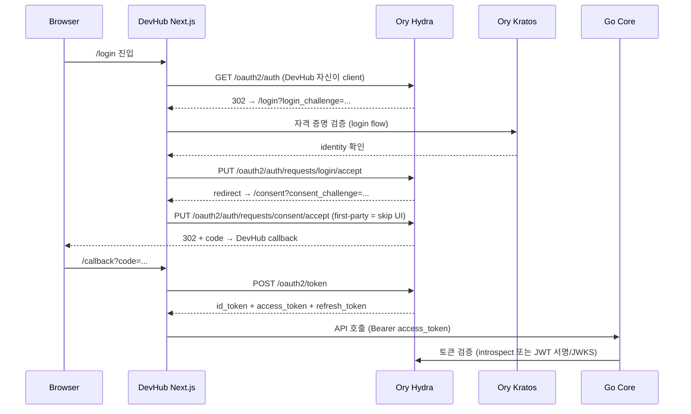

# ADR-0001: 사용자 계정/인증 — IdP 선택 (Ory Hydra + Kratos)

- 문서 목적: DevHub 사용자 계정/인증 구현 방식을 자체 구현이 아닌 외부 IdP(Identity Provider) 도입으로 전환하는 결정과 그 근거를 기록한다.
- 범위: Phase 13 (사용자 계정 1차) 의 구현 방식 — 데이터 모델 master, 인증 토큰 형식, 운영 토폴로지.
- 대상 독자: Backend 개발자, AI Agent, 시스템 관리자, 후속 인증 phase 의사결정자.
- 상태: accepted (1순위 후보로 진행 결정, 미해결 항목은 §8 참조)
- 결정일: 2026-05-07
- 관련 문서: [requirements.md 2.5](../requirements.md#25-사용자-계정-관리-user-account-management), [architecture.md 6.2](../architecture.md#62-사용자user--계정account-도메인-분리), [backend_api_contract.md §11](../backend_api_contract.md#11-계정-및-인증-account--auth), [backend/requirements.md §5](../backend/requirements.md#5-사용자-계정-및-인증-user-account--authentication), [backend_development_roadmap.md Phase 13](../../ai-workflow/memory/backend_development_roadmap.md)

## 1. 컨텍스트

직전 세션(2026-05-07) 까지 Phase 13 은 "DevHub 단일 앱의 자체 로그인" 을 전제로 설계됐다. 이번 세션에서 새로운 요구사항이 추가됐다.

> DevHub 의 계정 관리 서비스를 다른 앱에도 제공한다.

이 요구는 단순 기능 추가가 아니라 아키텍처 결정 레벨의 전환이다. DevHub 가 IdP(Identity Provider) 가 되어야 하며, 다음 표준/기능이 필요하다.

| 항목 | 단일 앱 인증 (직전 설계) | IdP 역할 (신규 요구) |
| --- | --- | --- |
| 토큰 형식 | 임의 session_token 또는 임의 JWT | OIDC ID Token + OAuth2 Access Token + JWKS 키 회전 |
| 클라이언트 | DevHub frontend 1개 | 다수 앱 등록·관리 (`client_id`, `client_secret`, redirect URI, scope) |
| 인증 흐름 | username/password POST | Authorization Code + PKCE, Refresh Token, (선택) Client Credentials |
| 디스커버리 | 불필요 | `/.well-known/openid-configuration`, JWKS endpoint |
| 동의/스코프 | 없음 | scope/audience, (선택) consent screen |
| 세션 관리 | 단일 앱 세션 | SSO 세션 + Single Logout |

자체 OIDC 구현은 보안 부채로 직결되는 영역이다 (PKCE, refresh token rotation, JWKS 회전, ID Token 클레임 정확도, replay/CSRF 보호). 검증된 오픈소스 IdP 를 도입하는 방향으로 결정한다.

## 2. 결정 동인 (Decision drivers)

1. **표준 준수**: OIDC/OAuth2 표준을 직접 만들지 않고 인증된 구현체에 위임.
2. **스택 동질성**: DevHub backend 는 Go 기반(`backend-core/`). 동일 런타임이 운영 부담을 줄임.
3. **데이터 master 보존**: DevHub `users` 테이블 (Phase 12 에서 이미 master) 의 위치를 가능한 보존.
4. **로그인 UX 통합**: 로그인/비밀번호 변경 화면을 DevHub Next.js 디자인 시스템 안에서 통합 운영(별도 IdP UI 가 튀어나오지 않게).
5. **운영 footprint**: 추가되는 프로세스 수, 메모리, 부팅 시간 최소화. **DevHub 서비스 전체는 Docker / docker-compose 미사용 전제이므로, IdP 도 native binary / 호스트 시스템 서비스로 배포 가능해야 한다.**
6. **MFA/계정 복구 확장성**: 1차에는 미도입이지만 후속 phase 에서 표준 기능으로 추가할 수 있어야 함.
7. **사내 SSL inspection 환경**: 외부 의존을 추가할 때 사내 mirror 경로 또는 내부 빌드 경로가 필요함을 고려. **컨테이너 이미지가 아닌 release binary 또는 소스 빌드 경로**를 우선 검토.

## 3. 검토한 옵션

### 3.1 자체 OIDC 구현 (직전 Phase 13 설계 그대로)

- 장점: 데이터 모델 그대로, 외부 의존 없음.
- 단점: OIDC 표준 정확 구현 난이도 매우 높음. 보안 부채 위험 큼. **비추천**.

### 3.2 Keycloak (Java/Quarkus, RedHat)

- 장점: 가장 성숙, OIDC/OAuth2/SAML 2.0/LDAP 페더레이션, Admin/Account UI 내장, 다중 realm = 다중 테넌트, MFA/패스워드 정책/계정 복구 표준 제공, 거대 커뮤니티.
- 단점:
    - JVM 운영 무거움 (≥512MB-1GB RAM, 부팅 ≥10초). DevHub Go Core 의 ~50MB 와 대비 큼.
    - 자체 DB 스키마 강제. DevHub `users.user_id` 와 1:1 매핑하려면 **Custom User Storage SPI(Java)** 작성 또는 Keycloak 이 master 가 되도록 모델을 뒤집어야 함 → Phase 12 와 충돌.
    - 사내 SSL inspection 환경에서 Quarkus 빌드 의존성 미러링 부담.

### 3.3 Zitadel (Go)

- 장점: Go 네이티브 — DevHub backend 스택과 동일. OIDC/OAuth2 인증 완료, multi-tenant 1급, gRPC + REST API. Keycloak 대비 메모리 1/4 수준. 액션(이벤트 hook) 으로 audit log 통합 용이.
- 단점: 커뮤니티가 Keycloak 보다 작음. Admin UI 가 자체 디자인 → DevHub UI 와 분리. SAML 2.0 베타. 자체 schema 사용.

### 3.4 Authentik (Python/Django)

- 장점: 모던 UI, 디자이너식 flow 편집기, OIDC/SAML/LDAP, 활발한 개발.
- 단점: Python 런타임 추가. Keycloak 대비 운영 사례 적음.

### 3.5 Ory Hydra + Kratos (Go, 모듈형) — **선정**

- **Hydra**: OAuth2 + OIDC server (headless, no UI). OIDC 인증 완료.
- **Kratos**: Identity & user management (headless, no UI). 자격 증명, 자체 등록, 로그인, 비밀번호 변경, 계정 복구, MFA(TOTP/WebAuthn) 표준 지원.
- **Keto**: 권한 (이번 결정 범위 밖, 후속 검토).

장점:
- Go 네이티브 — backend-core 와 동일 런타임/배포 패턴. **single static binary 로 배포 가능 → Docker 미사용 정책에 부합** (Ory 공식 release 의 binary 또는 소스 빌드 둘 다 가능).
- **Headless = 로그인 UI 를 DevHub Next.js 에서 직접 구현**. `frontend_development_roadmap.md` Phase 5 의 `/login`, `/account` 화면과 자연스럽게 합쳐진다. 사용자가 별도 IdP UI 로 점프하지 않음.
- Hydra 가 OIDC 표준을 책임짐 — DevHub 는 login_challenge → 인증 → consent_challenge 만 처리.
- Hydra + Kratos 모두 PostgreSQL 사용. DevHub 의 기존 `devhub` DB 인프라 재사용 가능 (별도 DB 또는 별도 schema).
- 메모리 footprint 작음 (각 ~50-100MB), 부팅 빠름.
- OIDC certified.

단점:
- 컴포넌트 2개 운영 (Hydra + Kratos). 학습 곡선.
- Admin UI 없음 → 시스템 관리자 화면을 DevHub admin 안에서 직접 구현 필요. **다만 이는 Phase 5 (frontend) 에서 어차피 만들 화면이므로 추가 비용은 작다.**
- Kratos 의 identity schema 와 DevHub `users` 사이에 동기화 책임이 생김 (§5 참조).

## 4. 결정 (Decision)

DevHub 의 사용자 인증/계정 구현은 **Ory Hydra + Ory Kratos** 를 도입한다.

- **Hydra**: OAuth2/OIDC server. 외부 앱(다른 사내/외부 클라이언트) 이 DevHub 로 OIDC 로그인하는 표준 endpoint 를 책임진다.
- **Kratos**: identity store + 인증 흐름 처리. 비밀번호 해시, 로그인, 비밀번호 변경/복구, MFA(후속), 자격 증명 lifecycle 을 책임진다.
- **DevHub Next.js**: Hydra 의 login/consent UI 와 Kratos 의 self-service UI 를 자체 구현한다 (디자인 일관성).
- **DevHub Go Core**: 자체 `accounts` 테이블/핸들러를 작성하지 않는다. 대신 (a) Kratos identity webhook 또는 (b) Kratos identity API 를 호출해 `users.user_id` ↔ Kratos identity `id` 매핑을 유지하는 동기화 로직과 audit log 기록 어댑터를 책임진다.

## 5. 데이터 모델 / Master of identity

선정 모델: **DevHub `users` 가 사람·조직 master, Kratos 가 credential·세션 master**.

```text
users (DevHub master)               kratos identities (credential master)
  user_id (PK, text)        ←→        id (uuid)
  email                                traits.email
  display_name                         traits.display_name
  role, status, primary_unit_id
  ...

  매핑: kratos.identity.metadata_public.user_id = users.user_id
```

- `users.user_id` 는 그대로 도메인 master.
- Kratos identity 의 `metadata_public.user_id` 에 `users.user_id` 를 박아 1:1 매핑을 강제한다.
- DevHub 가 발급하는 ID Token 의 `sub` claim 은 `users.user_id` 로 매핑(Kratos identity id 그대로 또는 webhook 으로 치환).
- 직전 Phase 13 의 `accounts` 테이블은 **도입하지 않는다**. `login_id`, `password_hash`, `password_algo`, `failed_login_attempts`, `last_login_at`, `password_changed_at`, `status` 는 Kratos 가 책임진다.
- DevHub 의 `users.status` (active/pending/deactivated) 와 Kratos identity state (active/inactive) 는 동기화 대상이다 — Kratos identity 비활성화 시 `users.status` 도 함께 갱신.

## 6. 인증 흐름 (1차)



- 외부 앱은 DevHub Hydra 를 OIDC IdP 로 등록하고 동일 표준 흐름을 사용한다.
- DevHub 자체 frontend 는 first-party client 로 등록해 consent 화면을 skip 한다 (또는 silent consent).

## 7. 결과 (Consequences)

### 7.1 긍정적

- OIDC 표준 준수가 라이브러리 수준에서 보장됨 — 보안 부채 감소.
- 다른 앱이 DevHub 로 SSO 로그인 가능 — 신규 요구 충족.
- DevHub `users` master 보존 — Phase 12 데이터 모델 변경 없음.
- 로그인 UI 가 Next.js 안에 있음 — Phase 5 화면 작업과 자연스럽게 통합.
- MFA/계정 복구가 후속 phase 에서 Kratos 표준 흐름으로 추가됨 — 자체 구현 불필요.
- audit log 책임 경계가 명확: 인증 이벤트는 Kratos webhook → Go Core 가 `audit_logs` 에 기록. 도메인 액션 audit 는 그대로 Go Core 책임.

### 7.2 부정적 / 비용

- 운영 토폴로지에 native 프로세스 2개 추가 (Hydra, Kratos). 호스트 시스템 서비스(Windows Service / systemd / launchd) 또는 직접 실행 스크립트로 lifecycle 관리. **Docker 미사용 정책 준수**.
- Kratos identity ↔ DevHub `users` 동기화 어댑터 신규 구현 (Go).
- 시스템 관리자 화면(계정 발급/회수/잠금 해제/강제 재설정) 을 DevHub admin 에서 직접 구현 — Hydra/Kratos admin API 호출.
- `backend_api_contract.md §11` 의 7개 endpoint 재설계 필요 — 다음 형태로 재구성.
    - 외부 클라이언트용: OIDC discovery + token endpoint (Hydra 표준 path).
    - 내부 관리용: `/api/v1/admin/identities/*` — Kratos admin API wrap.
    - 내부 self-service: Next.js 가 직접 Kratos public flow API 호출.
- 사내 SSL inspection 환경에서 Hydra/Kratos **release binary** 다운로드 경로 / 사내 mirror 또는 소스 빌드 경로 사전 확인 필요.

### 7.3 RBAC 단계화 영향

`architecture.md §6.3` 의 RBAC Phase 2 정의가 바뀐다. "자체 `accounts` 테이블 도입" → "**Ory Hydra + Kratos 도입 및 DevHub OIDC client 화**" 로 갱신.

## 8. 미해결 항목 (Open questions) → 결정 결과

본 절은 ADR 채택 시점에 보류했던 항목들과 그 후속 결정을 함께 기록한다. 결정은 별도 ADR 없이 본 ADR 의 인라인 갱신으로 관리한다.

1. **Hydra/Kratos 데이터베이스 분리 정책**: 기존 `devhub` DB 안에 별도 schema 로 둘지, 별도 DB 인스턴스를 띄울지.
   - **결정 (2026-05-07)**: **기존 `devhub` DB 안에 `hydra`, `kratos` 별도 schema** 로 분리. Hydra/Kratos 의 `dsn` URL 에 `?search_path=hydra` / `?search_path=kratos` 를 적용해 Hydra/Kratos 자체 migration 이 schema 단위로 격리되도록 한다. 운영 트래픽 진입 시점에 별도 DB 인스턴스 분리를 재평가한다.

2. **외부 앱 신뢰 경계**: 사내 N개 앱만 first-party trust 로 보고 consent 화면을 생략할지, 또는 외부 SaaS 도 대상이 될 수 있는지.
   - **결정 (2026-05-07)**: **단계적 도입**. 1차 (Phase 13) 는 **사내 first-party only** 로 한정해 silent consent (Hydra `skip_consent=true`) 로 진행. 외부 SaaS client 추가는 후속 phase 에서 consent UI 구현과 함께. ADR 의 데이터 모델은 외부 client 등록도 가능하도록 그대로 유지(Hydra 표준 client registration 모델이 자체 지원).

3. **MFA 도입 시점**: 1차에 미도입이라는 기존 정책 유지 여부 재확인.
   - **결정 (2026-05-07)**: **1차 미도입 유지** (`requirements.md §2.5` MFA 후보 항목과 동일). Kratos 가 후속 phase 에서 TOTP/WebAuthn 표준 흐름으로 추가 가능하도록 schema 만 확장 가능 상태로 유지.

4. **`X-Devhub-Actor` 헤더 폐기 시점**: Phase 13 완료 시점에 즉시 폐기할지, 별도 마이그레이션 phase 로 분리할지.
   - **결정 (2026-05-07)**: **Deprecation 후 별도 phase 에서 완전 제거**. Phase 13 P1 7단계(Bearer token 검증 미들웨어) 도입 시점에 `X-Devhub-Actor` 폴백은 유지하되 deprecation warning 로그를 남긴다. 모든 backend 핸들러가 token 경로로 actor 도출하도록 전환됐는지 검증된 뒤 별도 phase 에서 완전 제거.

5. **Gitea SSO (RBAC Phase 4)**: Hydra 가 Gitea 의 OIDC client 가 되거나, Gitea 가 Hydra 의 upstream identity provider 가 되는 구도 가능.
   - **결정 (2026-05-07)**: **본 ADR 범위 밖 — Phase 13 완료 후 별도 ADR 로 처리** (예: `docs/adr/0002-gitea-sso.md`). 1차 결정 보류.

6. **Binary 획득 경로 (Docker 미사용 전제)**: Ory Hydra/Kratos binary 를 어떻게 가져올지.
   - **결정 (2026-05-07)**: **`go install github.com/ory/hydra/v2/cmd/hydra@vX.Y.Z` / `go install github.com/ory/kratos/cmd/kratos@vX.Y.Z` 를 사용자 터미널(샌드박스 외)에서 수동 실행**. 사내 GoProxy 미러는 직전 세션에서 backend 의존성 해소에 사용된 것과 동일 경로를 재사용. AI 자동화(샌드박스 모드) 환경은 외부 다운로드가 차단되므로 binary 설치 자체는 항상 사용자 수동 단계로 처리하고, AI 는 설정 파일·검증 스크립트·테스트 작성에 한정한다.

7. **호스트 시스템 서비스 등록 방식**: Windows Service / systemd / launchd 중 어느 표준을 쓸지.
   - **결정 (2026-05-07)**: **PoC 1차는 직접 실행** (PowerShell 백그라운드 또는 별도 창). 개발 환경 OS = Windows. 운영 진입 시점에 운영 OS 기준으로 별도 운영 가이드 문서로 시스템 서비스 wrapper(NSSM / `sc.exe` / systemd unit) 를 결정.

## 9. 구현 계획 (개략)

세부 task 분해는 후속 backlog 항목으로 관리한다. Phase 13 1차 implementation 단계의 상위 흐름:

1. **PoC (Docker 미사용)**: Ory Hydra + Kratos release binary 를 호스트에 설치(또는 소스 빌드)하고 직접 실행. 로컬 PostgreSQL `devhub` DB 에 별도 schema(`hydra`, `kratos`) 또는 별도 DB 생성. 설정 파일(`hydra.yaml`, `kratos.yaml`) 을 `backend-core/configs/` 또는 별도 위치에 둔다. DevHub 가 Hydra 의 OIDC client 로 등록되어 Next.js `/login` 으로 OIDC 코드 흐름 1회 성공.
2. **identity schema 정의**: Kratos identity schema 에 `traits.email`, `traits.display_name`, `metadata_public.user_id` 정의. DevHub `users` 와 1:1 매핑 검증 테스트.
3. **동기화 어댑터**: Kratos webhook 수신 endpoint 를 Go Core 에 추가. identity 생성/비활성화 시 `users.status` 갱신과 `audit_logs` 기록.
4. **시스템 관리자 화면**: Next.js admin 에서 Kratos admin API 호출 wrapper. 발급(initial password 강제 재설정 토큰)/회수/잠금 해제/강제 재설정.
5. **audit log 매핑**: Kratos 이벤트(`session.created`, `identity.created`, `identity.disabled`, `password.changed`) → DevHub audit action 6종 기록.
6. **API 계약 재작성**: `backend_api_contract.md §11` 을 OIDC discovery + admin identity wrapper + self-service flow 안내로 교체.
7. **`X-Devhub-Actor` 폐기**: Bearer token 검증 미들웨어로 actor 도출 후 헤더 제거.

## 10. 대안의 재검토 트리거

다음 사건 발생 시 본 ADR 을 재검토한다.

- Ory Hydra/Kratos 의 메이저 라이선스 변경 또는 메인테이너 이탈.
- DevHub 가 SAML 2.0 IdP 역할도 직접 수행해야 한다는 요구가 추가될 때 (Hydra/Kratos 는 SAML 미지원 → Keycloak 또는 Authentik 재검토).
- 운영 인력이 Java/JVM 운영을 더 선호하고 Go 운영을 부담스러워하는 변화가 생겼을 때.
