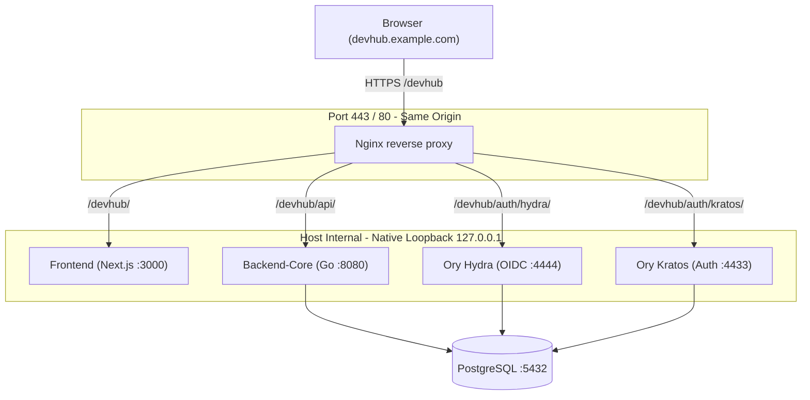

# ADR-0018: 단일 외부 포트 역프록시 구성 및 `/devhub` sub-path prefix 정책

## 1. 상태
- **상태**: Accepted
- **작성일**: 2026-05-18
- **수정일**: 2026-05-18
- **결정 근거 sprint**: `adr0018-reverse-proxy`

## 2. 컨텍스트
DevHub 플랫폼은 5개의 독립된 프로세스(Next.js Frontend, Go Backend-Core, Python AI Gardener, Ory Hydra, Ory Kratos)가 서로 다른 포트에서 Native하게 기동되는 멀티 프로세스 지향 아키텍처(ADR-0003 no-docker 정책)를 고수하고 있습니다.

이러한 멀티 포트(Port) 구성은 로컬 개발 환경에서는 극도로 높은 생산성을 발휘하지만, 실제 Staging 및 Production 환경에 배포될 경우 다음과 같은 심각한 제약 사항을 초래합니다:
1. **네트워크 인프라 제약**: 많은 운영 기업의 보안/방화벽 ingress 정책이 단일 포트(HTTP 80 / HTTPS 443) 진입만을 허용하여 다른 포트의 직접 접근이 원천 차단됩니다.
2. **CORS 및 Cookie Scope의 복잡성**: Hydra와 Kratos의 브라우저 쿠키(Browser Cookie) 처리가 서로 다른 origin 간에 이루어질 때 SameSite=Lax 정책 충돌이 잦아져 세션 누락 또는 리다이렉트 무한 루프가 발생하기 쉽습니다.
3. **보안/TLS 관리 부담**: 각각의 포트마다 별도의 SSL/TLS 인증서 체인을 묶고 포트별 도메인을 구성하거나 CORS whitelist를 지속적으로 정비해야 하는 운영 관리 부채가 발생합니다.

## 3. 결정 사항

### 3.1 Nginx 기반 역프록시(Reverse Proxy) 단일 진입로 선정
Staging/Production 환경의 Ingress 단일 진입로로 **Nginx**를 공식 reverse proxy로 채택합니다.
- 모든 외부 트래픽은 단일 포트(`80` / `443`)를 통해 Nginx로 진입하며, Nginx가 TLS를 종료(SSL/TLS Termination)한 뒤 내부 Native 프로세스로 트래픽을 프록시합니다.
- 내부 프로세스 간(Frontend-Core ↔ Hydra/Kratos)의 모든 연동은 로컬 루프백(`127.0.0.1`) 네트워크 내부에서 평문 HTTP로 신속하게 이루어집니다.

### 3.2 `/devhub` sub-path prefix 라우팅 구조 확정
운영 도메인의 다른 경로(예: 마케팅, 블로그 등 타 서비스)와의 충돌을 완벽히 방지하고 고립하기 위해 `/devhub` sub-path prefix로 모든 트래픽을 통일합니다:
- **Frontend (Next.js)**: `https://devhub.example.com/devhub/*`
- **Backend-Core (Go)**: `https://devhub.example.com/devhub/api/v1/*` (Nginx가 `/devhub`를 Strip한 뒤 `/api/*`로 백엔드 전달)
- **Ory Hydra (OIDC public)**: `https://devhub.example.com/devhub/auth/hydra/*`
- **Ory Kratos (Self-service public)**: `https://devhub.example.com/devhub/auth/kratos/*`

### 3.3 로컬 개발(local dev) vs 운영(production/staging) 이중 분기 가드 적용
- **로컬 개발**: 기존의 극도로 빠르고 격리 친화적인 멀티 포트 환경(`localhost:3000`)을 그대로 유지합니다. Next.js의 `rewrites`를 통해 Same-Origin 개발 편의성을 가집니다.
- **운영/스테이징**: `NEXT_PUBLIC_BASE_PATH=/devhub` 환경 변수를 주입함으로써 프론트엔드가 Next.js `basePath: "/devhub"`로 빌드되며, `endpoints.ts`가 런타임에 basePath 유무를 감지해 relative path 및 absolute callback URI를 dynamic하게 조립하도록 설계합니다.

### 3.4 Same-Origin CORS 무력화 및 쿠키 범위 고립(Isolation)
- 모든 API 및 인증 엔드포인트 호출이 단일 Hostname/Port 상에서 absolute-path-relative(`/devhub/api/*`, `/devhub/auth/*`)로 동작하므로 **Same-Origin** 정책이 강제되며 별도의 CORS 처리가 필요 없어집니다.
- 브라우저 쿠키(Secure = true, SameSite = Lax)의 유출(Leak)을 원천 가드하기 위해, Kratos/Hydra 쿠키의 `Path` scope를 각각 `/devhub/auth/kratos` 및 `/devhub/auth/hydra`로 strict하게 조립하여 세션의 도메인 단위 유출을 차단합니다.

### 3.5 신뢰 프록시(Trusted Proxies) 설정 및 Request ID 전파
- Nginx는 모든 upstream 프록시 전달 시 `X-Real-IP`, `X-Forwarded-For`, `X-Forwarded-Proto`, `X-Forwarded-Host`, `X-Request-ID` 헤더를 엄격히 바인딩합니다.
- 백엔드 코어는 PR #145(docker hardening) 결정에 따라 `DEVHUB_TRUSTED_PROXIES=127.0.0.1` 설정을 활성화하여 Nginx가 바인딩한 client IP를 신뢰하고 audit에 기록합니다.

---

## 4. 아키텍처 토폴로지 (mermaid)



---

## 5. 운영 컷오버(Cutover) 및 롤백(Roll-back) SOP

### 5.1 컷오버 당일 (D-Day)
1. **사용자 사전 공지**: 단일 포트 전환(Issuer 및 OIDC redirect URI 갱신)에 따라 기존 활성 로그인 세션이 일체 강제 만료(Token Introspection fail)되므로 강제 재로그인이 필요함을 사전 안내합니다.
2. **Nginx 설정 적용 및 Syntax 검증**:
   ```bash
   sudo cp infra/nginx/devhub.conf /etc/nginx/sites-available/
   sudo ln -s /etc/nginx/sites-available/devhub.conf /etc/nginx/sites-enabled/
   sudo nginx -t && sudo systemctl reload nginx
   ```
3. **환경변수 일괄 갱신 및 Native 프로세스 재기동**:
   - 프론트엔드는 `NEXT_PUBLIC_BASE_PATH=/devhub`와 OIDC relative endpoint들을 로드하여 다시 빌드/시동합니다.
   - 백엔드는 `DEVHUB_HYDRA_ADMIN_URL=http://127.0.0.1:4445` (admin API는 외부 노출 없이 local network direct 통신 안전성 확보)를 바인딩하여 재기동합니다.
4. **OAuth2 Client redirect_uris 갱신**:
   - Kratos/Hydra CLI 또는 Admin API를 이용하여 client redirect_uri를 `https://devhub.example.com/devhub/auth/callback`으로 일치시킵니다.
5. **E2E 스모크 테스트 가동**:
   - 1차 로그인 → 대시보드 진입 → API 호출 → 로그아웃의 라이프사이클을 Playwright 혹은 수동으로 검증합니다.

### 5.2 롤백 시나리오
- OIDC redirect 루프나 프론트엔드 static asset 로딩 FOUC 이슈 발생 시 즉각 롤백합니다:
  1. DNS 및 Nginx 설정을 이전 백업본으로 교체하고 Nginx를 리로드합니다.
  2. 프론트엔드 및 백엔드를 이전의 멀티 포트(basePath 비활성) 환경 설정으로 원복 기동합니다.

---

## 6. 변경 이력
- **2026-05-18**: `adr0018-reverse-proxy` 피처 스프린트의 일환으로 신규 Accepted 상태 발급.
