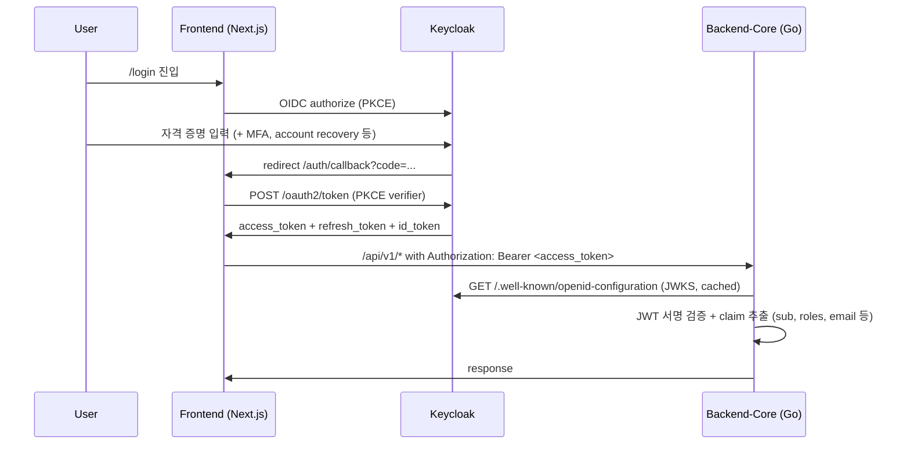

# ADR-0019: Keycloak 단일화 (Hydra+Kratos 폐기) 결정의 사후 명문화

## 1. 상태
- **상태**: Accepted
- **작성일**: 2026-05-19
- **수정일**: 2026-05-19
- **결정 근거 sprint**: `claude/work_260519-a`
- **supersedes**: [ADR-0001 (Ory Hydra + Kratos 선정, 2026-05-07)](./0001-idp-selection.md)
- **관련 문서**: [docs/infrastructure/keycloak-idp/refactor_execution_plan.md](../infrastructure/keycloak-idp/refactor_execution_plan.md) (실행 계획), [docs/infrastructure/keycloak-idp/sso_federation.md](../infrastructure/keycloak-idp/sso_federation.md) (rejected 옵션 B design), [ADR-0018 단일 포트 reverse proxy](./0018-single-port-reverse-proxy-policy.md)

## 2. 컨텍스트

### 2.1 historical 결정 (ADR-0001, 2026-05-07)

ADR-0001 은 DevHub 의 IdP 로 **Ory Hydra + Kratos** 조합을 선정했다.
- Hydra: OAuth2/OIDC server
- Kratos: identity + self-service (password, signup, settings, recovery)
- Go 네이티브 + headless + Docker 미사용 정책 부합

이 결정으로 M0~M2 단계의 인증/계정/RBAC 트랙이 모두 완성됐고 audit/actor enrichment + request_id 미들웨어 + Bearer token verifier (Hydra introspection) 까지 정합화됐다 (2026-05-11 PR #57).

### 2.2 2026-05-18 design 검토 (PR #163, sprint -v) — 옵션 B 권장

`docs/infrastructure/keycloak-idp/sso_federation.md` (sprint `claude/work_260518-v`, PR #163, merge `cdd73b0`) 가 외부 Keycloak SSO 통합의 3가지 옵션을 비교:

| 옵션 | 변경 범위 | 운영 부담 | 권장 |
| --- | --- | --- | --- |
| A. Keycloak 으로 Hydra+Kratos **전체 대체** | 매우 큼 — ADR-0001 reverse, backend verifier 재구현, frontend OIDC client 재구성 | Keycloak 1개로 simplify | ❌ blast radius 큼 |
| B. Keycloak 을 Kratos 의 upstream OIDC provider 로 **federation** | 중간 — Kratos `selfservice.methods.oidc` + frontend SSO 버튼 + HRDB user mapping | 기존 stack 유지 + Keycloak 추가 | ⭐ **권장** |
| C. Hydra 와 token brokering | 매우 큼 + 복잡 | brokering layer 추가 | ❌ over-engineering |

design 문서는 **옵션 B 를 권장**했으며 §15 에서 "Phase 2 진입 시 ADR-0019 후보" 로 옵션 B 의 결정 명문화를 예고했다.

### 2.3 2026-05-18 actual implementation (PR #167) — 옵션 A 채택

같은 날 외부 codex 가 별도 브랜치 (`codex/keycloak-only-refactor-plan`, merge `dff487d`) 에서 **옵션 A (Keycloak 단일화) 실 구현을 main 에 머지**했다. 머지 commit 사실:

- 신규: `backend-core/internal/auth/keycloak_verifier.go` + `keycloak_admin_client.go` + JWKS cache + resource_access role fallback
- 신규: migration `000021_rename_kratos_identity_to_idp_subject` (`users.kratos_identity_id` → `users.idp_subject` 컬럼 일반화)
- 삭제: `auth/hydra_introspection.go` + `httpapi/hydra_admin_client.go` + `hydra_token_client.go` + `auth_login.go` + `auth_logout.go` + `auth_consent.go` + `auth_signup.go` + `auth_token.go` + `kratos_webhook.go` + `kratos-logout.ts` 및 관련 테스트
- 갱신: `infra/nginx/devhub.conf` (Keycloak 단일 진입), 프론트엔드 `auth.service.ts` OIDC discovery 기반, requirements/architecture/setup 가이드/E2E 테스트 가이드 정합화

즉 **design 의 권장 (옵션 B) 이 reversal 되고 옵션 A 가 실제 채택**됐다.

### 2.4 결정 reversal 의 명문화 필요성

PR #167 의 codex 는 ADR-0001 의 **제목과 §3.5 heading 만** "Ory Keycloak" 으로 수정하고 §3.5 body / §4 결정 / §5 데이터 모델 / §6 인증 흐름 / §7 결과 / §8 미해결 / §9 구현 등은 **Hydra+Kratos 기준 그대로** 보존했다. 결과:

- ADR-0001 의 제목과 본문이 충돌 (제목 "Ory Keycloak" + 본문 "Hydra: OAuth2/OIDC server. Kratos: identity store")
- ADR governance 의 immutable history 원칙 위반
- reader 가 ADR-0001 의 현재 결정을 가늠할 수 없음

본 ADR-0019 가 **결정 reversal 의 정합적 사후 명문화**를 책임진다.

## 3. 결정 사항

### 3.1 Keycloak 단일화 채택 (옵션 A)

DevHub 의 IdP 를 **Keycloak 단일 stack 으로 일원화**한다.

- 인증 (OAuth2/OIDC): Keycloak realm 의 OIDC discovery endpoint
- 계정/세션/비밀번호: Keycloak Admin API (`/admin/realms/{realm}/users`)
- 토큰 검증: Keycloak JWKS 기반 JWT verifier (introspection 대신 local JWT 서명 검증 + JWKS cache)
- frontend: OIDC code flow + PKCE (Keycloak public client `devhub-frontend`)
- backend: confidential service-account client `devhub-backend` (Admin API 호출용)

### 3.2 ADR-0001 supersession

ADR-0001 (Hydra+Kratos 선정, 2026-05-07) 의 결정은 본 ADR-0019 가 supersede 한다.

- ADR-0001 의 본문 §3~§9 는 historical context 로 immutable 보존
- ADR-0001 의 status 헤더에 "superseded by ADR-0019 (2026-05-19)" 명시
- ADR-0001 의 제목 + §3.5 heading 은 원래 "Ory Hydra + Kratos" 표기로 복원 (PR #167 의 partial heading 수정 정정)

### 3.3 결정 근거 (왜 옵션 A 인가)

design 문서 PR #163 §2 가 옵션 B 를 권장했음에도 옵션 A 가 채택된 사유:

1. **운영 단순성**: 사내 운영팀이 Keycloak 을 이미 관리할 수 있는 환경에서 Hydra+Kratos 별도 운영은 인프라 부담 중복. 단일 Keycloak 으로 모든 인증/계정 stack 통합 시 운영 surface 축소.
2. **자체 password 사용자와 SSO 사용자 공존 부담 회피**: 옵션 B 는 transitional 기간 동안 Kratos password 와 Keycloak SSO 두 method 공존 + identity link 충돌 처리 + cutover Phase 4 종료 시 password method 비활성화 등 단계적 복잡성. 옵션 A 는 Keycloak 으로 단일화하면서 password 정책도 Keycloak 의 표준 정책에 위임.
3. **MFA / WebAuthn / account recovery 표준 기능 자연 흡수**: Keycloak 의 MFA / FIDO2 / WebAuthn / account recovery / password policy 가 표준 기능. 옵션 B 의 federation 으로는 Keycloak 의 MFA 정책 상속에 그치고 DevHub 의 자체 Kratos MFA 도 별도 운영 필요.
4. **`users.idp_subject` 일반화**: migration 000021 로 `users.kratos_identity_id` → `users.idp_subject` 로 일반화하면 IdP 교체에 대한 결합도 감소 (옵션 A 의 부수 효과).
5. **단일 포트 reverse proxy (ADR-0018) 와의 정합**: ADR-0018 의 `/devhub/auth/*` prefix 가 옵션 A 에서는 `/devhub/auth/keycloak/*` 단일 path 로 단순화. 옵션 B 는 `/devhub/auth/hydra/*` + `/devhub/auth/kratos/*` 두 path 유지.
6. **off-boarding 즉시성**: 옵션 A 는 Keycloak 에서 사용자 비활성화 → DevHub 접근 즉시 차단 (token expiration window 내). 옵션 B 는 Kratos identity 의 별도 비활성화 sync 필요.

trade-off:
- 옵션 A 는 ADR-0001 의 모든 결정을 reverse — historical 결정 reversal 자체의 운영 부담 (코드 대거 삭제/재작성, migration 필요)
- 그러나 이미 PR #167 으로 실 구현 완료된 상태 → 결정 reversal 의 sunk cost 는 회수 완료

따라서 옵션 A 채택 + ADR-0001 supersession 으로 결정.

## 4. 결과

### 4.1 코드 변경 (PR #167 머지 사실)

PR #167 (merge commit `dff487d`, 2026-05-18) 가 다음 6단계 (KC-PR-A..F) 를 단일 묶음으로 머지:

| 단계 | 범위 | 결과 |
| --- | --- | --- |
| KC-PR-A | config/provider 스켈레톤 | `DEVHUB_IDP_PROVIDER=keycloak` env + config 로더 |
| KC-PR-B | Keycloak JWT/JWKS verifier 전환 | `internal/auth/keycloak_verifier.go` + `keycloak_verifier_test.go` (JWKS cache + resource_access fallback) |
| KC-PR-C | account/admin API Keycloak Admin 연동 | `internal/httpapi/keycloak_admin_client.go` + `keycloak_admin_client_test.go` (Kratos Admin 대체) |
| KC-PR-D | frontend auth/logout flow 전환 | OIDC discovery 기반 authorize/callback/logout + Hydra/Kratos 전용 URL 제거 + legacy self-signup 비활성화 |
| KC-PR-E | identity 컬럼 일반화 마이그레이션 | migration `000021_rename_kratos_identity_to_idp_subject` + backfill + 조회 로직 전환. **2026-05-19 sprint -l 정정** — `000021` prefix 충돌 (기존 `000021_rbac_team_manager` 와 중복) 발견 → `000030_rename_kratos_identity_to_idp_subject.{up,down}.sql` 로 rename + 운영 DB 정정 SOP ([docs/setup/migration_000021_conflict_resolution.md](../setup/migration_000021_conflict_resolution.md)). |
| KC-PR-F | 테스트/문서/traceability 동기화 | requirements / architecture / backend_api_contract / setup 가이드 / E2E 테스트 가이드 Keycloak 기준 정합화 |

### 4.2 환경설정 계약

#### 4.2.1 공통
- `DEVHUB_IDP_PROVIDER=keycloak`
- `DEVHUB_OIDC_ISSUER_URL`
- `DEVHUB_OIDC_CLIENT_ID`
- `DEVHUB_OIDC_CLIENT_SECRET` (confidential client)
- `DEVHUB_OIDC_AUDIENCE` (선택)

#### 4.2.2 Backend
- `DEVHUB_OIDC_JWKS_URL` (선택: 없으면 issuer discovery)
- `DEVHUB_KEYCLOAK_ADMIN_URL`
- `DEVHUB_KEYCLOAK_ADMIN_REALM`
- `DEVHUB_KEYCLOAK_ADMIN_CLIENT_ID`
- `DEVHUB_KEYCLOAK_ADMIN_CLIENT_SECRET`

#### 4.2.3 Frontend
- `NEXT_PUBLIC_OIDC_ISSUER_URL`
- `NEXT_PUBLIC_OIDC_CLIENT_ID`
- `NEXT_PUBLIC_OIDC_REDIRECT_URI`
- `NEXT_PUBLIC_OIDC_SCOPE` (기본: `openid profile email`)

### 4.3 데이터 모델

migration 000021 가 도입한 `users.idp_subject` 컬럼이 IdP 발급 sub 의 단일 anchor.

```text
users (DevHub master)               keycloak users (IdP master)
  user_id (PK, text)        ←→        sub (uuid, OIDC claim)
  idp_subject (FK to sub)
  email                                attributes.email
  display_name                         attributes.name
  role, status, primary_unit_id
  ...
```

- `users.user_id` 는 그대로 DevHub 도메인 master
- `users.idp_subject` 가 Keycloak `sub` claim 과 1:1 매핑
- DevHub backend Bearer token verifier 는 access_token 의 `sub` claim 으로 `users` row 조회

### 4.4 인증 흐름 (Keycloak 단일화 후)



핵심: backend 가 **introspection 대신 local JWT 서명 검증 + JWKS cache** 로 동작 → Keycloak 의 admin endpoint 부담 감소 + latency 개선.

### 4.5 audit_logs 영향

- Kratos webhook 기반 audit 흐름 (PR-M2-AUDIT, ADR-0001 §7 의 결정) 은 제거됨
- Keycloak 이벤트 통합 design = [docs/planning/keycloak_event_audit_integration.md](../planning/keycloak_event_audit_integration.md) (sprint `-e` PR #173, 2026-05-19, design accepted — 옵션 B admin event polling + audit_logs action 매핑 30 row + 구현 PR-A..E). 실 backend 구현은 §5.3 잔여 carve.
- `audit_logs.actor_login` 은 Keycloak `preferred_username` claim 으로 매핑
- `audit_logs.source_ip` + `request_id` 는 ADR-0001 의 결정 그대로 (PR-D 의 actor enrichment 유지)

## 5. 운영 영향 + 잔여 carve out

### 5.1 cutover 진행 상태

- ✅ 2026-05-18 PR #167 머지로 코드 cutover 완료
- ✅ 2026-05-18 PR #168 + post-update 로 workflow memory sync 완료
- ✅ 2026-05-19 본 sprint (`claude/work_260519-a`) 로 ADR governance 정정 완료
- ⏳ Keycloak realm/client 운영 환경 구성 (사내 운영팀 책임) — local docker-compose 임베디드 모드 + external 모드 분기는 execution plan §6 참조

### 5.2 trade-off

| 항목 | Keycloak 단일화 (옵션 A, 본 결정) | Hydra+Kratos (ADR-0001) |
| --- | --- | --- |
| 운영 프로세스 | Keycloak 1개 (JVM ~512MB-1GB) | Hydra + Kratos 2개 (Go ~50-100MB each) |
| Admin UI | Keycloak 내장 | 자체 구현 (`/admin/settings/*`) |
| MFA / WebAuthn | Keycloak 표준 기능 | Kratos 표준 기능 (Phase 4 carve) |
| account recovery | Keycloak 표준 기능 | Kratos 표준 기능 |
| password policy | Keycloak 표준 정책 | Kratos 자체 정책 |
| Docker 미사용 정책 (ADR-0003) | JVM 운영 — native binary 또는 컨테이너 둘 다 가능 (사내 환경 별도 결정) | Go static binary native 운영 자연스러움 |
| 운영 학습 곡선 | Keycloak — 사내 운영팀 친숙도에 의존 | Hydra+Kratos — 신규 운영 자원 |

### 5.3 잔여 carve out

- ✅ **resolved (2026-05-19, sprint `claude/work_260519-c`)** — Keycloak realm/client/role 운영 SOP — [`docs/setup/keycloak_operations.md`](../setup/keycloak_operations.md) §2~§4 + §7 local embedded vs external 분기 + §8 운영 SOP (생성/회수/secret rotation/장애).
- ✅ **resolved (2026-05-19, sprint `claude/work_260519-c`)** — JWKS rotation 운영 SOP — [`docs/setup/keycloak_operations.md`](../setup/keycloak_operations.md) §6 (rotation 주기 + backend JWKS cache invalidation + 정상 rotation D-Day SOP + 비상 rotation 절차 §6.5).
- ✅ **resolved (2026-05-19, sprint `claude/work_260519-c`)** — Keycloak ↔ HRDB sync (employee_id strict link) — [`docs/setup/keycloak_operations.md`](../setup/keycloak_operations.md) §5.2 `employee_id` custom claim 매핑 SOP (Keycloak admin console 설정 단계 + user attribute 입력 경로). 자동화 (SCIM bridge / HRDB ETL → Keycloak Admin API) 는 carve 유지.
- ✅ **resolved (2026-05-19, sprint `claude/work_260519-d`)** — Keycloak SSO logout chain (RP-initiated logout) — [`docs/setup/keycloak_operations.md`](../setup/keycloak_operations.md) §8.5 (현재 frontend `auth.service.ts:100-126` 의 RP-initiated 구현 패턴 + Keycloak admin console post_logout_redirect_uri whitelist SOP + chain order mermaid + admin force logout + 보안 점검 4 위협 mitigation). 잔여 sub-carve = front-channel logout URL / backchannel logout / multi-tab sync 3 항목.
- **(carve)** MFA 도입 — Keycloak 의 표준 MFA 정책 활성화 + 사내 정책 결정. ADR-0001 §8.3 (MFA 1차 미도입) 의 자연 진입.
- ✅ **resolved (design, 2026-05-19, sprint `claude/work_260519-h`)** — Keycloak failover — [docs/infrastructure/keycloak-idp/failover.md](../infrastructure/keycloak-idp/failover.md) 신규 (옵션 6종 비교 — A 단일 SPOF / B HA active-active / C HA active-passive / D DevHub graceful degradation / E backup IdP fallback **명시 제외** ADR-0019 충돌 / F DR site). Phase 1 권장 옵션 D 명문화 (JWKS cache 5분 + access_token 5분 = 5-10분 graceful degradation window, **backend 변경 없음**), Phase 2 권장 옵션 B Keycloak HA active-active (Infinispan + shared PG + LB, 별도 ADR 후보 (ADR-0021 은 Onboarding 으로 2026-05-21 발급됨 — 본 carve 진입 시점에 다음 번호 사용)), Phase 3 carve 옵션 F DR site. 운영 모니터링 metric carve (`devhub_jwks_fetch_total` + `devhub_jwks_cache_age_seconds`) + status page SOP carve. backup IdP fallback (옵션 E) 은 ADR-0019 §3.1 Keycloak 단일화 결정과 충돌하므로 명시 제외 — 진짜 case 발생 시 ADR-0019 재검토.
- 🔄 **decision shift (2026-05-20, sprint `claude/work_260520-q-215-hrdb-cancel`, issue #215 close)** — off-boarding 즉시성 — design 은 sprint -g (2026-05-19) 에 resolved 됐으나, 사용자가 **DevHub 외부 Keycloak 시나리오 채택** 으로 결정 변경. HR ↔ Keycloak sync 책임이 외부 IdP 팀 (Keycloak User Federation 또는 사내 ETL → Keycloak Admin REST) 로 이관 → **Phase 1 cron (옵션 C) 폐기**. 대체 흐름: 외부 Keycloak user disable → backend Keycloak event listener (sub-carve C, PR #241 sprint -k) 가 admin event polling → `user_sync.go::SyncUserProfile` 가 DevHub `users.status='deactivated'` 자동 sync. design doc [keycloak_offboarding_immediacy.md](../infrastructure/keycloak-idp/offboarding_immediacy.md) 의 §3.1 Phase 1 cron 부분 deprecation banner + script [`scripts/hrdb_etl_sync.sh`](../../scripts/hrdb_etl_sync.sh) (sprint -p PR #184) 도 deprecation 마킹 (historical reference 보존). Phase 2 (LDAP/AD federation 또는 외부 Keycloak provider) 가 운영 시나리오. 별도 ADR 후보 (ADR-0021 은 Onboarding 으로 2026-05-21 발급됨 — 본 carve 진입 시점에 다음 번호 사용) (Phase 2 진입 시 재평가). historical design 은 보존 — 본 결정은 운영 시나리오 변경에 따른 implementation 폐기.
- ✅ **resolved (design, 2026-05-19, sprint `claude/work_260519-f`)** — Keycloak `groups` → DevHub RBAC role 자동 매핑 — [docs/domain/rbac-permissions/keycloak_groups_mapping.md](../domain/rbac-permissions/keycloak_groups_mapping.md) 신규 (옵션 4종 비교 + 권장 B Keycloak group composite realm role + 1:1 매핑 표 + Keycloak admin SOP + user 운영 SOP 갱신 + HR sync 자연 통합 + Phase 1..4 cutover). 별도 ADR 발행 없음 (Phase 2 옵션 C 확장 시 별도 ADR 후보 (ADR-0021 은 Onboarding 으로 2026-05-21 발급됨 — 본 carve 진입 시점에 다음 번호 사용)). 실 Keycloak admin SOP 적용 (staging/prod group 4 생성 + composite role assign) 은 carve. **sprint -q (PR #185, 2026-05-19)** 가 backend `extractKeycloakRole` 의 multi-role priority filter 구현 (sprint -j codex review #9 #6 후속) — `devhubRolePriority` map + `selectHighestPriorityRole` helper + unit test 9건. order-dependency 해소. **sprint -r (PR #186, 2026-05-19)** 가 backend `VerifyBearerToken` 의 stale-while-error fallback 구현 (sprint -j codex review #9 #3 후속) — `errKidMismatch` sentinel + `parseWithJWKS` helper + `invalidateCache` + 1회 retry + unit test 2건. Keycloak key rotation 시 사용자 영향 없음. **sprint -s (PR #187, 2026-05-19)** 가 frontend basePath 포함 logout URI 구현 (sprint -j codex review #9 #4 후속) — `endpoints.ts BASE_PATH` export + `auth.service.ts` 의 `OIDC_REDIRECT_URI` + `post_logout_redirect_uri` 가 `${origin}${BASE_PATH}/...` 정합. keycloak_operations §3.1 + §8.5.2 whitelist `/devhub/` 재정정. **sprint -t (PR #188, 2026-05-19)** 가 backend 자동 idp_subject sync 구현 (sprint -j codex review #9 #2 후속) — `authenticateActor` 의 GetUser 성공 분기에서 user.IdPSubject 가 빈 경우 actor.Subject 로 lazy backfill (best-effort) + unit test 2건. **backend 확장 carve 4건 모두 resolved**.
- ✅ **resolved (design, 2026-05-19, sprint `claude/work_260519-e`)** — Keycloak event listener / admin event SPI → DevHub `audit_logs` 통합 — [docs/planning/keycloak_event_audit_integration.md](../planning/keycloak_event_audit_integration.md) 신규 (옵션 3종 비교 + 권장 B admin event polling + audit_logs action 매핑 25 row (login 15 + admin 7 + skip 3) + 구현 단계 PR-A..E + 보안 점검 + cutover Phase 1..4 + ADR-0020 후보). **실 구현 Phase 2 PR-B (sprint `claude/work_260519-u`, 2026-05-19) — skeleton resolved** — migration 000031 [`event_cursors`](../../backend-core/migrations/000031_create_event_cursors.up.sql) + [`internal/store/event_cursors.go`](../../backend-core/internal/store/event_cursors.go) `EventCursorStore` interface + `PostgresStore.GetEventCursor` / `UpsertEventCursor` + [`internal/httpapi/keycloak_admin_client.go`](../../backend-core/internal/httpapi/keycloak_admin_client.go) `ListUserEvents` + `ListAdminEvents` (codex review #9 정정 정합 — `?dateFrom=` + `/admin-events`) + [`internal/audit/keycloak_event_puller.go`](../../backend-core/internal/audit/keycloak_event_puller.go) `RunKeycloakEventPuller` cron worker (`pullUserEvents` + `pullAdminEvents` + `loadCursor` + 매핑 표 user 15 row + admin 7 row + default skip 3 type + SHA256 dedup hash) + unit test 14건 PASS. **실 구현 Phase 2 PR-C (sprint `claude/work_260519-v`, 2026-05-19) — wire + metric + integration test resolved** — `domain.AuditSourceKeycloakEvent` enum 신규 + [`internal/audit/metrics.go`](../../backend-core/internal/audit/metrics.go) Prometheus metric 3종 (`devhub_keycloak_events_processed_total` CounterVec[kind,action] + `devhub_keycloak_event_cursor_lag_seconds` GaugeVec[cursor_key] + `devhub_keycloak_event_pull_errors_total` CounterVec[kind]) + [`internal/audit/keycloak_admin_adapter.go`](../../backend-core/internal/audit/keycloak_admin_adapter.go) `HTTPAPIEventLister` adapter (audit ← httpapi 순방향 의존 유지) + [`backend-core/main.go`](../../backend-core/main.go) wire (`DEVHUB_KEYCLOAK_EVENT_LISTENER_ENABLED` gate + `keycloakAdminEventLister` thin wrapper + `buildKeycloakEventAuditEmitter` actor login resolver) + config 신규 3 env (`DEVHUB_KEYCLOAK_EVENT_LISTENER_ENABLED` / `_INTERVAL` / `_MAX_EVENTS`) + pullOnce 정정 (한쪽 error 가 다른 쪽 emit 막지 않게 firstErr 패턴) + 신규 test 5건 (integration end-to-end 1건 + metric 4건). **실 구현 Phase 2 PR-D (sprint `claude/work_260519-w`, 2026-05-19) — store-level dedup resolved** — migration 000032 `audit_logs.source_event_id TEXT` 추가 + partial UNIQUE INDEX (source_type, source_event_id) WHERE NOT NULL + `domain.AuditLog.SourceEventID` 필드 + store INSERT 의 `ON CONFLICT DO NOTHING` + `getAuditLogBySourceEventID` lookup helper + `audit.AuditEmitter` 시그니처에 `sourceEventID` 추가 + puller 가 SHA256 hash 를 sourceEventID 로 전달 + main.go emitter 가 `entry.SourceEventID` set + integration test 2건 (DEVHUB_TEST_DB_URL skip pattern, dedup + empty-source-id 허용 검증). **실 구현 Phase 2 PR-E (sprint `claude/work_260519-x`, 2026-05-19) — 운영 SOP resolved** — [`keycloak_operations.md §8.6`](../setup/keycloak_operations.md) 신규 9 sub-section (활성화 사전 조건 / Keycloak admin console Events 설정 / backend env 3종 / Prometheus dashboard 4 panel + PromQL / 알람 3종 / audit_logs dedup 동작 확인 query / 트러블슈팅 5 케이스 / disable·rollback / sub-carve 3 (SPI push 전환 / cold storage / dashboard JSON 자산)). §9.2 audit log 통합 → resolved 표기 + §10 audit 항목 strikethrough. **§5.3 (9) Phase 2 모든 carve (PR-B~PR-E) resolved**.
- ✅ **resolved (design, 2026-05-19, sprint `claude/work_260519-m`)** — frontend e2e (Playwright) Kratos → Keycloak admin API migration — [docs/infrastructure/keycloak-idp/e2e_migration.md](../infrastructure/keycloak-idp/e2e_migration.md) 신규 (옵션 3종 비교 + 권장 B Keycloak admin API 전환 + admin token + user seed payload 변경 + group 가입 + DevHub users sync 3 옵션 + Phase 1..3 cutover + 보안 4 위협). global-setup.ts (170 line) + fixtures.ts (130 line) + .env.example L41-42 의 KRATOS_ADMIN_URL 잔재 식별 + 본 sprint 가 deprecation 주석만 추가 (e2e 동작 유지). **실 코드 전환** 은 사내 Keycloak e2e 환경 staging 진입 동반 별도 sprint carve.

### 5.4 RM-M4-09 의미 재정의

ADR-0001 시점의 RM-M4-09 "외부 SSO 통합 (Gitea 연동 등)" 은 Hydra 가 외부 IdP (Gitea, Keycloak 등) 의 brokering layer 가 되는 그림을 가정했다. 본 ADR-0019 이후 RM-M4-09 의 scope 는 다음으로 재정의:

- Keycloak 자체가 SSO 우산 (사내 AD/LDAP/SAML 다른 시스템과 연결) — Keycloak 의 federation 기능 사용
- DevHub 는 Keycloak 의 OIDC client 로만 동작
- Gitea 등 외부 시스템과의 SSO 는 Keycloak 의 identity broker / user federation 으로 처리 (DevHub 코드 변경 없음)

이 재정의는 traceability §3 의 RM-M4-09 row 갱신과 함께 반영.

## 6. 변경 이력

| 일자 | 변경 | sprint |
| --- | --- | --- |
| 2026-05-19 | 1차 발행. PR #167 (옵션 A 실 구현, 2026-05-18) 사후 명문화 + ADR-0001 supersession + 결정 근거 6 항목 + 잔여 carve out 8 항목 + RM-M4-09 의미 재정의. | `claude/work_260519-a` |
| 2026-05-19 | §5.3 carve out (1) realm/client/role SOP + (2) JWKS rotation SOP + (3) Keycloak ↔ HRDB sync 3 항목 resolved — [`docs/setup/keycloak_operations.md`](../setup/keycloak_operations.md) 신규. §5.3 잔여 carve = 6 항목 (logout chain / MFA / failover / off-boarding / groups → RBAC + audit event listener 신규 carve). | `claude/work_260519-c` |
| 2026-05-19 | §5.3 carve out (4) SSO logout chain (RP-initiated logout) resolved — [`docs/setup/keycloak_operations.md`](../setup/keycloak_operations.md) §8.5 신규 (frontend `auth.service.ts:100-126` 의 현재 RP-initiated 구현 인용 + Keycloak admin console SOP + chain order mermaid + admin force logout + 보안 4 위협 mitigation + sub-carve 3 항목 — front-channel URL / backchannel / multi-tab sync). §5.3 잔여 carve = 5 항목 (MFA / failover / off-boarding / groups → RBAC / audit event listener). | `claude/work_260519-d` |
| 2026-05-19 | §5.3 carve out (9) audit event listener / SPI → audit_logs 통합 **design resolved** — [docs/planning/keycloak_event_audit_integration.md](../planning/keycloak_event_audit_integration.md) 신규 (옵션 3종 비교 + 권장 B admin event polling + audit_logs action 매핑 25 row (login 15 + admin 7 + skip 3) + 구현 단계 PR-A..E + 보안 점검 + cutover Phase 1..4 + ADR-0020 후보). §4.5 audit_logs 영향 절에 design link 추가. 실 backend 구현 (cron worker + event_cursors migration + admin client 확장 + Prometheus metric) 은 carve 유지. §5.3 잔여 carve = 4 항목 (MFA / failover / off-boarding / groups → RBAC) + design+carve 1 항목 (event listener 실 구현). | `claude/work_260519-e` |
| 2026-05-19 | §5.3 carve out (8) Keycloak `groups` → DevHub RBAC role 자동 매핑 **design resolved** — [docs/domain/rbac-permissions/keycloak_groups_mapping.md](../domain/rbac-permissions/keycloak_groups_mapping.md) 신규 (옵션 4종 비교 + 권장 B Keycloak group composite realm role + group ↔ role 1:1 매핑 표 + Keycloak admin SOP + user 운영 SOP 갱신 + HR sync 자연 통합 + Phase 1..4 cutover). **backend 변경 없음** — keycloak_verifier.go 의 realm_access.roles 추출이 그대로 동작. ADR-0021 별도 발행 없음 (1차 결정, Phase 2 옵션 C 확장 시 재평가). [keycloak_operations.md](../setup/keycloak_operations.md) §4.3 group section + §8.1 step 3 갱신. §5.3 잔여 carve = 3 항목 (MFA — 사내 정책 제외 / failover / off-boarding) + design+carve 1 항목 (event listener 실 구현) + 실 SOP carve 1 항목 (group 실 적용 staging/prod). | `claude/work_260519-f` |
| 2026-05-19 | §5.3 carve out (7) off-boarding 즉시성 **design resolved** — [docs/infrastructure/keycloak-idp/offboarding_immediacy.md](../infrastructure/keycloak-idp/offboarding_immediacy.md) 신규 (옵션 6종 비교 — A 현행 daily / B admin force / C HR ETL push / D HR webhook / E LDAP federation / F SCIM bridge — + Phase 1 권장 옵션 C HR ETL → Keycloak Admin API push 상세 + Phase 2 권장 옵션 E LDAP/AD federation + Phase 3 carve SCIM/webhook). [ADR-0008](./0008-hrdb-production-adapter.md) §6 의 '실시간 sync 요구' 항목과 통합 + design link. [keycloak_operations.md](../setup/keycloak_operations.md) §8.2 user 회수 SOP 보강. Phase 1 latency 목표 ≤ 1h (hourly ETL + access_token TTL 5분), Phase 2 ≤ 15분 (LDAP federation 5-20분). 별도 ADR 후보 (ADR-0021 은 Onboarding 으로 2026-05-21 발급됨 — 본 carve 진입 시점에 다음 번호 사용) (Phase 2 진입 시 재평가). **backend 변경 없음** (Phase 1 ETL script + Keycloak admin SOP). §5.3 잔여 carve = 2 항목 (MFA — 사내 정책 제외 / failover) + design+carve 3 항목 (event listener 실 구현 / group staging/prod 적용 / off-boarding Phase 1 운영 cron 적용). | `claude/work_260519-g` |
| 2026-05-19 | §5.3 carve out (6) Keycloak failover **design resolved** — [docs/infrastructure/keycloak-idp/failover.md](../infrastructure/keycloak-idp/failover.md) 신규 (옵션 6종 비교 — A 단일 SPOF / B HA active-active / C HA active-passive / D DevHub graceful degradation / E backup IdP fallback **명시 제외 ADR-0019 충돌** / F DR site — + Phase 1 권장 옵션 D 상세 (JWKS cache 5분 + access_token 5분 = 5-10분 graceful window, **backend 변경 없음**) + Phase 2 권장 옵션 B HA active-active (Infinispan + shared PG + LB, 별도 ADR 후보 (ADR-0021 은 Onboarding 으로 2026-05-21 발급됨 — 본 carve 진입 시점에 다음 번호 사용)) + Phase 3 carve 옵션 F DR site). [keycloak_operations.md](../setup/keycloak_operations.md) §8.4 장애 대응 표 확장 (graceful degradation 단계별 SOP). 운영 모니터링 metric carve. **§5.3 모든 carve out design 완결** (MFA 제외) — 잔여 = MFA 사내 정책 제외 + 4 design+carve (event listener 실 구현 / group staging/prod 적용 / off-boarding Phase 1 운영 cron / HA Phase 2 사내 인프라). | `claude/work_260519-h` |
| 2026-05-19 | §5.3 carve out (9) audit event listener **Phase 2 PR-B (skeleton) resolved** — migration 000031 [`event_cursors`](../../backend-core/migrations/000031_create_event_cursors.up.sql) + [`internal/store/event_cursors.go`](../../backend-core/internal/store/event_cursors.go) `EventCursorStore` interface + PostgresStore impl + [`internal/httpapi/keycloak_admin_client.go`](../../backend-core/internal/httpapi/keycloak_admin_client.go) `ListUserEvents` + `ListAdminEvents` (codex review #9 정정 정합 — `?dateFrom=` + `/admin-events` 경로) + [`internal/audit/keycloak_event_puller.go`](../../backend-core/internal/audit/keycloak_event_puller.go) `RunKeycloakEventPuller` cron worker (HomeLab pull + DREQ intake token cron 패턴 정합) + `pullUserEvents` / `pullAdminEvents` + `loadCursor` (first-run `now()` 초기화 — design §3.3) + 매핑 표 user 15 row + admin 7 row (design §4.1 + §4.2) + default skip 3 type (REFRESH_TOKEN / CODE_TO_TOKEN / INTROSPECT_TOKEN — design §4.3) + SHA256 dedup hash (design §3.3) + unit test 14건 PASS (audit puller 11건 + admin client events 3건). **잔여 carve = PR-C main.go wire + Prometheus metric (`devhub_keycloak_events_processed_total` + `devhub_keycloak_event_cursor_lag_seconds`) + integration test + PR-D `audit_logs.source_type='keycloak_event'` schema 정합 + PR-E [keycloak_operations.md](../setup/keycloak_operations.md) §8.6 운영 SOP**. | `claude/work_260519-u` |
| 2026-05-19 | §5.3 carve out (9) audit event listener **Phase 2 PR-C (wire + metric + integration test) resolved** — [`domain.AuditSourceKeycloakEvent`](../../backend-core/internal/domain/domain.go) enum 신규 (audit_logs `source_type='keycloak_event'` 정합) + [`internal/audit/metrics.go`](../../backend-core/internal/audit/metrics.go) Prometheus metric 3종 (`devhub_keycloak_events_processed_total` CounterVec[kind,action] + `devhub_keycloak_event_cursor_lag_seconds` GaugeVec[cursor_key] + `devhub_keycloak_event_pull_errors_total` CounterVec[kind]) — DREQ + HomeLab metric 패턴 (`sync.Once` + `registerCollector` + observe helpers) 정합 + [`internal/audit/keycloak_admin_adapter.go`](../../backend-core/internal/audit/keycloak_admin_adapter.go) `HTTPAPIEventLister` adapter (audit ← httpapi 순방향 의존 유지, `HTTPAPIUserEvent` + `HTTPAPIAdminEvent` mirror + `NewHTTPAPIEventListerAdapter`) + [`backend-core/main.go`](../../backend-core/main.go) cron loop wire (`DEVHUB_KEYCLOAK_EVENT_LISTENER_ENABLED` gate + `keycloakAdminEventLister` thin wrapper for `*httpapi.KeycloakAdminClient` → `audit.HTTPAPIEventLister` 변환 + `buildKeycloakEventAuditEmitter` actor login resolver - payload `user_id` / `auth_user_id` 우선 + DREQ intake token cron 패턴 정합) + [`internal/config/config.go`](../../backend-core/internal/config/config.go) 신규 3 env (`DEVHUB_KEYCLOAK_EVENT_LISTENER_ENABLED` / `_INTERVAL` (default 30s) / `_MAX_EVENTS` (default 500)) + `pullOnce` 정정 (한쪽 error 가 다른 쪽 emit 막지 않게 firstErr 패턴 + `ObservePullError` emit) + emit / cursor advance 직후 `ObserveEventProcessed` + `ObserveCursorLag` 호출. 신규 test 5건 — `keycloak_event_integration_test.go` 1건 (3-tick end-to-end + dateFrom inclusive boundary dedup + payload key 검증 + cursor advance 검증) + `metrics_test.go` 4건 (InitMetrics idempotent + Counter / Gauge / pull-error observe). go build + go test PASS (audit 0.832s). **잔여 carve = PR-D `audit_logs` schema dedup UNIQUE constraint (source_event_id) + PR-E [keycloak_operations.md](../setup/keycloak_operations.md) §8.6 운영 SOP**. | `claude/work_260519-v` |
| 2026-05-19 | §5.3 carve out (9) audit event listener **Phase 2 PR-D (store-level dedup) resolved** — migration 000032 [`audit_logs_source_event_id.up.sql`](../../backend-core/migrations/000032_audit_logs_source_event_id.up.sql) — `audit_logs.source_event_id TEXT` 컬럼 추가 + partial UNIQUE INDEX `audit_logs_source_event_id_uniq` (source_type, source_event_id) WHERE source_event_id IS NOT NULL (legacy row 영향 없음, Keycloak event listener 처럼 deterministic id 부여하는 emitter 만 dedup 대상). [`domain.AuditLog`](../../backend-core/internal/domain/domain.go) 에 `SourceEventID string` 필드 추가. [`internal/store/audit_logs.go`](../../backend-core/internal/store/audit_logs.go) `CreateAuditLog` INSERT 가 `ON CONFLICT (source_type, source_event_id) WHERE source_event_id IS NOT NULL DO NOTHING` 적용 + `getAuditLogBySourceEventID` lookup helper 신규 (dedup 차단 시 기존 row SELECT 반환, caller 가 idempotency 의식 없이 사용 가능). `ListAuditLogs` SELECT 도 source_event_id COALESCE column 포함. [`audit.AuditEmitter`](../../backend-core/internal/audit/keycloak_event_puller.go) 시그니처 확장 — `(ctx, action, targetType, targetID, sourceEventID, payload)` 으로 sourceEventID 파라미터 추가. `pullUserEvents` / `pullAdminEvents` 가 자체 SHA256 hash 를 sourceEventID 로 전달. [`backend-core/main.go`](../../backend-core/main.go) `buildKeycloakEventAuditEmitter` 가 `entry.SourceEventID = sourceEventID` set. 신규 integration test 2건 — `audit_logs_dedup_integration_test.go` (DEVHUB_TEST_DB_URL skip pattern, postgres_integration_test 패턴 정합): (1) 동일 (source_type, source_event_id) INSERT 2회 → 1개 row + 기존 row 반환 검증, (2) 빈 source_event_id 로 INSERT 2회 → partial WHERE 가 NULL row 를 unique 제약에서 제외 → 2개 row 정상. 기존 audit/integration_test 의 emitter 시그니처 정정 + sourceEventID 검증 추가 (nonempty + tick1 LOGIN ≠ tick3 LOGOUT hash). go build + go test PASS (audit + store + domain + httpapi). **모든 §5.3 (9) Phase 2 backend 구현 (PR-B~PR-D) resolved** — 잔여 = PR-E [keycloak_operations.md](../setup/keycloak_operations.md) §8.6 운영 SOP. | `claude/work_260519-w` |
| 2026-05-19 | §5.3 carve out (9) audit event listener **Phase 2 PR-E (운영 SOP) resolved** — [`keycloak_operations.md §8.6`](../setup/keycloak_operations.md) 신규 9 sub-section: 활성화 사전 조건 (migration 000031 + 000032 + Keycloak Events 활성화 + service account view-events 권한) / Keycloak admin console User+Admin events Save + Expiration 7d 설정 / backend env 3종 (`DEVHUB_KEYCLOAK_EVENT_LISTENER_ENABLED` / `_INTERVAL` / `_MAX_EVENTS`) 운영 권장값 / Prometheus dashboard 4 panel (`events_processed_total` / `cursor_lag_seconds` / `pull_errors_total`) + PromQL 예시 3건 (rate / max lag / increase) / 알람 3종 (`cursor_lag_high` 600s for 5m / `cursor_lag_critical` 3600s for 10m / `pull_error_rate` 5건/5분) / audit_logs dedup 동작 확인 SQL 3건 (최근 emit / 중복 검사 / cursor 위치) / 트러블슈팅 5 케이스 (audit row 없음 / cursor lag / 중복 등장 / pull error / unknown action 빈번) + 대응 절차 / disable·rollback (env false + cursor 보존) / sub-carve 3 항목 (SPI push 전환 / cold storage archival / dashboard JSON 자산). §9.2 audit log 통합 carve → resolved 표기로 갱신 + §10 의 audit 항목 strikethrough. **§5.3 (9) Phase 2 모든 carve (PR-B~PR-E) resolved** — Phase 2 backend (B/C/D) + 운영 SOP (E) 완전 종결. 잔여 = MFA 사내 정책 제외 + 4 design+carve (group staging/prod 적용 / off-boarding Phase 1 운영 cron 적용 / HA Phase 2 사내 인프라 / event listener SPI push 전환). | `claude/work_260519-x` |
| 2026-05-19 | **codex review hotfix #10** (sprint `claude/work_260519-y`) — PR #189~#192 의 P1×3 + P2×2 일괄 흡수. P1-A `internal/audit/keycloak_event_puller.go` 의 `pullUserEvents` 가 skip type (REFRESH_TOKEN 등) 만 들어온 page 에서도 cursor advance 하도록 정정 (이전: latestTime zero → 다음 tick 동일 page 무한 재pull 위험). P1-B `loadCursor` 가 row 미존재 시 in-memory init 후 즉시 `UpsertEventCursor` 호출하여 영구 seed (이전: 첫 poll 빈 결과 시 다음 tick now() 재초기화 → 그 사이 발생 event 영구 누락). P1-C [keycloak_operations.md §8.6.1](../setup/keycloak_operations.md) 사전 조건 표에 'event_cursors row seed = backend 자동 (P1-B fix 정합)' 항목 추가. P2-D `hashUserEvent` 가 (time/type/userID/ipAddr/clientID/realmID/sessionId) 7-tuple, `hashAdminEvent` 가 (time/resourceType:operationType/resourcePath/authUserID/authClientID/authIPAddr/realmID) 7-tuple 로 확장 — burst 동시 ms event 의 client/realm 차이를 hash 가 반영해 store-level UNIQUE INDEX dedup 으로 audit 손실 회피. P2-E [keycloak_operations.md §8.6.2](../setup/keycloak_operations.md) Expiration row wording 정정 — '짧아도 무관' → '운영 outage tolerance + recovery time 보다 길게 (권장 7d 이상)'. 신규 test 4건 (LoadCursor_NotFound_PersistsSeed + SkipOnlyPage_AdvancesCursor + HashUserEvent_DistinguishesByClientID + HashAdminEvent_DistinguishesByAuthClient). codex P2 #4 (PR #189 same-ms boundary) 는 sprint -u Stage 3 (`580c0db` `evTime.Before`) 에서 이미 해소 — false positive 코멘트 응답으로 처리. | `claude/work_260519-y` |
| 2026-05-19 | **codex review hotfix #11** (sprint `claude/work_260519-aa`) — PR #193 의 P2 단일 정정. `pullUserEvents` 의 `latestHash` 가 same-ms boundary 에서 skip event (REFRESH_TOKEN 등) 의 hash 로 set 되어, 다음 tick 의 dateFrom inclusive boundary 에서 emit-able event 가 dedup 안 됨 + emit/metric 호출되던 side effect 정정 (audit_logs 자체는 partial UNIQUE INDEX 가 차단하므로 정확성 영향 없음, dashboard counter 왜곡 + DB INSERT 부담). `latestEmittable bool` flag 도입 — same-ms 에 skip+emit 함께 등장하면 emit-able 의 hash 우선. 신규 test 2건 (SameMsSkipAndEmit_PrefersEmittableHash + SameMsSkipAndEmit_NextTickDedup). | `claude/work_260519-aa` |
| 2026-05-19 | **codex review hotfix #12** (sprint `claude/work_260519-ab`) — PR #194 codex P2 정정. sprint -z housekeeping 시 work_backlog row 의 "sprint -n~-y 12개 finalize" 가 실제로는 -u~-y 5개만 finalize 한 상태. sprint -n~-t 7 branch state.json 의 `status: in_progress → done` + `ended_at` + `merged_pr` + `merge_commit` (#182~#188) 추가. sprint -z + -aa 본인 finalize 도 추가. work_backlog row 정정 — "12개" → "5개 (-n~-t 7개 sprint -ab 후속 정정)". AGENTS.md 의 세션 복원 시 브랜치별 memory 우선 읽기 규칙에 따라 다음 에이전트가 PR #182~#188 작업을 in-progress 로 잘못 복원할 위험 회피. | `claude/work_260519-ab` |
| 2026-05-20 | **decision shift — off-boarding HRDB cron 폐기** (sprint `claude/work_260520-q-215-hrdb-cancel`, issue #215 close not planned). 사용자가 DevHub 외부 Keycloak 시나리오 채택 — 사내 IdP 팀이 별도 운영. HR ↔ Keycloak sync 책임이 외부 IdP 팀 (Keycloak User Federation 또는 사내 ETL → Keycloak Admin REST) 으로 이관. §5.3 (7) off-boarding 즉시성 의 Phase 1 cron (옵션 C) 폐기 — design [keycloak_offboarding_immediacy.md](../infrastructure/keycloak-idp/offboarding_immediacy.md) 의 §3.1 + script [scripts/hrdb_etl_sync.sh](../../scripts/hrdb_etl_sync.sh) (sprint -p PR #184) 모두 deprecation 마킹 (historical reference 보존). 대체: 외부 Keycloak user disable → backend Keycloak event listener (sub-carve C, PR #241) admin event polling → user_sync.go::SyncUserProfile 가 `users.status='deactivated'` 자동 sync. Phase 2 (LDAP/AD federation 또는 외부 Keycloak provider) 가 운영 시나리오. release_v1_roadmap §3.2 P1-4 strikethrough + §4.2 v1.1 milestone 정정. v1.0 release gate 잔여 2건 (#210 + #214). | `claude/work_260520-q-215-hrdb-cancel` |
