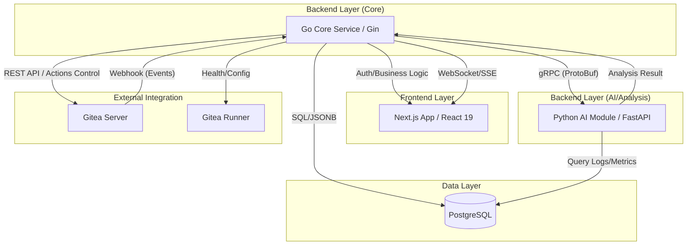

# DevHub 시스템 아키텍처 설계서

- **작성일:** 2026-04-29
- **상태:** Draft / Confirmed
- **관련 문서:** [요구사항 정의서](./requirements.md), [프로젝트 프로파일](../ai-workflow/project/project_workflow_profile.md)

## 1. 개요
본 문서는 DevHub의 시스템 구성, 서비스 간 통신 방식, 데이터 흐름 및 UI/UX 시각화 전략을 상세히 정의합니다.

## 2. 시스템 컴포넌트 구조

## 3. 서비스 간 통신 (Internal Communication)

### 3.1 Go Core ↔ Python AI (gRPC)
- **프로토콜:** gRPC (HTTP/2 기반)
- **IDL:** Protocol Buffers (.proto)
- **선정 이유:** 
    - Go와 Python 간의 고성능 바이너리 통신.
    - 강력한 타입 체크를 통한 인터페이스 정합성 보장.
    - 대용량 로그 데이터 전송 시 스트리밍 기능 활용 가능.

### 3.2 Backend ↔ Frontend (REST & WebSocket)
- **API:** RESTful API (Next.js Data Fetching / TanStack Query)
- **실시간 통신:** **WebSocket** 또는 **SSE**
    - **용도:** Gitea Actions 빌드 상태 실시간 업데이트, 긴급 리스크 알림, 실시간 이슈 액티비티 피드.

## 4. 데이터 전략 (Data Strategy)

### 4.1 하이브리드 동기화
- **Webhook:** Gitea의 모든 이벤트를 실시간 수집하여 즉시 반영.
- **Hourly Pull:** 매 시간 전체 상태를 체크하여 동기화 유실 방지 (Reconciliation).

### 4.2 스토리지 구성
- **PostgreSQL:**
    - 정형 데이터: 사용자, 프로젝트, 권한, 저장소 매핑.
    - 비정형 데이터(JSONB): Gitea 원본 웹훅 이벤트, AI 분석 리포트 요약.
    - 보존 기간: 운영 로그 1개월, 개인화 데이터(Kudos 등)는 계정 삭제 후 1개월까지 보존.

## 5. UI/UX 및 시각화 전략

### 5.1 인터랙티브 인프라 관리
- **기술:** **React Flow**
- **내용:** Gitea Runner와 프로젝트 간의 구성도를 인터랙티브 다이어그램으로 구현. 사용자가 직접 드래그, 클릭하여 노드 상태 확인 및 제어(재시작 등) 수행.

### 5.2 역할별 대시보드
- **개발자:** 집중 시간 보호 모드, 개인화된 업무 연혁, 실시간 빌드 현황.
- **관리자:** 리스크 탐지(7일 임계치), 진행률 시각화, 의사결정 로그.
- **시스템 관리자:** 인프라 헬스체크, 알림 임계치 설정, Runner 제어 콘솔.

## 6. 보안 및 인증
- **SSO 연동:** Gitea와의 SSO(Single Sign-On) 연동을 통한 통합 인증.
- **RBAC:** 역할 기반 접근 제어를 통해 시스템 관리 메뉴 격리.
- **작업 로그:** 모든 관리자 작업(Runner 제어 등)에 대한 Audit Log 기록.
