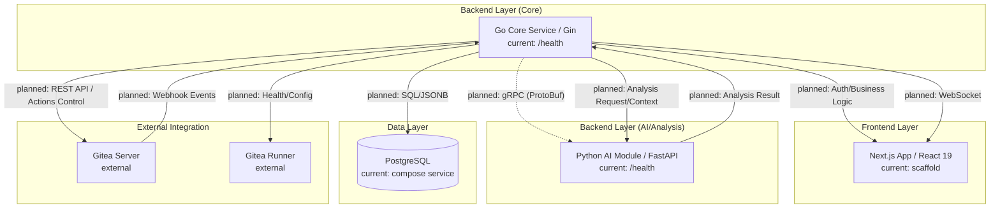

# DevHub 시스템 아키텍처 설계서

- 문서 목적: DevHub 의 시스템 구성 (Frontend / Go Core / Python AI), 서비스 간 통신 방식, 데이터 흐름, UI/UX 시각화 전략, RBAC 정책 단계화를 정의한다.
- 범위: 아키텍처 결정 본문. 구체 API 계약은 `docs/backend_api_contract.md`, 결정 근거는 `docs/adr/000X-*.md`, 도메인 모델 (조직) 은 `docs/organizational_hierarchy_spec.md` 가 source-of-truth.
- 대상 독자: Backend / 프론트엔드 / DevOps 개발자, AI agent, 아키텍처 검토자.
- 상태: accepted (sections marked Draft/Confirmed 안에서 부분 진화)
- 작성일: 2026-04-29
- 최종 수정일: 2026-05-13 (메타 헤더 표준화, sprint `claude/work_260513-d`)
- 관련 문서: [요구사항 정의서](./requirements.md), [백엔드 API 계약](./backend_api_contract.md), [ADR-0001 IdP](./adr/0001-idp-selection.md), [ADR-0002 RBAC](./adr/0002-rbac-policy-edit-api.md), [ADR-0003 No-Docker CI scope](./adr/0003-no-docker-policy-ci-scope.md), [추적성 매트릭스](./traceability/report.md), [프로젝트 프로파일](../ai-workflow/memory/PROJECT_PROFILE.md).

## 1. 개요
본 문서는 DevHub의 시스템 구성, 서비스 간 통신 방식, 데이터 흐름 및 UI/UX 시각화 전략을 상세히 정의합니다.

## 2. 시스템 컴포넌트 구조

상태 표기 기준:
- `current`: 현재 스캐폴딩 또는 health endpoint 수준으로 존재하는 구성
- `planned`: 아키텍처 계약은 확정되었지만 아직 구현 전인 구성
- `external`: DevHub 외부 시스템 또는 연동 대상



## 3. 서비스 간 통신 (Internal Communication)

### 3.1 Go Core ↔ Python AI (gRPC)
- **프로토콜:** gRPC (HTTP/2 기반)
- **IDL:** Protocol Buffers (.proto)
- **계약 상태:** 내부 분석 요청/응답의 기본 통신 방식은 gRPC로 확정합니다.
- **구현 상태:** 현재 스캐폴딩에는 `proto/analysis.proto`, Go/Python 생성 명령, Python gRPC 의존성이 포함되어 있습니다. 다만 `backend-ai/main.py`는 아직 FastAPI HTTP health endpoint만 실행하며, `50051`은 Docker Compose에 예약 노출된 포트일 뿐 실제 gRPC 서버와 Go Core client/server 연동은 후속 구현 범위입니다.
- **데이터 접근 경계:** 초기 구현에서 Python AI는 PostgreSQL에 직접 접근하지 않습니다. Go Core가 Gitea 이벤트, 로그, 메트릭, 권한 필터링을 처리한 뒤 필요한 분석 입력만 gRPC로 전달합니다.
- **확장 가능성:** 대용량 분석이나 배치 처리가 필요해질 경우 Python AI의 읽기 전용 DB 접근 또는 분석 전용 view/replica를 후속 아키텍처로 검토합니다.
- **선정 이유:** 
    - Go와 Python 간의 고성능 바이너리 통신.
    - 강력한 타입 체크를 통한 인터페이스 정합성 보장.
    - 대용량 로그 데이터 전송 시 스트리밍 기능 활용 가능.

### 3.2 Backend ↔ Frontend (REST & WebSocket)
- **API:** RESTful API (Next.js Data Fetching / TanStack Query)
- **실시간 통신:** **WebSocket**을 기본 계약으로 사용합니다.
    - **용도:** Gitea Actions 빌드 상태 실시간 업데이트, 긴급 리스크 알림, 실시간 이슈 액티비티 피드.
    - **SSE 처리:** SSE는 초기 구현 범위에 포함하지 않습니다. 프록시/운영 환경 제약으로 WebSocket 유지가 어렵다고 확인될 때 별도 fallback으로 재검토합니다.

## 4. 데이터 전략 (Data Strategy)

### 4.1 하이브리드 동기화
- **Webhook:** Gitea의 모든 이벤트를 실시간 수집하여 즉시 반영.
- **Hourly Pull:** 매 시간 전체 상태를 체크하여 동기화 유실 방지 (Reconciliation).

### 4.2 이벤트 수집 파이프라인

Gitea 이벤트 수집은 다음 파이프라인을 기본으로 합니다.

1. **Receive:** Go Core가 Gitea Webhook 이벤트를 수신.
2. **Validate:** Webhook secret/signature를 검증하고 이벤트 타입을 식별. 알 수 없는 이벤트 타입도 원본은 저장하되 처리 상태를 구분.
3. **Persist Raw Event:** payload 원문을 JSONB로 저장하고 event type, delivery id 또는 dedupe key, repository, sender, received_at, processed_at, status를 함께 기록.
4. **Normalize:** 이슈, PR, commit, build, runner 상태 등 도메인 테이블로 정규화.
5. **Apply Domain Update:** 프로젝트/저장소/사용자/권한/상태 테이블을 갱신.
6. **Request Analysis:** 필요한 경우 Go Core가 권한 필터링을 거친 분석 입력을 Python AI에 gRPC로 전달.
7. **Publish Update:** 프론트엔드 실시간 채널에 상태 변경을 전달.

중복 처리는 Gitea delivery id를 우선 idempotency key로 사용합니다. delivery id가 없는 이벤트는 event type, repository id/name, payload hash를 조합한 보조 key를 사용하며, 같은 key는 중복 삽입 또는 중복 처리하지 않습니다.

처리 상태는 `received`, `validated`, `processed`, `failed`, `ignored`를 기본으로 하며, 실패 시 실패 사유와 retry count를 기록합니다. 반복 실패 이벤트는 수동 확인 또는 `ignored` 상태로 전환해 재처리 루프를 방지합니다.

Hourly Pull reconciliation은 Webhook 누락을 보완하는 동기화 경로이며, 가능한 한 Webhook과 동일한 정규화/갱신 경로를 사용합니다. Pull 결과가 기존 상태와 충돌하면 요구사항 문서의 데이터 상충 정책에 따라 사용자 알림 및 PL read-only 노출 기준을 적용합니다.

### 4.3 스토리지 구성
- **PostgreSQL:**
    - 정형 데이터: 사용자, 프로젝트, 권한, 저장소 매핑.
    - 비정형 데이터(JSONB): Gitea 원본 웹훅 이벤트, AI 분석 리포트 요약.
    - 보존 기간: 운영 로그 1개월, 개인화 데이터(Kudos 등)는 계정 삭제 후 1개월까지 보존.

## 5. UI/UX 및 시각화 전략

### 5.1 인터랙티브 인프라 관리
- **기술:** **React Flow**
- **내용:** Gitea Runner와 프로젝트 간의 구성도를 인터랙티브 다이어그램으로 구현. 사용자가 직접 드래그, 클릭하여 노드 상태 확인 및 제어(재시작 등) 수행.

### 5.2 역할별 진입 우선순위 기반 대시보드
- **개발 대시보드 (Developer Dashboard):** 집중 시간 보호 모드, 개인화된 업무 연혁, 실시간 빌드 현황.
- **관리 대시보드 (Management Dashboard):** 리스크 탐지(7일 임계치), 진행률 시각화, 의사결정 로그.
- **시스템 대시보드 + 시스템 설정 (System Dashboard + System Settings):** 인프라 헬스체크, 알림 임계치 설정, Runner 제어 콘솔.
- **UX 제공 방식:** 역할별 UX는 전용 화면 완전 분리보다 기본 진입 페이지 우선순위로 간접 제공한다.
- **노출 정책:** 시스템 대시보드/시스템 설정은 `system_admin` 권한 사용자에게만 노출한다.

## 6. 보안 및 인증

초기 구현은 Gitea Webhook 수집과 시스템 관리자 기능의 오남용 방지를 우선하며, DevHub 자체 사용자 계정(Account) 기반 1차 인증을 도입한 뒤 Gitea SSO 통합을 후속 단계로 분리합니다.

### 6.1 초기 구현 범위

- **Webhook 검증:** Gitea Webhook endpoint는 `GITEA_WEBHOOK_SECRET` 기반 signature 검증을 필수로 합니다. 검증 실패 이벤트는 도메인 상태를 변경하지 않으며, 원본 저장 여부는 보안 위험을 고려해 최소 metadata 중심으로 기록합니다.
- **서비스 간 권한 경계:** 모든 Gitea 이벤트와 외부 API 호출은 Go Core를 먼저 통과합니다. Python AI는 인증/권한 판단을 직접 수행하지 않고, Go Core가 필터링한 분석 입력만 처리합니다.
- **관리자 접근:** 시스템 관리자 기능은 초기 단계에서 설정 기반 allowlist 또는 seed된 system admin 계정으로 제한합니다. 일반 관리자/PM 권한과 시스템 관리자 권한은 별도 role로 분리합니다.
- **Audit Log:** Runner 제어, Gitea 계정/조직/권한 변경, 알림 임계치 변경, Webhook 재처리/무시 처리, **계정 발급/회수, 비밀번호 변경, 로그인 성공/실패**는 Audit Log 기록 대상입니다.

### 6.2 사용자(User) ↔ 계정(Account) 도메인 분리

DevHub는 사람 단위 식별(User)과 인증 자격(Account)을 분리해 관리합니다. 자세한 정책은 [요구사항 정의서 2.5절](./requirements.md#25-사용자-계정-관리-user-account-management)을 참조합니다. 본 문서는 그 정책을 만족하기 위한 데이터 모델과 인증 흐름만 정의합니다.

#### 6.2.1 데이터 모델

```text
users (이미 존재)
  user_id        text  PK
  email          text  unique
  display_name   text
  role           text  CHECK in (developer, manager, system_admin)
  status         text  CHECK in (active, pending, deactivated)
  primary_unit_id, current_unit_id, is_seconded, joined_at, ...

accounts (신규)
  id              bigserial PK
  user_id         text NOT NULL UNIQUE  REFERENCES users(user_id) ON DELETE CASCADE
  login_id        text NOT NULL UNIQUE
  password_hash   text NOT NULL
  password_algo   text NOT NULL          -- 예: 'bcrypt', 'argon2id'
  status          text NOT NULL CHECK (status IN ('active','disabled','locked','password_reset_required'))
  failed_login_attempts integer NOT NULL DEFAULT 0
  last_login_at   timestamptz
  password_changed_at timestamptz NOT NULL DEFAULT NOW()
  created_at, updated_at timestamptz NOT NULL DEFAULT NOW()
```

`accounts.user_id`의 `UNIQUE` 제약이 1:1 invariant 의 1차 방어선입니다. 도메인 레이어와 HTTP 핸들러도 이 invariant 를 함께 검사하며, 계정 생성 시 동일 사용자에 대한 중복 시도는 `409 Conflict`로 거절합니다. `users` 행이 삭제되면 `ON DELETE CASCADE` 로 계정도 함께 삭제됩니다.

#### 6.2.2 비밀번호 처리 원칙

- 비밀번호 평문은 어떤 경로로도 저장/로깅하지 않습니다. 핸들러 진입 직후 즉시 해시로 변환하고 평문 변수의 수명은 최소화합니다.
- 해시 알고리즘은 bcrypt(cost ≥ 12) 또는 argon2id 중 하나를 선택하며, 선택 결과를 `password_algo` 컬럼에 저장해 향후 알고리즘 회전을 가능하게 합니다.
- 비밀번호 강도는 운영 정책으로 별도 정의하되, 최소 길이/금지 패턴 검사는 핸들러 입력 검증 단계에서 수행합니다.
- 강제 재설정(시스템 관리자) 후 다음 로그인은 비밀번호 변경을 강제하기 위해 계정 상태를 `password_reset_required` 로 설정합니다.

#### 6.2.3 인증 흐름 (1차)

> **결정 (2026-05-07, [ADR-0001](./adr/0001-idp-selection.md))**: DevHub 의 계정/인증 구현은 자체 `accounts` 테이블이 아니라 **Ory Hydra + Ory Kratos** 를 도입한다. DevHub 자체는 Hydra 의 first-party OIDC client 로 동작하고, 다른 앱들도 동일 Hydra 를 OIDC IdP 로 사용할 수 있다. `users` 는 사람·조직 master 로 유지하고 Kratos 가 credential·세션 master 가 된다.

흐름 (사용자가 DevHub Next.js 에서 로그인하는 first-party 케이스 기준):

1. 브라우저가 DevHub Next.js `/login` 에 진입하면 Next.js 는 Hydra `/oauth2/auth` 로 Authorization Code + PKCE 흐름을 시작합니다.
2. Hydra 가 `login_challenge` 와 함께 Next.js login UI 로 redirect 하면, Next.js 는 Kratos public flow API 로 자격 증명을 검증합니다. 실패 카운터/잠금 정책은 Kratos 가 책임집니다.
3. 검증 성공 시 Next.js 는 Hydra `accept login` → first-party client 의 자동 consent 처리 → callback 에서 token endpoint 호출로 ID Token + Access Token + Refresh Token 을 받습니다.
4. Go Core 는 인입 요청의 Bearer access token 을 Hydra JWKS 또는 introspect endpoint 로 검증하고, ID Token `sub` claim 에 담긴 `users.user_id` 를 actor 로 사용합니다. `X-Devhub-Actor` fallback 헤더는 M0 SEC-4 에서 prod 코드 처리가 제거됐고 [ADR-0004](./adr/0004-x-devhub-actor-removal.md) (2026-05-13) 가 폐기 완료를 선언합니다 — 회귀 방지 테스트만 유지합니다.
5. 다른 앱은 Hydra 에 별도 OIDC client 로 등록되어 동일 표준 흐름을 사용합니다. consent UI 노출 여부는 신뢰 경계 결정(ADR-0001 §8) 에 따릅니다.

### 6.3 RBAC 단계화

| 단계 | 범위 | 기준 |
| --- | --- | --- |
| Phase 1 | Webhook secret 검증, system admin role 분리, 관리자 작업 Audit Log | TASK-007 및 초기 시스템 관리자 기능 구현 기준 |
| Phase 2 | Ory Hydra + Kratos 도입, DevHub 의 OIDC client 화, Kratos 기반 자격 증명/로그인/비밀번호 변경/계정 상태 관리, Kratos 이벤트 → DevHub audit log 매핑 | Hydra/Kratos 컨테이너 운영 진입 및 backend Phase 13 완료 시점 ([ADR-0001](./adr/0001-idp-selection.md)) |
| Phase 3 | Gitea 사용자/조직/저장소 권한 동기화, 프로젝트별 role 매핑 | 프로젝트-저장소 매핑과 관리자 대시보드 확장 시점 |
| Phase 4 | Gitea SSO 연동 기반 통합 인증, 자체 계정과의 병행/대체 정책 결정 | 운영 환경 전환 전 별도 보안 검토 후 도입 |

### 6.4 Audit Log 최소 필드

Audit Log는 최소한 `actor_id`, `actor_role`, `action`, `target_type`, `target_id`, `request_id`, `source_ip`, `result`, `reason`, `created_at`을 기록합니다. Webhook 처리 계열 작업은 `actor_id` 대신 `gitea_delivery_id` 또는 dedupe key를 함께 남겨 재처리 경로를 추적합니다. 계정/인증 계열 action 은 다음을 사용합니다.

| action | target_type | 비고 |
| --- | --- | --- |
| `account.created` | `account` | actor=발급한 시스템 관리자 |
| `account.disabled` | `account` | 회수 |
| `account.password_changed` | `account` | actor=본인 또는 시스템 관리자 |
| `account.locked` | `account` | 자동(연속 실패) 또는 수동 |
| `auth.login.succeeded` | `account` | source_ip 필수 |
| `auth.login.failed` | `account` 또는 `login_id` | login_id가 존재하지 않아도 시도는 기록 |

비밀번호 평문, 해시, 임시 비밀번호는 어떤 audit 필드에도 기록하지 않습니다.
