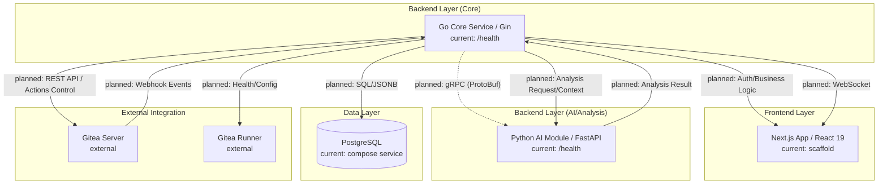

# DevHub 시스템 아키텍처 설계서

- **작성일:** 2026-04-29
- **상태:** Draft / Confirmed
- **관련 문서:** [요구사항 정의서](./requirements.md), [프로젝트 프로파일](../ai-workflow/project/project_workflow_profile.md)

## 1. 개요
본 문서는 DevHub의 시스템 구성, 서비스 간 통신 방식, 데이터 흐름 및 UI/UX 시각화 전략을 상세히 정의합니다.

## 2. 시스템 컴포넌트 구조

상태 표기 기준:
- `current`: 현재 스캐폴딩 또는 health endpoint 수준으로 존재하는 구성
- `planned`: 아키텍처 계약은 확정되었지만 아직 구현 전인 구성
- `external`: DevHub 외부 시스템 또는 연동 대상

## 3. 서비스 간 통신 (Internal Communication)

### 3.1 Go Core ↔ Python AI (gRPC)
- **프로토콜:** gRPC (HTTP/2 기반)
- **IDL:** Protocol Buffers (.proto)
- **계약 상태:** 내부 분석 요청/응답의 기본 통신 방식은 gRPC로 확정합니다.
- **구현 상태:** 현재 스캐폴딩에는 `proto/analysis.proto`, Go/Python 생성 명령, Python gRPC 의존성이 포함되어 있습니다. 다만 `backend-ai/main.py`는 아직 FastAPI HTTP health endpoint만 실행하며, `50051`은 Docker Compose에 예약 노출된 포트일 뿐 실제 gRPC 서버와 Go Core client/server 연동은 후속 구현 범위입니다.
- **데이터 접근 경계:** 초기 구현에서 Python AI는 PostgreSQL에 직접 접근하지 않습니다. Go Core가 Gitea 이벤트, 로그, 메트릭, 권한 필터링을 처리한 뒤 필요한 분석 입력만 gRPC로 전달합니다.
- **확장 가능성:** 대용량 분석이나 배치 처리가 필요해질 경우 Python AI의 읽기 전용 DB 접근 또는 분석 전용 view/replica를 후속 아키텍처로 검토합니다.
- **선정 이유:** 
    - Go와 Python 간의 고성능 바이너리 통신.
    - 강력한 타입 체크를 통한 인터페이스 정합성 보장.
    - 대용량 로그 데이터 전송 시 스트리밍 기능 활용 가능.

### 3.2 Backend ↔ Frontend (REST & WebSocket)
- **API:** RESTful API (Next.js Data Fetching / TanStack Query)
- **실시간 통신:** **WebSocket**을 기본 계약으로 사용합니다.
    - **용도:** Gitea Actions 빌드 상태 실시간 업데이트, 긴급 리스크 알림, 실시간 이슈 액티비티 피드.
    - **SSE 처리:** SSE는 초기 구현 범위에 포함하지 않습니다. 프록시/운영 환경 제약으로 WebSocket 유지가 어렵다고 확인될 때 별도 fallback으로 재검토합니다.

## 4. 데이터 전략 (Data Strategy)

### 4.1 하이브리드 동기화
- **Webhook:** Gitea의 모든 이벤트를 실시간 수집하여 즉시 반영.
- **Hourly Pull:** 매 시간 전체 상태를 체크하여 동기화 유실 방지 (Reconciliation).

### 4.2 이벤트 수집 파이프라인

Gitea 이벤트 수집은 다음 파이프라인을 기본으로 합니다.

1. **Receive:** Go Core가 Gitea Webhook 이벤트를 수신.
2. **Validate:** Webhook secret/signature를 검증하고 이벤트 타입을 식별. 알 수 없는 이벤트 타입도 원본은 저장하되 처리 상태를 구분.
3. **Persist Raw Event:** payload 원문을 JSONB로 저장하고 event type, delivery id 또는 dedupe key, repository, sender, received_at, processed_at, status를 함께 기록.
4. **Normalize:** 이슈, PR, commit, build, runner 상태 등 도메인 테이블로 정규화.
5. **Apply Domain Update:** 프로젝트/저장소/사용자/권한/상태 테이블을 갱신.
6. **Request Analysis:** 필요한 경우 Go Core가 권한 필터링을 거친 분석 입력을 Python AI에 gRPC로 전달.
7. **Publish Update:** 프론트엔드 실시간 채널에 상태 변경을 전달.

중복 처리는 Gitea delivery id를 우선 idempotency key로 사용합니다. delivery id가 없는 이벤트는 event type, repository id/name, payload hash를 조합한 보조 key를 사용하며, 같은 key는 중복 삽입 또는 중복 처리하지 않습니다.

처리 상태는 `received`, `validated`, `processed`, `failed`, `ignored`를 기본으로 하며, 실패 시 실패 사유와 retry count를 기록합니다. 반복 실패 이벤트는 수동 확인 또는 `ignored` 상태로 전환해 재처리 루프를 방지합니다.

Hourly Pull reconciliation은 Webhook 누락을 보완하는 동기화 경로이며, 가능한 한 Webhook과 동일한 정규화/갱신 경로를 사용합니다. Pull 결과가 기존 상태와 충돌하면 요구사항 문서의 데이터 상충 정책에 따라 사용자 알림 및 PL read-only 노출 기준을 적용합니다.

### 4.3 스토리지 구성
- **PostgreSQL:**
    - 정형 데이터: 사용자, 프로젝트, 권한, 저장소 매핑.
    - 비정형 데이터(JSONB): Gitea 원본 웹훅 이벤트, AI 분석 리포트 요약.
    - 보존 기간: 운영 로그 1개월, 개인화 데이터(Kudos 등)는 계정 삭제 후 1개월까지 보존.

## 5. UI/UX 및 시각화 전략

### 5.1 인터랙티브 인프라 관리
- **기술:** **React Flow**
- **내용:** Gitea Runner와 프로젝트 간의 구성도를 인터랙티브 다이어그램으로 구현. 사용자가 직접 드래그, 클릭하여 노드 상태 확인 및 제어(재시작 등) 수행.

### 5.2 역할별 대시보드
- **개발자:** 집중 시간 보호 모드, 개인화된 업무 연혁, 실시간 빌드 현황.
- **관리자:** 리스크 탐지(7일 임계치), 진행률 시각화, 의사결정 로그.
- **시스템 관리자:** 인프라 헬스체크, 알림 임계치 설정, Runner 제어 콘솔.

## 6. 보안 및 인증

초기 구현은 Gitea Webhook 수집과 시스템 관리자 기능의 오남용 방지를 우선하며, Gitea SSO 통합은 후속 단계로 분리합니다.

### 6.1 초기 구현 범위

- **Webhook 검증:** Gitea Webhook endpoint는 `GITEA_WEBHOOK_SECRET` 기반 signature 검증을 필수로 합니다. 검증 실패 이벤트는 도메인 상태를 변경하지 않으며, 원본 저장 여부는 보안 위험을 고려해 최소 metadata 중심으로 기록합니다.
- **서비스 간 권한 경계:** 모든 Gitea 이벤트와 외부 API 호출은 Go Core를 먼저 통과합니다. Python AI는 인증/권한 판단을 직접 수행하지 않고, Go Core가 필터링한 분석 입력만 처리합니다.
- **관리자 접근:** 시스템 관리자 기능은 초기 단계에서 설정 기반 allowlist 또는 seed된 system admin 계정으로 제한합니다. 일반 관리자/PM 권한과 시스템 관리자 권한은 별도 role로 분리합니다.
- **Audit Log:** Runner 제어, Gitea 계정/조직/권한 변경, 알림 임계치 변경, Webhook 재처리/무시 처리는 Audit Log 기록 대상입니다.

### 6.2 RBAC 단계화

| 단계 | 범위 | 기준 |
| --- | --- | --- |
| Phase 1 | Webhook secret 검증, system admin role 분리, 관리자 작업 Audit Log | TASK-007 및 초기 시스템 관리자 기능 구현 기준 |
| Phase 2 | Gitea 사용자/조직/저장소 권한 동기화, 프로젝트별 role 매핑 | 프로젝트-저장소 매핑과 관리자 대시보드 확장 시점 |
| Phase 3 | Gitea SSO 연동 기반 통합 인증 | 운영 환경 전환 전 별도 보안 검토 후 도입 |

### 6.3 Audit Log 최소 필드

Audit Log는 최소한 `actor_id`, `actor_role`, `action`, `target_type`, `target_id`, `request_id`, `source_ip`, `result`, `reason`, `created_at`을 기록합니다. Webhook 처리 계열 작업은 `actor_id` 대신 `gitea_delivery_id` 또는 dedupe key를 함께 남겨 재처리 경로를 추적합니다.
