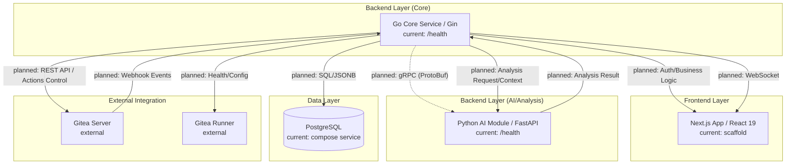
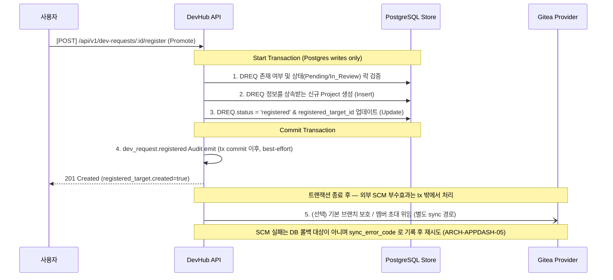

# DevHub 시스템 아키텍처 설계서

- 문서 목적: DevHub 의 시스템 구성 (Frontend / Go Core / Python AI), 서비스 간 통신 방식, 데이터 흐름, UI/UX 시각화 전략, RBAC 정책 단계화를 정의한다.
- 범위: 아키텍처 결정 본문. 구체 API 계약은 `docs/backend_api_contract.md`, 결정 근거는 `docs/adr/000X-*.md`, 도메인 모델 (조직) 은 `docs/organizational_hierarchy_spec.md` 가 source-of-truth.
- 대상 독자: Backend / 프론트엔드 / DevOps 개발자, AI agent, 아키텍처 검토자.
- 상태: accepted
- 작성일: 2026-04-29
- 최종 수정일: 2026-05-27 (Repository 소유권·연동·lifecycle 도메인 §10 신규 ARCH-REPO-01..07 + §8.7 Gitea sync/auth_mode ARCH-INT-07 + §6.5 Keycloak pin/SPI/WS ticket 보강)
- 관련 문서: [요구사항 정의서](./requirements.md), [백엔드 API 계약](./backend_api_contract.md), [ADR-0019 Keycloak 단일화 (현재 IdP 결정)](./adr/0019-keycloak-only-idp.md), [ADR-0001 IdP (Hydra+Kratos, superseded)](./adr/0001-idp-selection.md), [ADR-0002 RBAC](./adr/0002-rbac-policy-edit-api.md), [ADR-0003 No-Docker CI scope](./adr/0003-no-docker-policy-ci-scope.md), [ADR-0022 Keycloak 25.0 pin](./adr/0022-keycloak-version-pin-25-0.md), [ADR-0023 Keycloak 26.0 pin](./adr/0023-keycloak-version-pin-26-0.md), [ADR-0024 WebSocket 인증 ticket 패턴](./adr/0024-websocket-auth-query-token.md), [추적성 매트릭스](./traceability/report.md), [코드베이스 스냅샷 2026-05-27](./analysis/2026-05-27-codebase-snapshot/README.md), [프로젝트 프로파일](../ai-workflow/memory/PROJECT_PROFILE.md).

## 1. 개요
본 문서는 DevHub의 시스템 구성, 서비스 간 통신 방식, 데이터 흐름 및 UI/UX 시각화 전략을 상세히 정의합니다.

## 2. 시스템 컴포넌트 구조

상태 표기 기준:
- `current`: 현재 스캐폴딩 또는 health endpoint 수준으로 존재하는 구성
- `planned`: 아키텍처 계약은 확정되었지만 아직 구현 전인 구성
- `external`: DevHub 외부 시스템 또는 연동 대상


```mermaid
graph TD
    subgraph "Frontend Layer"
        NextJS[Next.js App / React 19<br/>current: scaffold]
    end

    subgraph "Backend Layer (Core)"
        GoCore[Go Core Service / Gin<br/>current: /health]
        GoCore -- "planned: Auth/Business Logic" --> NextJS
        GoCore -- "planned: WebSocket" --> NextJS
    end

    subgraph "Backend Layer (AI/Analysis)"
        PyAI[Python AI Module / FastAPI<br/>current: /health]
        GoCore -. "planned: gRPC (ProtoBuf)" .-> PyAI
        GoCore -- "planned: Analysis Request/Context" --> PyAI
        PyAI -- "planned: Analysis Result" --> GoCore
    end

    subgraph "Data Layer"
        PG[(PostgreSQL<br/>current: compose service)]
        GoCore -- "planned: SQL/JSONB" --> PG
    end

    subgraph "External Integration"
        Gitea[Gitea Server<br/>external]
        Gitea -- "planned: Webhook Events" --> GoCore
        GoCore -- "planned: REST API / Actions Control" --> Gitea
        GiteaRunner[Gitea Runner<br/>external]
        GoCore -- "planned: Health/Config" --> GiteaRunner
    end
```

> **정정 (2026-05-27, 코드 스냅샷 main `cf19c94`)**: 위 다이어그램의 `current: scaffold`/`planned` 라벨은 2026-04-29 초기 상태 기준이며 현행 코드와 괴리가 있다. 실제로는 **Go Core 가 v1.0 scope 기준 기능 완성** 상태이고, Gitea 연동은 webhook(서버→DevHub push) + REST pull sync 워커(DevHub→Gitea, §8.7) **양방향 가동**, WebSocket 실시간(ticket 인증, §3.2/§6.5), PostgreSQL 영속(45 마이그레이션) 모두 구현돼 있다. 미구현 구간은 **Go Core ↔ Python AI gRPC(여전히 스켈레톤, `backend-ai` 는 `/health` 만)** 와 Gitea Runner 제어 콘솔뿐이다. 다이어그램 자체는 초기 의도 보존을 위해 immutable 유지하고, 실 상태는 [코드베이스 스냅샷 §1](./analysis/2026-05-27-codebase-snapshot/01_codebase_state_analysis.md)을 source-of-truth 로 본다.

## 3. 서비스 간 통신 (Internal Communication)

### 3.1 Go Core ↔ Python AI (gRPC)
- **프로토콜:** gRPC (HTTP/2 기반)
- **IDL:** Protocol Buffers (.proto)
- **계약 상태:** 내부 분석 요청/응답의 기본 통신 방식은 gRPC로 확정합니다.
- **구현 상태:** 현재 스캐폴딩에는 `proto/analysis.proto`, Go/Python 생성 명령, Python gRPC 의존성이 포함되어 있습니다. 다만 `backend-ai/main.py`는 아직 FastAPI HTTP health endpoint만 실행하며, `50051`은 Docker Compose에 예약 노출된 포트일 뿐 실제 gRPC 서버와 Go Core client/server 연동은 후속 구현 범위입니다.
- **데이터 접근 경계:** 초기 구현에서 Python AI는 PostgreSQL에 직접 접근하지 않습니다. Go Core가 Gitea 이벤트, 로그, 메트릭, 권한 필터링을 처리한 뒤 필요한 분석 입력만 gRPC로 전달합니다.
- **확장 가능성:** 대용량 분석이나 배치 처리가 필요해질 경우 Python AI의 읽기 전용 DB 접근 또는 분석 전용 view/replica를 후속 아키텍처로 검토합니다.
- **선정 이유:** 
    - Go와 Python 간의 고성능 바이너리 통신.
    - 강력한 타입 체크를 통한 인터페이스 정합성 보장.
    - 대용량 로그 데이터 전송 시 스트리밍 기능 활용 가능.

### 3.2 Backend ↔ Frontend (REST & WebSocket)
- **API:** RESTful API (Next.js Data Fetching / TanStack Query)
- **실시간 통신:** **WebSocket**을 기본 계약으로 사용합니다.
    - **용도:** Gitea Actions 빌드 상태 실시간 업데이트, 긴급 리스크 알림, 실시간 이슈 액티비티 피드.
    - **SSE 처리:** SSE는 초기 구현 범위에 포함하지 않습니다. 프록시/운영 환경 제약으로 WebSocket 유지가 어렵다고 확인될 때 별도 fallback으로 재검토합니다.

> **보강 (2026-05-27, [ADR-0024](./adr/0024-websocket-auth-query-token.md))**: WebSocket 인증은 브라우저 `WebSocket` API 가 커스텀 헤더를 못 보내는 제약 때문에 **ticket 패턴**으로 구현됐다. 인증된 actor 가 `POST /api/v1/realtime/ticket` 로 단일-사용(single-use, 60s TTL) ticket 을 발급받고, `GET /api/v1/realtime/ws?ticket=...` 로 업그레이드 시 ticket 을 소비한다. ticket store 는 in-memory(single-instance) 또는 PostgreSQL `realtime_tickets`(`DELETE ... RETURNING` 으로 multi-instance 원자 소비, migration 000035)다. 초기에 검토된 `?access_token=` query 직접 전달 방식은 access token 노출 위험 때문에 **ticket-only 컷오버(ADR-0024 §6 carve 5)로 제거**됐다. WS subscribe 후 각 event type 은 RBAC matrix 로 재검사한다(§6.5). 자세한 보안 경계는 §6.5 참조.

## 4. 데이터 전략 (Data Strategy)

### 4.0 SCM Provider Adapter 원칙

- 외부 형상관리 연동은 `SCM Adapter Interface`를 기준으로 provider별 구현체를 분리한다.
- Core 도메인은 provider 중립 계약(Repository/PR/Build/Quality/Event)만 사용하고, provider별 API 차이는 어댑터에서 변환한다.
- `repo_provider`를 라우팅 키로 사용해 어댑터를 선택한다.
- 신규 provider 추가는 "어댑터 등록 + 설정"으로 처리하며, 기존 도메인 API/화면 계약 변경을 최소화한다.
- 장애 격리 원칙: 특정 provider 어댑터 장애는 해당 provider ingest 파이프라인으로만 제한하고 전체 수집 파이프라인 중단을 유발하지 않는다.

### 4.1 하이브리드 동기화
- **Webhook:** Gitea의 모든 이벤트를 실시간 수집하여 즉시 반영.
- **Hourly Pull:** 매 시간 전체 상태를 체크하여 동기화 유실 방지 (Reconciliation).

### 4.2 이벤트 수집 파이프라인

Gitea 이벤트 수집은 다음 파이프라인을 기본으로 합니다.

1. **Receive:** Go Core가 Gitea Webhook 이벤트를 수신.
2. **Validate:** Webhook secret/signature를 검증하고 이벤트 타입을 식별. 알 수 없는 이벤트 타입도 원본은 저장하되 처리 상태를 구분.
3. **Persist Raw Event:** payload 원문을 JSONB로 저장하고 event type, delivery id 또는 dedupe key, repository, sender, received_at, processed_at, status를 함께 기록.
4. **Normalize:** 이슈, PR, commit, build, runner 상태 등 도메인 테이블로 정규화.
5. **Apply Domain Update:** 프로젝트/저장소/사용자/권한/상태 테이블을 갱신.
6. **Request Analysis:** 필요한 경우 Go Core가 권한 필터링을 거친 분석 입력을 Python AI에 gRPC로 전달.
7. **Publish Update:** 프론트엔드 실시간 채널에 상태 변경을 전달.

중복 처리는 Gitea delivery id를 우선 idempotency key로 사용합니다. delivery id가 없는 이벤트는 event type, repository id/name, payload hash를 조합한 보조 key를 사용하며, 같은 key는 중복 삽입 또는 중복 처리하지 않습니다.

처리 상태는 `received`, `validated`, `processed`, `failed`, `ignored`를 기본으로 하며, 실패 시 실패 사유와 retry count를 기록합니다. 반복 실패 이벤트는 수동 확인 또는 `ignored` 상태로 전환해 재처리 루프를 방지합니다.

Hourly Pull reconciliation은 Webhook 누락을 보완하는 동기화 경로이며, 가능한 한 Webhook과 동일한 정규화/갱신 경로를 사용합니다. Pull 결과가 기존 상태와 충돌하면 요구사항 문서의 데이터 상충 정책에 따라 사용자 알림 및 PL read-only 노출 기준을 적용합니다.

### 4.3 스토리지 구성
- **PostgreSQL:**
    - 정형 데이터: 사용자, 프로젝트, 권한, 저장소 매핑.
    - 비정형 데이터(JSONB): Gitea 원본 웹훅 이벤트, (v2 예정) AI 분석 리포트 요약.
    - 보존 기간: 운영 로그 1개월, 개인화 데이터(Kudos 등)는 계정 삭제 후 1개월까지 보존.

## 5. UI/UX 및 시각화 전략

### 5.1 인터랙티브 인프라 관리
- **기술:** **React Flow**
- **내용:** Gitea Runner와 프로젝트 간의 구성도를 인터랙티브 다이어그램으로 구현. 사용자가 직접 드래그, 클릭하여 노드 상태 확인 및 제어(재시작 등) 수행.

### 5.2 역할별 진입 우선순위 기반 대시보드
- **개발 대시보드 (Developer Dashboard):** 집중 시간 보호 모드, 개인화된 업무 연혁, 실시간 빌드 현황.
- **관리 대시보드 (Management Dashboard):** 리스크 탐지(7일 임계치), 진행률 시각화, 의사결정 로그.
- **시스템 대시보드 + 시스템 설정 (System Dashboard + System Settings):** 인프라 헬스체크, 알림 임계치 설정, Runner 제어 콘솔.
- **UX 제공 방식:** 역할별 UX는 전용 화면 완전 분리보다 기본 진입 페이지 우선순위로 간접 제공한다.
- **노출 정책:** 시스템 대시보드/시스템 설정은 `system_admin` 권한 사용자에게만 노출한다.

## 6. 보안 및 인증

초기 구현은 Gitea Webhook 수집과 시스템 관리자 기능의 오남용 방지를 우선하며, 인증은 Keycloak 기반 OIDC 표준 흐름으로 통일합니다. AI 가드너 기반 분석/추천 기능은 v2 범위로 분리합니다.

### 6.1 초기 구현 범위

- **Webhook 검증:** Gitea Webhook endpoint는 `GITEA_WEBHOOK_SECRET` 기반 signature 검증을 필수로 합니다. 검증 실패 이벤트는 도메인 상태를 변경하지 않으며, 원본 저장 여부는 보안 위험을 고려해 최소 metadata 중심으로 기록합니다.
- **서비스 간 권한 경계:** 모든 Gitea 이벤트와 외부 API 호출은 Go Core를 먼저 통과합니다. Python AI는 인증/권한 판단을 직접 수행하지 않고, Go Core가 필터링한 분석 입력만 처리합니다.
- **관리자 접근:** 시스템 관리자 기능은 초기 단계에서 설정 기반 allowlist 또는 seed된 system admin 계정으로 제한합니다. 일반 관리자/PM 권한과 시스템 관리자 권한은 별도 role로 분리합니다.
- **Audit Log:** Runner 제어, Gitea 계정/조직/권한 변경, 알림 임계치 변경, Webhook 재처리/무시 처리, **계정 발급/회수, 비밀번호 변경, 로그인 성공/실패**는 Audit Log 기록 대상입니다.

### 6.2 사용자(User) ↔ 계정(Account) 도메인 분리

DevHub는 사람 단위 식별(User)과 인증 자격(Account)을 분리해 관리합니다. 자세한 정책은 [요구사항 정의서 2.5절](./requirements.md#25-사용자-계정-관리-user-account-management)을 참조합니다. 본 문서는 그 정책을 만족하기 위한 데이터 모델과 인증 흐름만 정의합니다.

#### 6.2.1 데이터 모델

```text
users (이미 존재)
  user_id        text  PK
  email          text  unique
  display_name   text
  role           text  CHECK in (developer, manager, system_admin)
  status         text  CHECK in (active, pending, deactivated)
  idp_subject    text  unique      -- OIDC subject 매핑
  primary_unit_id, current_unit_id, is_seconded, joined_at, ...
```

인증 credential(비밀번호/세션/복구)은 Keycloak 이 소유하고, DevHub는 사용자/조직 메타데이터와 권한 모델을 소유합니다.

#### 6.2.2 비밀번호 처리 원칙

- 비밀번호 평문은 어떤 경로로도 저장/로깅하지 않습니다. 핸들러 진입 직후 즉시 해시로 변환하고 평문 변수의 수명은 최소화합니다.
- 해시 알고리즘은 bcrypt(cost ≥ 12) 또는 argon2id 중 하나를 선택하며, 선택 결과를 `password_algo` 컬럼에 저장해 향후 알고리즘 회전을 가능하게 합니다.
- 비밀번호 강도는 운영 정책으로 별도 정의하되, 최소 길이/금지 패턴 검사는 핸들러 입력 검증 단계에서 수행합니다.
- 강제 재설정(시스템 관리자) 후 다음 로그인은 비밀번호 변경을 강제하기 위해 계정 상태를 `password_reset_required` 로 설정합니다.

#### 6.2.3 인증 흐름 (1차)

> **결정 (2026-05-07 [ADR-0001](./adr/0001-idp-selection.md) → 2026-05-19 [ADR-0019](./adr/0019-keycloak-only-idp.md) 으로 supersede)**: DevHub 인증은 **Keycloak OIDC** 표준 흐름으로 통일한다. `users` 는 사람·조직 master 로 유지하고, credential·session lifecycle 은 IdP가 소유한다. ADR-0001 의 Hydra+Kratos 원본 결정은 PR #167 (2026-05-18) 로 Keycloak 단일화로 전환됐고 ADR-0019 가 결정 사후 명문화. ADR-0001 본문은 historical context 로 immutable 보존.

흐름 (사용자가 DevHub Next.js 에서 로그인하는 first-party 케이스 기준):

1. 브라우저가 DevHub Next.js `/login` 에 진입하면 Next.js 는 Keycloak authorization endpoint로 Authorization Code + PKCE 흐름을 시작합니다.
2. 인증 성공 후 callback 에서 token endpoint 호출로 ID Token + Access Token (+ 필요 시 Refresh Token)을 발급받습니다.
3. Go Core 는 인입 요청의 Bearer token 을 issuer/JWKS 기준으로 검증하고, `sub` claim 을 DevHub actor(`users.idp_subject`)와 매핑합니다.
4. `X-Devhub-Actor` fallback 헤더는 [ADR-0004](./adr/0004-x-devhub-actor-removal.md) (2026-05-13) 기준 폐기되어 prod 코드에서 처리하지 않습니다.
5. 다른 앱도 동일 IdP에 OIDC client 로 등록해 표준 흐름을 사용합니다.

### 6.3 RBAC 단계화

| 단계 | 범위 | 기준 |
| --- | --- | --- |
| Phase 1 | Webhook secret 검증, system admin role 분리, 관리자 작업 Audit Log | TASK-007 및 초기 시스템 관리자 기능 구현 기준 |
| Phase 2 | Keycloak 기반 OIDC 도입, DevHub OIDC client 전환, token 검증/actor 매핑/audit 경계 정착 | Keycloak/OIDC 운영 진입 및 backend Phase 13 완료 시점 ([ADR-0019](./adr/0019-keycloak-only-idp.md), [ADR-0001](./adr/0001-idp-selection.md) superseded) |
| Phase 3 | Gitea 사용자/조직/저장소 권한 동기화, Repository 하위 Project role 매핑 | Application-Repository-Project 매핑과 관리자 대시보드 확장 시점 |
| Phase 4 | Gitea SSO 연동 기반 통합 인증, 자체 계정과의 병행/대체 정책 결정 | 운영 환경 전환 전 별도 보안 검토 후 도입 |

### 6.4 Audit Log 최소 필드

Audit Log는 최소한 `actor_id`, `actor_role`, `action`, `target_type`, `target_id`, `request_id`, `source_ip`, `result`, `reason`, `created_at`을 기록합니다. Webhook 처리 계열 작업은 `actor_id` 대신 `gitea_delivery_id` 또는 dedupe key를 함께 남겨 재처리 경로를 추적합니다. 계정/인증 계열 action 은 다음을 사용합니다.

| action | target_type | 비고 |
| --- | --- | --- |
| `account.created` | `account` | actor=발급한 시스템 관리자 |
| `account.disabled` | `account` | 회수 |
| `account.password_changed` | `account` | actor=본인 또는 시스템 관리자 |
| `account.locked` | `account` | 자동(연속 실패) 또는 수동 |
| `auth.login.succeeded` | `account` | source_ip 필수 |
| `auth.login.failed` | `account` 또는 `login_id` | login_id가 존재하지 않아도 시도는 기록 |

비밀번호 평문, 해시, 임시 비밀번호는 어떤 audit 필드에도 기록하지 않습니다.

### 6.5 Keycloak 버전 pin · SPI event listener · WS ticket 인증 (보강, 2026-05-27)

> 본 절은 §6.1~§6.4 의 보안 baseline 위에, 2026-05-21 이후 코드에 반영된 인증 운영 사실을 추가 명문화한다. 기존 §6.2.3 OIDC 흐름·§6.4 Audit 최소 필드는 변경 없이 유지된다.

#### 6.5.1 Keycloak 버전 pin

- DevHub 는 IdP 를 Keycloak 단일화([ADR-0019](./adr/0019-keycloak-only-idp.md))하면서 운영 환경의 Keycloak 컨테이너 버전을 명시 pin 한다: [ADR-0022](./adr/0022-keycloak-version-pin-25-0.md)(25.0) → [ADR-0023](./adr/0023-keycloak-version-pin-26-0.md)(26.0).
- 버전 변경 시 admin bootstrap env 가 silent fail 하지 않도록, 26+ 표준(`KC_BOOTSTRAP_ADMIN_USERNAME/PASSWORD`)과 25.x legacy(`KEYCLOAK_ADMIN/KEYCLOAK_ADMIN_PASSWORD`)를 양쪽 동시 주입하는 것을 운영 기준으로 한다(E2E Keycloak realm bootstrap 정합).
- JWKS 검증기(`internal/auth`)는 issuer/audience(ClientID) validation + RS256/384/512 만 허용하며, key rotation 직후 kid mismatch 시 1회 forced refetch + retry, Keycloak unreachable 시 `stale-while-error` fallback(default 24h cutoff)으로 DevHub uptime 을 보장한다. stale 사용 중에는 revoked key 보호가 제한적으로 깨질 수 있어 rotation 직후 운영 SOP(강제 재시작 / cache flush)는 별도 carve 다.

#### 6.5.2 Keycloak event → audit_logs 동기화 (SPI + polling)

Keycloak 에서 발생한 사용자/관리자 이벤트(로그인, group/role 변경, 계정 enable/disable, USER:DELETE 등)는 두 경로로 DevHub `audit_logs` + `users` 동기화에 반영된다.

- **Push (SPI)**: Keycloak event listener SPI(Java, `infra/idp/keycloak-event-listener-spi/`)가 이벤트를 `POST /api/v1/internal/keycloak-events` 로 전송한다. 이 endpoint 는 일반 OIDC 가 아닌 `X-Webhook-Secret` 상수 비교(fail-closed)로만 인증하며 v1 그룹 미들웨어(인증/RBAC) 밖에 등록된다([ADR-0020](./adr/0020-account-user-management-boundary.md) §5.6 push 경로).
- **Poll (cron)**: `internal/audit` 의 Keycloak event 폴러가 Admin REST(`/admin/realms/{realm}/events` + `/admin-events`)를 기본 30s 주기로 polling 해 cursor(`event_cursors`, migration 000031) 이후 이벤트를 audit 으로 emit + `users` profile/membership/status sync(ADR-0020 sub-carve C)한다.
- **dedup**: push 와 poll 이 동시 존재할 수 있으므로(SPI push 단일화는 미전환 부채), distinguishing 7-tuple SHA-256 을 `audit_logs.source_event_id`(`source_type=keycloak_event`, partial UNIQUE migration 000032)에 기록해 at-least-once 중복을 흡수한다.
- audit source_type 카탈로그: `oidc | webhook | keycloak_event | system`(legacy `kratos` enum 은 historical row decode 용으로만 보존, ADR-0001 superseded).

#### 6.5.3 WebSocket ticket 인증 경계 (ADR-0024)

- §3.2 의 ticket 발급/소비 흐름을 인증 경계 관점에서 정리하면: `POST /api/v1/realtime/ticket`(인증 actor 면 RBAC bypass 발급) → `GET /api/v1/realtime/ws?ticket=...`(ticket single-use consume). consume 시 store fault 는 401 이 아니라 503 으로 응답해 정상 사용자 오거부를 회피한다.
- WS subscribe 이후 각 event type 별로 RBAC matrix(`PermissionCache.Allows(role, resource, action)`)를 재검사해 권한 없는 event 구독을 거부한다.
- 알려진 표면: `CheckOrigin` 이 현재 모든 origin 을 허용(ticket 인증으로 보호되나 CSWSH 표면 잔존) — origin 검증 강화는 후속 hardening carve.

## 7. 개발 의뢰 (Dev Request, DREQ) 도메인

외부 시스템에서 들어오는 개발 의뢰를 수신 → 담당자 검토 → application/project 등록(promote) 까지 처리하는 도메인. 컨셉 문서: [`docs/planning/development_request_concept.md`](./planning/development_request_concept.md). 요구사항: [`docs/requirements.md §5.5`](./requirements.md). Usecase: [`UC-DREQ-01..10`](./planning/system_usecases.md).

### 7.1 컴포넌트 (ARCH-DREQ-01)

```
┌──────────────────┐                       ┌──────────────────────────────────────┐
│  External System │ ──── POST /api/v1 ─▶  │  Go Core: dev_requests handler       │
│ (ops portal /    │   /dev-requests       │  ├── auth: 외부 수신용 별도 정책      │
│  ITSM / Jira /   │                       │  │   (REQ-NFR-DREQ-001, ADR 후보)     │
│  사내 워크플로우)│                       │  ├── validate: 필수 필드 + assignee   │
└──────────────────┘                       │  │   존재 / (source_system,           │
                                           │  │   external_ref) idempotency        │
                                           │  ├── store: dev_requests (Postgres)   │
                                           │  └── audit: dev_request.received      │
                                           └────────────┬─────────────────────────┘
                                                        │
                                                        ▼
                                           ┌──────────────────────────────────────┐
                                           │  Frontend: 담당자 dashboard          │
                                           │  + /admin/settings/dev-requests       │
                                           │  └── Promote-to-Application/Project  │
                                           │     (단일 트랜잭션 — REQ-FR-DREQ-005) │
                                           └──────────────────────────────────────┘
                                                        │
                                                        ▼
                                           ┌──────────────────────────────────────┐
                                           │  Application / Project 도메인        │
                                           │  (DREQ.registered_target_id 로 매핑)  │
                                           └──────────────────────────────────────┘
```

### 7.2 상태 머신 (ARCH-DREQ-02)

[컨셉 §2.3](./planning/development_request_concept.md) 의 6-상태 머신 (`received → pending → in_review → registered | rejected | closed`). 모든 전이는 `dev_request.*` audit action 으로 기록.

### 7.3 외부 수신 인증 경계 (ARCH-DREQ-03)

- 외부 수신 endpoint (`POST /api/v1/dev-requests`) 는 일반 사용자 OIDC 흐름이 아닌 **별도 인증 middleware (`requireIntakeToken`)** 를 사용. **[ADR-0012](./adr/0012-dreq-external-intake-auth.md)** 가 옵션 A (API 토큰 + IP allowlist) 를 채택. 옵션 B (HMAC) / C (OAuth client_credentials) 는 후속 단계 마이그레이션 경로.
- 검증 흐름 (ADR-0012 §4.1.2):
  - 외부 호출은 `Authorization: Bearer <plain-token>` 헤더로 도착.
  - middleware 가 `SHA-256(plain-token)` 으로 `dev_request_intake_tokens.hashed_token` lookup.
  - 매칭 없음 또는 `revoked_at IS NOT NULL` → 401.
  - caller IP 가 row 의 `allowed_ips` CIDR 범위 밖 → 401.
  - 검증 성공 시 `source_system` 컨텍스트 주입 + `last_used_at` 갱신 + audit `dev_request.intake_auth_succeeded` emit.
- 본 endpoint 는 `routePermissionTable` 의 `Bypass: true` 또는 별도 `IntakeAuth: true` 플래그로 일반 OIDC enforce 를 건너뛴다.
- 인증 성공 시 `source_system` 은 토큰의 매핑 값에서 자동 채움 (request body 의 self-claim 은 신뢰하지 않음 — spoofing 방지).
- 그 외 endpoint (GET 목록 / 상세 / Promote / Reject / Reassign / Close) 는 일반 OIDC + RBAC + 본 sprint 의 `enforceRowOwnership` 패턴([ADR-0011 §4.2](./adr/0011-rbac-row-scoping.md))으로 보호. 담당자 본인 의뢰 또는 system_admin / pmo_manager 만 가능.

### 7.4 RBAC 자원 (ARCH-DREQ-04)

- 신규 resource `dev_requests` 를 RBAC matrix 에 추가.
- 1차 정책 (MVP):
  - `system_admin`: view + create(외부 수신 server-side, frontend 에서는 미노출) + edit + delete
  - `pmo_manager`: view + edit (담당자 재할당은 제외 — system_admin 만)
  - `manager` / `developer`: view (본인 의뢰만, row-level `actor.login == assignee_user_id`)
- 정책 매핑 표는 backend 구현 sprint 의 migration (`000022_dev_requests` 또는 `000023_rbac_dev_request_resource`) 에서 확정.

### 7.5 데이터 모델 (ARCH-DREQ-05)

```text
dev_requests
  id                      uuid       PK
  title                   text       NOT NULL
  details                 text
  requester               text       NOT NULL
  assignee_user_id        text       NOT NULL  REFERENCES users(user_id) ON DELETE RESTRICT
  source_system           text       NOT NULL
  external_ref            text       NULLABLE  -- (source_system, external_ref) UNIQUE
  status                  text       NOT NULL  CHECK in (received, pending, in_review, registered, rejected, closed)
  registered_target_type  text                 CHECK in (application, project) WHEN status='registered'
  registered_target_id    text                 NULLABLE
  rejected_reason         text                 NOT NULL WHEN status='rejected'
  received_at             timestamptz NOT NULL
  created_at, updated_at  timestamptz NOT NULL DEFAULT NOW()

  CONSTRAINT dev_requests_idempotency_uniq
    UNIQUE (source_system, external_ref)
    WHERE external_ref IS NOT NULL;
  CONSTRAINT dev_requests_registered_target_consistency
    CHECK ( (status = 'registered') = (registered_target_type IS NOT NULL AND registered_target_id IS NOT NULL) );
  CONSTRAINT dev_requests_rejected_reason_required
    CHECK ( (status = 'rejected') = (rejected_reason IS NOT NULL) );
```

application / project 의 `origin_dreq_id` 역참조 컬럼 도입 여부는 REQ-FR-DREQ-009 의 ADR 후속에서 결정.

#### 외부 수신 토큰 테이블 (ADR-0012 §4.1.1)

```text
dev_request_intake_tokens
  token_id        uuid       PK
  client_label    text       NOT NULL  -- 운영용 식별자 (예: "ops_portal")
  hashed_token    text       NOT NULL  UNIQUE  -- SHA-256 hex of plain token
  allowed_ips     jsonb      NOT NULL  -- CIDR 배열
  source_system   text       NOT NULL  -- token 매핑되는 source_system 값
  created_at      timestamptz NOT NULL DEFAULT NOW()
  created_by      text       NOT NULL  REFERENCES users(user_id)
  last_used_at    timestamptz NULLABLE
  revoked_at      timestamptz NULLABLE
```

plain token 은 발급 직후 1회만 admin 에게 노출하고 어디에도 저장하지 않는다 (IdP admin password issuance 패턴, [accounts_admin](../backend/) 참조).

### 7.6 Audit action 카탈로그 (ARCH-DREQ-06)

| action | target_type | 비고 |
| --- | --- | --- |
| `dev_request.received` | `dev_request` | 외부 수신, payload 에 source_system / external_ref / assignee |
| `dev_request.registered` | `dev_request` | promote 시점, payload 에 registered_target_type/id |
| `dev_request.rejected` | `dev_request` | rejected_reason 포함 |
| `dev_request.reassigned` | `dev_request` | from / to assignee |
| `dev_request.reopened` | `dev_request` | rejected → pending |
| `dev_request.closed` | `dev_request` | registered/rejected → closed |
| `dev_request.intake_auth_succeeded` | `dev_request_intake_token` | ADR-0012 §4.1.6 — payload `{token_id, client_label, source_ip}`. token plain 값은 절대 기록 안 함. |
| `dev_request.intake_auth_failed` | `dev_request_intake_token` 또는 `route` | ADR-0012 §4.1.6 — payload `{reason, source_ip, header_present, token_prefix_4chars}`. token full 값은 절대 기록 안 함. |
| `auth.row_denied` | `route` | enforceRowOwnership 패턴, 본 도메인 row 거절 |

## 8. 외부 시스템 연동 (Integration) 도메인

컨셉 문서: [`docs/planning/external_system_integration_concept.md`](./planning/external_system_integration_concept.md), 요구사항: [`docs/requirements.md §5.6`](./requirements.md), Usecase: [`UC-INT-01..14`](./planning/system_usecases.md).

### 8.1 컴포넌트 경계 (ARCH-INT-01)

```
┌──────────────────────────────────────────────────────────────────────┐
│                    Go Core Integration Domain                        │
│                                                                      │
│  Provider Registry ──┬── Adapter Router ──┬── Ingest Pipeline        │
│  (type,capability,   │                    │   (webhook/pull)         │
│   enabled,auth,scope)│                    │                           │
│                      │                    └── Normalize Pipeline       │
│                      │                        (repo/pr/build/doc/infra)│
│                      │                                                │
│                      └── Health/Status Manager (sync_status)         │
└──────────────────────────────────────────────────────────────────────┘
           │                         │                           │
           ▼                         ▼                           ▼
   External ALM/SCM/CI         External Doc System          HomeLab Agents
 (Jira/Bitbucket/Gitea/...)    (Confluence 등)             (node/service telemetry)
```

- Core 는 provider 중립 계약만 유지하고, provider-specific API 차이는 Adapter 내부에서 흡수한다.
- provider 장애는 격리 경계로 취급해 전체 파이프라인 중단으로 확산되지 않게 한다.
- `Adapter Router` 는 provider별 webhook 검증 전략을 분리한다.
  - 예: HMAC-SHA256, token compare, provider SDK verifier
  - 공통 contract: `Verify(headers, body) -> (ok, reason)` 를 제공하고 API-73 ingest 전에 실행

### 8.2 동기화 전략 (ARCH-INT-02)

- 두 경로를 병행한다.
  - 실시간 경로: webhook ingest
  - 보정 경로: scheduled pull (reconciliation)
- 동일 자원에 대해 idempotency key를 사용해 중복 처리/중복 저장을 방지한다.
- 정규화 결과는 snapshot + event history 로 분리 저장한다.
- 동기화 우선순위 규칙:
  - 동일 `resource_type + external_id` 에 대해 `occurred_at` 이 더 최신인 이벤트를 우선한다.
  - `occurred_at` 이 같으면 `ingested_at` 이 더 늦은 이벤트를 최종 반영한다.
  - pull 경로는 webhook 미수신 구간 보정만 수행하며, 최신 watermark 이후 데이터만 처리한다.
- 충돌 정책:
  - 외부 SoT 필드와 DevHub 내부 주석성 필드가 충돌할 때 SoT 필드는 외부 원천값 우선.
  - 충돌 감지 시 `integration.conflict.detected` audit 을 기록하고 운영 화면에 경고 배지를 노출한다.

### 8.3 데이터 모델 초안 (ARCH-INT-03)

```text
integration_providers
  provider_id          uuid PK
  provider_key         text UNIQUE            -- jira, confluence, gitea, forgejo, bitbucket, jenkins, bamboo, homelab
  provider_type        text NOT NULL          -- alm | scm | ci_cd | doc | infra
  display_name         text NOT NULL
  enabled              boolean NOT NULL
  auth_mode            text NOT NULL          -- token | basic | oauth2 | app_password | agent
  capabilities         jsonb NOT NULL         -- ["repo.read","pr.read",...]
  sync_status          text NOT NULL          -- requested | verifying | active | degraded | disconnected
  last_sync_at         timestamptz NULL
  last_error_code      text NULL
  created_at, updated_at timestamptz NOT NULL

integration_bindings
  binding_id           uuid PK
  scope_type           text NOT NULL          -- application | project
  scope_id             text NOT NULL
  provider_id          uuid NOT NULL REFERENCES integration_providers(provider_id)
  external_key         text NOT NULL
  policy               text NOT NULL          -- summary_only | execution_system | bidirectional_candidate
  created_at, updated_at timestamptz NOT NULL
  UNIQUE(scope_type, scope_id, provider_id, external_key)

infra_nodes
  node_id              text PK
  provider_id          uuid NOT NULL REFERENCES integration_providers(provider_id)
  hostname             text NOT NULL
  ip_address           text NOT NULL
  environment          text NOT NULL          -- homelab | stage | prod
  status               text NOT NULL          -- stable | warning | down
  metrics              jsonb NOT NULL         -- cpu/mem/disk/load
  observed_at          timestamptz NOT NULL

infra_services
  service_id           text PK
  node_id              text NOT NULL REFERENCES infra_nodes(node_id)
  name                 text NOT NULL
  version              text NULL
  port                 int NULL
  health_status        text NOT NULL          -- healthy | degraded | down
  metadata             jsonb NOT NULL
  observed_at          timestamptz NOT NULL
```

> **정정/보강 (2026-05-27)**: 위 `integration_providers` 초안에는 outbound 연동에 필요한 자격증명 컬럼이 빠져 있다. 현행 스키마는 다음 컬럼이 추가됐다(상세 모델은 §8.7):
> - `base_url text NULL` (migration 000038) — provider API 엔드포인트. `auth_token_url` 과 함께 `http(s)+host` 검증.
> - `api_token text NULL` (migration 000040) — outbound PAT. **write-only** — 응답에는 raw 미노출, `api_token_set` bool 만.
> - `auth_username / auth_client_id / auth_token_url / auth_secret` (migration 000041) — `auth_mode` 별 구조화 자격증명. `auth_secret` 도 write-only(`auth_secret_set` bool).
> - `credentials_ref text` — inbound webhook 서명 검증용 시크릿. **현재 GET 응답에 평문 노출되는 알려진 보안 gap**(#6 평문 secret 저장 carve, envelope 암호화 미적용).
>
> `auth_mode` 값은 본 §8.3 표대로 `token | basic | oauth2 | app_password | agent` 5종이며, mode 별 Authorization 헤더 산출(`OutboundAuth`/`ResolveOutboundAuth`)은 §8.7 참조. `integration_sync_jobs` 큐 테이블(migration 000028)도 본 초안에는 누락 — §8.7 에서 정의한다.

- `capabilities` 는 provider type 별 최소 표준 키를 포함한다.
  - `alm`: `issue.read`, `epic.read`, `issue.link`
  - `scm`: `repo.read`, `pr.read`, `branch.read`, `webhook.ingest`
  - `ci_cd`: `build.read`, `deploy.read`, `job.rerun`
  - `doc`: `page.read`, `space.read`, `doc.link`
  - `infra`: `node.read`, `service.read`, `snapshot.ingest`
- `integration_bindings.policy` 는 scope-연동 책임을 의미한다.
  - `summary_only`: 읽기 전용 요약
  - `execution_system`: 실행/상태 판단의 기준 시스템
  - `bidirectional_candidate`: write-back 후보(ADR 승인 전 비활성)

### 8.4 보안/권한 경계 (ARCH-INT-04)

- Provider credential 은 평문 저장을 금지한다 (encrypted at rest 또는 external secret manager 참조).
- 연동 생성/수정/비활성화는 `system_admin` 권한만 허용한다.
- 조회는 scope 기반으로 제한한다:
  - `system_admin`: 전체 조회
  - 일반 역할: 자신의 접근 가능한 Application/Project scope 한정
- 감사로그 action namespace: `integration.*`, `infra.node.*`, `infra.service.*`

### 8.5 홈랩 수집 경계 (ARCH-INT-05)

- 홈랩은 infra provider 로 취급한다 (`provider_type=infra`).
- 수집 방식은 1차에 Agent Push 를 기본 후보로 둔다.
  - Agent 가 node/service 상태를 DevHub ingest endpoint 로 전송
  - DevHub 는 마지막 스냅샷 + 상태 변경 이력을 동시 관리
- 수집 실패 시 provider 상태를 `degraded` 로 전이하고 경고를 노출한다.
- Agent payload 최소 계약:
  - `agent_id`, `snapshot_at`, `nodes[]`, `services[]`, `trace_id`
  - 각 node/service 는 `observed_at` 필수
  - 동일 `agent_id + snapshot_at` 재전송은 idempotent 처리
- Adapter 연동 범위 (baseline):
  - API-77 ingest payload를 `infra_service_snapshots`로 영속화하고, API-76/API-78 조회 시 최신 persisted snapshot hydrate를 지원한다.
  - adapter 계약은 `save_snapshot/load_latest_snapshot` 읽기·쓰기 경계까지만 포함한다.
- Adapter 연동 범위 (후속):
  - provider별 delta upsert (`infra_nodes`, `infra_services`)와 변경 이력(event log) 분리 저장.
  - pull/reconciliation 경로와 push ingest 간 watermark 정합, 충돌 해결 정책 적용.

### 8.6 장애 격리 및 복구 (ARCH-INT-06)

- provider별 retry/backoff 정책을 독립적으로 적용한다.
- 특정 provider 의 반복 실패는 circuit-open 상태로 격리하고, 나머지 provider 파이프라인은 지속 처리한다.
- 운영자는 provider 단위로 수동 재동기화(re-sync) 요청을 트리거할 수 있어야 한다.
- `degraded` 전이 임계값은 설정 가능(configurable)해야 한다.
  - 기본 예시: `failure_threshold=3`, `window=5m`, `cooldown=10m`
  - 홈랩/사내망 환경 특성에 맞춰 provider별 override 를 허용한다.

### 8.7 Gitea SCM pull sync 워커 · sync job 큐 · auth_mode/OutboundAuth · webhook 헤더 alias (ARCH-INT-07)

> 본 절은 §8.1~§8.6 의 provider-중립 연동 원칙을, 2026-05-21 이후 코드에 구현된 **Gitea(및 Forgejo/Gogs 호환) SCM 연동의 구체 아키텍처**로 보강한다. 기존 ARCH-INT-01..06 은 변경 없이 유지된다.

#### 8.7.1 SCM pull sync 워커 + sync job 큐

- **데이터 모델(보강)**: `integration_sync_jobs`(migration 000028) — provider 단위 sync 작업 큐. status(`queued | running | succeeded | failed`).
- **큐 소비**: store 의 `AcquireNextQueuedSyncJob` 가 `provider_type='scm'` gate + `FOR UPDATE ... SKIP LOCKED` 로 단건 acquire 한다. 비-SCM job 은 store 레이어에서 차단되어 워커에 도달하지 않는다. multi-instance 에서 같은 job 을 두 워커가 잡지 않도록 SKIP LOCKED 가 직렬화한다.
- **백그라운드 워커**: `internal/gitea` 의 SCM sync 워커가 `main.go` 의 30s 주기 goroutine 으로 기동(`pgStore != nil` 일 때 항상). `ProcessOnce` 순서:
  1. queued sync job 을 우선 acquire.
  2. `resolveSyncConfig` 로 provider 의 `base_url` + `auth_mode` 별 자격을 해석. base_url 없거나 자격 미설정(또는 `agent` mode) → job `failed`.
  3. `ListUserRepos` → repo 마다 `UpsertRepository`(`source=scm`, `provider_id` 기록) + repo 단위 deep sync(issues open/closed + PRs open/closed upsert).
  4. 큐가 비면 env(`GITEA_URL`/`GITEA_TOKEN`) 기반 legacy 주기 sync(둘 다 있을 때만).
- **보안 핵심 — env fallback 금지**: 명시 provider 를 해석할 때 worker-global env 토큰으로 **fallback 하지 않는다**(provider 고유 host 에 잘못된 계정 토큰이 유출되는 것을 차단). env fallback 은 provider 미명시(legacy) 경로에만 허용된다.
- **운영 가시성 부채**: 본 워커는 현재 Prometheus metric 이 없어 진행/실패가 로그로만 노출되고, 30s 주기는 env override 불가(하드코딩)다 — 후속 hardening 후보.

#### 8.7.2 auth_mode 모델 + OutboundAuth/ResolveOutboundAuth

- `IntegrationProvider.auth_mode` 5종에 대해, provider receiver `ResolveOutboundAuth()` 가 active mode 별 자격증명 컬럼을 `OutboundAuth` 구조로 해석한다.

| auth_mode | 사용 컬럼 | 산출 Authorization 헤더 |
| --- | --- | --- |
| `token` / unset | `api_token` | `token <pat>` |
| `basic` | `auth_username` + `auth_secret` | `Basic base64(user:secret)` |
| `app_password` | `auth_username` + `auth_secret` | `Basic base64(user:secret)` |
| `oauth2` | `auth_client_id` + `auth_token_url` + `auth_secret` | client-credentials grant 교환 후 `Bearer <token>` |
| `agent` | (직접 API sync 불가) | — (skip) |

- 자격 누락 시 `ok=false` 로 skip(워커는 job `failed` 처리), oauth2 토큰 교환 실패는 error 로 전파한다.
- `api_token`/`auth_secret` 은 API 레이어에서 write-only(`*_set` bool)로 가려지지만 store/도메인 레이어는 raw 평문을 그대로 보관한다(at-rest 암호화 부재, #6 carve).

#### 8.7.3 webhook 헤더 alias (inbound ingest)

- 범용 ingest endpoint `POST /api/v1/integration/providers/:id/webhook`(API-73)는 서명 헤더를 `X-Integration-Signature` → `X-Gitea-Signature` → `X-Gogs-Signature` 순으로 fallback 수용한다(Gitea 가 `X-Gitea-Signature` 를 보내는데 초기 코드가 `X-Integration-Signature` 만 보던 헤더 불일치를 정정).
- 서명 검증은 provider 의 `credentials_ref` 전략별(`hmac_sha256:<secret>` / `provider_sdk:<vendor>:<secret>` / shared token)로 수행하고, 통과 시 dedupe `SaveWebhookEvent` + sync state best-effort 갱신.
- 별도 전용 Gitea webhook 핸들러 `POST /api/v1/integrations/gitea/webhooks`(API-02)는 `X-Gitea-Signature`/`X-Gogs-Signature` 만 수용한다(`X-Integration-*` 미수용) — 두 경로의 헤더 수용 범위가 달라 일관성 부채로 남아 있다.

## 9. 사용자 초기 등록 (Onboarding) 도메인

Keycloak 인증 통과 + DevHub 프로필 미완료 사용자의 self-service 초기 등록 흐름을 처리하는 도메인. 컨셉 문서: [`docs/planning/keycloak_user_onboarding_concept.md`](./planning/keycloak_user_onboarding_concept.md). 요구사항: [`docs/requirements.md §5.7`](./requirements.md). Usecase: [`UC-ONBOARD-01..11`](./planning/system_usecases.md).

### 9.1 컴포넌트 (ARCH-ONBOARD-01)

```
┌──────────────────┐         ┌────────────────────────────────────────────┐
│  User (Browser)  │ ──────▶ │  Frontend (Next.js)                        │
└──────────────────┘         │  ├── /devhub/onboarding (form + skip)       │
                             │  ├── (dashboard)/layout (3-branch gating)  │
                             │  ├── /account (self-service unit change)   │
                             │  └── OrganizationPicker (typeahead + tree) │
                             └────────────┬───────────────────────────────┘
                                          │ Authorization: Bearer <kc-token>
                                          ▼
┌────────────────────────────────────────────────────────────────────────┐
│                    Go Core: Onboarding handlers                        │
│                                                                         │
│  authenticateActor                                                      │
│  ├── token verify (Keycloak JWKS, ARCH-12)                              │
│  ├── GetUser(idp_subject) — DB row miss = token-only actor (lazy        │
│  │   auto-create 폐기, REQ-FR-ONBOARD-009 정합)                          │
│  └── attach actor to context                                            │
│                                                                         │
│  onboardingGate middleware (allowlist 외 enforce)                       │
│  └── DB row 없음 OR onboarding_completed_at IS NULL → 403 +             │
│      { code: onboarding_required }                                      │
│                                                                         │
│  Handlers:                                                              │
│  ├── GET    /api/v1/me                — onboarding_required flag        │
│  ├── POST   /api/v1/me/onboarding     — 제출 (row INSERT + 완료 + audit) │
│  ├── PATCH  /api/v1/me                — self-service unit change         │
│  ├── GET    /api/v1/organizations/    — typeahead search (≤20 results)  │
│  │          search?q=...&limit=20                                       │
│  ├── POST   /api/v1/users             — admin 사전 등록 (API-33 확장)     │
│  └── POST   /api/v1/admin/users/      — review_status pending→reviewed   │
│             :user_id/review             전이 (system_admin)              │
└────────────┬───────────────────────────────────────────────────────────┘
             │
             ▼
┌────────────────────────────────────────────────────────────────────────┐
│  Postgres                                                               │
│  ├── users (onboarding_completed_at, review_status 신규 컬럼 — §9.5)    │
│  ├── organization_units (search/tree 소스, 기존 ARCH-15..17 재사용)     │
│  └── audit_logs (account.onboarding_completed, account.unit_changed,    │
│                  account.review_confirmed — §9.6)                       │
└────────────────────────────────────────────────────────────────────────┘
```

### 9.2 상태 머신 (ARCH-ONBOARD-02)

미완료 사용자 접근 단계는 **3 tier** (concept §5.9 + REQ-FR-ONBOARD-006):

```
                       (첫 로그인, DB row 없음)
                                 │
                                 ▼
                   ┌─────────────────────────┐
                   │      limited (skip)     │  ← user row 미존재
                   │  공통 메뉴 + /onboarding │      onboarding_required=true
                   │  + GET /me              │      session skip flag → banner
                   └────────┬────────┬──────┘
                            │        │
                  ("나중에  │        │ (form 제출 — POST /me/onboarding)
                   하기")   │        ▼
                            │  ┌─────────────────────────┐
                            │  │   pending_review        │  ← row INSERT + completed_at
                            │  │ 무소속 처리 + 할당 리소스 │      review_status=pending_review
                            │  │  + 공통 메뉴 접근        │
                            │  └────────────┬────────────┘
                            │               │
                            │   (admin POST /admin/users/:id/review)
                            │               ▼
                            │  ┌─────────────────────────┐
                            │  │       reviewed          │  ← review_status=reviewed
                            │  │   정상 접근 (모든 API)   │
                            │  └────────────┬────────────┘
                            │               │
                            │   (self-service PATCH /me — primary_unit_id 변경)
                            │               │
                            │               ▼
                            │      review_status → pending_review (재진입)
                            ▼
                       (재로그인 또는 banner 해제)
                       매 로그인 시 limited 상태 재진입
```

전이 규칙:

| 전이 | 트리거 | 결과 컬럼 | Audit |
| --- | --- | --- | --- |
| `(none) → limited` | 미등록 사용자의 첫 진입 | (row 미생성) | (none) |
| `limited → pending_review` | `POST /api/v1/me/onboarding` 성공 | row INSERT + `onboarding_completed_at=NOW()` + `review_status='pending_review'` | `account.onboarding_completed` |
| `pending_review → reviewed` | `POST /api/v1/admin/users/:id/review` (system_admin) | `review_status='reviewed'` | `account.review_confirmed` |
| `reviewed → pending_review` | `PATCH /api/v1/me` 의 `primary_unit_id` 변경 | `review_status='pending_review'` | `account.unit_changed` |

### 9.3 Gating 정책 (ARCH-ONBOARD-03)

- **Backend** — source of truth.
  - `onboardingGate` middleware 가 미완료 사용자에 대해 allowlist 외 모든 endpoint 를 `403 Forbidden` + `{ code: onboarding_required }` 로 차단 (REQ-FR-ONBOARD-009).
  - Allowlist (backend endpoint 만 — frontend 정적 페이지는 backend 호출 없이 렌더되므로 본 정책과 무관):
    - `GET /api/v1/me`
    - `POST /api/v1/me/onboarding`
    - `GET /api/v1/organizations/search`
    - `GET /api/v1/organization/hierarchy` (트리 picker 소스, 기존 endpoint)
    - 정적/health endpoint (예: `GET /health`)
  - lazy auto-create 폐기 — `authenticateActor` 는 DB row miss 를 정상 상태 (token-only actor) 로 취급. AuthenticatedActor 의 Email/DisplayName 은 token claim 에서 직접 추출.
- **Frontend** — UX layer (3분기, REQ-FR-ONBOARD-010).
  - 첫 진입 (session-scoped skip flag 미설정): `/devhub/onboarding` 으로 즉시 redirect.
  - skip 액션 이후 (sessionStorage 의 `devhub.onboarding.skipped=true`): 자동 redirect 없음 + 모든 페이지 상단에 dismissible banner.
  - 보호 리소스 진입 시도 (backend `403 onboarding_required`): skip 여부 무관 hard redirect to `/devhub/onboarding`.
  - sessionStorage 선택 이유: 세션 단위로만 보존 (탭 닫기 = reset), 매 로그인 시 onboarding 재강제 (REQ-FR-ONBOARD-011 의 "사실상의 reminder" 정합).

### 9.4 RBAC / Route permission 정책 (ARCH-ONBOARD-04)

- 신규 RBAC resource **추가 없음**. 본 도메인의 권한 분기는 route-level 만으로 cover.
- Route permission table 갱신:

| Endpoint | RBAC 요구 | onboardingGate | 비고 |
| --- | --- | --- | --- |
| `GET /api/v1/me` | (인증만, 모든 role) | **allowlist** | onboarding_required 분기 |
| `POST /api/v1/me/onboarding` | (인증만, 모든 role — token-only actor 도 호출 가능) | **allowlist** | 미완료 사용자가 제출 가능해야 하므로 gate bypass |
| `GET /api/v1/organizations/search` | (인증만, 모든 role) | **allowlist** | 모든 사용자에게 모든 조직 노출 (REQ-FR-ONBOARD-004) |
| `GET /api/v1/organization/hierarchy` | (인증만, 모든 role, 기존 endpoint) | **allowlist** | 트리 picker 소스 (§9.3 allowlist 정합) |
| `PATCH /api/v1/me` | (인증만, 본인) | **외 (차단)** | 완료 사용자만 호출 — `pending_review` 재진입 부수 효과. 미완료 사용자는 `POST /me/onboarding` 으로 첫 제출 |
| `POST /api/v1/users` | `users:create` (system_admin) | **외 (차단)** | admin 사전 등록 — admin 자신은 항상 완료 사용자 |
| `POST /api/v1/admin/users/:user_id/review` | `users:edit` (system_admin) | **외 (차단)** | review_status transition |

- pending_review 사용자의 "무소속" 처리는 RBAC 레벨이 아닌 **business logic 레벨** — 할당 리소스 조회 시 `user.primary_unit_id` 를 검토 상태에 따라 NULL 로 취급하거나 query filter 적용. 정확한 구현은 IMPL carve 에서.

### 9.5 데이터 모델 (ARCH-ONBOARD-05)

`users` 테이블에 다음 컬럼 신규 추가 (REQ-NFR-ONBOARD-006):

```text
users  (기존 컬럼 + 신규 2개)
  ... (기존 컬럼은 ARCH-12, ARCH-15 등 참조)
  onboarding_completed_at   timestamptz   NULLABLE   -- 완료 시점 마킹 (NULL = 미완료)
  review_status             text          NULLABLE   -- 'pending_review' | 'reviewed'

  CONSTRAINT users_review_status_check
    CHECK ( review_status IS NULL OR review_status IN ('pending_review', 'reviewed') );
  CONSTRAINT users_onboarding_review_consistency
    CHECK ( (onboarding_completed_at IS NULL) = (review_status IS NULL) );
```

- `onboarding_completed_at IS NULL` ↔ `review_status IS NULL` — onboarding 미완료 사용자는 검토 단계가 적용되지 않는다는 의미. CHECK 제약으로 데이터 무결성 보장.
- `review_status='pending_review'` row 는 onboarding 제출 직후 자동 생성. `review_status='reviewed'` 는 system_admin 의 명시 transition.
- 마이그레이션 파일: `backend-core/migrations/0000XX_user_onboarding_state.up.sql` (번호는 다음 sequential — 기존 마지막 마이그레이션 + 1, IMPL carve 에서 확정).
- 기존 row 처리 — 본 컬럼 추가 이전에 lazy auto-created 되어 있던 row 는 `onboarding_completed_at=NULL` + `review_status=NULL` (기본 NULLABLE) 로 시작. 사용자가 다음 로그인 시 onboarding 강제 진입을 통해 정상 흐름 진입 — backfill 불요 (REQ-FR-ONBOARD-001 의 "row 미존재 OR completed_at NULL = 미완료" 정합).

### 9.6 Audit action 카탈로그 (ARCH-ONBOARD-06)

| action | target_type | payload | 트리거 |
| --- | --- | --- | --- |
| `account.onboarding_completed` | `user` | `{ user_id, primary_unit_id, display_name }` | `POST /api/v1/me/onboarding` 성공 |
| `account.review_confirmed` | `user` | `{ user_id, primary_unit_id, reviewed_by }` | `POST /api/v1/admin/users/:user_id/review` 성공 |
| `account.unit_changed` | `user` | `{ user_id, primary_unit_id_from, primary_unit_id_to, by_user }` | `PATCH /api/v1/me` 의 primary_unit_id 변경 또는 admin 의 unit reassignment. 부수 효과로 `review_status=pending_review` 재진입. |

- **Skip 자체는 audit emit 안 함** — state 변경 없음 (REQ-FR-ONBOARD-011 정합). 매 로그인 시 onboarding 화면 강제 진입이 사실상의 reminder 역할.
- 기존 `account.lazy_provisioned` event (ADR-0020 sub-carve B PR #239) 는 lazy auto-create 폐기와 함께 **deprecated** — 신규 row 는 모두 `account.onboarding_completed` 로 기록. 기존 emit 이력은 audit_logs 에 보존 (immutable).
- ADR-0019 §5.3 (9) Keycloak admin event listener 와의 관계: Keycloak group/role 변경은 `audit/user_sync.go` (sub-carve C PR #241) 가 별도 audit emit. 본 도메인의 `account.unit_changed` 는 **DevHub 내 self-service / admin transition** 만 발급.

## 10. Repository 소유권·연동·lifecycle 아키텍처

DevHub `repositories` 는 (a) 외부 SCM(Gitea 등)에서 webhook/pull 로 미러된 row 와 (b) DevHub 운영자가 시스템 내에서 직접 생성·관리하는 row 가 같은 테이블에 공존한다. 본 섹션은 이 두 출처를 구분하는 소유권 모델, 양방향(import/create) 연동, draft→publish lifecycle, 그리고 SCM provider 참조의 canonical 단일화를 정의한다. 도입 PR: #363(소유권 분리 + import) / #366(create) / #368(draft→publish) / #371(충돌 정정) / #373(provider_id 단일화). 관련 마이그레이션: 000042 / 000043 / 000044 / 000045.

### 10.1 소유권 분리 모델 (ARCH-REPO-01)

`domain.Repository` 는 SCM mirror 필드와 시스템 메타를 분리한다.

```text
repositories  (소유권/연동 관련 컬럼만 발췌)
  source            text      -- 'scm' | 'system' (빈값 = legacy 'scm' 취급)
  provider_id       uuid  FK  -- integration_providers(provider_id) (scm type), canonical SCM 참조
  provider_key      text      -- (read-only, LEFT JOIN integration_providers 로 derive — 표시용)
  description       text      -- system-owned 메타 (SCM sync 가 절대 덮어쓰지 않음)
  repository_status text      -- 'draft' | 'active' (CHECK repositories_status_check)
  publish_requested_at, published_at  timestamptz NULL
```

- `source='scm'`: 외부 SCM 이 원천(SoT). webhook/pull sync 가 mirror.
- `source='system'`: DevHub 가 원천. draft 생성 또는 outbound create(§10.4)로 발생.
- `provider_id` 가 SCM provider 참조의 **단일 출처(FK)**, `provider_key` 는 사람이 읽기 위한 derived 값일 뿐 저장 식별자가 아니다(§10.7).

### 10.2 SCM mirror vs system-owned 필드 보존 (ARCH-REPO-02)

`UpsertRepository` 의 `ON CONFLICT (full_name) DO UPDATE` 는 sync 가 외부 값으로 덮어써도 되는 **SCM mirror 필드만** `EXCLUDED` 로 갱신하고, system-owned 필드는 보존한다.

- 덮어쓰는 SCM mirror: `owner_login / name / clone_url / html_url / default_branch / private / gitea_repository_id`.
- 보존(기존 우선): `source = COALESCE(기존, EXCLUDED)`, `provider_id = COALESCE(기존, EXCLUDED)`.
- 보존(SET 절에서 아예 제외): `description` — system-owned 메타라 sync 가 절대 갱신하지 않음.
- INSERT 분기는 `source = COALESCE(NULLIF($n,''),'scm')`, `repository_status='active'`, `published_at=NOW()` 로 채운다.

이 규약 덕분에 운영자가 SCM-mirror row 에 부여한 분류/설명 메타가 다음 sync 에 의해 유실되지 않는다. in-memory fake 도 동일 미러 보존을 흉내내 production parity 를 맞춘다.

### 10.3 inbound import (ARCH-REPO-03)

운영자가 등록된 SCM provider 의 원격 저장소를 DevHub 로 끌어오는 경로.

- `GET /api/v1/integration/providers/:provider_id/scm-repositories` (API-88) — provider 의 원격 repo 목록 + DevHub 내 import 여부(`imported` 플래그, `ListRepositoriesByProvider`).
- `POST /api/v1/integration/providers/:provider_id/import-repositories` (API-89) — 선택 repo 를 SCM 에서 **재조회한 값**으로 `UpsertRepository`(`source='scm'`). request body 의 stale 값이 아니라 provider 에 직접 조회한 결과를 신뢰한다.
- 권한: `infrastructure:edit`. capability gate: `pull`(§10.6).

### 10.4 outbound create (ARCH-REPO-04)

DevHub 에서 신규 저장소를 외부 SCM 에 생성하는 경로(시스템→SCM).

- `POST /api/v1/integration/providers/:provider_id/create-repository` (API-90) — `gitea.Client.CreateRepo`(owner 비면 `POST /user/repos`, 있으면 `POST /orgs/{owner}/repos`)로 원격 생성 후 DevHub row 를 `source='system'` 으로 기록.
- 권한: `infrastructure:edit`. capability gate: `push`(§10.6) + provider 가 gitea-compatible vendor 여야 함(`isGiteaCompatibleProvider` — 비-gitea vendor 거부).
- §10.3 + §10.4 로 SCM ↔ 시스템 repository **양방향(import + create) 연동**이 완성된다.

### 10.5 draft→publish 상태머신 (ARCH-REPO-05)

system-owned repository 는 외부 SCM 에 즉시 만들지 않고 DevHub 내 draft 로 먼저 등록한 뒤 publish 시점에 SCM 에 생성할 수 있다.

```
  POST /api/v1/repositories
  (createRepositoryDraft)
        │  source='system', repository_status='draft'
        │  provider_key → provider_id FK 해석 (migration 000045)
        ▼
  ┌──────────────┐    POST /api/v1/repositories/:id/publish    ┌──────────────┐
  │   draft      │ ─── (requestRepositoryPublish, draft only) ─▶│   active     │
  │              │     provider SCM/push/gitea-compat 검사       │              │
  └──────────────┘     → gitea.CreateRepo → UpsertRepository     └──────────────┘

  (SCM webhook/pull sync 로 인입되는 row 는 draft 를 거치지 않고 repository_status='active' 직행)
```

- `createRepositoryDraft`(API: `POST /repositories`, RBAC `application_repositories:create`): `source='system'`, `repository_status='draft'` row INSERT. provider_key 를 provider_id FK 로 해석.
- `requestRepositoryPublish`(API: `POST /repositories/:id/publish`, RBAC `application_repositories:edit`): `repository_status='draft'` 인 row 만 대상. provider 의 SCM type + push capability + gitea-compat 검사 후 `gitea.CreateRepo` → `UpsertRepository`. SCM 생성 실패 시 `MarkRepositoryDraftPublishRequested`(publish_requested_at set) 후 502(BadGateway) 반환하는 부분 실패 경로가 있다.
- **검증 공백(부채)**: draft→publish 핸들러·store 메서드(`CreateRepositoryDraft`/`MarkRepositoryDraftPublishRequested`)는 #368(codex)이 **무테스트로 머지**했고 #373 이 그 위를 수정 — 단위/통합 테스트 보강이 후속 directive 다.

### 10.6 capability gate (ARCH-REPO-06)

SCM 연동 endpoint(import/create/sync)는 공통 게이트 `scmProviderForCapability` 를 통과해야 한다.

- 게이트 검사: provider **exists** + **enabled**(disabled provider 는 409 거부, #371 정정) + `provider_type='scm'` + 요청 capability 보유 + gitea-compat.
- capability ↔ 기능 매핑: `import` = `pull`, `sync` = `pull | sync`, `create` = `push`.
- 이로써 provider 가 선언한 capability 범위 밖의 동작이 차단된다(예: pull-only provider 에 create 거부).

### 10.7 provider_id 단일화 (ARCH-REPO-07)

도입 과정에서 SCM provider 참조가 두 컬럼으로 중복됐다 — #368 의 `scm_provider`(provider_key TEXT, migration 000043 ADD) 와 #363 의 `provider_id`(FK UUID, migration 000042). 동일 SCM 참조를 의미 중복하던 것을 #373(migration 000045)이 정리했다.

- **canonical = `provider_id`(FK)**. `scm_provider` 컬럼은 provider_key→provider_id backfill 후 DROP.
- 표시용 `provider_key` 는 저장하지 않고 `GetRepositoryByID`/`ListRepositories` 가 `LEFT JOIN integration_providers` 로 derive.
- 패턴: **중복 식별 컬럼은 FK 를 canonical 로 두고 readable key 는 join 으로 derive**(SCM-owned vs system-owned 보존 규약 §10.2 와 인접 원칙).
- 부수 메모: project-companion 흐름의 `RepositoryCreatePayload.SCMProvider` 는 placeholder 로 별개라 유지된다(draft→publish 의 provider_id 해석과 의미가 겹치는 경미한 부채).
- 운영 주의: `scm_provider` 는 000043 ADD → 000045 DROP 으로 2 마이그레이션만 존재한 short-lived 컬럼이다. 000045 의 down 은 컬럼 재추가 + provider_id→provider_key best-effort backfill(매칭 실패 시 NULL)로 비대칭이므로 rollback 시 사전 점검이 필요하다.

## 11. Application 개발 대시보드 (APPDASH) 도메인

Application 상세 대시보드에서 제공해야 할 다차원 롤업 정보, 실시간 헬스 메트릭 및 요구사항-개발-배포 연계 추적을 처리하는 도메인. 컨셉 문서: [`docs/planning/application_dashboard_concept.md`](./planning/application_dashboard_concept.md). 요구사항: [`docs/requirements.md §5.9`](./requirements.md). Usecase: [`UC-APPDASH-01..07` (`system_usecases.md §2.15`)](./planning/system_usecases.md).

### 11.1 아키텍처 구조도 (ARCH-APPDASH-01)

```
                       +---------------------------------------+
                       |    Frontend: Application Dashboard    |
                       +---------------------------------------+
                                           │
                                           │ (API Calls / WS Events)
                                           v
                       +---------------------------------------+
                       |          Go Core: HTTP API            |
                       |       (Application Handlers)          |
                       +---------------------------------------+
                                           │
                        ┌──────────────────┴──────────────────┐
                        ▼                                     ▼
           +-------------------------+           +-------------------------+
           | ApplicationRollup Logic |           |    Promote Transaction  |
           +-------------------------+           +-------------------------+
                        │                                     │
                        │ (Aggregate / Cache)                 │ (Single Tx)
                        v                                     v
           +-------------------------+           +-------------------------+
           |  PostgreSQL / Redis     |           |  PostgreSQL / Gitea SCM |
           +-------------------------+           +-------------------------+
```

### 11.2 헬스 및 품질 스코어 정규화 모형 (ARCH-APPDASH-02)

종합 코드 품질 스코어는 연결된 모든 리포지토리의 품질 상태를 반영하되, 지엽적인 코딩 룰 지표를 배제하고 다음 **5점 만점 정규화 모형**을 기반으로 산출합니다.

* **개별 리포지토리 점수 ($S_r$) 산출 공식**:
  $$S_r = w_1 \cdot \text{RatingScore} + w_2 \cdot (C \times 5.0) - w_3 \cdot (D \times 5.0)$$
  * $\text{RatingScore}$: SonarQube Quality Gate Rating (A: 5.0, B: 4.0, C: 3.0, D: 2.0, E: 1.0)
  * $C$: 테스트 커버리지율 (0.0 ~ 1.0)
  * $D$: 중복도 (0.0 ~ 1.0)
  * $w_1, w_2, w_3$: 기설정된 가중치 매트릭스 (기본값: $w_1 = 0.6, w_2 = 0.3, w_3 = 0.1$, 합산 1.0)
* **종합 품질 롤업 스코어 ($S_{\text{total}}$) 산출 공식**:
  $$S_{\text{total}} = \frac{\sum_{r} W_r \cdot S_r}{\sum_{r} W_r}$$
  * $W_r$: 리포지토리별 정의된 가중치 배분 비율 (`applied_weights` 기반)

### 11.3 프로젝트 진척 및 리스크 분석 알고리즘 (ARCH-APPDASH-03)

하위 프로젝트 진행 상태와 지연 위험 요소를 계량적으로 분석하여 리스크 배지를 제공합니다.

* **기능적 프로젝트 진척율 ($P$) 산출 공식 (스토리 포인트 가중 방식)**:
  $$P = \frac{\sum SP_{\text{Completed}}}{\sum SP_{\text{Total}}} \times 100$$
* **지능형 지연 리스크 평가 공식 ($R$)**:
  $$R = \frac{\text{남은 작업 비율 (100 - P)}}{\text{남은 일정 비율 (잔여 기간 / 전체 기간)}}$$
  * **🟢 Healthy**: $R < 1.0$ (일정 대비 진척 상태 양호)
  * **🟡 Warning**: $1.0 \le R < 1.5$ 또는 $D\text{-Day} \le 14$ 이고 $P < 50\%$ (지연 위험 1단계)
  * **🔴 At Risk**: $R \ge 1.5$ 또는 $D\text{-Day} \le 7$ 이고 $P < 70\%$ (즉각 조치 필요)

### 11.4 DREQ 프로젝트 승격(Promote) 트랜잭션 보장 (ARCH-APPDASH-04)

대기 중인 개발 의뢰(DREQ)를 프로젝트(Project)로 격상시키는 흐름의 **Postgres write (신규 Project 생성 + DREQ status/target 갱신) 는 단일 데이터베이스 트랜잭션** (REQ-FR-DREQ-005, [ADR-0013](./adr/0013-dreq-rbac-row-scoping.md) §5, [API-62 계약](./backend_api_contract.md)) 으로 원자 처리한다. Gitea 등 외부 SCM 부수효과(기본 브랜치 보호·멤버 자동 초대)는 DB 롤백으로 되돌릴 수 없는 외부 side effect 이므로 **트랜잭션 밖**에서 처리한다 (provider 응답 대기 중 DB lock 점유 회피 + 비원자성 방지). SCM 실패는 DB 롤백 대상이 아니며 `ApplicationRepository.sync_error_code` 로 기록 후 재시도하며, ARCH-APPDASH-05 의 Graceful Degradation 정책을 따른다.


```mermaid
sequenceDiagram
    participant User as 사용자
    participant API as DevHub API
    participant DB as PostgreSQL Store
    participant SCM as Gitea Provider

    User->>API: [POST] /api/v1/dev-requests/:id/register (Promote)
    Note over API,DB: Start Transaction (Postgres writes only)
    API->>DB: 1. DREQ 존재 여부 및 상태(Pending/In_Review) 락 검증
    API->>DB: 2. DREQ 정보를 상속받는 신규 Project 생성 (Insert)
    API->>DB: 3. DREQ.status = 'registered' & registered_target_id 업데이트 (Update)
    Note over API,DB: Commit Transaction
    API->>API: 4. dev_request.registered Audit emit (tx commit 이후, best-effort)
    API-->>User: 201 Created (registered_target.created=true)
    Note over API,SCM: 트랜잭션 종료 후 — 외부 SCM 부수효과는 tx 밖에서 처리
    API-)SCM: 5. (선택) 기본 브랜치 보호 / 멤버 초대 위임 (별도 sync 경로)
    Note over API,SCM: SCM 실패는 DB 롤백 대상이 아니며 sync_error_code 로 기록 후 재시도 (ARCH-APPDASH-05)
```

### 11.5 장애 격리 및 우아한 성능 저하 (ARCH-APPDASH-05)

다양한 SCM, CI, SonarQube 외부 연동 어댑터 장애 시 대시보드 롤업이 완전히 정지되는 현상을 방지하는 장애 격리 정책을 채택합니다.

* **동적 Data Gap 로깅**: 특정 연동 어댑터가 속도 제한(`rate_limited`), 자격 증명 만료(`auth_invalid`) 등으로 데이터를 수집하지 못하는 경우, 해당 수집 에러 코드를 `ApplicationRepository.sync_error_code`에 상세 로깅하고 집계 시 제외합니다.
* **Fallback 롤업**: 가용한 리포지토리의 데이터만을 활용해 임시 롤업 품질/빌드 스코어를 산출하고, 대시보드 UI 상에 `[주의] 일부 데이터 제외 롤업됨 (2/3 연동 중)` 형태의 Data Gap 경고 배지를 함께 표출하여 화면 전체 붕괴를 예방합니다 (Graceful Degradation).

### 11.6 Audit action 카탈로그 (ARCH-APPDASH-06)

| action | target_type | payload | 트리거 |
| --- | --- | --- | --- |
| `dev_request.registered` | `dev_request` | `{ dreq_id, created_project_id, registered_target_type, created }` | DREQ의 프로젝트 승격(promote=register) 완료 시 — 기존 DREQ 도메인 ARCH-DREQ-06 / API-62 의 단일 action 재사용 (신규 `dev_request.promoted` 미도입 — `registered` 필터 consumer/테스트가 APPDASH 발 승격을 누락하지 않도록 source-of-truth 정합) |
| `application.weight_policy_updated` | `application` | `{ application_id, old_policy, new_policy, updated_by }` | 리포지토리 가중치 변경 시 |

