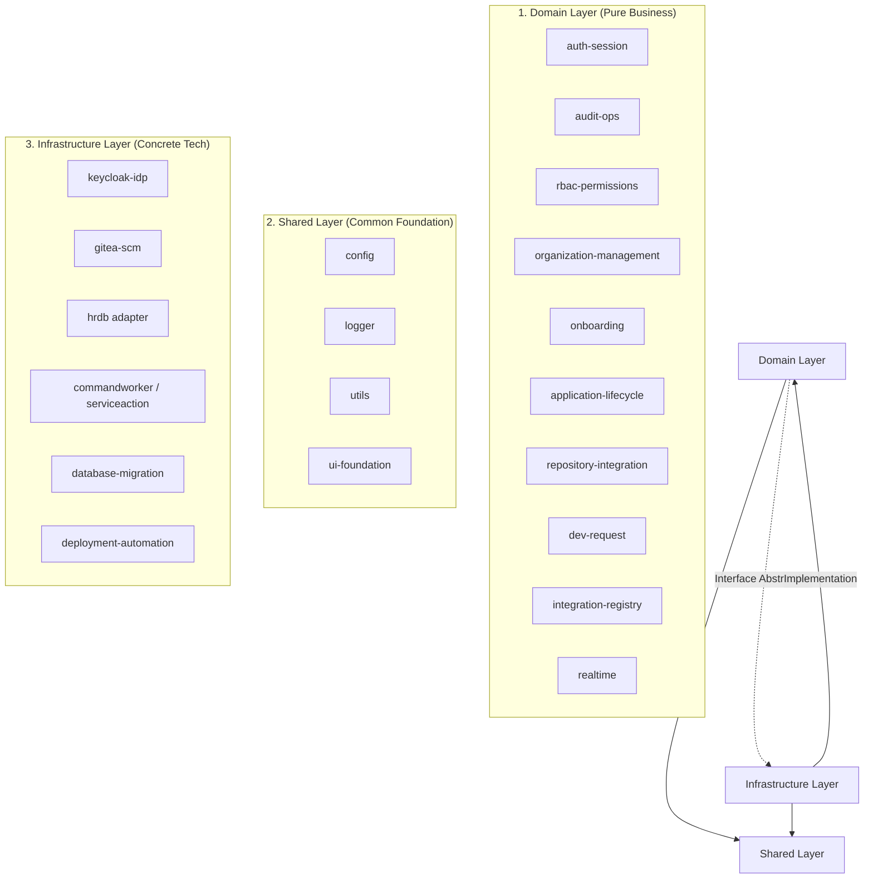

# DevHub 시스템 아키텍처 설계서 (Master Index)

- 문서 목적: DevHub 의 cross-cutting 시스템 아키텍처 (3대 레이어 / 호출 규칙 / 데이터 전략 / UI 전략 / 보안 baseline / RBAC 단계화) 와 도메인별 아키텍처 진입점을 제공한다.
- 범위: §1-§4 (cross-cutting) + §5 도메인별 아키텍처 link 표 + §6 보안 baseline (cross-cutting) + §7 RBAC 단계화. 도메인별 본문은 sub-document.
- 대상 독자: Backend / 프론트엔드 / DevOps 개발자, AI agent, 아키텍처 검토자.
- 상태: accepted
- 작성일: 2026-04-29
- 최종 수정일: 2026-05-29 (Phase 3 split — 도메인별 본문 §5/§7~§12 이관, 본 문서는 master index 로 전환)
- 관련 문서: [요구사항 정의서 (master index)](./requirements.md), [백엔드 API 계약 (master index)](./backend_api_contract.md), [ADR-0019 Keycloak 단일화](./adr/0019-keycloak-only-idp.md), [ADR-0002 RBAC](./adr/0002-rbac-policy-edit-api.md), [ADR-0024 WebSocket ticket](./adr/0024-websocket-auth-query-token.md), [추적성 매트릭스](./traceability/report.md), [코드베이스 스냅샷 2026-05-27](./analysis/2026-05-27-codebase-snapshot/README.md).

## 1. 개요

본 문서는 DevHub의 cross-cutting 시스템 구성, 서비스 간 통신 방식, 데이터 흐름 및 UI/UX 시각화 전략을 정의한다. 도메인별 컴포넌트·상태 머신·audit catalog 는 `docs/domain/<도메인>/architecture.md` sub-document 가 source-of-truth.

## 2. 시스템 컴포넌트 구조 (3대 레이어 아키텍처)

본 프로젝트는 비즈니스 핵심 가치와 외부 기술적 종속성을 분리하기 위해 **3대 최상위 레이어** (Domain, Shared, Infrastructure) 및 도메인 내부 **4대 계층** (View, Service, Repository, Schema) 구조를 따릅니다.

### 2.1 레이어별 컴포넌트 구조도

```mermaid
graph TD
    subgraph "1. Domain Layer (Pure Business)"
        auth[auth-session]
        audit[audit-ops]
        rbac[rbac-permissions]
        org[organization-management]
        onboard[onboarding]
        app[application-lifecycle]
        repo[repository-integration]
        dreq[dev-request]
        registry[integration-registry]
        realtime[realtime]
    end

    subgraph "2. Shared Layer (Common Foundation)"
        config[config]
        logger[logger]
        utils[utils]
        uif[ui-foundation]
    end

    subgraph "3. Infrastructure Layer (Concrete Tech)"
        keycloak[keycloak-idp]
        gitea[gitea-scm]
        hrdb[hrdb adapter]
        worker[commandworker / serviceaction]
        mig[database-migration]
        deploy[deployment-automation]
    end

    %% 의존 관계 및 호출 규격
    DomainLayer[Domain Layer] --> SharedLayer[Shared Layer]
    InfrastructureLayer[Infrastructure Layer] --> SharedLayer[Shared Layer]
    DomainLayer -.->|Interface Abstraction| InfrastructureLayer[Infrastructure Layer]
    InfrastructureLayer -->|Implementation| DomainLayer
```

### 2.2 아키텍처 호출 규칙 (Calling Constraints)

시스템의 유연한 변경과 결합도 완화를 위해 다음 세 가지 호출 규칙을 엄격하게 적용합니다.

1. **상향 호출 금지 (No Upward Calls)**
   * `Infrastructure` 레이어는 `Domain` 레이어의 구체 비즈니스 서비스나 엔티티를 직접 소유하거나 지배하지 않습니다.
   * `Domain`은 외부 연동 대상에 대해 추상화된 어댑터 인터페이스(예: `SCMAdapter`, `HRDBAdapter`)만 노출하며, `Infrastructure`는 이 인터페이스의 기술 구현체로만 작동하여 상향 결합도를 제거합니다.
2. **교차 도메인 DB 직접 조인 및 수정 금지 (No Cross-Domain DB Direct Access)**
   * 각 비즈니스 `Domain`은 자신의 `Repository` 계층을 통해서만 영속 스토리지에 접근합니다.
   * 타 도메인의 소유 테이블(예: `dev-request` 도메인이 `rbac_policies` 테이블을 직접 조작)에 대한 직접 쿼리나 조인을 금지하며, 도메인 간 협업이 필요한 경우 상위 `Service` 수준의 인터페이스 호출이나 `realtime` 도메인의 실시간 이벤트를 구독하여 소통합니다.
3. **Shared의 독립성 (Independence of Shared)**
   * `Shared` 레이어의 컴포넌트(설정, 로그, 공통 UI)는 비즈니스 도메인의 특정 상태나 의미론(Semantics)에 의존하지 않고, 항상 중립적이고 재사용 가능한 유틸리티 성격을 유지해야 합니다.

## 3. 서비스 간 통신 (Internal Communication)

### 3.1 Go Core ↔ Python AI (gRPC)
- **프로토콜:** gRPC (HTTP/2 기반)
- **IDL:** Protocol Buffers (.proto)
- **계약 상태:** 내부 분석 요청/응답의 기본 통신 방식은 gRPC로 확정합니다.
- **구현 상태:** 현재 스캐폴딩에는 `proto/analysis.proto`, Go/Python 생성 명령, Python gRPC 의존성이 포함되어 있습니다. 다만 `backend-ai/main.py`는 아직 FastAPI HTTP health endpoint만 실행하며, `50051`은 Docker Compose에 예약 노출된 포트일 뿐 실제 gRPC 서버와 Go Core client/server 연동은 후속 구현 범위입니다.
- **데이터 접근 경계:** 초기 구현에서 Python AI는 PostgreSQL에 직접 접근하지 않습니다. Go Core가 Gitea 이벤트, 로그, 메트릭, 권한 필터링을 처리한 뒤 필요한 분석 입력만 gRPC로 전달합니다.
- **확장 가능성:** 대용량 분석이나 배치 처리가 필요해질 경우 Python AI의 읽기 전용 DB 접근 또는 분석 전용 view/replica를 후속 아키텍처로 검토합니다.
- **선정 이유:**
    - Go와 Python 간의 고성능 바이너리 통신.
    - 강력한 타입 체크를 통한 인터페이스 정합성 보장.
    - 대용량 로그 데이터 전송 시 스트리밍 기능 활용 가능.

### 3.2 Backend ↔ Frontend (REST & WebSocket)
- **API:** RESTful API (Next.js Data Fetching / TanStack Query)
- **실시간 통신:** **WebSocket**을 기본 계약으로 사용합니다.
    - **용도:** Gitea Actions 빌드 상태 실시간 업데이트, 긴급 리스크 알림, 실시간 이슈 액티비티 피드.
    - **SSE 처리:** SSE는 초기 구현 범위에 포함하지 않습니다. 프록시/운영 환경 제약으로 WebSocket 유지가 어렵다고 확인될 때 별도 fallback으로 재검토합니다.

> WebSocket 인증의 ticket 패턴([ADR-0024](./adr/0024-websocket-auth-query-token.md)) 은 [realtime 도메인 아키텍처](./domain/realtime/architecture.md) 가 source-of-truth.

## 4. 데이터 전략 (Data Strategy)

### 4.0 SCM Provider Adapter 원칙

- 외부 형상관리 연동은 `SCM Adapter Interface`를 기준으로 provider별 구현체를 분리한다.
- Core 도메인은 provider 중립 계약(Repository/PR/Build/Quality/Event)만 사용하고, provider별 API 차이는 어댑터에서 변환한다.
- `repo_provider`를 라우팅 키로 사용해 어댑터를 선택한다.
- 신규 provider 추가는 "어댑터 등록 + 설정"으로 처리하며, 기존 도메인 API/화면 계약 변경을 최소화한다.
- 장애 격리 원칙: 특정 provider 어댑터 장애는 해당 provider ingest 파이프라인으로만 제한하고 전체 수집 파이프라인 중단을 유발하지 않는다.

### 4.1 하이브리드 동기화
- **Webhook:** Gitea의 모든 이벤트를 실시간 수집하여 즉시 반영.
- **Hourly Pull:** 매 시간 전체 상태를 체크하여 동기화 유실 방지 (Reconciliation).

### 4.2 이벤트 수집 파이프라인

Gitea 이벤트 수집은 다음 파이프라인을 기본으로 합니다.

1. **Receive:** Go Core가 Gitea Webhook 이벤트를 수신.
2. **Validate:** Webhook secret/signature를 검증하고 이벤트 타입을 식별. 알 수 없는 이벤트 타입도 원본은 저장하되 처리 상태를 구분.
3. **Persist Raw Event:** payload 원문을 JSONB로 저장하고 event type, delivery id 또는 dedupe key, repository, sender, received_at, processed_at, status를 함께 기록.
4. **Normalize:** 이슈, PR, commit, build, runner 상태 등 도메인 테이블로 정규화.
5. **Apply Domain Update:** 프로젝트/저장소/사용자/권한/상태 테이블을 갱신.
6. **Request Analysis:** 필요한 경우 Go Core가 권한 필터링을 거친 분석 입력을 Python AI에 gRPC로 전달.
7. **Publish Update:** 프론트엔드 실시간 채널에 상태 변경을 전달.

중복 처리는 Gitea delivery id를 우선 idempotency key로 사용합니다. delivery id가 없는 이벤트는 event type, repository id/name, payload hash를 조합한 보조 key를 사용하며, 같은 key는 중복 삽입 또는 중복 처리하지 않습니다.

처리 상태는 `received`, `validated`, `processed`, `failed`, `ignored`를 기본으로 하며, 실패 시 실패 사유와 retry count를 기록합니다. 반복 실패 이벤트는 수동 확인 또는 `ignored` 상태로 전환해 재처리 루프를 방지합니다.

Hourly Pull reconciliation은 Webhook 누락을 보완하는 동기화 경로이며, 가능한 한 Webhook과 동일한 정규화/갱신 경로를 사용합니다. Pull 결과가 기존 상태와 충돌하면 요구사항 문서의 데이터 상충 정책에 따라 사용자 알림 및 PL read-only 노출 기준을 적용합니다.

### 4.3 스토리지 구성
- **PostgreSQL:**
    - 정형 데이터: 사용자, 프로젝트, 권한, 저장소 매핑.
    - 비정형 데이터(JSONB): Gitea 원본 웹훅 이벤트, (v2 예정) AI 분석 리포트 요약.
    - 보존 기간: 운영 로그 1개월, 개인화 데이터(Kudos 등)는 계정 삭제 후 1개월까지 보존.

## 5. UI/UX 및 시각화 전략

### 5.1 인터랙티브 인프라 관리
- **기술:** **React Flow**
- **내용:** Gitea Runner와 프로젝트 간의 구성도를 인터랙티브 다이어그램으로 구현. 사용자가 직접 드래그, 클릭하여 노드 상태 확인 및 제어(재시작 등) 수행.

### 5.2 역할별 진입 우선순위 기반 대시보드
- **개발 대시보드 (Developer Dashboard):** 집중 시간 보호 모드, 개인화된 업무 연혁, 실시간 빌드 현황.
- **관리 대시보드 (Management Dashboard):** 리스크 탐지(7일 임계치), 진행률 시각화, 의사결정 로그.
- **시스템 대시보드 + 시스템 설정 (System Dashboard + System Settings):** 인프라 헬스체크, 알림 임계치 설정, Runner 제어 콘솔.
- **UX 제공 방식:** 역할별 UX는 전용 화면 완전 분리보다 기본 진입 페이지 우선순위로 간접 제공한다.
- **노출 정책:** 시스템 대시보드/시스템 설정은 `system_admin` 권한 사용자에게만 노출한다.

## 6. 보안 및 인증 (cross-cutting baseline)

초기 구현은 Gitea Webhook 수집과 시스템 관리자 기능의 오남용 방지를 우선하며, 인증은 Keycloak 기반 OIDC 표준 흐름으로 통일합니다. AI 가드너 기반 분석/추천 기능은 v2 범위로 분리합니다.

### 6.1 초기 구현 범위

- **Webhook 검증:** Gitea Webhook endpoint는 `GITEA_WEBHOOK_SECRET` 기반 signature 검증을 필수로 합니다. 검증 실패 이벤트는 도메인 상태를 변경하지 않으며, 원본 저장 여부는 보안 위험을 고려해 최소 metadata 중심으로 기록합니다.
- **서비스 간 권한 경계:** 모든 Gitea 이벤트와 외부 API 호출은 Go Core를 먼저 통과합니다. Python AI는 인증/권한 판단을 직접 수행하지 않고, Go Core가 필터링한 분석 입력만 처리합니다.
- **관리자 접근:** 시스템 관리자 기능은 초기 단계에서 설정 기반 allowlist 또는 seed된 system admin 계정으로 제한합니다. 일반 관리자/PM 권한과 시스템 관리자 권한은 별도 role로 분리합니다.
- **Audit Log:** Runner 제어, Gitea 계정/조직/권한 변경, 알림 임계치 변경, Webhook 재처리/무시 처리, **계정 발급/회수, 비밀번호 변경, 로그인 성공/실패**는 Audit Log 기록 대상입니다.

### 6.2 사용자(User) ↔ 계정(Account) 도메인 분리

DevHub는 사람 단위 식별(User)과 인증 자격(Account)을 분리해 관리합니다. 본 절의 본문(데이터 모델, 비밀번호 처리 원칙, 인증 흐름 1차)은 [auth-session 도메인 architecture §1](./domain/auth-session/architecture.md) 로 이관됐다.

### 6.3 RBAC 단계화

| 단계 | 범위 | 기준 |
| --- | --- | --- |
| Phase 1 | Webhook secret 검증, system admin role 분리, 관리자 작업 Audit Log | TASK-007 및 초기 시스템 관리자 기능 구현 기준 |
| Phase 2 | Keycloak 기반 OIDC 도입, DevHub OIDC client 전환, token 검증/actor 매핑/audit 경계 정착 | Keycloak/OIDC 운영 진입 및 backend Phase 13 완료 시점 ([ADR-0019](./adr/0019-keycloak-only-idp.md), [ADR-0001](./adr/0001-idp-selection.md) superseded) |
| Phase 3 | Gitea 사용자/조직/저장소 권한 동기화, Repository 하위 Project role 매핑 | Application-Repository-Project 매핑과 관리자 대시보드 확장 시점 |
| Phase 4 | Gitea SSO 연동 기반 통합 인증, 자체 계정과의 병행/대체 정책 결정 | 운영 환경 전환 전 별도 보안 검토 후 도입 |

### 6.4 Audit Log 최소 필드 (cross-cutting)

Audit Log는 최소한 `actor_id`, `actor_role`, `action`, `target_type`, `target_id`, `request_id`, `source_ip`, `result`, `reason`, `created_at`을 기록합니다. Webhook 처리 계열 작업은 `actor_id` 대신 `gitea_delivery_id` 또는 dedupe key를 함께 남겨 재처리 경로를 추적합니다. 계정/인증 계열 action 카탈로그는 [auth-session 도메인 api §6](./domain/auth-session/api.md) 참조.

비밀번호 평문, 해시, 임시 비밀번호는 어떤 audit 필드에도 기록하지 않습니다.

### 6.5 Keycloak 버전 pin / SPI / WS ticket 보안 경계

본 절의 §6.5.1 (Keycloak 버전 pin) + §6.5.2 (event → audit_logs 동기화) 본문은 다음 도메인 sub-document 로 이관됐다.

- §6.5.1 / §6.5.2 → [auth-session/architecture.md §2](./domain/auth-session/architecture.md) + [audit-ops/architecture.md §3](./domain/audit-ops/architecture.md)
- §6.5.3 (WebSocket ticket 인증 경계 / ADR-0024) → [realtime/architecture.md §2](./domain/realtime/architecture.md)

## 7. 도메인별 아키텍처 (sub-document link 표)

본 절은 도메인별 아키텍처 sub-document 의 진입점이다. ID 본문 (ARCH-*) 은 각 sub-document 가 source-of-truth.

| 도메인 | 아키텍처 | 본문 ID 범위 |
| --- | --- | --- |
| auth-session | [`./domain/auth-session/architecture.md`](./domain/auth-session/architecture.md) | User↔Account 분리, OIDC 흐름, Keycloak 버전 pin, SPI/poll event sync |
| audit-ops | [`./domain/audit-ops/architecture.md`](./domain/audit-ops/architecture.md) | ARCH-AUDIT-01..04 |
| rbac-permissions | [`./domain/rbac-permissions/architecture.md`](./domain/rbac-permissions/architecture.md) | ARCH-RBAC-01..06 |
| organization-management | [`./domain/organization-management/architecture.md`](./domain/organization-management/architecture.md) | ARCH-ORG-01..05 |
| onboarding | [`./domain/onboarding/architecture.md`](./domain/onboarding/architecture.md) | ARCH-ONBOARD-01..06 |
| application-lifecycle | [`./domain/application-lifecycle/architecture.md`](./domain/application-lifecycle/architecture.md) | ARCH-APPDASH-01..06 |
| repository-integration | [`./domain/repository-integration/architecture.md`](./domain/repository-integration/architecture.md) | ARCH-REPO-01..07 |
| dev-request | [`./domain/dev-request/architecture.md`](./domain/dev-request/architecture.md) | ARCH-DREQ-01..06 |
| integration-registry | [`./domain/integration-registry/architecture.md`](./domain/integration-registry/architecture.md) + [`task_architecture.md`](./domain/integration-registry/task_architecture.md) | ARCH-INT-01..07, ARCH-TASK-01..07 |
| realtime | [`./domain/realtime/architecture.md`](./domain/realtime/architecture.md) | ARCH-RT-01..05 |

## 8. 변경 이력 (요약)

| 일자 | 변경 |
| --- | --- |
| 2026-05-29 | **Phase 3 split** — 도메인별 본문(§7 DREQ, §8 Integration, §9 Onboarding, §10 Repository, §11 APPDASH, §12 Task) 을 10 도메인 sub-document 의 `architecture.md` (+ Task 전용 `task_architecture.md`) 로 이관. §6.2 (User/Account 분리) → auth-session, §6.4 (audit 최소 필드)는 master 유지 + audit-ops 인용, §6.5.1/§6.5.2 → auth-session + audit-ops, §6.5.3 → realtime. ID 보존, 신규 발급 없음(rbac-permissions, organization-management, audit-ops 의 ARCH-*-XX 는 도메인 임시 발급 — Phase 4 traceability matrix 재구성 시 정합). |
| 2026-05-28 | (split 이전) §12 Task Item Ingestion 도메인 신규 — task_architecture.md 로 이관됨. |
