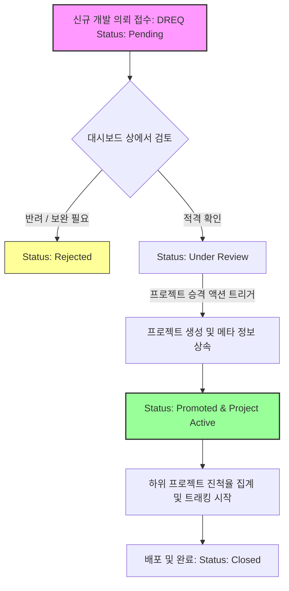

# Application 개발 대시보드 컨셉 및 콘텐츠 구성 방안 (Concept Design)

- **문서 목적**: DevHub의 핵심 단위인 Application(어플리케이션)의 상세 대시보드에서 제공해야 할 핵심 정보 및 UX 구성을 정의하고 고도화한다.
- **상태**: `draft` (설계 진행 중)
- **최종 수정일**: 2026-05-27
- **대상 독자**: 제품 리드, 프론트엔드 및 백엔드 개발자

---

## 1. 현재 구성 분석 및 데이터 소스 식별

현재 DevHub 백엔드 및 데이터베이스에는 어플리케이션 단위의 **롤업 메트릭(Rollup Metrics)** 및 연동 정보가 풍부하게 갖춰져 있습니다. 이를 바탕으로 대시보드에 매핑할 수 있는 실제 데이터 소스는 다음과 같습니다.

### 1.1 `ApplicationRollup` 데이터 구조
백엔드(`internal/domain/application.go` 및 `internal/store/repository_ops.go`)에서 이미 계산 및 집계를 완료하여 제공하는 실제 데이터 항목들입니다.
* **`build_success_rate`**: 연결된 리포지토리들의 가중치 평균 빌드 성공률 (0.0 ~ 1.0) — **시계열 추세 차트(REQ-FR-APPDASH-005)** 의 y축 지표로 유지. 단, 카드/리스트 표시는 아래 `target_branch_build_status` 로 대체 (REQ-FR-APPDASH-001).
* **`target_branch_build_status`**: 연결된 리포지토리들의 **마지막 빌드 결과 종합** derive 값 (`healthy` / `broken` / `unknown`). 각 repo 의 `LastBuildStatus` 가 `failed|cancelled` 이면 `broken` 우선, 모두 `success|skipped` 면 `healthy`, 그 외 `unknown`. 카드/리스트의 "빌드 상태" 표기 source.
* **`build_avg_duration_seconds`**: 가중치 평균 빌드 소요 시간
* **`quality_score`**: 가중치 평균 코드 품질 점수
* **`quality_gate_failed_count`**: 품질 게이트 통과 실패 횟수
* **`critical_warning_count`**: 상태 전이(Planning -> Active, Active -> Closed)를 차단하는 크리티컬 워닝(보안 취약점, 빌드 깨짐 등) 개수
* **`pull_request_distribution`**: PR 상태 분포 (`opened`, `merged`, `closed` 등)
* **`Meta` 필드 데이터**:
  * `applied_weights`: 리포지토리별 실제 적용된 가중치 배분 현황
  * `data_gaps`: 데이터 누락이 발생한 리포지토리 및 사유 (`provider_unreachable`, `no_data_in_window`)
  * `fallbacks`: 기본 정책 대신 Fallback 가중치가 적용된 내역

### 1.2 연동 관계 데이터
* **연결된 리포지토리 (`ApplicationRepository`)**: SCM Provider(GitHub, Gitea 등), 역할(`primary`/`sub`/`shared`), 동기화 상태(`synced`/`degraded`/`disconnected`), 동기화 에러 코드
* **DREQ (개발 의뢰)**: 이 어플리케이션으로 승격될 수 있거나 매핑된 DREQ 현황

---

## 2. Application 개발 대시보드 핵심 콘텐츠 도출

현재 백엔드 제공 스펙과 사용성 관점을 결합하여, 개발 대시보드에서 보여줄 5대 핵심 영역과 상세 콘텐츠를 도출합니다.

### 2.1 영역 1: 종합 개발 헬스 스코어 및 상태 (Governance & Health Overview)
어플리케이션의 핵심 라이프사이클 관리 정보와 요약 메트릭을 최상단에서 한눈에 파악합니다.
* **라이프사이클 메타**: Leader(담당 팀장), Development Unit(개발 부서), Visibility(공개 범위), 핵심 Key 및 일정.
* **3대 헬스 메트릭 카드 (가중치 롤업 및 실시간 상태)**:
  * **대상 브랜치 빌드 상태 (Target Branch Build Status)**: 
    > [!IMPORTANT]
    > **단순 빌드 성공률(%)보다 개발 생산성 측면에서 훨씬 크리티컬한 지표입니다.** 
    > 통합 대상 핵심 브랜치(`main`, `release` 등)의 **실시간 빌드 실패(Broken/Red) 상태 여부**를 직관적으로 노출합니다.
    * **리포지토리 슬러그 표기**: 어플리케이션에 여러 리포지토리가 연결될 수 있으므로, 어떤 저장소의 빌드가 깨졌는지 바로 식별할 수 있도록 **리포지토리 슬러그(예: `org/repo-slug`)**를 반드시 함께 표기합니다.
    * **모든 실패한 빌드 리스트업 및 UX**: 최상단 빌드 카드 내에 현재 **실패(Broken) 상태에 있는 모든 빌드 런 리스트**를 노출하여 개발자가 스크롤을 내리지 않고도 문제의 대상 저장소와 브랜치를 즉시 진단하고 실패한 빌드 로그로 즉각 이동할 수 있게 설계합니다. (모두 정상일 경우 `All Branches: Healthy 🟢` 노출)
    * **실패 빌드 세부 정보 스펙**: 각 실패 건당 `[리포지토리 슬러그] > [브랜치명] | 빌드 번호 (#128) | 실패 시점 (3분 전) | 에러 요약 스니펫 ("Exit code 1 on test task")` 및 **[로그 즉시 진입 딥링크]** 버튼을 제공하여 디버깅 동선을 최소화합니다.
  * **빌드 소요 시간 (Build Duration - 참고용)**: 최근 빌드들의 평균 소요 시간 및 추이. 빌드 파이프라인의 효율성 저하나 지연 여부를 파악하기 위한 유용한 참고 지표로 삼습니다.
  * **품질 및 정적분석 지표 (Quality & Issues)**:
    > [!IMPORTANT]
    > **품질 지표는 단순 종합 점수에서 개발 실무 관점의 다차원적 분석 데이터로 세분화하여 설계합니다.**
    * **종합 품질 스코어 (5점 만점)**: 각 리포지토리의 품질 데이터를 **5점 만점 스케일로 정규화**한 가중치 평균 품질 점수입니다. (예: `4.2 / 5.0`)
      * *정규화 공식*: 각 저장소의 SonarQube Quality Gate Rating (A: 5.0, B: 4.0, C: 3.0, D: 2.0, E: 1.0) 또는 커버리지율($C$) 및 중복도($D$)를 조합한 스코어링 모형 적용:
        $$\text{Normalized Score} = w_1 \cdot \text{RatingScore} + w_2 \cdot (\text{Coverage} \times 5.0) - w_3 \cdot (\text{Duplication} \times 5.0)$$
    * **정적 분석 검출 이슈 (Static Analysis Issues - 핵심)**: 소나큐브 등 정적분석 도구로 검출되어 해결 상태를 관리해야 하는 **실제 미해결 이슈 건수**를 심각도별(Blocker/Critical/Major)로 집계하여 최상단에 직접 노출합니다. 기술 부채 triaging 및 리스크 관리에 가장 중요한 데이터 역할을 합니다.
    * **코딩 룰 검사 항목의 분리**: 코딩 룰 및 세부 린트 위반 내역 등 부가적이고 지엽적인 코드 가독성 지표는 상위 수준의 어플리케이션 뷰에서 노이즈가 될 수 있으므로 과감히 제외합니다. 해당 항목은 하위 레벨의 **개별 리포지토리 상세 대시보드(Repository Dashboard)**의 전용 품질 탭에서 노출하도록 역할을 분리합니다.
  * **보안/위험 가드 (Security & Critical Guard)**: 크리티컬 워닝 개수 및 위험 상태 신호등.
* **가중치 배분 비주얼라이저 (Weight policy visualizer)**: 리포지토리 역할(`primary`/`sub`)에 따라 롤업 계산에 가중치가 어떻게 적용되었는지 원형 차트나 도넛 차트로 표현.

### 2.2 영역 2: 하위 프로젝트 진척도 및 로드맵 관리 (Linked Projects Progress & Roadmap)
어플리케이션은 큰 서비스 단위이며, 그 하위에서 여러 개의 프로젝트(예: 마일스톤, 피처 단위 등)가 수행됩니다. 하위 프로젝트들의 진행 상태와 로드맵은 대시보드 진입 시 최우선으로 인지해야 하는 핵심 거버넌스 데이터이므로 최상단에 배치합니다.
* **프로젝트 진척율 집계**: 어플리케이션에 속한 모든 프로젝트들의 상태(Planning, Active, Closed, Archived) 및 목표 일정 대비 진척 현황(Progress Bar)을 표시합니다.
* **진척 산정 알고리즘**:
  * *단순 개수제 산식*: $\text{Progress (\%)} = \frac{\text{완료된 태스크 수}}{\text{전체 태스크 수}} \times 100$
  * *스토리 포인트 가중 산식 (권장)*: 각 작업 아이템의 스토리 포인트($SP$) 가중치를 합산하여 실질적인 기능적 진척을 정밀 측정합니다.
    $$\text{Functional Progress (\%)} = \frac{\sum SP_{\text{Completed}}}{\sum SP_{\text{Total}}} \times 100$$
* **지능형 리스크 감지 및 D-Day 배지**:
  * 단순히 남은 일수($D\text{-Day}$)만 표시하는 것을 넘어, **[남은 작업량 대비 잔여 일정 비율]**을 분석하여 지연 리스크를 자동 진단합니다.
  * **🟢 Healthy**: 남은 일수 비율이 충분하고 일정 내 완료율 추이가 안정적인 경우.
  * **🟡 Warning**: $D\text{-Day} \le 14$ 이나 진척율이 50% 미만인 경우.
  * **🔴 At Risk**: $D\text{-Day} \le 7$ 이나 진척율이 70% 미만인 경우, 또는 목표 배포일이 이미 도과된 경우.

### 2.3 영역 3: 소스 코드 및 PR 활성도 스트림 (Development & Collaboration Stream)
개발의 속도(Velocity)와 협업 수준을 보여주는 영역입니다.
* **PR 분포 및 리드타임**: `pull_request_distribution` 맵을 활용한 도넛/바 차트.
* **최근 코드 변경 히스토리**: 연결된 SCM Provider의 최근 커밋 및 PR 병합 타임라인.
* **기여자 분석**: 활성 기여자 수 및 Top Contributor 레이아웃.

### 2.4 영역 4: CI/CD 빌드 품질 및 안정성 분석 (Build Stability & Operations)
소프트웨어 배포 파이프라인의 실시간 안정성을 추적합니다.
* **브랜치별 실시간 빌드 상태 매트릭스**: 각 리포지토리의 주요 타겟 브랜치별 최신 빌드 상태 (Green/Red) 리스트.
* **빌드 소요 시간 및 빌드 성공률 추이 (Area Chart)**: 7일/30일간의 빌드 시간 변화 추이 및 빌드 성공률 시계열 데이터.
* **빌드 성능 메트릭 (Avg. Duration)**: 평균 빌드 속도 및 최근 빌드 실패 로그 스니펫 (실패 원인 추적).
* **배포 지역 및 동기화 헬스**: 리포지토리별 `SyncStatus` 모니터링 카드. 동기화 중단(`disconnected`) 또는 지연(`degraded`) 시 즉시 복구 액션 버튼 제공.

### 2.5 영역 5: 연결된 모든 개발 의뢰 관리 (All Linked Dev Requests - DREQ Overview)
이 어플리케이션과 링크된 **모든 개발 의뢰(DREQ)**의 인테이크 및 처리 과정을 완벽하게 가시화하여 요구사항-개발-배포의 end-to-end 추적성을 보장합니다.
* **의뢰 전체 조회 및 필터링**: 이 어플리케이션에 매핑된 모든 DREQ의 리스트와 현황(대기 중, 검토 중, 승격 완료, 반려 등)을 전용 탭이나 전용 섹션을 통해 한눈에 볼 수 있도록 제공합니다.
* **의뢰 승격(Promote) 상세 액션 워크플로우**:
  * 대기 중(`Pending`) 또는 검토 중(`Under Review`)인 DREQ 카드 우측에 **[프로젝트 승격(Promote to Project)]** 버튼을 배치합니다.
  * 해당 버튼 클릭 시, DREQ의 제목, 설명, 우선순위를 자동으로 상속받는 **"프로젝트 생성 모달(Create Project Modal)"**이 호출됩니다.
  * 모달 내에서 담당자(Leader), 타겟 마일스톤, 연동할 SCM 리포지토리 가중치를 확정한 후 승인하면, 즉시 백엔드 트랜잭션을 통해 신규 `Project`가 생성되고 DREQ의 상태는 `Promoted (승격 완료)` 상태로 전이됩니다.
* **DREQ 승격 라이프사이클 및 추적성 흐름도 (Mermaid)**:




---

## 3. UI/UX 레이아웃 설계안 (Wireframe Concept)

어플리케이션 대시보드는 정보를 명확하게 나누어 시각적 노이즈를 최소화하고, 다크/라이트 모드와 모던 글래스모피즘(Glassmorphism) 스타일을 적용하여 디자인 프리미엄을 극대화합니다.

```
+---------------------------------------------------------------------------------------------------+
|  [<- 뒤로가기]   어플리케이션 이름 (status: active / key: APP-KEY)                        [설정] [새로고침]  |
|  Leader: 홍길동 | Dev Unit: 플랫폼개발팀 | Updated: 2026-05-27                                            |
+---------------------------------------------------------------------------------------------------+
|  +-------------------------------------+  +-------------------+  +-------------------+  +---------------+  |
|  | Target Branch Build                 |  | Avg Build Time    |  | Quality & Issues  |  | Crit. Warnings|  |
|  |  🔴 org/core#main                   |  |   4m 32s (Stable) |  |   4.2 / 5.0 (Good)|  |   0 (Stable)  |  |
|  |     #128 | 3m 전 | "Exit code 1" [로그] |  |                   |  |  [정적분석 미해결] |  |               |  |
|  |  🔴 org/api#release                 |  |                   |  |  - 2 Blocker      |  |               |  |
|  |     #95  | 10m 전 | "Lint failed" [로그]|  |                   |  |  - 5 Major        |  |               |  |
|  +-------------------------------------+  +-------------------+  +-------------------+  +---------------+  |
+---------------------------------------------------------------------------------------------------+
|  하위 프로젝트 진척 현황 (Linked Projects Progress)                                                       |
|   - [🟡 Warning]  v1.0 Release:   [=======>          ] 70% (Active) - Due: 2026-06-15 (D-19)              |
|   - [🟢 Healthy]  Q2 Refactoring: [==>               ] 20% (Active) - Due: 2026-06-30 (D-34)              |
|   - [🟢 Healthy]  OIDC Client:    [==================] 100% (Done)  - Completed at 2026-05-20             |
+---------------------------------------------------------------------------------------------------+
|  +--------------------------------------------+  +------------------------------------------------+  |
|  | [차트] 빌드 소요시간 & 코드 품질 7일 트렌드 |  | 코드 품질 분석 (Quality Gate)                  |  |
|  |                                            |  | - 종합 품질 스코어: 4.2 / 5.0 (정규화 공식 기준) |  |
|  |                                            |  | - 정적분석 미해결: 7건                         |  |
|  |                                            |  | - (코딩룰 세부 내역은 저장소 대시보드에서 제공) |  |
|  +--------------------------------------------+  +------------------------------------------------+  |
+---------------------------------------------------------------------------------------------------+
|  +-------------------------------------------------------------------------------------------------+  |
|  | 연결된 개발 리포지토리 리스트 (Linked Repositories)                                              |  |
|  |  - org/core (Primary, Synced)  [main: BROKEN 🔴] [Avg Build: 3m 15s] [Quality: 4.5]                 |  |
|  |  - org/api (Sub, Synced)       [release: BROKEN 🔴] [Avg Build: 1m 45s] [Quality: 3.9]              |  |
|  +-------------------------------------------------------------------------------------------------+  |
+---------------------------------------------------------------------------------------------------+
|  연결된 모든 개발 의뢰 목록 (All Linked Dev Requests - DREQ Overview)                                     |
|   - #DREQ-102: 신규 API 개발    [대기 중 🟡] [Assignee: 홍길동] [Created: 2026-05-25]    [프로젝트 승격 🚀]  |
|   - #DREQ-105: UI 컴포넌트 수정 [검토 중 🔵] [Assignee: 이영균] [Created: 2026-05-26]    [프로젝트 승격 🚀]  |
|   - #DREQ-109: 성능 개선 의뢰   [반려 🔴]   [Assignee: 미지정] [Created: 2026-05-27]                        |
+---------------------------------------------------------------------------------------------------+
```

---

## 4. 고도화 액션 아이템 (Next Steps)

1. **시계열 히스토리 백엔드 스펙 구체화**:
   * 현재 `mockHistoryData`로 제공되는 7일 트렌드 시계열 데이터를 백엔드에서 실제 `build_runs` 및 `quality_snapshots` 테이블을 조회하여 응답하는 전용 API (예: `GET /api/v1/applications/:id/history`) 설계 검토.
2. **하위 프로젝트 진척도 롤업 로직 설계**:
   * 백엔드 상에서 `projects` 및 연결된 작업 아이템(Task/Issue) 데이터를 종합하여 어플리케이션 하위 프로젝트들의 완료율(%)을 계산하여 반환하는 집계 API 스펙 구상.
3. **가중치 배분(Weight Policy) 시각화 및 정책 변경**:
   * UI 대시보드 내에서 가중치 정책(`equal`/`repo_role`/`custom`)을 간편하게 조회 및 수정할 수 있는 어플리케이션 설정 탭 연동.
