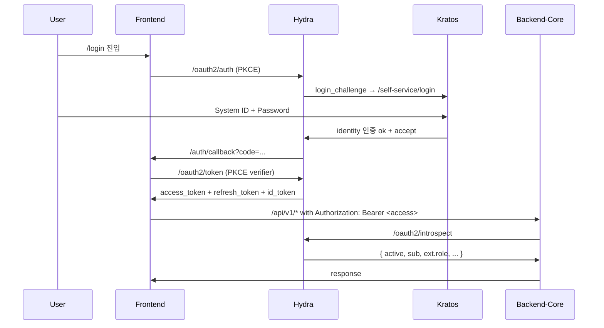
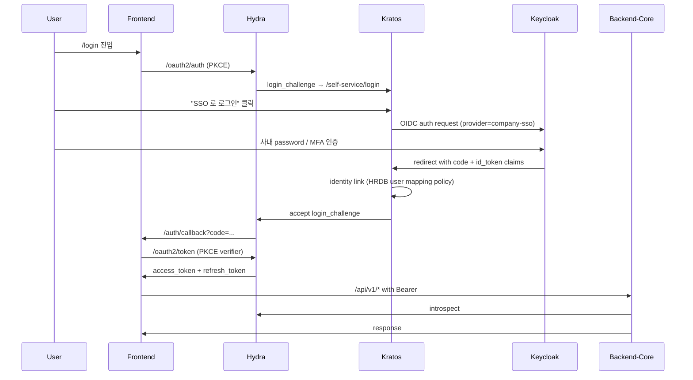

# Design 검토 — 외부 Keycloak SSO federation (Kratos upstream OIDC provider)

- 문서 목적: 외부 Keycloak 을 Kratos 의 upstream OIDC provider 로 federation 통합 (옵션 B) 의 design 검토. 1차 산출물은 planning 단계 — 결정 후 ADR-0019 승격은 별도 sprint.
- 범위: 인증 flow 변경 + HRDB user mapping 정책 + claim 매핑 + cutover 절차 + local dev / staging / prod 분기 + 보안 점검. 코드 변경 없음.
- 대상 독자: 아키텍트, 운영자 (SRE / IdP), Security, Backend / Frontend / IdP 담당자.
- 상태: **rejected (2026-05-19)** — 본 문서의 권장 옵션 B (Kratos federation) 는 채택되지 않았다. 2026-05-18 PR #167 (Keycloak-only refactor) 가 옵션 A (Keycloak 단일화) 를 실 구현했고 2026-05-19 [ADR-0019](../adr/0019-keycloak-only-idp.md) 가 옵션 A 의 사후 명문화. 본 문서의 §2 옵션 비교 표 + §4 HRDB mapping 4 옵션 + §8 보안 점검 + §14 carve out 의 일부는 옵션 A 환경에서도 historical reference 로 유효.
- 최종 수정일: 2026-05-19
- 결정 근거 sprint: `claude/work_260518-v` (draft 1차) → `claude/work_260519-a` (rejected status 갱신)
- 관련 문서: [ADR-0019 Keycloak 단일화 (실 채택 결정)](../adr/0019-keycloak-only-idp.md), [ADR-0001 IdP selection (Hydra+Kratos, superseded)](../adr/0001-idp-selection.md), [ADR-0008 HRDB production adapter](../adr/0008-hrdb-production-adapter.md), [ADR-0010 primary_dept resolution](../adr/0010-primary-dept-resolution.md), [environment-setup](../setup/environment-setup.md), [single_port_reverse_proxy](./single_port_reverse_proxy.md) (단일 포트 design 과 cookie scope 정합), [통합 로드맵](../development_roadmap.md) RM-M4-09 (외부 SSO 통합 항목).

> **⚠️ rejected 안내 (2026-05-19)**: 본 문서는 옵션 B (Kratos federation) 를 권장했으나 실 채택은 옵션 A (Keycloak 단일화). ADR-0019 가 옵션 A 의 결정 근거 + 잔여 carve out 의 source-of-truth. 본 문서는 historical design context 로 immutable 보존되며, §4 HRDB employee_id strict link 정책 + §7 claim 매핑 + §8 보안 점검 + §14 carve out 은 옵션 A 환경에서도 적용 가능한 일반 reference 로 활용 가능.

## 1. 컨텍스트 + 동기

### 1.1 현재 인증 stack (ADR-0001)

- **Ory Hydra** — OAuth2 / OIDC provider. DevHub backend 로 token 발급, introspection 제공
- **Ory Kratos** — Identity + self-service (password, signup, settings, recovery)
- **HRDB** (`hrdb` schema, ADR-0008 PostgreSQL adapter) — 인사 master data. Sign Up 시 lookup (`system_id`, `employee_id`, `name`) 후 Kratos identity 생성
- Frontend = OIDC code flow with PKCE, sessionStorage token store
- Backend = Bearer token verifier (Hydra introspection), audit_logs with actor enrichment

flow 요약:



### 1.2 외부 Keycloak SSO 도입 동기

- **enterprise SSO 통합** — 사내 Keycloak 이 이미 Active Directory / LDAP / SAML 다른 시스템과 연결되어 있을 가능성. DevHub 도 동일 SSO 우산 아래.
- **사용자 password 단일화** — DevHub 자체 password 불필요 (사용자가 회사 계정으로 로그인).
- **MFA 통합** — Keycloak 의 MFA / FIDO2 / WebAuthn 정책을 DevHub 도 자연 상속 (ADR-0001 §8.3 MFA 미도입 결정의 자연 후속).
- **off-boarding** — 인사 시스템에서 사용자 비활성화 시 Keycloak 도 함께 비활성 → DevHub 접근도 자동 차단.
- RM-M4-09 ("외부 SSO 통합") 의 구체화.

## 2. 통합 옵션 비교 (3종)

| 옵션 | 변경 범위 | 운영 부담 | 보안 검증 | 권장 |
| --- | --- | --- | --- | --- |
| **A. Keycloak 으로 Hydra+Kratos 전체 대체** | 매우 큼 — ADR-0001 reverse, backend BearerTokenVerifier 재구현 (Keycloak introspection / JWKS), Sign Up flow 재설계, audit/RBAC 정합 재검증, frontend OIDC client 재구성 | Keycloak 1개로 simplify | 모든 인증 stack 재검증 필요 | ❌ M0~M2 완성된 stack 폐기 + blast radius 매우 큼 |
| **B. Keycloak 을 Kratos 의 upstream OIDC provider 로 federation** | 중간 — Kratos `selfservice.methods.oidc` 에 Keycloak provider 추가 + frontend login UI 에 "SSO 로 로그인" 버튼 + HRDB user mapping policy 결정 + Kratos identity link 처리 | 기존 stack 유지 + Keycloak 추가 (사내 운영팀이 별도 관리 가능성 ↑) | Kratos 의 검증된 OIDC client | ⭐ **권장** |
| **C. Keycloak 을 별도 OIDC provider 로 두고 Hydra 와 token brokering** | 매우 큼 + 복잡 — Hydra 가 외부 IdP 의 token 을 trust (federated identity provider chain), token type 검증, introspection drift 위험 | brokering layer 추가 + token chain 운영 | token chain 의 모든 path 보안 검증 | ❌ over-engineering. Ory Hydra 는 자체 IdP 역할이 1차 디자인이라 brokering 은 비자연 |

## 3. 옵션 B (권장) — Kratos federation 상세

### 3.1 Kratos config 추가

`infra/idp/kratos.yaml` 의 `selfservice.methods` 에 `oidc` 메서드 추가:

```yaml
selfservice:
  methods:
    password:
      enabled: true        # 기존 — 자체 password 도 유지 (transitional)
    oidc:
      enabled: true
      config:
        providers:
          - id: company-sso          # 사용자가 보는 provider 식별자
            provider: generic        # Kratos generic OIDC provider
            client_id: devhub-kratos
            client_secret: ${KEYCLOAK_CLIENT_SECRET}
            issuer_url: https://sso.example.com/realms/company
            scope:
              - openid
              - profile
              - email
            mapper_url: file://./infra/idp/keycloak_claim_mapper.jsonnet
            requested_claims:
              # Keycloak 의 OIDC client 가 노출해야 하는 claim 명세.
              # 사내 employee_id 가 claim 으로 노출되는지 운영 검증 필요.
              id_token:
                employee_id: { essential: true }
                preferred_username: { essential: true }
                email: { essential: true }
                email_verified: { essential: true }
```

### 3.2 claim → DevHub identity mapping (`keycloak_claim_mapper.jsonnet`)

```jsonnet
local claims = std.extVar('claims');

{
  identity: {
    traits: {
      // Kratos identity schema 의 devhub_user 정합 — email + system_id + employee_id
      email: claims.email,
      system_id: claims.preferred_username,   // 사내 ID (System ID 와 일치 가정)
      employee_id: claims.employee_id,        // Keycloak custom claim (사내 mapper 책임)
      display_name: claims.name,
    },
  },
}
```

운영 가정: Keycloak 의 OIDC client mapper 가 `employee_id` 를 사내 사용자 attribute 에서 OIDC claim 으로 export. 운영자가 Keycloak admin console 에서 client → Mappers 설정.

### 3.3 frontend login UI

`/auth/login` 페이지에 "SSO 로 로그인" 버튼 추가. 클릭 시 Kratos `/self-service/login/browser` 의 OIDC method 활성화:

```ts
// frontend/components/auth/LoginForm.tsx (예상 변경)
<button onClick={() => window.location.href = `${KRATOS_PUBLIC_URL}/self-service/login/browser?provider=company-sso`}>
  SSO 로 로그인 (Company)
</button>
```

자체 password 입력 폼은 기존 그대로 유지 (transitional).

### 3.4 flow 변경 다이어그램



핵심: Kratos 가 외부 Keycloak 으로 위임하지만, **Hydra 가 DevHub 의 token 을 발급** — backend BearerTokenVerifier 는 변경 없음. backend / RBAC / audit 동작 정합.

## 4. HRDB user mapping 정책 (핵심 결정)

### 4.1 문제 정의

Keycloak 으로 첫 로그인 한 사용자 = Kratos identity 가 없는 상태. Kratos 가 자동으로 identity 를 생성 (`oidc` method 의 1차 lookup → 없으면 register). 그러나:

- 이미 자체 password 로 가입한 사용자가 같은 email 로 Keycloak 로그인 시 **두 identity 가 생성** → identity 중복.
- HRDB lookup 정합 — `system_id` / `employee_id` 가 일관 매핑되어야 RBAC / 조직 / audit 의 의미 보존.
- enterprise 환경에서 사용자가 Keycloak 만 사용하게 강제할지, 둘 다 허용할지 결정 필요.

### 4.2 매핑 옵션 비교

| 옵션 | 정책 | 충돌 처리 | 권장 |
| --- | --- | --- | --- |
| **M1. email 기준 strict link** | 같은 email 의 기존 identity 있으면 link, 없으면 새로 생성 | email 변경 / domain alias 시 mis-link 위험 | ❌ enterprise 에서 email 변경 빈도 ↑ (결혼/조직 이동) |
| **M2. employee_id 기준 strict link** | Keycloak claim 의 `employee_id` 가 기존 identity 의 trait 와 일치하면 link | employee_id 가 always 일관성 보장 (HR 시스템 master) | ⭐ **권장** — HRDB 의 employee_id 와 일관 |
| **M3. system_id 기준 strict link** | `preferred_username` 이 기존 identity 의 `system_id` 와 일치하면 link | 사용자가 SystemID 를 잊거나 사번-시스템ID 불일치 시 위험 | △ HRDB lookup 의 보조 키 |
| **M4. (email OR employee_id) + 운영자 확인 fallback** | 자동 link 충돌 시 admin 이 manual 확인 후 link | UX 부담 ↑, 운영자 burden ↑ | △ 안전하지만 운영 부담 |

**권장 = M2 (employee_id strict link)**. 이유:
- HRDB 의 `employee_id` 가 인사 master data 의 primary key
- Keycloak 의 OIDC mapper 가 사내 employee_id attribute 를 claim 으로 export 가능 (운영 가정)
- email / system_id 변경 시에도 employee_id 는 일관

### 4.3 Kratos identity link 처리

Kratos 의 `oidc.config.providers` 에 `mapper_url` 이 link 로직 정의. employee_id 일치 시 기존 identity 에 OIDC method credential 만 추가, 불일치면 새 identity 생성. 본 design 의 jsonnet 은 단순화 — 실 운영은 Kratos hook 또는 backend 의 webhook 로 결정.

### 4.4 신규 사용자 가입 정책

- Keycloak 으로 첫 로그인 + employee_id 의 HRDB lookup 성공 = auto-link (자체 identity 생성, HRDB row 의 system_id / display_name 등 매핑).
- HRDB lookup 실패 (employee_id 가 HRDB 에 없음) = **로그인 거부** (ADR-0001 §8.2 의 self-service 가입 미사용 결정 정합). admin 이 별도 HR sync 후 재시도.
- ADR-0008 §6 의 daily ETL cron 이 HR 시스템 → DevHub `hrdb` schema sync 책임.

### 4.5 자체 password 사용자와 Keycloak SSO 사용자 공존

- **transitional 기간** (cutover 1~3 개월) = 두 방식 공존. 사용자가 선택.
- **cutover 종료 후** = 자체 password 비활성화 (ADR-0001 §8.2 ↔ 본 ADR-0019 trade-off).
- 운영자는 admin endpoint (`POST /api/v1/accounts`) 로 자체 password 사용자도 SSO 만 사용하게 마이그레이션 가능 (Kratos identity 의 password method 제거).

## 5. backend / Hydra 영향

### 5.1 변경 없는 부분

- backend `BearerTokenVerifier` (Hydra introspection) — Hydra 가 토큰 발급 그대로
- backend RBAC / audit / actor enrichment
- API contract / endpoint
- audit_logs schema

### 5.2 변경 부분

- backend의 Sign Up handler (RM-M3-01) — 현재 HRDB lookup 후 Kratos identity 생성. SSO 환경에서는 첫 로그인 자체가 Kratos identity 생성을 trigger 하므로 별도 Sign Up endpoint 불필요. 또는 transitional 기간에만 유지.
- Hydra config — 변경 없음 (Kratos 가 upstream identity 로 변경되지만 Hydra 입장에서는 Kratos 가 여전히 identity provider)
- `audit_logs.actor_login` — Keycloak 사용자의 `system_id` 또는 `email` 로 일관 매핑. 운영자가 결정 (`preferred_username` 권장)

## 6. frontend 영향

- `/auth/login` 페이지에 "SSO 로 로그인" 버튼 추가
- `/auth/login` 의 password form 은 transitional 기간 동안 유지 → cutover 후 제거
- `/account` 페이지의 password 변경 form 은 자체 password 사용자만 노출 (Keycloak 사용자는 "Keycloak 에서 비밀번호 변경" 안내로 redirect)
- Sign Out flow — Keycloak SSO 로그인 사용자는 Hydra `/oauth2/sessions/logout` + Kratos cookie 종료 후 **Keycloak 의 SSO logout 도 trigger 권장** (RP-initiated logout chain)

## 7. claim 매핑 명세

| Keycloak claim | DevHub identity trait | 책임 |
| --- | --- | --- |
| `sub` | (사용 안 함 — Kratos 내부 identity_id 가 primary) | Keycloak 자체 |
| `preferred_username` | `system_id` | Keycloak admin 이 사내 SystemID 와 sync |
| `email` | `email` | Keycloak admin |
| `email_verified` | (true 만 link 허용 — 미검증 email 거부) | 운영 정책 |
| `name` | `display_name` | Keycloak admin |
| `employee_id` (custom) | `employee_id` | Keycloak mapper (custom attribute → OIDC claim export) |
| `groups` (custom) | (DevHub RBAC role 매핑 보조 — Phase 2 후속) | Keycloak mapper |

### 7.1 employee_id custom claim 운영 SOP

Keycloak admin console:
1. Client `devhub-kratos` 의 Mappers 탭 진입
2. "Add mapper" → "User Attribute" 선택
3. 설정: User Attribute = `employee_id`, Token Claim Name = `employee_id`, Claim JSON Type = String, Add to ID token = ON
4. 저장 후 jwt.io 등으로 id_token decode 해 `employee_id` claim 확인

## 8. 보안 점검

### 8.1 잠재 위협

- **claim spoofing** — Keycloak 의 OIDC client_secret 이 leak 되면 attacker 가 임의 claim 으로 token 발급 가능. **mitigation**: client_secret 을 vault 에 보관 + rotation SOP (HomeLab agent token rotation 패턴 정합).
- **HRDB lookup bypass** — Keycloak 이 `employee_id` claim 을 잘못 매핑하면 다른 사용자로 인증 가능. **mitigation**: §4.2 의 M2 strict link + HRDB lookup 실패 시 거부 + audit_logs 에 SSO 인증 상세 기록.
- **session hijacking** — Kratos session cookie 가 stolen 되면 SSO 우산까지 노출. **mitigation**: session.lifespan 24h → 12h 또는 8h 단축 + SameSite=Lax + Secure + HttpOnly.
- **MFA 우회** — DevHub 의 ADR-0001 §8.3 (MFA 1차 미도입) 결정은 Kratos password 만 대상. Keycloak SSO 사용자는 Keycloak 의 MFA 정책 상속 → ADR-0001 §8.3 의 자연 진입.

### 8.2 audit_logs 확장 후보

- 신규 audit action `auth.sso.login_success` / `auth.sso.login_failed` / `auth.sso.account_linked` (HRDB lookup OK) / `auth.sso.account_create_denied` (HRDB lookup fail)
- `audit_logs.payload` 에 `keycloak_sub`, `employee_id`, `email`, `link_decision` (matched / created / denied) 기록

## 9. cutover 절차

### 9.1 Phase 2 — staging 검증

1. **Keycloak 환경 구성** (사내 운영팀 책임) — Keycloak realm `company`, client `devhub-kratos` 등록, employee_id mapper 설정
2. **DevHub staging** — `infra/idp/kratos.yaml` 의 `selfservice.methods.oidc` 추가 + `keycloak_claim_mapper.jsonnet` 신규
3. **frontend staging** — `/auth/login` 의 SSO 버튼 추가 (env gate, prod 영향 0)
4. **E2E 시나리오** — Keycloak 사용자 1차 로그인 → HRDB lookup → Kratos identity link → DevHub 접근 + Sign Out chain (Keycloak SSO logout 포함)
5. **1주 관찰** — audit_logs 의 sso.* action 검수 + identity 중복 / link 실패 / off-boarding 동작 검증

### 9.2 Phase 3 — prod cutover

1. **사용자 공지** (D-7) — "SSO 로그인 도입" + "기존 password 도 transitional 사용 가능"
2. **Keycloak client_secret** vault 보관 + DEVHUB_KEYCLOAK_CLIENT_SECRET 환경 변수 주입
3. **kratos.yaml** prod 갱신 + `kratos reload`
4. **frontend** prod deploy
5. **모니터링** — 24h 인증 성공/실패 ratio + identity 중복 감지

### 9.3 Phase 4 — transitional 종료 (선택)

- 1~3개월 후 자체 password 사용자 비율 검토
- 충분히 낮으면 (예: <5%) password method 비활성화 (`kratos.yaml` 의 `methods.password.enabled: false` + ADR-0001 §8.2 갱신)
- `/account` 페이지의 password 변경 form 제거

## 10. local dev 영향

- local dev 에서 Keycloak 실행 = 부담 (Hydra+Kratos+PG+backend+frontend 5 process + Keycloak 추가 = 6 process)
- **권장**: local dev 는 기존 그대로 (자체 password 만), Keycloak SSO 는 staging / prod 만
- env gate (`NEXT_PUBLIC_SSO_ENABLED=true`) 로 frontend 의 SSO 버튼 노출 분기

## 11. CI / E2E 영향

- E2E `auth.spec.ts` — 기존 자체 password 시나리오는 unchanged (Keycloak 도입 후에도 password method 유지)
- 신규 spec 후보 `auth-sso.spec.ts` — Keycloak fixture 환경에서만 실행 (CI 그린화 부담 ↑, **carve out**)
- 본 sprint 의 단일 포트 design (sprint -u) 와 정합 — `/devhub/auth/kratos/*` prefix 환경에서도 OIDC 동작 정상

## 12. 단일 포트 design (sprint -u) 정합

[`single_port_reverse_proxy.md`](./single_port_reverse_proxy.md) 의 단일 포트 환경 + 본 Keycloak federation 동시 적용 시:

- Kratos public_url = `https://devhub.example.com/devhub/auth/kratos/`
- Keycloak issuer = `https://sso.example.com/realms/company` (별도 도메인)
- OIDC redirect URI (Kratos → Keycloak → Kratos) = `https://devhub.example.com/devhub/auth/kratos/self-service/methods/oidc/callback/company-sso`
- cookie scope = `Path=/devhub/auth/kratos`

두 design 이 충돌 없음 — 단일 포트 design 이 외부 진입 layer 정리, Keycloak SSO 가 identity layer 정리. 적용 순서는 단일 포트 → Keycloak SSO 권장 (URL 정합 확정 후 SSO 진입).

## 13. 단계별 진입

### Phase 1 (본 sprint) — design 문서만
- ✅ 본 문서 (`docs/planning/keycloak_sso_federation.md`)

### Phase 2 — staging 검증 (별도 sprint)
- ADR-0019 승격 — Keycloak federation 결정 + HRDB mapping 정책 (M2 employee_id) 명문화
- Kratos config + frontend SSO 버튼 + claim mapper 도입
- staging 환경에서 1주 관찰

### Phase 3 — prod cutover (별도 sprint)
- 사용자 공지 + prod deploy + 24h 모니터링

### Phase 4 — transitional 종료 (선택, 별도 sprint)
- 자체 password method 비활성화 + ADR-0001 §8.2 갱신

## 14. 잔여 carve out / open question

- **(carve)** Keycloak `groups` claim → DevHub RBAC role 매핑 정책 — 자동 매핑 (예: `devhub-admin` → `system_admin`) vs 수동 매핑. Phase 2 결정.
- **(carve)** Keycloak SSO logout chain — Hydra logout + Kratos logout + Keycloak SSO logout 의 순서 + state 보존. RP-initiated logout (id_token_hint) 정합.
- **(carve)** MFA — Keycloak 의 MFA 정책 상속 시 ADR-0001 §8.3 (MFA 1차 미도입) 의 자연 진입. 별도 ADR 후보.
- **(open)** Keycloak failover — Keycloak 자체가 단일 장애점이 되면 DevHub 전체 로그인 불가. 자체 password method 의 유지가 장애 대응 backup 으로 작동 (transitional 종료 후의 backup 정책 결정 필요).
- **(open)** off-boarding 즉시성 — HR 시스템 → Keycloak → DevHub 의 사용자 비활성화 chain 의 propagation 시간. ADR-0008 daily ETL cron 의 latency 와 Keycloak 의 token TTL (access 1h / refresh 24h) 의 worst case 24h+ 가능. M4 진입 시 ADR-0008 §6 의 ETL 운영 entry 와 함께 결정.
- **(open)** Keycloak admin 사용자가 DevHub 의 backend RBAC system_admin 과 일치 안 할 수 있음 — IDs 와 권한 도메인 분리 정책.

## 15. 결정 후보 (Phase 2 진입 시 ADR-0019) — **rejected (2026-05-19)**

> **2026-05-19 갱신**: 본 §15 의 ADR-0019 후보는 옵션 B 의 명문화를 가정했으나 실 채택은 옵션 A (Keycloak 단일화). [ADR-0019 Keycloak 단일화](../adr/0019-keycloak-only-idp.md) 가 옵션 A 의 결정 근거 + ADR-0001 supersession + 잔여 carve out 을 source-of-truth 로 명문화한다. 아래 옵션 B 명문화 후보 안은 historical context 로 보존.

(원안, rejected)

본 문서가 Phase 2 진입 시 ADR 승격 후보:

**ADR-0019 후보 (옵션 B, rejected)**: 외부 Keycloak SSO federation 정책 (Kratos upstream OIDC provider, HRDB employee_id strict link, transitional 기간 자체 password 공존 + Phase 4 종료, audit sso.* action 4종, RP-initiated logout chain)

ADR §3 검토 옵션 표 + §4 결정 (옵션 B + M2) + §5 결과 + §6 carve out 은 본 §2/§4/§13/§14 를 그대로 승격.

## 16. 변경 이력

| 일자 | 변경 | sprint |
| --- | --- | --- |
| 2026-05-18 | 1차 draft — 16 section + 옵션 3종 비교 + Kratos federation 상세 + HRDB user mapping 4 옵션 (M2 employee_id 권장) + claim 매핑 명세 + 보안 점검 + cutover 절차 + 단일 포트 design 정합 + carve out + ADR-0019 후보. | `claude/work_260518-v` |
| 2026-05-19 | status: planning → **rejected**. 2026-05-18 PR #167 (Keycloak-only refactor) 가 옵션 A 실 구현 + 2026-05-19 [ADR-0019](../adr/0019-keycloak-only-idp.md) 가 옵션 A 사후 명문화. 본 문서의 옵션 B 권장은 채택되지 않음. §1 메타 헤더 supersession banner + §15 ADR-0019 후보 갱신 + §16 변경 이력. | `claude/work_260519-a` |
