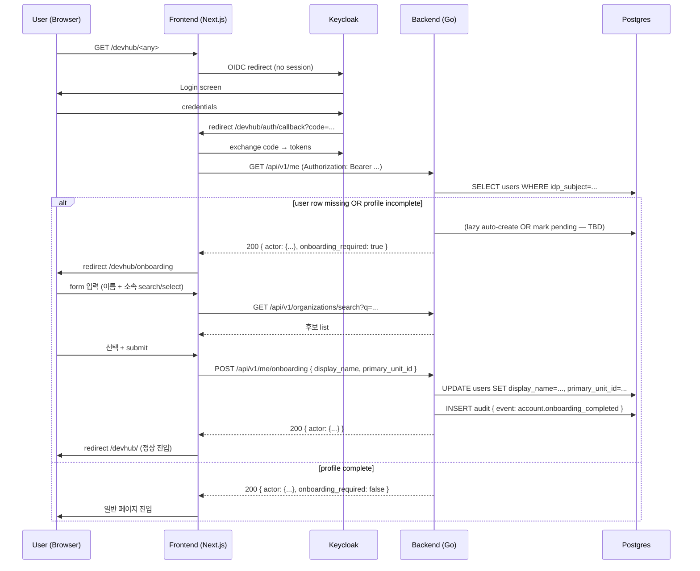

# Keycloak ↔ DevHub 사용자 연동 — 초기 등록 (onboarding) UI 컨셉

- 문서 목적: Keycloak 으로 인증은 했으나 DevHub 시스템 사용자 프로필이 완료되지 않은 사용자에 대해 초기 등록 UI 를 제공하는 기능의 **개발 컨셉**을 정리한다.
- 범위: 컨셉 정의, 현재 상태와의 gap 식별, 흐름 sketch, 결정 후보 옵션 정리, open question 정리. **요구사항 / 설계 / 구현은 본 문서 scope 외** — 후속 phase (requirements / design) 에서 다룬다.
- 대상 독자: 요구사항 분석 / 설계 담당자, backend / frontend 개발자, 운영자, ADR-0020 후속 carve 담당자.
- 상태: draft (concept)
- 최종 수정일: 2026-05-20
- 다음 단계: 요구사항 분석 (`docs/requirements.md` row 추가 또는 별도 requirements 문서)
- 관련 문서:
  - [ADR-0019 Keycloak 단일 IdP](../adr/0019-keycloak-only-idp.md)
  - [ADR-0020 계정/사용자 관리 책임 경계](../adr/0020-account-user-management-boundary.md)
  - [`docs/planning/account_user_management_redesign.md`](./account_user_management_redesign.md) — Phase 1/2 의 매트릭스 + 옵션 A 채택 배경
  - [`docs/reports/2026-05-20-network-docker-single-port-review.md`](../reports/2026-05-20-network-docker-single-port-review.md) — 단일 포트 정합 리뷰

## 1. 컨셉 요약 (1줄)

> Keycloak 인증 통과 + DevHub 사용자 프로필 미완료 사용자가 첫 접근 시, 모든 일반 페이지 진입을 보류하고 **초기 등록 화면** (이름 + 소속) 에 강제 진입시킨 뒤 입력을 완료해야 정상 사용 가능하도록 한다.

## 2. 배경 — 현재 상태 (`main` HEAD `63e0157`)

### 2.1 기존 lazy auto-create 흐름 (ADR-0020 §5.2.2)
`backend-core/internal/httpapi/lazy_auto_create.go:54-115` 의 `authenticateActor` 미들웨어가 Keycloak token 검증 후 `GetUser` miss 시 자동으로 `users` row 를 생성한다.

| 필드 | 현재 lazy create 시 값 | 출처 |
| --- | --- | --- |
| `user_id` | token `preferred_username` | Keycloak |
| `email` | token `email` | Keycloak |
| `display_name` | token `name` (없으면 login fallback) | Keycloak |
| `role` | token `realm_access.roles` 매핑 → fallback `developer` | Keycloak + DevHub default |
| `status` | `active` (상수) | DevHub |
| `type` | `human` (상수) | DevHub |
| `idp_subject` | token `sub` | Keycloak |
| **`primary_unit_id`** | **NULL** | (미배정) |
| **`current_unit_id`** | **NULL** | (미배정) |
| `is_seconded` | `false` (default) | DevHub |
| `joined_at` | `time.Now().UTC()` | DevHub (자동) |

### 2.2 현 상태의 gap
- **소속 (unit) 미배정 상태가 사용자 인지 없이 발생**: 시스템 관점에서 lazy-created user 는 "row 는 존재하지만 소속 NULL" 상태로 무기한 잔존 가능. UI 에서 사용자 list 에 "소속 없음" 으로만 표기.
- **display_name 의 정확성 의존**: Keycloak `name` claim 이 비어있으면 login (user_id) 가 표시명으로 fallback. 사용자가 자신의 표시명을 명시적으로 확인/수정한 적 없음.
- **사용자 능동 등록 경로 부재**: ADR-0020 채택 후 `/api/v1/accounts/*` 관리자 endpoint 가 폐기됐고, frontend 의 admin "Issue Account" UI 도 제거됨. 사용자가 자신의 소속을 등록할 self-service 경로는 현재 없음 — 관리자가 사후에 `admin/settings/users` 에서 unit 만 할당 가능.
- **첫 접근 UX 단절**: 사용자는 Keycloak 로그인 → 대시보드 진입 → 자신의 소속이 "미배정" 인 상태로 사용 시작 → 어느 admin 에게 요청해야 unit 이 배정되는지 알기 어려움. 사용자가 자신의 소속을 알고 있는데도 시스템에 알리는 경로가 없다.

### 2.3 사용자 요구 (본 컨셉)
- 미등록 / 미완료 사용자가 첫 접근 시 **초기 등록 화면으로 redirect** (강제 진입).
- 입력 항목: **이름 (display_name)** + **소속 (primary_unit_id)**.
- 소속 입력 UX: 조직 DB 에 등록된 조직들 중에서 **검색 + 선택** 으로 결정 (자유 입력 아님).
- 등록 완료 후에야 일반 페이지 사용 가능.

## 3. 영향 영역 (high-level)

| 영역 | 영향 | 비고 |
| --- | --- | --- |
| **Backend authenticateActor** | "프로필 완료 여부" 판단 기준 추가 (필드 정합 정책 결정 필요) | lazy auto-create 유지 / 폐기 / 부분 변경 옵션 결정 |
| **Backend onboarding API** | 사용자 self-service profile completion endpoint 신규 (`PATCH /api/v1/me` 또는 `POST /api/v1/me/onboarding`) | ADR-0020 의 책임 경계와 정합 필요 |
| **Backend organizations search API** | 현재 `?q=` 검색 endpoint **없음** — 신규 추가 또는 hierarchy 응답을 frontend 가 클라이언트 측 필터 | 조직 트리 규모에 따라 선택 |
| **Frontend onboarding page** | `/onboarding` (또는 `/welcome`, `/profile/setup`) 신규 페이지 + form | basePath `/devhub/onboarding` 정합 |
| **Frontend gating layout** | 모든 일반 페이지가 actor 의 onboarding 상태 확인 + redirect | dashboard layout / middleware 위치 결정 |
| **Frontend org picker component** | 검색 가능한 조직 selector | 재사용 가능한 형태로 |
| **Audit** | `account.onboarding_completed` (제안 — 실제 이벤트명 미정) audit row | 기존 `account.lazy_provisioned` 와 짝 |
| **ADR / 정책** | ADR-0020 §3.2 (DevHub admin = unit assignment) 의 책임 경계 일부 변경 — self-service unit selection 허용 추가 | ADR-0020 확장 또는 신규 ADR 발급 |
| **traceability** | REQ / ARCH / API / IMPL / UT / TC 신규 ID | requirements phase 에서 발급 |

## 4. 흐름 sketch (high-level)

위 흐름은 sketch — 실제 endpoint 명, 응답 shape, gating 위치 (frontend layout vs backend middleware) 등은 요구사항 phase 에서 결정.

## 5. 핵심 결정 포인트 (요구사항 phase 입력)

본 컨셉 단계에서는 결정을 강제하지 않고, **결정해야 할 질문**과 **현재 보이는 후보 옵션**만 정리한다.

### 5.1 "프로필 미완료" 의 정의
**질문**: 무엇을 기준으로 onboarding 강제 redirect 를 트리거하는가?

| 옵션 | 기준 | 장단점 |
| --- | --- | --- |
| **A. `primary_unit_id IS NULL`** | 소속 미배정만으로 미완료 판단 | ✅ 추가 컬럼 불필요 ✅ 현재 lazy create 와 자연스럽게 정합 ⚠ 향후 unit 이 일시적으로 unset 되는 경우 (조직 개편) 의 false-positive 가능 |
| **B. 신규 컬럼 `onboarding_completed_at TIMESTAMP NULL`** | 명시적 onboarding 완료 마킹 | ✅ 의미 명확 + audit 친화 ✅ 향후 onboarding step 추가 시 확장 용이 ⚠ migration + state 정합 SOP 필요 |
| **C. 신규 컬럼 `profile_status ENUM(incomplete, complete, ...)`** | 상태 머신 | ✅ 다단계 onboarding 확장 가능 ⚠ 현 시점에 과한 모델링 |

옵션 A 는 lazy auto-create 와의 최소 결합, 옵션 B 는 추적성 우월, 옵션 C 는 향후 확장. requirements phase 에서 선택.

### 5.2 Lazy auto-create 와 onboarding 의 관계
**질문**: lazy auto-create 는 유지하는가, 폐기하는가, 부분 변경하는가?

| 옵션 | 동작 | 장단점 |
| --- | --- | --- |
| **A. lazy create 유지 + onboarding 별도 단계** | row 는 자동 생성 (audit 추적용) + onboarding 미완료면 redirect 강제 | ✅ 기존 audit 흐름 유지 ✅ `authenticateActor` 회귀 최소 ⚠ row 는 있는데 소속 NULL 상태가 onboarding 미완료까지 잔존 |
| **B. lazy create 폐기 + onboarding 완료 시점에 user row 첫 생성** | 첫 진입은 token claim 만으로 actor 구성 + UI 진입 차단 + onboarding 완료 시 INSERT | ✅ "row 존재 = 등록 완료" 의미 명확 ⚠ `authenticateActor` 대형 변경 ⚠ token-only actor 의 RBAC 처리 별도 정책 필요 |
| **C. lazy create 유지 + `primary_unit_id` 외 필드 NULL 도 허용 + onboarding 으로 채움** | row 는 minimal 로 생성, display_name 도 사용자가 onboarding 에서 확인 | ✅ 사용자 능동성 확보 ✅ A 의 변형 |

옵션 A 가 가장 작은 변경. ADR-0020 의 lazy provisioned audit + role default assigned 추적성 유지 측면도 옵션 A 우호적.

### 5.3 소속 (unit) 검색 UX
**질문**: 사용자가 organization 트리 중 어떻게 자신의 소속을 찾아 선택하는가?

| 옵션 | UX | 백엔드 |
| --- | --- | --- |
| **A. 검색 박스 + 자동완성 (typeahead)** | 사용자가 "AI" 입력 → "AI/플랫폼팀", "AI 연구소" 등 후보 표시 → 선택 | `GET /api/v1/organizations/search?q=...&limit=20` 신규 endpoint |
| **B. 트리 / 계층 선택기** | 회사 → 본부 → 부서 → 팀 트리 펼침 | 기존 `GET /api/v1/organization/hierarchy` 재사용 |
| **C. A + B 하이브리드** | 검색 + 트리 둘 다 제공 | A + B 둘 다 |

조직 규모 / 사용자 인지 패턴 따라 선택. A 가 가장 빠르고 검색 친화적이나 사용자가 정확한 부서명을 모르면 trial-and-error. B 는 사용자가 본부 위치만 알면 됨. requirements phase 에서 user persona 와 함께 결정.

### 5.4 사용자가 자신의 소속을 잘못 선택할 수 있다는 risk
**질문**: 사용자가 임의로 소속을 선택할 때 데이터 정확성을 어떻게 보장하는가?

| 옵션 | 정책 | 장단점 |
| --- | --- | --- |
| **A. 사용자 입력 그대로 신뢰** | 사용자 자기 진술 | ✅ UX 단순 ⚠ 부정확한 소속 등록 시 RBAC scope leak (sales 가 dev 소속으로 등록되면 dev 권한 접근 가능) |
| **B. status=`pending` → admin review → `active`** | 사용자가 등록 후 admin 이 confirm 해야 정상 활성화 | ✅ 데이터 정확성 ⚠ admin 부담 + 사용자 첫 진입 후 또 대기 |
| **C. HRDB 와 cross-check (자동 검증)** | 사용자 입력 + HRDB 의 직원 ↔ 부서 매핑 비교 + 불일치 시 경고/차단 | ✅ 자동 검증 ⚠ HRDB 의존 ⚠ ADR-0008 deprecated 후 HRDB ETL 폐기 (#215) 사실 정합 필요 |
| **D. Keycloak group → unit 매핑** | 사용자의 Keycloak group membership 으로 자동 유추 + 사용자가 확인만 | ✅ 자동 + 확인 ⚠ group → unit 매핑 정책 결정 + ADR-0019 §5.3 sub-carve 의 group staging-prod (잔여) 와 결합 |

옵션 D 가 가장 매끄러우나 사전 carve 의존. 옵션 A 는 작게 시작하되 추후 옵션 B / D 로 격상 가능.

### 5.5 Onboarding gating 위치
**질문**: 어디서 "onboarding 필요" 를 감지하고 redirect 시키는가?

| 옵션 | 위치 | 장단점 |
| --- | --- | --- |
| **A. Frontend layout middleware** | `app/(dashboard)/layout.tsx` 가 actor 상태 확인 후 redirect | ✅ UX 빠름 (서버 round-trip 1회) ⚠ frontend 가 actor 응답 shape 의존 |
| **B. Backend `/api/v1/me` 응답 + frontend 분기** | backend 가 `{ onboarding_required: true }` flag 반환 + frontend redirect | ✅ 책임 명확 ✅ 다른 client 에도 일관 적용 가능 |
| **C. Backend 모든 endpoint 가 미완료 user 차단** | 403 + `code: onboarding_required` 응답 | ✅ 가장 강한 가드 ⚠ allowlist (onboarding endpoint 자체) 관리 부담 |

A + B 혼합 (B 가 source of truth, A 가 UX) 이 일반적.

### 5.6 onboarding 화면의 추가 입력 항목
**질문**: 이름 + 소속 외에 본 onboarding 에서 받을 정보는?

후보:
- 사용자 사진 / 아바타 (현재 미사용)
- 표시명 (display_name) 와 별개의 닉네임
- 입사일 (joined_at) — 현재 자동 (today) 인데 사용자 입력으로 갱신?
- 전화번호 / Slack ID 등 연락처
- 부서장 / 팀장 확인

기본 컨셉은 **이름 + 소속 만** 으로 minimum viable onboarding 으로 시작. 후속 확장은 별도 sprint.

### 5.7 다국어 / 접근성
- DevHub 기본 언어는 한국어 — onboarding 화면도 한국어 우선.
- 접근성 (a11y): form label, focus order, screen reader, 키보드 검색 (Combobox role).
- requirements phase 에서 wireframe 과 함께 결정.

## 6. 변경/신규 자산 후보 (high-level)

### 6.1 backend-core 신규/변경
- (신규) `internal/httpapi/me_onboarding.go` — `PATCH /api/v1/me` 또는 `POST /api/v1/me/onboarding`
- (신규) `internal/httpapi/organizations_search.go` — `GET /api/v1/organizations/search?q=...&limit=...` (5.3 옵션 A 채택 시)
- (변경) `internal/httpapi/lazy_auto_create.go` — 5.2 결정에 따라 동작 부분 변경 가능
- (변경) `internal/httpapi/router.go` — 신규 endpoint 라우팅
- (변경) `internal/httpapi/permissions.go` — `/api/v1/me/onboarding` 등 신규 endpoint 의 RBAC route permission
- (변경) `internal/domain/domain.go` — audit event 신규 (`account.onboarding_completed` 등)
- (마이그레이션) `backend-core/migrations/0000XX_user_onboarding_completed.up.sql` — 5.1 옵션 B/C 채택 시

### 6.2 frontend 신규/변경
- (신규) `frontend/app/onboarding/page.tsx` — 초기 등록 화면 (basePath 정합)
- (신규) `frontend/components/onboarding/OnboardingForm.tsx`
- (신규) `frontend/components/organization/OrganizationPicker.tsx` (또는 OrganizationCombobox)
- (신규) `frontend/lib/services/onboarding.service.ts`
- (변경) `frontend/app/(dashboard)/layout.tsx` — actor 의 onboarding 상태 확인 + redirect
- (변경) `frontend/lib/services/identity.service.ts` — `getMe()` 응답 shape 에 `onboarding_required` 추가
- (변경) i18n 자산 (있으면)

### 6.3 docs / governance
- (신규) `docs/requirements.md` — onboarding 관련 REQ row 신규
- (변경) ADR-0020 확장 또는 신규 ADR (self-service unit selection 허용 결정)
- (변경) `docs/backend_api_contract.md` — 신규 API row
- (변경) `docs/traceability/report.md` — REQ/ARCH/API/IMPL/UT/TC 신규 row
- (변경) `docs/architecture.md` — onboarding gating sequence diagram (선택)

## 7. ADR / 정책 영향 분석

### 7.1 ADR-0019 (Keycloak 단일 IdP)
- 인증 / 토큰 발급은 Keycloak 유지 — 본 컨셉의 변경 없음.
- 단, **5.4 옵션 D (Keycloak group → unit 매핑)** 채택 시 ADR-0019 §5.3 sub-carve 의 group staging-prod 잔여 carve 와 결합 필요.

### 7.2 ADR-0020 (계정/사용자 관리 책임 경계)
- §3.2 책임 분리 표의 "**DevHub admin = unit assignment**" 항목이 본 컨셉으로 일부 변경: **사용자 self-service unit selection** 도 허용된다.
- 옵션:
  - (a) ADR-0020 §3.2 표를 확장 (사용자 self-service 추가) + §5.2.2 의 `primary_unit_id=NULL` 정책 보완.
  - (b) 신규 ADR 발급 (예: ADR-0021 "사용자 self-service onboarding") + ADR-0020 cross-link.
- 본 컨셉은 ADR-0020 의 핵심 결정 (계정은 Keycloak, 사용자는 DevHub) 를 reverse 하지 않으므로 **ADR-0020 §3.2 확장** 으로 충분할 가능성 높음. requirements phase 에서 결정.

### 7.3 ADR-0018 (단일 외부 포트 reverse proxy)
- onboarding 페이지는 `/devhub/onboarding` 으로 same-origin 진입 — 본 컨셉의 변경 없음.

### 7.4 단일 포트 정합 (2026-05-20 리뷰)
- onboarding 흐름에서 다른 host:port 로의 redirect 발생 금지 — same-origin 내부 path-relative redirect 만 허용.
- backend `c.Redirect` / `Location:` 헤더 직접 작성 = 0 hit 가드 유지.

## 8. Open question (요구사항 phase 입력)

1. **5.1 의 "프로필 미완료" 정의**: 옵션 A (NULL check) vs B (`onboarding_completed_at` 컬럼) vs C (state machine) — requirements 에서 명시.
2. **5.2 lazy auto-create 유지 / 폐기**: 옵션 A (유지) vs B (폐기) vs C (부분 변경).
3. **5.3 소속 검색 UX**: typeahead vs tree picker vs hybrid.
4. **5.4 데이터 정확성 보장**: 사용자 신뢰 vs admin review vs HRDB cross-check vs Keycloak group 매핑.
5. **5.5 onboarding gating 위치**: frontend layout vs backend response flag vs backend endpoint guard.
6. **5.6 입력 항목 확장 범위**: minimum (name + unit) vs extended (photo, phone, etc.).
7. **사용자가 onboarding 중간에 빠져나갈 수 있는가?** (force completion vs skip-and-resume vs admin escalation)
8. **organization picker 의 권한 가드**: 어떤 사용자가 어떤 unit 까지 선택 가능한가? (모든 unit 노출 vs HRDB filter vs Keycloak group filter)
9. **onboarding 완료 후 사용자가 자신의 소속을 추후 수정할 수 있는가?** 가능하다면 어디서? (`/account` 페이지에서 self-service vs admin-only)
10. **국제 사용자 (i18n)**: 한국어 외 언어 우선순위 / 이름 표기 (한글 / 영문 / 양쪽).
11. **모바일 반응형 + 접근성** 의 minimum 기준.
12. **테스트 데이터 / 시드**: dev 환경에서 onboarding 화면 검증용 시드 사용자 (smoke 용 `test` 계정 정합 정책).

## 9. 다음 단계 (next phase)

1. **요구사항 분석** (`docs/requirements.md` 확장 또는 `docs/planning/keycloak_user_onboarding_requirements.md` 신규)
   - 본 컨셉의 §5 결정 포인트 + §8 open question 에 대한 명시 결정.
   - REQ row 발급 (예: REQ-ONBOARD-01 ~ REQ-ONBOARD-N).
   - acceptance criteria + edge case 정리.
2. **설계** (architecture + API 계약 + UX wireframe)
3. **ADR 발행** (필요 시) — ADR-0020 확장 또는 신규 ADR.
4. **구현 carve 분할** — backend / frontend / docs 별 sprint 단위.
5. **traceability 매트릭스 row** — IMPL / UT / TC 까지 자동 발급.

본 컨셉 문서는 위 1번 (요구사항 분석) 의 직접 입력 자료로 사용한다.

## 10. 변경 이력

- **2026-05-20** (`main` HEAD `63e0157`): 초기 컨셉 작성. lazy auto-create 의 현 상태 + 사용자 요구의 gap + 결정 후보 옵션 정리.
