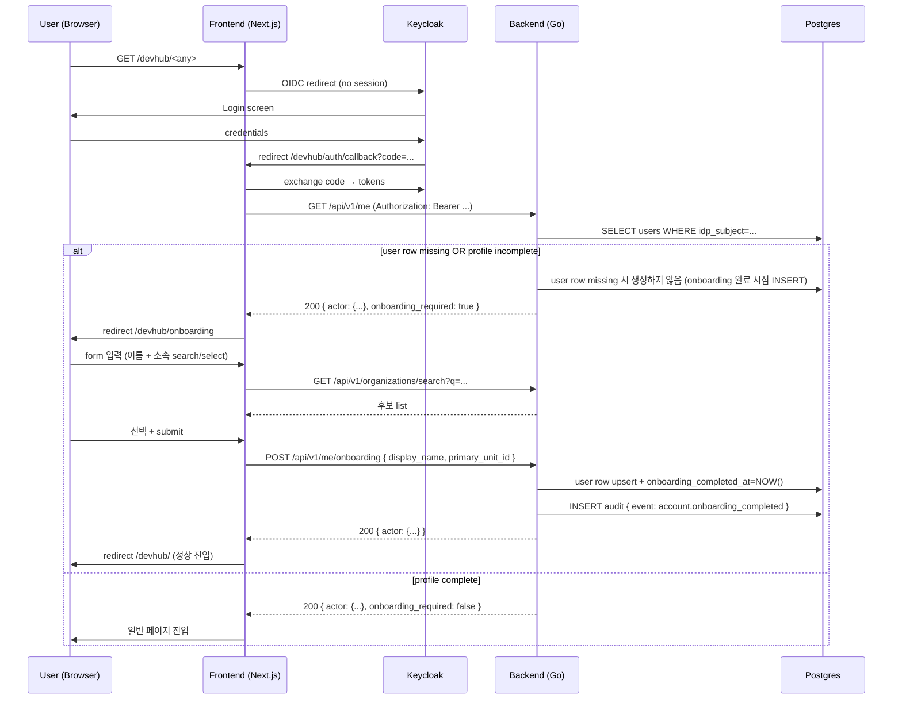

# Keycloak ↔ DevHub 사용자 연동 — 초기 등록 (onboarding) UI 컨셉

- 문서 목적: Keycloak 으로 인증은 했으나 DevHub 시스템 사용자 프로필이 완료되지 않은 사용자에 대해 초기 등록 UI 를 제공하는 기능의 **개발 컨셉**을 정리한다.
- 범위: 컨셉 정의, 현재 상태와의 gap 식별, 흐름 sketch, 결정 후보 옵션 정리, open question 정리. **요구사항 / 설계 / 구현은 본 문서 scope 외** — 후속 phase (requirements / design) 에서 다룬다.
- 대상 독자: 요구사항 분석 / 설계 담당자, backend / frontend 개발자, 운영자, ADR-0020 후속 carve 담당자.
- 상태: draft (concept)
- 최종 수정일: 2026-05-21
- 다음 단계: 요구사항 분석 (`docs/requirements.md` row 추가 또는 별도 requirements 문서)
- 관련 문서:
  - [ADR-0019 Keycloak 단일 IdP](../adr/0019-keycloak-only-idp.md)
  - [ADR-0020 계정/사용자 관리 책임 경계](../adr/0020-account-user-management-boundary.md)
  - [`docs/planning/account_user_management_redesign.md`](./account_user_management_redesign.md) — Phase 1/2 의 매트릭스 + 옵션 A 채택 배경
  - [`docs/reports/2026-05-20-network-docker-single-port-review.md`](../reports/2026-05-20-network-docker-single-port-review.md) — 단일 포트 정합 리뷰

## 1. 컨셉 요약 (1줄)

> Keycloak 인증 통과 + DevHub 사용자 프로필 미완료 사용자가 첫 접근 시, 모든 일반 페이지 진입을 보류하고 **초기 등록 화면** (이름 + 소속) 에 강제 진입시킨 뒤 입력을 완료해야 정상 사용 가능하도록 한다.

## 2. 배경 — 현재 상태 (`main` HEAD `63e0157`)

### 2.1 기존 lazy auto-create 흐름 (ADR-0020 §5.2.2)
`backend-core/internal/httpapi/lazy_auto_create.go:54-115` 의 `authenticateActor` 미들웨어가 Keycloak token 검증 후 `GetUser` miss 시 자동으로 `users` row 를 생성한다.

| 필드 | 현재 lazy create 시 값 | 출처 |
| --- | --- | --- |
| `user_id` | token `preferred_username` | Keycloak |
| `email` | token `email` | Keycloak |
| `display_name` | token `name` (없으면 login fallback) | Keycloak |
| `role` | token `realm_access.roles` 매핑 → fallback `developer` | Keycloak + DevHub default |
| `status` | `active` (상수) | DevHub |
| `type` | `human` (상수) | DevHub |
| `idp_subject` | token `sub` | Keycloak |
| **`primary_unit_id`** | **NULL** | (미배정) |
| **`current_unit_id`** | **NULL** | (미배정) |
| `is_seconded` | `false` (default) | DevHub |
| `joined_at` | `time.Now().UTC()` | DevHub (자동) |

### 2.2 현 상태의 gap
- **소속 (unit) 미배정 상태가 사용자 인지 없이 발생**: 시스템 관점에서 lazy-created user 는 "row 는 존재하지만 소속 NULL" 상태로 무기한 잔존 가능. UI 에서 사용자 list 에 "소속 없음" 으로만 표기.
- **display_name 의 정확성 의존**: Keycloak `name` claim 이 비어있으면 login (user_id) 가 표시명으로 fallback. 사용자가 자신의 표시명을 명시적으로 확인/수정한 적 없음.
- **사용자 능동 등록 경로 부재**: ADR-0020 채택 후 `/api/v1/accounts/*` 관리자 endpoint 가 폐기됐고, frontend 의 admin "Issue Account" UI 도 제거됨. 사용자가 자신의 소속을 등록할 self-service 경로는 현재 없음 — 관리자가 사후에 `admin/settings/users` 에서 unit 만 할당 가능.
- **첫 접근 UX 단절**: 사용자는 Keycloak 로그인 → 대시보드 진입 → 자신의 소속이 "미배정" 인 상태로 사용 시작 → 어느 admin 에게 요청해야 unit 이 배정되는지 알기 어려움. 사용자가 자신의 소속을 알고 있는데도 시스템에 알리는 경로가 없다.

### 2.3 사용자 요구 (본 컨셉)
- 미등록 / 미완료 사용자가 첫 접근 시 **초기 등록 화면으로 redirect** (강제 진입).
- 입력 항목: **이름 (display_name)** + **소속 (primary_unit_id)**.
- 소속 입력 UX: 조직 DB 에 등록된 조직들 중에서 **검색 + 선택** 으로 결정 (자유 입력 아님).
- 등록 완료 후에야 일반 페이지 사용 가능.

## 3. 영향 영역 (high-level)

| 영역 | 영향 | 비고 |
| --- | --- | --- |
| **Backend authenticateActor** | "프로필 완료 여부" 판단 기준 추가 + 미등록 사용자의 token-only actor 처리 | lazy auto-create 폐기(온보딩 완료 시 DB 등록) |
| **Backend onboarding API** | 사용자 self-service profile completion endpoint 신규 (`PATCH /api/v1/me` 또는 `POST /api/v1/me/onboarding`) | ADR-0020 의 책임 경계와 정합 필요 |
| **Backend admin registration API** | 관리자가 시스템 설정에서 사용자 등록/초기화 가능한 admin endpoint 추가 | self-service 와 병행 |
| **Backend review workflow** | onboarding 완료 후 관리자 검토/수정 상태(`pending_review`/`reviewed`) 관리 | 검토 전 무소속 제한 접근 정책 필요 |
| **Backend organizations search API** | `GET /api/v1/organizations/search?q=...&limit=20` 신규 endpoint **필수** (§5.3 옵션 C 하이브리드 채택) | 트리 endpoint 도 재사용 |
| **Frontend onboarding page** | `/onboarding` (또는 `/welcome`, `/profile/setup`) 신규 페이지 + form + "나중에 하기" 액션 | basePath `/devhub/onboarding` 정합 |
| **Frontend gating layout** | 모든 일반 페이지가 actor 의 onboarding 상태 확인 + redirect or banner | dashboard layout / middleware 위치 결정. skip 상태는 dismissible banner, 보호된 진입 시도는 강제 redirect (§5.9) |
| **Frontend limited-access UX** | 미완료 사용자의 제한 메뉴/화면 구성 — 2단계 (§5.9): **skip 상태** (DB row 없음, 공통 메뉴만) / **pending_review** (할당 리소스 + 공통 메뉴) | 두 단계 공용 컴포넌트 권장 |
| **Frontend org picker component** | 검색 가능한 조직 selector | 재사용 가능한 형태로 |
| **Audit** | `account.onboarding_completed` (제안 — 실제 이벤트명 미정) audit row | 기존 `account.lazy_provisioned` 와 짝 |
| **ADR / 정책** | ADR-0020 §3.2 (DevHub admin = unit assignment) 의 책임 경계 일부 변경 — self-service unit selection 허용 추가 | ADR-0020 확장 또는 신규 ADR 발급 |
| **traceability** | REQ / ARCH / API / IMPL / UT / TC 신규 ID | requirements phase 에서 발급 |

## 4. 흐름 sketch (high-level)

위 흐름은 sketch — 실제 endpoint 명, 응답 shape, gating 위치 (frontend layout vs backend middleware) 등은 요구사항 phase 에서 결정.

## 5. 핵심 결정 포인트 (요구사항 phase 입력)

본 컨셉 단계에서는 결정을 강제하지 않고, **결정해야 할 질문**과 **현재 보이는 후보 옵션**만 정리한다.

### 5.1 "프로필 미완료" 의 정의
**질문**: 무엇을 기준으로 onboarding 강제 redirect 를 트리거하는가?

| 옵션 | 기준 | 장단점 |
| --- | --- | --- |
| **A. `primary_unit_id IS NULL`** | 소속 미배정만으로 미완료 판단 | ✅ 추가 컬럼 불필요 ✅ 현재 lazy create 와 자연스럽게 정합 ⚠ 향후 unit 이 일시적으로 unset 되는 경우 (조직 개편) 의 false-positive 가능 |
| **B. 신규 컬럼 `onboarding_completed_at TIMESTAMP NULL`** | 명시적 onboarding 완료 마킹 | ✅ 의미 명확 + audit 친화 ✅ 향후 onboarding step 추가 시 확장 용이 ⚠ migration + state 정합 SOP 필요 |
| **C. 신규 컬럼 `profile_status ENUM(incomplete, complete, ...)`** | 상태 머신 | ✅ 다단계 onboarding 확장 가능 ⚠ 현 시점에 과한 모델링 |

옵션 A 는 lazy auto-create 와의 최소 결합, 옵션 B 는 추적성 우월, 옵션 C 는 향후 확장.
**결정(2026-05-20): 옵션 B 채택** — onboarding 완료 기준은 `onboarding_completed_at IS NOT NULL` 로 정의한다.
- 적용 범위:
  - `DB 미등록 사용자`: 첫 로그인 시 user row 미생성 상태로 온보딩 강제, onboarding 제출 시 user row 생성 + 완료 처리.
  - `DB 등록-미완료 사용자`: `onboarding_completed_at=NULL` 이면 온보딩 강제.

### 5.2 Lazy auto-create 와 onboarding 의 관계
**질문**: lazy auto-create 는 유지하는가, 폐기하는가, 부분 변경하는가?

| 옵션 | 동작 | 장단점 |
| --- | --- | --- |
| **A. lazy create 유지 + onboarding 별도 단계** | row 는 자동 생성 (audit 추적용) + onboarding 미완료면 redirect 강제 | ✅ 기존 audit 흐름 유지 ✅ `authenticateActor` 회귀 최소 ⚠ row 는 있는데 소속 NULL 상태가 onboarding 미완료까지 잔존 |
| **B. lazy create 폐기 + onboarding 완료 시점에 user row 첫 생성** | 첫 진입은 token claim 만으로 actor 구성 + UI 진입 차단 + onboarding 완료 시 INSERT | ✅ "row 존재 = 등록 완료" 의미 명확 ⚠ `authenticateActor` 대형 변경 ⚠ token-only actor 의 RBAC 처리 별도 정책 필요 |
| **C. lazy create 유지 + `primary_unit_id` 외 필드 NULL 도 허용 + onboarding 으로 채움** | row 는 minimal 로 생성, display_name 도 사용자가 onboarding 에서 확인 | ✅ 사용자 능동성 확보 ✅ A 의 변형 |

옵션 A 가 가장 작은 변경. ADR-0020 의 lazy provisioned audit + role default assigned 추적성 유지 측면도 옵션 A 우호적.
**결정(2026-05-20): 옵션 B 채택** — lazy auto-create 를 폐기하고, 사용자 DB 등록은 onboarding 완료 시점에 수행한다.

### 5.3 소속 (unit) 검색 UX
**질문**: 사용자가 organization 트리 중 어떻게 자신의 소속을 찾아 선택하는가?

| 옵션 | UX | 백엔드 |
| --- | --- | --- |
| **A. 검색 박스 + 자동완성 (typeahead)** | 사용자가 "AI" 입력 → "AI/플랫폼팀", "AI 연구소" 등 후보 표시 → 선택 | `GET /api/v1/organizations/search?q=...&limit=20` 신규 endpoint |
| **B. 트리 / 계층 선택기** | 회사 → 본부 → 부서 → 팀 트리 펼침 | 기존 `GET /api/v1/organization/hierarchy` 재사용 |
| **C. A + B 하이브리드** | 검색 + 트리 둘 다 제공 | A + B 둘 다 |

조직 규모 / 사용자 인지 패턴 따라 선택. A 가 가장 빠르고 검색 친화적이나 사용자가 정확한 부서명을 모르면 trial-and-error. B 는 사용자가 본부 위치만 알면 됨. requirements phase 에서 user persona 와 함께 결정.
**결정(2026-05-20): 옵션 C(하이브리드) 채택** — 검색(typeahead) + 트리 선택기를 함께 제공한다.
- 세부 기준:
  - 검색은 최소 2글자 입력 시 동작.
  - 검색 결과는 최대 20개 반환.
  - 검색 결과 표시 포맷은 조직명만 사용.

### 5.4 사용자가 자신의 소속을 잘못 선택할 수 있다는 risk
**질문**: 사용자가 임의로 소속을 선택할 때 데이터 정확성을 어떻게 보장하는가?

| 옵션 | 정책 | 장단점 |
| --- | --- | --- |
| **A. 사용자 입력 그대로 신뢰** | 사용자 자기 진술 | ✅ UX 단순 ⚠ 부정확한 소속 등록으로 조직 데이터 품질 저하/관리 비용 증가 |
| **B. status=`pending` → admin review → `active`** | 사용자가 등록 후 admin 이 confirm 해야 정상 활성화 | ✅ 데이터 정확성 ⚠ admin 부담 + 사용자 첫 진입 후 또 대기 |
| **C. HRDB 와 cross-check (자동 검증)** | 사용자 입력 + HRDB 의 직원 ↔ 부서 매핑 비교 + 불일치 시 경고/차단 | ✅ 자동 검증 ⚠ HRDB 의존 ⚠ ADR-0008 deprecated 후 HRDB ETL 폐기 (#215) 사실 정합 필요 |
| **D. Keycloak group → unit 매핑** | 사용자의 Keycloak group membership 으로 자동 유추 + 사용자가 확인만 | ✅ 자동 + 확인 ⚠ group → unit 매핑 정책 결정 + ADR-0019 §5.3 sub-carve 의 group staging-prod (잔여) 와 결합 |

옵션 D 가 가장 매끄러우나 사전 carve 의존. 옵션 A 는 작게 시작하되 추후 옵션 B / D 로 격상 가능.
**결정(2026-05-20): 옵션 B 변형 채택** — onboarding 은 사용자 제출 시 완료 처리하되, 이후 관리자 검토/수정 단계를 별도로 둔다.
- 정책:
  - 사용자 onboarding 제출 시 `onboarding_completed_at` 은 설정한다.
  - 동시에 사용자 소속 검토 상태를 `pending_review` 로 두고, 관리자 검토 후 `reviewed` 로 확정한다(필드명/모델은 requirements 단계 확정).
  - 검토 미완료(`pending_review`) 사용자는 시스템에서 **무소속**으로 취급한다.
  - 검토 미완료 사용자의 접근 범위는 `할당된 과제`, `할당된 저장소`, `할당된 어플리케이션`, `공통 메뉴`로 제한한다.

### 5.8 권한(Role) 정책 — 확정
- **온보딩 화면에서는 권한(role)을 입력/선택하지 않는다.**
- 권한은 온보딩과 분리된 정책으로만 결정한다:
  - Keycloak token claim (`realm_access.roles`) 매핑 결과를 사용하거나,
  - 매핑 불가 시 시스템 기본 권한(`developer`)을 일괄 적용한다.
- 즉, onboarding payload 는 `display_name`, `primary_unit_id` 범위로 제한하고, role 변경 API 는 본 scope 에 포함하지 않는다.
- 이 정책으로 "소속 선택 = 권한 상승" 경로를 차단한다.

### 5.9 Onboarding 중도 이탈 (skip-and-resume) 정책
**질문**: 사용자가 onboarding 화면에서 빠져나갈 수 있는가? skip 시 어떻게 처리되는가?

| 옵션 | 동작 | 장단점 |
| --- | --- | --- |
| **A. Force completion** | 완료 전까지 모든 진입 차단 (로그아웃은 가능) | ✅ 단순 + 데이터 무결성 ⚠ UX 압박 + 사용자 포기 위험 |
| **B. Skip-and-resume** | "나중에 하기" 허용 + 한정 접근 모드 진입 | ✅ UX 유연 ⚠ 한정 접근 모드 정의 필요 |
| **C. Admin escalation 단독** | 사용자가 관리자에게 문의 경로만 제공 | ✅ 안전망 ⚠ 중도이탈 자체는 미허용 |

**결정(2026-05-21): 옵션 B (skip-and-resume) 채택**.

- 정책:
  - onboarding 화면에 **"나중에 하기"** 액션을 제공한다. 사용자는 1회 액션으로 onboarding 을 일시 보류할 수 있다.
  - skip 시 사용자는 **한정 접근 모드 (limited mode)** 로 진입한다. user row 는 생성하지 않는다 (§5.2 옵션 B "row 존재 = 완료" 의미 보존).
  - 한정 접근 모드는 **token-only actor** 로 동작한다 — backend `authenticateActor` 는 token claim 만으로 actor 구성 + DB row miss 를 정상 상태로 취급한다.
- 한정 접근 모드 허용 범위:
  - 공통 메뉴 (메인 페이지, 도움말 등 정적/공개 페이지).
  - `/devhub/onboarding` 페이지 자체 (재진입 + 제출).
  - `GET /api/v1/me` (응답 = `{ actor: { ...token... }, onboarding_required: true }`).
- 한정 접근 모드 차단 범위:
  - 모든 도메인 API → `403 Forbidden`, body `{ "code": "onboarding_required", ... }` (§5.5 allowlist 정책 재사용).
  - 할당 리소스 페이지/위젯 → API 가 403 반환하므로 자연 차단. UI 는 "프로필을 먼저 완료해 주세요" 빈 상태 노출.
  - `/account` 페이지 (§8 #9) — onboarding 완료 후 사용자의 self-service 소속 변경 경로이므로, skip 모드 (DB row 미존재) 사용자는 접근하지 않는다. skip 사용자가 프로필을 처음 입력하려면 `/devhub/onboarding` 으로 진입.
- 횟수/시간 제한 없음:
  - skip 자체에 횟수/시간 제한을 두지 않는다. 매 로그인 시 onboarding 화면이 다시 강제 표시되므로 사실상의 reminder 가 작동한다.
  - 일반 페이지 접근 시도 시 403 응답 자체가 완료 동기를 제공한다.
- Audit 정책:
  - skip 자체는 audit event 를 발생시키지 않는다 (state 변경 없음, row 미생성).
  - 완료 시점의 `account.onboarding_completed` event 만 audit 한다 (기존 결정 유지).
- Frontend UX:
  - "나중에 하기" 클릭 → `/devhub/` (대시보드) 로 redirect.
  - 후속 일반 페이지 진입 시 `getMe()` 가 `onboarding_required: true` 반환 → 모든 페이지 상단에 **dismissible banner** ("프로필을 완료해 주세요" + onboarding 페이지 링크) 노출.
  - 보호된 페이지/리소스 진입 시도가 backend 403 을 받으면 frontend 는 즉시 `/devhub/onboarding` 으로 hard redirect.
- §5.4 (검토 단계) 정책과의 관계:
  - skip 상태 (DB row 없음) → onboarding 완료 시 row 생성 + `pending_review` 진입 → 관리자 검토 후 `reviewed`.
  - skip 상태는 `pending_review` 보다 더 좁은 접근 (할당 리소스 query 도 불가 — row 자체 없음).
  - 즉 미완료 사용자 접근 단계는 **3단계** 가 된다: `limited (skip)` < `pending_review` < `reviewed`.
- §5.5 (gating) 정책과의 관계:
  - Backend allowlist 동일 — onboarding 제출 API + 공통 메뉴/정적 API + `/api/v1/me`.
  - skip 한 사용자도 `onboarding_required: true` 가 동일하게 응답되므로 §5.5 분기 로직 재사용 가능.

### 5.5 Onboarding gating 위치
**질문**: 어디서 "onboarding 필요" 를 감지하고 redirect 시키는가?

| 옵션 | 위치 | 장단점 |
| --- | --- | --- |
| **A. Frontend layout middleware** | `app/(dashboard)/layout.tsx` 가 actor 상태 확인 후 redirect | ✅ UX 빠름 (서버 round-trip 1회) ⚠ frontend 단독으로는 API 직접 호출 우회 방지 불가 |
| **B. Backend `/api/v1/me` 응답 + frontend 분기** | backend 가 `{ onboarding_required: true }` flag 반환 + frontend redirect | ✅ 책임 명확 ✅ 다른 client 에도 일관 적용 가능 |
| **C. Backend 모든 endpoint 가 미완료 user 차단** | 403 + `code: onboarding_required` 응답 | ✅ 가장 강한 가드 ⚠ allowlist (onboarding endpoint 자체) 관리 부담 |

**결정(2026-05-20): 옵션 B + C + A 조합 채택**  
- Source of truth 는 Backend: 미완료 사용자는 allowlist API 외 모두 차단 (`403`, `code=onboarding_required`).
- Frontend 는 UX 레이어 — `/api/v1/me` 의 `onboarding_required` 가 `true` 일 때 frontend 동작은 3분기 (§5.9 정합):
  - **첫 진입** (skip 액션 미실행): `/devhub/onboarding` 으로 즉시 redirect.
  - **skip 액션 이후** (session-scoped skip flag set): `/devhub/onboarding` 자동 redirect 없음 + 모든 페이지 상단에 dismissible banner 노출.
  - **보호 리소스 진입 시도** (backend 가 403/`onboarding_required` 반환): skip 여부 무관 hard redirect.

### 5.6 onboarding 화면의 추가 입력 항목
**질문**: 이름 + 소속 외에 본 onboarding 에서 받을 정보는?

후보:
- 사용자 사진 / 아바타 (현재 미사용)
- 표시명 (display_name) 와 별개의 닉네임
- 입사일 (joined_at) — 현재 자동 (today) 인데 사용자 입력으로 갱신?
- 전화번호 / Slack ID 등 연락처
- 부서장 / 팀장 확인

**결정(2026-05-20)**: onboarding 입력 항목은 **필수 항목만** 사용한다.
- 필수: `display_name`, `primary_unit_id`
- 제외: 사진/아바타, 닉네임, 입사일, 연락처, 기타 부가 정보

### 5.7 다국어 / 접근성
- DevHub 기본 언어는 한국어 — onboarding 화면도 한국어 우선.
- 접근성 (a11y): form label, focus order, screen reader, 키보드 검색 (Combobox role).
**결정(2026-05-20, i18n)**:
- UI 언어는 한국어 고정(영문 UI는 본 범위 제외).
- 이름 표기는 단일 `display_name` 필드 자유 입력(한글/영문/혼용 허용)으로 처리하고 별도 영문명 필드는 두지 않는다.
- 확장성: 추후 옵션으로 영문 프로필 필드(예: `display_name_en`)를 추가할 수 있도록 API/DB/프론트 모델은 nullable 확장에 호환되는 구조로 설계한다.
- requirements phase 에서 wireframe 과 함께 세부 문구만 확정.

## 6. 변경/신규 자산 후보 (high-level)

### 6.1 backend-core 신규/변경
- (신규) `internal/httpapi/me_onboarding.go` — `PATCH /api/v1/me` 또는 `POST /api/v1/me/onboarding`
- (신규) `internal/httpapi/admin_users_registration.go` — 관리자 수동 등록/초기화 endpoint (경로 TBD)
- (신규) `internal/httpapi/organizations_search.go` — `GET /api/v1/organizations/search?q=...&limit=20` (§5.3 옵션 C 하이브리드 채택 — search + tree 양쪽 다 제공, search 는 본 endpoint, tree 는 기존 `/organization/hierarchy` 재사용)
- (폐기) `internal/httpapi/lazy_auto_create.go` — §5.2 옵션 B 채택으로 lazy auto-create 자체 폐기. `authenticateActor` 는 DB row miss 를 정상 상태로 취급 (token-only actor, §5.9 한정 접근 모드 지원)
- (변경) `internal/httpapi/router.go` — 신규 endpoint 라우팅
- (변경) `internal/httpapi/permissions.go` — `/api/v1/me/onboarding` 등 신규 endpoint 의 RBAC route permission
- (변경) `internal/domain/domain.go` — audit event 신규 (`account.onboarding_completed` 등)
- (마이그레이션) `backend-core/migrations/0000XX_user_onboarding_completed.up.sql` — §5.1 옵션 B 채택, 필수 (`onboarding_completed_at TIMESTAMP NULL` 컬럼 신규)

### 6.2 frontend 신규/변경
- (신규) `frontend/app/onboarding/page.tsx` — 초기 등록 화면 (basePath 정합)
- (신규) `frontend/components/onboarding/OnboardingForm.tsx`
- (신규) `frontend/components/organization/OrganizationPicker.tsx` (또는 OrganizationCombobox)
- (신규) `frontend/lib/services/onboarding.service.ts`
- (변경) `frontend/app/(dashboard)/layout.tsx` — actor 의 onboarding 상태 확인 + redirect
- (변경) `frontend/lib/services/identity.service.ts` — `getMe()` 응답 shape 에 `onboarding_required` 추가
- (변경) i18n 자산 (있으면)

### 6.3 docs / governance
- (신규) `docs/requirements.md` — onboarding 관련 REQ row 신규
- (변경) ADR-0020 확장 또는 신규 ADR (self-service unit selection 허용 결정)
- (변경) `docs/backend_api_contract.md` — 신규 API row
- (변경) `docs/traceability/report.md` — REQ/ARCH/API/IMPL/UT/TC 신규 row
- (변경) `docs/architecture.md` — onboarding gating sequence diagram (선택)

## 7. ADR / 정책 영향 분석

### 7.1 ADR-0019 (Keycloak 단일 IdP)
- 인증 / 토큰 발급은 Keycloak 유지 — 본 컨셉의 변경 없음.
- 단, **5.4 옵션 D (Keycloak group → unit 매핑)** 채택 시 ADR-0019 §5.3 sub-carve 의 group staging-prod 잔여 carve 와 결합 필요.

### 7.2 ADR-0020 (계정/사용자 관리 책임 경계)
- §3.2 책임 분리 표의 "**DevHub admin = unit assignment**" 항목이 본 컨셉으로 일부 변경: **사용자 self-service unit selection** 도 허용된다.
- 옵션:
  - (a) ADR-0020 §3.2 표를 확장 (사용자 self-service 추가) + §5.2.2 의 `primary_unit_id=NULL` 정책 보완.
  - (b) 신규 ADR 발급 (예: ADR-0021 "사용자 self-service onboarding") + ADR-0020 cross-link.
- 본 컨셉은 ADR-0020 의 핵심 결정 (계정은 Keycloak, 사용자는 DevHub) 를 reverse 하지 않으므로 **ADR-0020 §3.2 확장** 으로 충분할 가능성 높음. requirements phase 에서 결정.

### 7.3 ADR-0018 (단일 외부 포트 reverse proxy)
- onboarding 페이지는 `/devhub/onboarding` 으로 same-origin 진입 — 본 컨셉의 변경 없음.

### 7.4 단일 포트 정합 (2026-05-20 리뷰)
- onboarding 흐름에서 다른 host:port 로의 redirect 발생 금지 — same-origin 내부 path-relative redirect 만 허용.
- backend `c.Redirect` / `Location:` 헤더 직접 작성 = 0 hit 가드 유지.

## 8. Open question (요구사항 phase 입력)

1. **5.2 lazy auto-create 정책**
   - **결정(2026-05-20)**: lazy auto-create 폐기.
   - `DB 미등록` + `DB 등록-미완료` 사용자 모두 온보딩 강제 대상.
   - 사용자 DB 등록은 onboarding 완료 제출 시점에 수행.
2. **관리자 수동 등록 범위**: 시스템 설정에서 생성 가능한 필드 범위(이름/소속/상태).
   - **결정(2026-05-20)**: 관리자 등록 시 기본 프로필 정보는 입력 가능하되 `onboarding_completed_at` 은 설정하지 않는다.
   - 사용자가 첫 로그인 후 onboarding 화면에서 정보를 1회 확인/수정하고 제출해야 완료 처리된다.
3. **5.3 소속 검색 UX**
   - **결정(2026-05-20)**: 하이브리드(typeahead + tree picker) 채택.
   - 검색 최소 입력 2글자, 결과 최대 20개, 결과 표시는 조직명만 사용.
4. **5.4 데이터 정확성 보장**
   - **결정(2026-05-20)**: 사용자 onboarding 제출은 완료 처리하되 관리자 검토/수정 단계를 별도 운영.
   - 검토 미완료 사용자는 무소속 취급 + 할당된 과제/저장소/어플리케이션 + 공통 메뉴만 접근 허용.
5. **5.5 onboarding gating 위치**
   - **결정(2026-05-20)**: Backend 강제 + Frontend UX 보조.
   - Backend 는 미완료 사용자에 대해 allowlist API 외 전부 `403(code=onboarding_required)` 차단.
   - Frontend 는 `/api/v1/me` 의 `onboarding_required` 플래그로 `/devhub/onboarding` 즉시 redirect.
6. **5.6 입력 항목 범위**
   - **결정(2026-05-20)**: 필수 항목만 사용(`display_name`, `primary_unit_id`).
   - 사진/아바타/닉네임/입사일/연락처 등 부가 항목은 본 범위에서 제외.
7. **사용자가 onboarding 중간에 빠져나갈 수 있는가?**
   - **결정(2026-05-21)**: skip-and-resume 채택 (§5.9 참조).
   - "나중에 하기" 액션 허용 + 한정 접근 모드 (공통 메뉴 + onboarding 자체 + `GET /api/v1/me` 만 접근).
   - skip 시 user row 미생성 (§5.2 옵션 B 정합) — token-only actor 로 동작.
   - 재로그인 시 다시 onboarding 화면 강제 진입 (사실상의 reminder, 별도 횟수/시간 제한 없음).
   - 일반 페이지 진입 시 dismissible banner + 보호 리소스 접근 시도는 backend 403 → frontend hard redirect.
8. **organization picker 의 권한 가드**
   - **결정(2026-05-20)**: 모든 사용자에게 모든 organization 후보를 노출한다.
9. **onboarding 완료 후 소속 수정 정책**
   - **결정(2026-05-20)**: `/account` 페이지에서 사용자 self-service 수정 허용.
   - 사용자가 소속을 변경하면 검토 상태를 `pending_review` 로 되돌리고, 관리자 검토/수정 후 `reviewed` 로 확정.
   - `pending_review` 기간에는 기존 정책대로 무소속 제한 접근(할당 리소스 + 공통 메뉴) 적용.
10. **국제 사용자 (i18n)**
   - **결정(2026-05-20)**: UI 언어는 한국어 고정(영문 UI는 본 범위 제외).
   - 이름 표기는 단일 `display_name` 필드 자유 입력(한글/영문/혼용 허용), 별도 영문명 필드 없음.
   - 추후 영문 프로필 필드(예: `display_name_en`)를 옵션으로 추가 가능한 확장 구조를 유지.
11. **모바일 반응형 + 접근성 최소 기준**
   - **결정(2026-05-20)**: 모바일 반응형은 본 범위에서 제외.
   - **필수(접근성)**:
     - 모든 입력 필드에 label 연결.
     - 키보드만으로 검색/선택/제출 가능.
     - 에러는 색상만으로 전달하지 않고 텍스트 메시지 제공.
     - 포커스 순서/가시성 보장.
     - organization picker는 combobox role/ARIA 속성 준수.
   - **필수(제출/검증 UX)**:
     - 필수값 누락 시 필드별 인라인 에러 표시.
     - 제출 성공/실패 상태를 `aria-live`로 전달.
12. **테스트 데이터 / 시드**
   - **결정(2026-05-20)**: 이전 결정사항 전체를 검증 가능한 최소 시드 세트로 구성한다.
   - 계정 네이밍: `test_` prefix 고정.
   - 시드 세트:
     - `test_self_new_user`: DB 미등록 상태에서 첫 로그인 시 onboarding 진입 검증.
     - `test_admin_seeded_incomplete`: 관리자 사전등록 + `onboarding_completed_at=NULL` 상태 검증.
     - `test_completed_pending_review`: onboarding 완료 + `pending_review` 상태, 무소속 제한 접근(할당 리소스 + 공통 메뉴) 검증.
     - `test_completed_reviewed`: onboarding 완료 + `reviewed` 상태, 정상 접근 검증.
     - `test_reviewed_then_unit_change`: `reviewed` 사용자의 소속 self-service 변경 시 `pending_review` 재진입 검증.
     - `org_fixture_bulk`: organization 25개 이상 샘플(2글자 검색, 최대 20개 제한, 조직명-only 표시 검증용).
   - 운영 규칙:
     - 시드는 단일 초기화/재적재 스크립트로 관리한다.
     - role 은 onboarding 입력이 아닌 Keycloak claim 매핑 또는 기본값 정책으로만 세팅한다.

## 9. 다음 단계 (next phase)

1. ~~**요구사항 분석** (`docs/requirements.md` 확장 또는 `docs/planning/keycloak_user_onboarding_requirements.md` 신규)~~ — **2026-05-21 done**: `docs/requirements.md` §5.7 신규 (REQ-FR-ONBOARD-001..012 + REQ-NFR-ONBOARD-001..008, sprint `claude/onboarding-requirements-2026-05-21`).
2. ~~**설계** (architecture + API 계약 + UX wireframe)~~ — **2026-05-21 done**: `docs/planning/system_usecases.md` §2.13 (UC-ONBOARD-01..11) + `docs/architecture.md` §9 (ARCH-ONBOARD-01..06) + `docs/backend_api_contract.md` §16 (API-83..86 spec staged + API-32 / API-33 확장 명시), sprint `claude/onboarding-arch-2026-05-21`. UX wireframe 은 별도 carve.
3. **ADR 발행** (필요 시) — ADR-0020 §3.2 확장 (self-service unit selection 허용 명문화) vs 신규 ADR-XX. requirements §5.7 + ARCH §9 의 결정 종합으로 충분할 가능성도 있음 — IMPL carve 전에 결정.
4. **구현 carve 분할** — backend (handler/store/migration/gating/review_transition) + frontend (page/picker/banner/account-edit) + docs (cross-link 갱신) 별 sprint 단위. ARCH §9.1 의 backend handler 목록 + concept §6.2 의 frontend 자산 목록을 분담 기준으로.
5. **traceability 매트릭스 cell 채우기** — IMPL / UT / TC 까지 발급 (현재 매트릭스 row 의 미진입 마킹된 셀, IMPL carve 진행과 동기화).

본 컨셉 문서는 §5.7 (REQ row 발급) + §9 (ARCH row 발급) + §16 (API spec staged) 의 직접 입력 자료로 사용됐다. 후속 단계는 §5.7 의 REQ ID + §9 의 ARCH ID + §16 의 API ID 를 기준으로 추적된다.

## 10. 변경 이력

- **2026-05-20** (`main` HEAD `63e0157`): 초기 컨셉 작성. lazy auto-create 의 현 상태 + 사용자 요구의 gap + 결정 후보 옵션 정리.
- **2026-05-21** (`main` HEAD `c1a090f`, sprint `claude/keycloak-onboarding-concept-2026-05-21`): §5.9 신규 (onboarding 중도 이탈 skip-and-resume 정책) + §8 #7 결정. 정합 갱신 — §3 영향 영역 표 비고 (skip vs pending_review 2단계 limited mode 명시, organizations search endpoint 필수 확정, gating layout 의 banner/redirect 분기) + §6.1 lazy_auto_create.go 비고를 "폐기" 로 정합 + §6.1 organizations_search.go 비고를 §5.3 옵션 C (하이브리드) 로 정합 + §6.1 migration filename 의 stale "옵션 B/C 채택 시" 조건부 정리. **Self-review Stage 3 보강** — §5.5 결정문에 §5.9 banner-vs-redirect 3분기 명시 (P1 #1) + §5.9 한정 접근 모드에서 `/account` 를 차단 범위로 이동 (P1 #2 self-contradiction 해소). 컨셉 단계 잔여 open question 0건 — 다음 단계는 요구사항 phase 진입.
- **2026-05-21** (`main` HEAD `e9b7543`, sprint `claude/onboarding-requirements-2026-05-21`): **요구사항 phase 진입**. `docs/requirements.md` §5.7 신규 (REQ-FR-ONBOARD-001..012 + REQ-NFR-ONBOARD-001..008) — 본 컨셉의 §5 결정 + §8 open question 결정을 acceptance criteria 로 변환. `docs/traceability/report.md` §2.1 인덱스 + §3 매트릭스 + §6 변경 이력에 Onboarding 도메인 row 추가 (UC/ARCH/API/IMPL/UT/TC 후속 carve 마킹). 본 문서 §9 다음 단계 1번 done 마크 + 2~5번 (설계 → ADR → 구현 carve → 매트릭스 cell 채우기) 으로 진행.
- **2026-05-21** (`main` HEAD `4d882d5`, sprint `claude/onboarding-arch-2026-05-21`): **ARCH phase 진입**. `docs/planning/system_usecases.md` §2.13 신규 (UC-ONBOARD-01..11) + `docs/architecture.md` §9 신규 (ARCH-ONBOARD-01..06 — 컴포넌트 / 3-tier 상태머신 / Gating 정책 / RBAC route permission / 데이터 모델 / Audit 카탈로그) + `docs/backend_api_contract.md` §16 신규 (API-83 POST /me/onboarding + API-84 GET /organizations/search + API-85 PATCH /me + API-86 POST /admin/users/:id/review + API-32 / API-33 확장 명시). `docs/traceability/report.md` §2.1.5 + §2.2 + §3 매트릭스 + §6 changelog 동기화. 본 문서 §9 next-phase #2 (설계) done. 다음 단계 = #3 ADR 발행 결정 (ADR-0020 §3.2 확장 vs 신규 ADR) + #4 구현 carve 분할.
