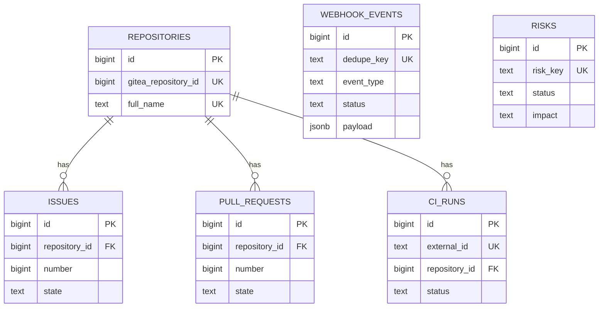
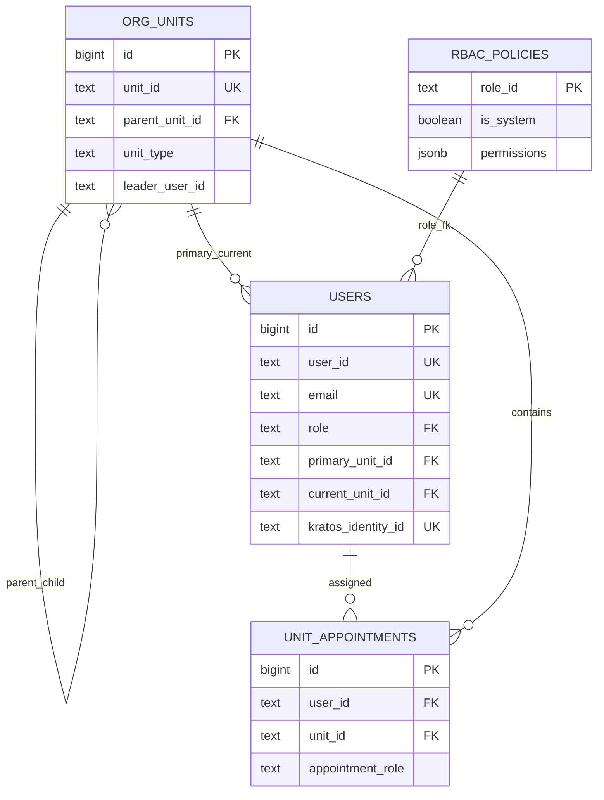
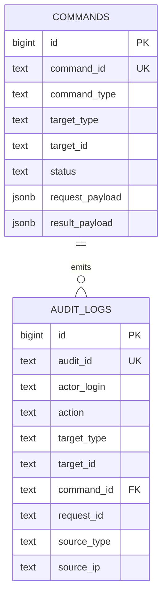
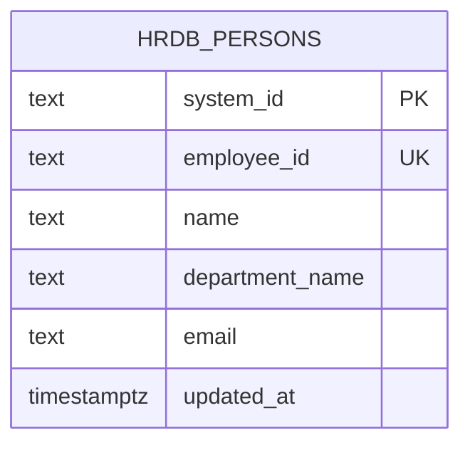
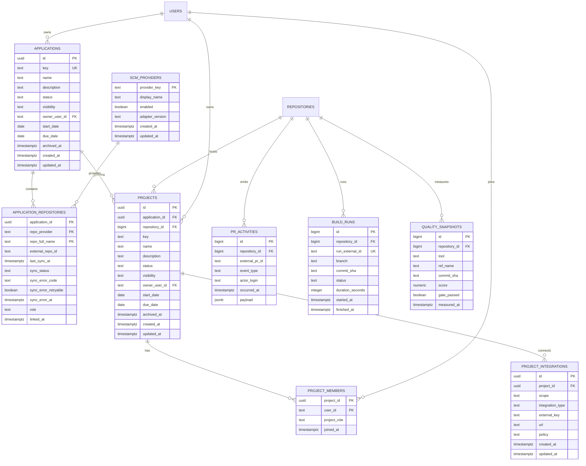
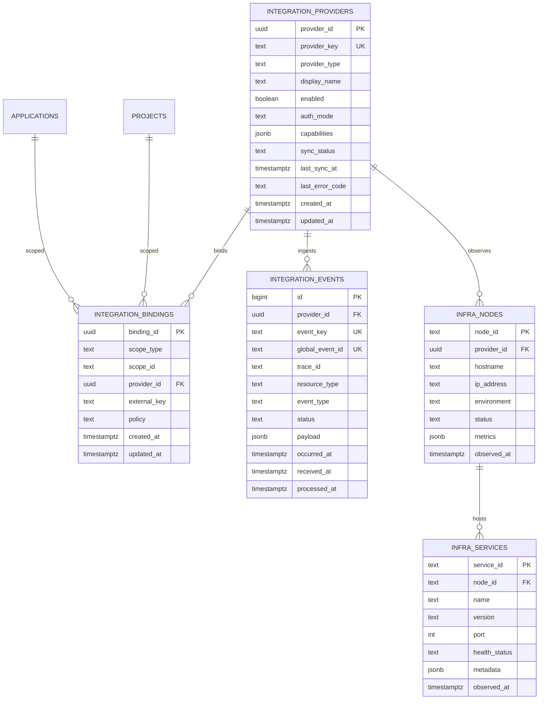
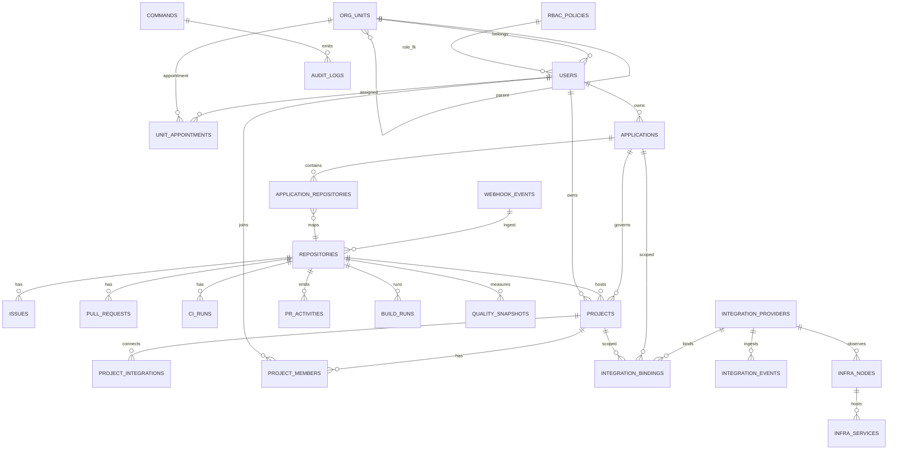

# DevHub 시스템 ERD 카탈로그

- 문서 목적: 코드베이스 전체 모듈의 데이터 모델을 ERD로 분리 관리한다.
- 범위: 현행 DB 스키마 + Project 확장 ERD + External Integration/HomeLab ERD 초안.
- 대상 독자: Backend 설계/구현 담당, 데이터 모델 리뷰어, 추적성 리뷰어.
- 상태: draft
- 최종 수정일: 2026-05-15 (External Integration/HomeLab ERD 초안 추가)
- 관련 문서: [Usecase 카탈로그](./system_usecases.md), [요구사항](../requirements.md), [API 계약](../backend_api_contract.md)

## 1. 기준

- 스키마 기준: `backend-core/migrations/*.up.sql`
- 현행 소스 기준: `backend-core/internal/store`, `backend-core/internal/httpapi`

## 2. 모듈별 ERD

### 2.1 Gitea Ingest / Snapshot

### 2.2 Organization / Users / RBAC

### 2.3 Command / Audit

### 2.4 HRDB

### 2.5 Application/Repository/Project 확장 초안

> **합성 키 메모**:
> - `APPLICATION_REPOSITORIES.PK = (application_id, repo_provider, repo_full_name)` — 동일 `repo_full_name` 이 서로 다른 provider 에 존재할 수 있으므로 provider 를 PK 에 포함. `docs/planning/project_management_concept.md` §7 / §13.3 와 일치.
> - `PROJECT_MEMBERS.PK = (project_id, user_id)` — 동일 사용자의 중복 멤버십 차단.
> - `PROJECT_INTEGRATIONS` 는 단일 `id` PK + (`scope`, `project_id` 또는 `application_id`, `integration_type`, `external_key`) 조합에 unique 인덱스(설계 단계 확정).

### 2.6 External Integration / HomeLab 확장 초안

> **스코프 FK 메모**:
> - `INTEGRATION_BINDINGS.scope_type` 이 `application` 인 경우 `scope_id -> applications.id`, `project` 인 경우 `scope_id -> projects.id` 를 의미한다.
> - 물리 FK는 polymorphic 제약으로 단일 컬럼에 직접 강제하기 어렵기 때문에 앱 레이어 + partial unique 인덱스로 보완한다.

> **이벤트 추적성 메모**:
> - `INTEGRATION_EVENTS` 는 `global_event_id`/`trace_id` 를 통해 바인딩/도메인 엔터티와의 논리 연결을 추적한다.
> - 외부 시스템 키(`external_key`, `resource_type`, `event_key`) 조합으로 연관 관계를 복원하며, 물리 FK 없이도 재처리/감사 추적이 가능하도록 설계한다.

## 3. 통합 ERD (현행 + Project 확장)

## 4. 설계/구현 반영 규칙

1. 신규 API 계약은 대응 ERD 엔티티를 참조해야 한다.
2. 신규 마이그레이션은 본 문서의 ERD 섹션 번호를 커밋/PR에 명시한다.
3. 추적성 매트릭스에서 UC/ARCH/API/IMPL가 동일 모듈 ERD를 참조하도록 유지한다.
