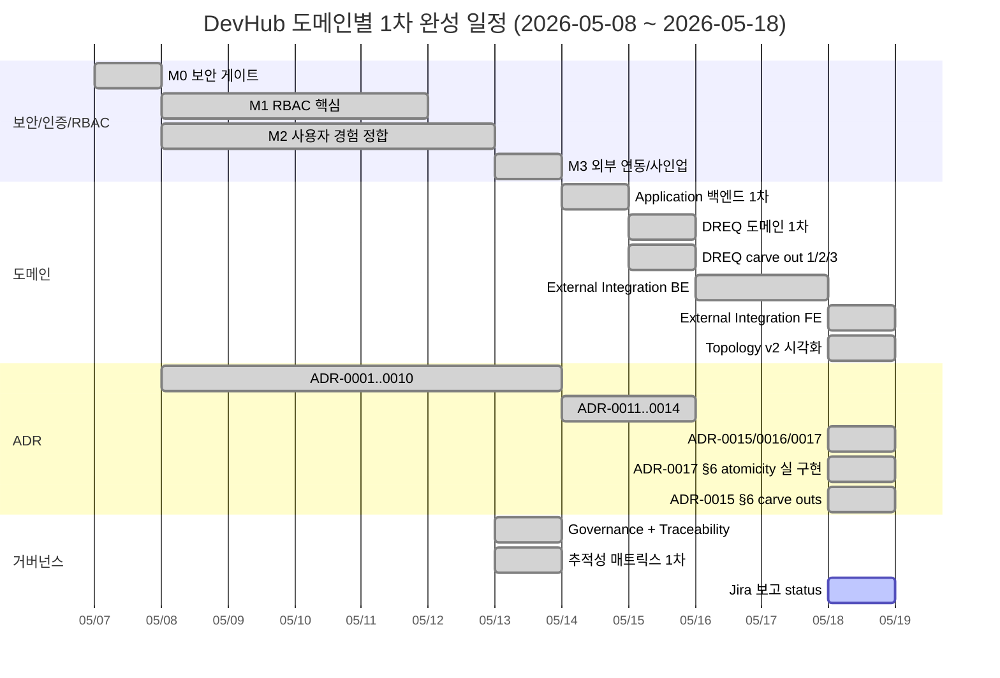

# DevHub 개발 현황 보고 — 2026-05-18

- 문서 목적: Jira 등 외부 보고용 개발 현황 정리. 본 문서는 작성만 — upload 는 보고자가 직접.
- 범위: 10 항목 (로그인 / 사용자 관리 / 조직 관리 / 과제 관리 + 요구사항 / 유스케이스 / 설계 + 단위테스트 / E2E 테스트 + 추적성 관리).
- 대상 독자: 외부 stakeholder (Jira reader), PM/PO, 운영 담당자.
- 상태: draft
- 최종 수정일: 2026-05-20
- 관련 문서: [통합 로드맵](../development_roadmap.md), [추적성 매트릭스](../traceability/report.md), [거버넌스](../governance/README.md), [세션 인계](../../ai-workflow/memory/session_handoff.md).

## 본 문서 사용 안내

- **렌더 환경 가정**: 본 문서는 GitHub 마크다운 렌더 기준. Mermaid 다이어그램 (§0) 은 GitHub / GitLab / Notion 등에서 자동 렌더되지만, **Jira Cloud / On-premise 의 기본 마크다운은 Mermaid 미지원**. Jira 에 업로드 시 (a) Mermaid 다이어그램을 PNG/SVG 로 export 해 이미지 첨부, (b) 또는 Mermaid plugin (e.g., Confluence Mermaid Macro) 사용 권장.
- **sprint code 안내**: 본 문서의 `sprint -m`, `sprint -p` 등은 git branch `claude/work_260518-<letter>` 의 줄임 — 사내 일자별 작업 단위. 외부 reader 는 PR 번호 (#xxx) 만 참조해도 흐름 파악 충분.
- **PR 번호 매핑**: 본 보고서가 다루는 PR 누적 = 2026-05-08 ~ 2026-05-18, #1 ~ #159. 자세한 매핑은 부록 A + `git log --oneline main`.

---

## 0. 요약 — 전체 진척도



### 마일스톤 통계 (2026-05-18 main HEAD `6648105`)

| 항목 | 수 |
| --- | --- |
| REQ-FR (Functional Requirements) | 105 + (Platform/Project 확장) + (DREQ 11) + (INT 12) ≈ **140+** |
| REQ-NFR (Non-Functional) | 26 + (DREQ 6) + (INT 8) ≈ **40** |
| ARCH (Architecture) | ARCH-01..17 + ARCH-DREQ-01..06 + ARCH-INT-01..06 = **29** |
| API (Backend endpoints) | 80 (API-01..80) |
| ADR (Architecture Decision Records) | **17** (ADR-0001~0017 모두 accepted) |
| RM (Roadmap items) | RM-M3-01..03 (done) + RM-M4-01..09 (planned) |
| IMPL | 79 + (Application/DREQ/INT 확장) |
| UT (Unit Tests) | 47 + (application 43 + DREQ 19 + INT) |
| TC (E2E Test Cases) | 37 + TC-DREQ-* 13 + TC-INT-FRONTEND-* 12 + TC-INT-HOMELAB-03 = **63** |
| 누적 PR | 159 (2026-05-08 ~ 2026-05-18, 본 hotfix #159 포함) |

---

## 1. 로그인 기능 개발

### 1.1 상태: ✅ **1차 완성** (M0 + M1 + M2 1차)

OIDC + PKCE 기반 자체 로그인 + RP-initiated logout 완성. Ory Hydra (OAuth2 provider) + Ory Kratos (identity / self-service) native 실행 (no-docker 정책).

### 1.2 완료 사항

- **OIDC code flow with PKCE end-to-end** — frontend → Hydra `/oauth2/auth` → Kratos `/self-service/login` → consent → token exchange → tokenStore (sessionStorage 의 access_token + refresh_token + id_token).
- **Bearer token verification** — backend `BearerTokenVerifier` (Hydra introspection) + actor 식별 (`actor.role` 추출).
- **Sign Out** — Header → Hydra `/oauth2/sessions/logout` (id_token_hint) + Kratos cookie 종료.
- **/account 페이지** — Kratos privileged session 안내 + password 변경 form (Kratos settings flow).
- **Sign Up (셀프 가입)** — `POST /api/v1/auth/signup` (hrdb lookup + Kratos identity 생성) — RM-M3-01.

### 1.3 진행 중

- 없음 — 1차 완성.

### 1.4 잔여 (후속)

- Hydra JWKS / introspection verifier 실 구현 (현재는 introspection 기반)
- 외부 SSO 통합 (Gitea 연동 등) — RM-M4-09
- MFA — M4 carve out

### 1.5 관련 PR / ID

- M0 SEC: PR #14~#19
- M1 RBAC 핵심: PR #20~#23, #27~#31
- M1 cleanup (envelope + audit actor enrichment): PR #56 (PR-B+C), #57 (PR-D)
- M2 login/logout/account/admin/org: PR #45 (PR-L1), #50 (PR-L3), #51 (PR-L2), #49 (deploy guide), #52~#55 (Track S1~S4)
- M2 UX 1차 완성: PR #85 (`claude/login_usermanagement_finish`)
- M3 Sign Up: PR #98, #99 (RM-M3-01)
- ADR: [ADR-0001 IdP selection](../adr/0001-idp-selection.md), [ADR-0006 X-Devhub-Actor 거부](../adr/0006-x-devhub-actor-reject-inbound.md)

### 1.6 캡처 가이드 (production 환경)

production frontend 의 `/login` 페이지 진입 후 OIDC redirect → System ID + Password 입력 화면. 캡처 후보:

| # | 화면 | 캡처 대상 |
| --- | --- | --- |
| 1 | `/login` 진입 직후 | OIDC redirect 발생 직전 spinner |
| 2 | `/auth/login?login_challenge=...` | System ID + Password 폼 |
| 3 | `/admin` (system_admin 로그인 후) | landing |
| 4 | Header 의 actor 표시 + Sign Out 버튼 |  |
| 5 | `/account` | 현재 비밀번호 변경 모달 |

```
+------------------------------------------+
|  [DevHub Logo]              [System Admin]
|                                          
|  Sign In to DevHub                       
|  ┌────────────────────────────┐          
|  │ System ID:  [_____________]│          
|  │ Password:   [_____________]│          
|  │            [ Sign In →   ] │          
|  └────────────────────────────┘          
+------------------------------------------+
```

---

## 2. 사용자 관리 기능 개발

### 2.1 상태: ✅ **1차 완성** (M2 + Track S + Kratos audit 통합)

system_admin 의 사용자 발급/리셋/비활성/삭제 + 사용자의 self-service password 변경 + audit log 통합.

### 2.2 완료 사항

- **`/admin/settings/users`** — 사용자 목록 + 발급 모달 + 임시 password 1회 노출 (PR #54, Track S3).
- **accounts admin endpoints** — `POST /api/v1/accounts` (발급, 임시 password 반환), `PUT password` (admin reset), `PATCH` (활성/비활성), `DELETE` (소프트 삭제). Kratos admin API proxy.
- **self-service password 변경** — `/account` 페이지가 Kratos settings flow 호출 (privileged session 가드).
- **Kratos webhook → audit_logs** — Kratos 의 self-service 이벤트가 backend `/api/v1/kratos/webhook` 으로 전달 → audit_logs 에 기록 (PR-M2-AUDIT, PR #85).
- **`audit_logs` 의 actor enrichment** — `source_ip` + `request_id` + `source_type` (PR-D, PR #57). audit 트레이서빌리티 강화.

### 2.3 진행 중

- 없음.

### 2.4 잔여 (후속)

- `/admin/settings/users` 의 SearchInput 실 필터링 (현재 placeholder).
- Kratos webhook 추가 audit 항목 (recovery 등).

### 2.5 관련 PR / ID

- Track S3 admin: PR #54 (`work_26_05_11`)
- Self-service: PR #50 (`work_26_05_11`)
- M2 1차 완성: PR #85
- PR-D audit enrichment: PR #57, #80

### 2.6 캡처 가이드

production `/admin/settings/users` 진입 후:

| # | 화면 |
| --- | --- |
| 1 | `/admin/settings/users` 목록 (table) |
| 2 | "Issue Account" 모달 |
| 3 | 발급 직후 임시 password 1회 노출 modal |
| 4 | Account row 의 Reset / Disable / Delete 액션 메뉴 |

---

## 3. 조직 관리 기능 개발

### 3.1 상태: ✅ **1차 완성** + iPad 터치 안정화 + 트랜잭션 강화

조직도 (organization tree) drag & drop + leader 변경 + 단위 생성/수정 단일 트랜잭션 강화.

### 3.2 완료 사항

- **`/admin/settings/organization`** 4 tab (Track S2) — Tree / Members / Departments / Leaders.
- **drag & drop 좌표 저장** — PR #55 (`PR-S4`). 사용자 위치 영구화.
- **Leader 변경** — partial unique index `unit_single_leader_idx WHERE appointment_role='leader'` 로 single-leader invariant 보장.
- **단위 생성/수정 단일 트랜잭션** — `unit_appointments` leader 자동 sync (demote-then-promote in tx) + `SELECT ... FOR UPDATE` 직렬화 (PR #112).
- **`getHierarchy` MV** — `total_count` materialized view 로 조직 통계 빠른 조회 (ADR-0009).
- **`primary_unit_id` 자동 판정** — `ResolvePrimaryUnit` (ADR-0010).
- **iPad 터치 안정화** — `ActionMenu` 의 350ms touch reset, keyboard activation (a11y).

### 3.3 진행 중

- 없음.

### 3.4 잔여 (후속)

- daily ETL cron 운영 entry (ADR-0008 §6)
- `primary_dept` backfill worker (signup 직후 + admin trigger, ADR-0010 §4.3)
- 파견 종료 (`is_seconded` 자동 갱신) trigger

### 3.5 관련 PR / ID

- Track S2: PR #53 (`PR-S2`)
- drag: PR #55 (`PR-S4`)
- 트랜잭션 강화: PR #112 (`codex/frontend_color_review`)
- ADR: [ADR-0008 HRDB PostgreSQL](../adr/0008-hrdb-production-adapter.md), [ADR-0009 total_count MV](../adr/0009-org-secondary-memberships-and-total-count-mv.md), [ADR-0010 primary_unit](../adr/0010-primary-dept-resolution.md)

### 3.6 캡처 가이드

```
+---------------------------------------+
| Organization                          |
|  Engineering                          |
|  ├─ Infrastructure (15)               |
|  │   ├─ Backend (5) [leader: u1]      |
|  │   └─ Frontend (3) [leader: u3]     |
|  └─ Product (8)                       |
|      └─ UX Strategy (5) [leader: u2]  |
| (drag handles + leader badge)         |
+---------------------------------------+
```

---

## 4. 과제 관리 기능 개발

### 4.1 상태: ✅ **DREQ (Dev Request) 도메인 종합 closing**

외부 요청 → 사내 application/project 등록 → 진척 추적 → close. Platform + Project + Repository + DREQ 4 도메인 통합.

### 4.2 완료 사항

#### 4.2.1 Application Domain (backend 1차)

- API-01~58 전체 activated (18 endpoint group + 7 migration).
- 도메인 타입: Application / PlatformRepository / SCMProvider / Project / ProjectMember / ProjectIntegration / PRActivity / BuildRun / QualitySnapshot 등.
- RBAC 4 신규 resource (`applications` / `platform_repositories` / `projects` / `scm_providers`).
- 상태 전이 머신: planning → active → on_hold → resume → closed → archived (critical_warning_count=0 가드).
- Backend integration test 23건 (CI backend-integration job).

#### 4.2.2 DREQ Domain

- **Concept + Design**: `docs/domain/dev-request/concept.md` + REQ-FR-DREQ-001..011 + UC-DREQ-01..10 + ARCH-DREQ-01..06 + API-59..68 + API-79 (PATCH allowed_ips).
- **AuthADR**: ADR-0012 (옵션 A: API 토큰 + IP allowlist).
- **Backend 1차** (PR #124): 7 endpoint + intake auth middleware + 3 migration + 19 unit test.
- **Frontend 1차** (PR #125): DevRequestTable + DevRequestDetailModal + MyPendingDevRequestsWidget + `/admin/settings/dev-requests` + `/dev-requests` (일반 사용자).
- **Admin-UI** (PR #130/#131): intake token admin (issue/list/revoke) + `/admin/settings/dev-request-tokens` 페이지 + plain-1회 modal.
- **Promote-Tx**: 단일 트랜잭션으로 application/project 등록 + dev_request 상태 갱신 (ADR-0013 RBAC row-scoping).
- **Token expiry + IP mutation** (PR #137): migration 000027 + ADR-0017.
- **§6 atomicity 실 구현** (PR #156, sprint -o): UpdateDevRequestIntakeTokenIPs 단일 CTE + FOR UPDATE + concurrent race test.
- TC-DREQ-* **13건** 정식 발급 + e2e spec ts active.

### 4.3 진행 중

- 없음.

### 4.4 잔여 (후속)

- 자동 cron revoke (`expires_at <= NOW()` 정리) — ADR-0017 §6
- PATCH 의 `expires_at` 갱신 — ADR-0017 §6
- 토큰 만료 알림 metric — ADR-0017 §6
- pmo_manager 의 owner-self route gate 활성화 (ADR-0011 §4.2 후속)
- critical_warning_count 임계치 외부화 (운영 정책 테이블)

### 4.5 관련 PR / ID

- Application: PR #104~#110
- DREQ Concept/AuthADR: PR #121, #122
- DREQ Backend/Frontend: PR #124, #125
- DREQ Promote-Tx: PR #128
- DREQ Admin-UI: PR #130, #131
- DREQ token expiry: PR #137 (gemini)
- DREQ atomicity: PR #156 (sprint -o)
- ADR: [ADR-0011 row-scoping](../adr/0011-rbac-row-scoping.md), [ADR-0012 intake auth](../adr/0012-dreq-external-intake-auth.md), [ADR-0013 row-scoping](../adr/0013-dreq-rbac-row-scoping.md), [ADR-0014 admin endpoint](../adr/0014-dreq-intake-token-admin.md), [ADR-0017 operational hardening](../adr/0017-dreq-intake-token-operational-hardening.md)

### 4.6 캡처 가이드

```
+--------------------------------------------+
| My Pending Dev Requests          [3]       |
|                                            |
|  ┌──────────────────────────────────────┐  |
|  │ REQ-2026-053  | New ML Pipeline      │  |
|  │ Submitter: external                  │  |
|  │ Assigned: alice@example.com          │  |
|  │ [Register App] [Register Project]    │  |
|  │ [Reject]       [Reassign]            │  |
|  └──────────────────────────────────────┘  |
+--------------------------------------------+
```

---

## 5. 요구사항 작성

### 5.1 상태: ✅ **체계 도입 + 도메인별 발급 누적**

거버넌스 + 추적성 체계 도입 (2026-05-13, ADR-0003+governance) 이후 도메인별 요구사항 카탈로그 누적.

### 5.2 완료 사항

- **체계 도입** (PR #89): `docs/governance/document-standards.md` + `docs/traceability/conventions.md` + `docs/traceability/report.md` + PR template + AGENTS/GEMINI 진입점.
- **단계별 ID 컨벤션**: `REQ-FR-*` (Functional) + `REQ-NFR-*` (Non-Functional).
- **도메인별 카탈로그** (`docs/requirements.md`):
  - REQ-FR-AUTH-* / REQ-FR-RBAC-* (M0/M1)
  - REQ-FR-ACCOUNT-* / REQ-FR-ORG-* (M2)
  - REQ-FR-CMD-* / REQ-FR-INFRA-* (M3)
  - REQ-FR-APP-001..012 / REQ-FR-PROJ-000..010 / REQ-NFR-PROJ-001..006 (Platform/Project, 2026-05-14)
  - REQ-FR-DREQ-001..011 / REQ-NFR-DREQ-001..006 (DREQ, 2026-05-15)
  - **REQ-FR-INT-001..012 / REQ-NFR-INT-001..008** (External Integration, 2026-05-15)

### 5.3 잔여

- M4 진입 시 RM-M4-XX 별 REQ 분해 (WebSocket / AI Gardener / System Admin 대시보드).

### 5.4 관련 PR / ID

- 거버넌스 도입: PR #89, #90 (`work_260513-c/d`)
- 도메인 확장: PR #104 (Application), PR #121 (DREQ), PR #135 (Integration)

---

## 6. 유스케이스 작성

### 6.1 상태: ✅ **단계별 발급 누적**

도메인별 유스케이스 카탈로그 + 매트릭스 §2.1.5.

### 6.2 완료 사항

- **`docs/planning/system_usecases.md`** — 시스템 전반 usecase 카탈로그.
- **도메인별 UC**:
  - UC-AUTH-* / UC-RBAC-* (M0/M1)
  - UC-ACCOUNT-* / UC-ORG-* / UC-CMD-* (M2/M3)
  - UC-APP-* / UC-PROJ-* (Application, 2026-05-14)
  - UC-DREQ-01..10 (DREQ, 2026-05-15)
  - **UC-INT-01..14** (External Integration, 2026-05-15)

### 6.3 잔여

- M4 RM-M4-* 별 UC (WebSocket 실시간 / AI 분석 흐름).

### 6.4 관련 PR / ID

- 도메인 확장: 동일 (PR #104 / #121 / #135)

---

## 7. 설계 작성

### 7.1 상태: ✅ **ARCH + API + ADR 체계 완성**

설계 = ARCH (architecture.md §1..8) + API (backend_api_contract.md §1..15) + ADR (17건).

### 7.2 완료 사항

#### 7.2.1 ARCH (Architecture)

`docs/architecture.md`:
- §1..7 — 시스템 구성, command lifecycle, RBAC, audit, integration
- §8 (신규 2026-05-15) — External Integration capability matrix + adapter contract

#### 7.2.2 API (Backend contract)

`docs/backend_api_contract.md`:
- §1..14 — Auth / RBAC / accounts / org / commands / infra / Application / DREQ
- **§15 (신규)** — External Integration provider/binding/HomeLab endpoint (API-69..78 + API-80 DELETE)
- 신규 sub 표: API-66..68 (DREQ admin) + API-79 (PATCH allowed_ips) + API-80 (DELETE provider with FK guard)

#### 7.2.3 ADR (Architecture Decision Records)

17건 모두 accepted:

| ADR | 제목 | 도메인 |
| --- | --- | --- |
| ADR-0001 | IdP selection (Hydra+Kratos) | 인증 |
| ADR-0002 | RBAC policy edit API | RBAC |
| ADR-0003 | no-docker CI 정책 | CI |
| ADR-0004 | X-Devhub-Actor 폐기 | 인증 |
| ADR-0005 | actionlint / workflow lint | CI |
| ADR-0006 | inbound X-Devhub-Actor 400 거부 | 인증 |
| ADR-0007 | RBAC PermissionCache 다중 인스턴스 | RBAC |
| ADR-0008 | HRDB production adapter | HRDB |
| ADR-0009 | secondary memberships + total_count MV | 조직 |
| ADR-0010 | primary_dept resolution | 조직 |
| ADR-0011 | Platform/Project RBAC row-scoping | Application |
| ADR-0012 | DREQ intake auth (옵션 A) | DREQ |
| ADR-0013 | DREQ RBAC row-scoping | DREQ |
| ADR-0014 | DREQ intake token admin endpoint | DREQ |
| **ADR-0015** | HomeLab adapter pull strategy | Integration |
| **ADR-0016** | Prometheus alerts policy | Integration |
| **ADR-0017** | DREQ intake token operational hardening | DREQ |

ADR-0017 §6 atomicity ✅ **resolved** (sprint -o, PR #156).  
ADR-0015 §6 (1) size limit + streaming + (2) token rotation SOP ✅ **resolved** (sprint -p, PR #157).

### 7.3 잔여

- ADR-0016 §6 carve outs — Alertmanager raw YAML / Grafana JSON / pull latency p95 alert (baseline 1주 관찰 후) / push 알림 / stage→prod 임계 확정.
- ADR-0017 §6 잔여 — cron revoke / PATCH expires_at / 만료/staleness alert metric.
- ADR-0015 §6 (3) dedicated worker (M4) + (4) push/pull dedup (별도 ADR).
- M4 RM-M4-XX 별 ADR 후보 (WebSocket replay, AI Gardener gRPC).

### 7.4 관련 PR / ID

- governance + traceability 1차: PR #89, #90
- ADR-0015/0016/0017 신규: PR #143 (sprint -c)
- ADR-0017 atomicity resolved: PR #156
- ADR-0015 carve resolved: PR #157

---

## 8. 단위테스트 작성

### 8.1 상태: ✅ **체계 도입 + 도메인별 누적**

backend (Go test) + frontend (Vitest) + integration test (Postgres) 3 계층.

### 8.2 완료 사항

- **CI backend-unit job** (PR #86) — `go test ./...`.
- **CI backend-integration job** (PR #109) — `DEVHUB_TEST_DB_URL` 환경에서 Postgres 회귀 23 test + 신규 추가 누적.
- **CI frontend-unit job** (PR #86) — Vitest, **48 test PASS** (2026-05-18 main HEAD).
- **도메인별 누적**:
  - **Auth/RBAC** — 110+ test (login, accounts, RBAC matrix, audit enrichment, request_id middleware)
  - **Application** — handler 25 + project 8 + integration 6 + rollup 4 + integration test 23 = **66**
  - **DREQ** — backend 19 + frontend Vitest + intake auth middleware
  - **External Integration** — handler / store / adapter / pull loop / metrics
  - **frontend layout** — Header / Sidebar / AuthGuard / PKCE fuzz (50 case parity)
- **Race test** (sprint -o, PR #156) — `TestIntegration_UpdateDevRequestIntakeTokenIPs_Atomicity` 4 sub-test (Happy / NotFound / Revoked / **ConcurrentUpdateAndRevoke** with `sync.WaitGroup`).
- **Size limit 회귀** (sprint -p, PR #157) — file/HTTP puller 의 oversized + unlimited 5 test.

### 8.3 잔여

- M4 RM-M4-* 별 UT 추가
- ADR-0007 RBAC cache 다중 인스턴스 일관성 test (LISTEN/NOTIFY) — M1-DEFER-E carve out

### 8.4 관련 PR / ID

- CI 도입: PR #86, #87, #88 (sprint `work_260513-a/b`)
- Backend integration job 신설: PR #109, #110 (sprint `work_260514-e/f`)
- Race test: PR #156 (sprint `work_260518-o`)

---

## 9. E2E 테스트 작성

### 9.1 상태: ✅ **Playwright + 도메인별 spec ts 누적**

CI E2E shard 1/2 + 2/2 (Playwright chromium) — 약 50+ test (2026-05-18 기준).

### 9.2 완료 사항

- **CI 도입** (PR #86, gemini) — Playwright 40 TC 베이스.
- **TC 카탈로그**:
  - `test_cases_m1.md` (auth + RBAC)
  - `test_cases_m2_auth.md` (login + logout + signout + accounts)
  - `test_cases_m3_command_infra.md` (M3 carve)
  - `test_cases_m5_dreq.md` (**13 TC-DREQ-***, sprint -d, PR #144)
  - `test_cases_m4_integration.md` — TC-INT-FRONTEND-* **12건** (LIST/CREATE/EDIT/SYNC/RBAC/DELETE/DELETE-NEG + BIND-{LIST,CREATE,RBAC} + TOPOLOGY-V2-{NAV,RBAC}) + TC-INT-HOMELAB-03
- **active spec ts**:
  - `auth.spec.ts` / `password-change.spec.ts` / `signout.spec.ts` / `admin-permissions.spec.ts` / `admin-users-crud.spec.ts`
  - `dev-requests.spec.ts` (DREQ 6 step + intake auth negative + PATCH allowed_ips)
  - `admin-integrations.spec.ts` (provider lifecycle 5 step)
  - **`admin-integration-bindings.spec.ts`** (bindings lifecycle 3 test, sprint -m)
  - **`admin-topology-v2.spec.ts`** (topology v2 3 test, sprint -n)
- **신규 TC** (본 후속 세션):
  - TC-INT-FRONTEND-BIND-{LIST,CREATE,RBAC}-01 (3건, sprint -m)
  - TC-INT-HOMELAB-03 carve out → **active** (sprint -n)
  - TC-INT-FRONTEND-TOPOLOGY-V2-{NAV,RBAC}-01 (2건, sprint -n)

### 9.3 핵심 학습 (본 세션 5 hotfix iteration)

`page.request.*` (GET/PATCH/DELETE) 가 CI 에서 OIDC session 미공유로 일관 fail. 회피 패턴 정착:
1. POST = modal form submit (apiClient 자동 Bearer)
2. GET = DOM `data-XXX-id` attribute 추출
3. PATCH/DELETE = `page.evaluate` fetch + sessionStorage Bearer
4. CSS list 안에 text=/regex/ 못 둠 → `locator.or()` chain

### 9.4 잔여

- TC-INFRA-NODE-CLICK-01 / TC-INFRA-GROUP-TOGGLE-01 (carve out 카탈로그만, spec ts 추후)
- TC-DREQ-* 의 누락 intake auth 일부 path
- TC-INT-FRONTEND-DELETE-NEG-01 (binding 시드 후 DELETE → 409, 현재 UT 만 cover)

### 9.5 관련 PR / ID

- E2E 도입: PR #86 (gemini)
- DREQ TC: PR #144 (sprint -d)
- Integration TC: PR #149, #154, #155 (sprint -h/-m/-n)

---

## 10. 추적성 관리

### 10.1 상태: ✅ **체계 도입 + 매트릭스 1차 + 단계별 갱신 누적**

거버넌스 두 축 (문서 관리 + 추적성) 중 추적성 축 1차 완성.

### 10.2 완료 사항

- **체계 도입** (PR #89, `work_260513-c`):
  - `docs/governance/README.md` (진입점)
  - `docs/governance/document-standards.md` (메타 헤더, lifecycle, ID 노출 표준)
  - `docs/traceability/conventions.md` (ID 컨벤션)
  - `docs/traceability/sync-checklist.md` (매 PR 동기화 절차)
  - `docs/traceability/report.md` (1차 종합 매트릭스)
  - `.github/pull_request_template.md` (PR body 의 "추적성 영향" 섹션)
  - AGENTS/GEMINI 진입점
- **1차 종합 매트릭스**: REQ-FR 105 + REQ-NFR 26 + ARCH 17 + API 40 + RM 28 + IMPL 79 + UT 47 + TC 37 = **412 항목**, 도메인 그룹 13 행.
- **단계별 갱신** — 모든 도메인 추가 시 §3 매트릭스 row + §2 sub 표 + §5 미커버 표 + §6 변경 이력 동기화.
- **갱신 도메인**:
  - 2026-05-13: governance + traceability 도입, 매트릭스 1차
  - 2026-05-14: Application 도메인 row
  - 2026-05-15: DREQ + External Integration concept staged
  - 2026-05-16~18: 외부 8 PR 흡수 + ADR-0015/0016/0017 row + TC-DREQ-* 카탈로그 + API-79/80 + bindings + topology v2 + ADR atomicity / size limit resolve
- **§3 External Integration row** — **"1차 종합 활성화"** (provider + bindings + topology v2 + ADR-0015 §6 resolved + ADR-0017 §6 resolved).

### 10.3 잔여

- M4 RM-M4-XX 별 매트릭스 row (planned 상태 유지, 진입 시 갱신).
- ADR-0016 §6 carve out resolve 시 §5/§6 row 추가.
- ADR-0017 §6 잔여 carve out resolve 시 동일.
- 본 sprint -q 머지 후 §6 변경 이력 row 8건 (#152~#158) 누적 확인.

### 10.4 관련 PR / ID

- 거버넌스 + traceability 도입: PR #89, #90
- 단계별 갱신: 모든 sprint 가 §6 변경 이력 row 추가 (CONVENTION)
- 본 후속 세션 추가: PR #154~#157 + 본 PR (sprint -q)

### 10.5 추적성 매트릭스 진입

[`docs/traceability/report.md`](../traceability/report.md):
- §1 개요 / §2 단계별 인덱스 (REQ → UC → ARCH → API → RM → IMPL → UT → TC) / §3 종합 매트릭스 / §4 ADR 인덱스 / §5 미커버 표 / §6 변경 이력
- 모든 PR 의 추적성 영향은 PR body 의 "추적성 영향" 섹션에 명시 (PR template § ON-CHECK).

---

## 부록 A — 본 세션 (2026-05-18 post-EOD) 주요 PR 흐름

| PR | sprint | 내용 |
| --- | --- | --- |
| #152 | `-k` | 2026-05-18 EOD 종합 housekeeping (단일 일자 11 PR sync) |
| #153 | `-l` | codex hotfix #7 — PR #149 merge_commit SHA 정정 |
| #154 | `-m` | External Integration bindings 관리 UI + 5 hotfix iteration |
| #155 | `-n` | Infra topology v2 시각화 (React Flow + degraded banner) |
| #156 | `-o` | ADR-0017 §6 atomicity 실 구현 (CTE + FOR UPDATE + race test) |
| #157 | `-p` | ADR-0015 §6 carve outs (size limit + streaming + token rotation SOP) |
| #158 | `-q` | post-EOD 종합 housekeeping + 본 Jira 보고 status 문서 (1차 draft) |
| #159 | `-r` | 본 보고서 self-review hotfix — P1 3건 (ARCH/TC count + M1 RBAC PR 범위) + P2 4건 (Mermaid caveat + 정확 sum + sprint 안내 + PR #158 명시) |

## 부록 B — production 환경 스크린샷 캡처 가이드

본 보고서의 ASCII mockup 은 참고용. 실 보고 시 production 환경에서 다음 5 화면 캡처 권장:

1. **로그인** — `/login` → `/auth/login?login_challenge=...` (System ID + Password form)
2. **system_admin landing + Topology v1** — `/admin` (React Flow infra + Real-time Metrics)
3. **Topology v2** — `/admin/topology-v2` (snapshot meta + degraded banner + sidebar services)
4. **DREQ widget + page** — developer/manager dashboard 의 MyPendingDevRequestsWidget + `/admin/settings/dev-requests`
5. **Integration providers + bindings** — `/admin/settings/integrations` (ProviderTable) + `/admin/settings/integration-bindings` (BindingsTable)

**캡처 환경 권장**: 1920x1080, dark theme (DevHub default), 한국어 locale.

## 부록 C — 본 보고서 변경 이력

| 일자 | 변경 | sprint |
| --- | --- | --- |
| 2026-05-18 | 1차 draft — 10 항목 + Mermaid 진척도 + ASCII mockup + 캡처 가이드 | `claude/work_260518-q` (PR #158) |
| 2026-05-18 | self-review hotfix — P1 3건 (ARCH 23→29 / TC-INT-FRONTEND-* 13→12 + 총 TC sum 63 명시 / M1 RBAC PR 범위 정정) + P2 4건 (Mermaid Jira 호환 caveat + 사용 안내 / sprint code 안내 / 부록 A PR #158 + 본 #159 추가 / 누적 PR 158→159) | `claude/work_260518-r` (PR #159) |
| 2026-05-18 | codex hotfix #8 P2 #4/#5 — §1.5 ADR-0006 link 파일명 정정 (`inbound-rejected.md` → `reject-inbound.md`) + §4.5 ADR-0012 link 파일명 정정 (`intake-auth.md` → `external-intake-auth.md`). 외부 보고서의 dead link 회귀 가드. | `claude/work_260518-w` (본 PR) |
