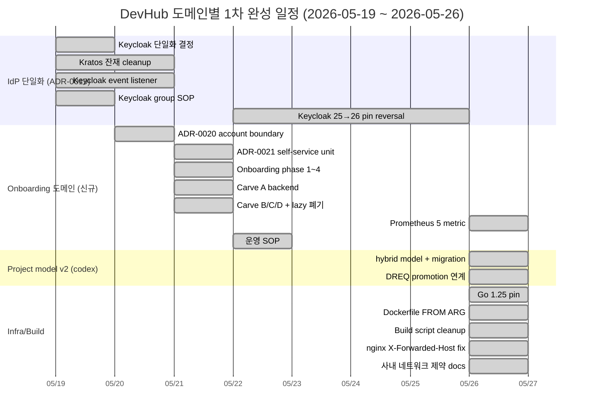

# DevHub 개발 현황 보고 — 2026-05-26

- 문서 목적: Jira 등 외부 보고용 개발 현황 정리 (주간). 본 문서는 작성만 — upload 는 보고자가 직접.
- 범위: 10 항목 (로그인 / 사용자 관리 / 조직 관리 / 과제 관리 + 요구사항 / 유스케이스 / 설계 + 단위테스트 / E2E 테스트 + 추적성 관리) + §11 (신규) Onboarding 도메인 + §12 (신규) Build/Deploy SOP.
- 대상 독자: 외부 stakeholder (Jira reader), PM/PO, 운영 담당자.
- 상태: draft
- 최종 수정일: 2026-05-26
- 직전 보고: [jira_status_2026_05_18.md](./jira_status_2026_05_18.md) (immutable snapshot — 8일 전).
- 관련 문서: [통합 로드맵](../development_roadmap.md), [추적성 매트릭스](../traceability/report.md), [거버넌스](../governance/README.md), [세션 인계](../../ai-workflow/memory/session_handoff.md).

## 본 문서 사용 안내

- **렌더 환경 가정**: GitHub 마크다운 + Mermaid. Jira Cloud / On-premise 기본 마크다운은 Mermaid 미지원 → PNG/SVG export 또는 Mermaid plugin (Confluence Mermaid Macro) 권장.
- **sprint code 안내**: 본 문서의 `sprint -a`, `sprint -m` 등은 git branch `claude/work_<date>-<letter>` 의 줄임. 외부 reader 는 PR 번호 (#xxx) 만 참조해도 흐름 파악 충분.
- **PR 번호 매핑**: 본 보고서 누적 범위 = 2026-05-19 ~ 2026-05-26, **#160 ~ #326** (167 PR). 직전 보고 = #1 ~ #159.

---

## 0. 요약 — 전체 진척도



### 마일스톤 통계 (2026-05-26 main HEAD `03db2e0`)

| 항목 | 2026-05-18 | 2026-05-26 | 증감 |
| --- | --- | --- | --- |
| REQ-FR | ~140+ | **~160+** (REQ-FR-ONBOARD-* 20 추가) | +20 |
| REQ-NFR | ~40 | ~46 (REQ-NFR-ONBOARD-* 6 추가) | +6 |
| ARCH | 29 | **35+** (ARCH-ONBOARD-01..06 추가) | +6 |
| API (backend endpoints) | 80 (API-01..80) | **86+** (API-83..86 onboarding + 신규 hybrid) | +6 |
| **ADR** | 17 (0001~0017) | **23** (0001~0023) — ADR-0001 partial superseded by ADR-0019 + ADR-0022 fully superseded by ADR-0023 | +6 |
| RM | RM-M3 done + RM-M4 planned | RM-M3 done + RM-M4 일부 + **RM-ONBOARD-01..04** | +4 |
| IMPL | 79+ | 100+ | +20+ |
| UT | 47+ | **70+** (Onboarding metric 5 + project model 등) | +23 |
| TC (E2E Test Cases) | 63 | **74+** (TC-ONBOARD-* 11 + admin-projects.spec) | +11 |
| 누적 PR | 159 | **326** | +167 |
| 머지된 issue closed | (해당 없음) | **#302 (P2-3 client secret)** + #214/#284 등 close | +N |

---

## 1. 로그인 기능 개발

### 1.1 상태: ✅ **Keycloak 단일 IdP 완료** (ADR-0019, 2026-05-19) + 안정화 누적

**이전 보고 변경**: Hydra + Kratos (ADR-0001) → **Keycloak 단일 IdP** (ADR-0019, ADR-0001 partial supersession). 11 backend 파일 삭제 + Kratos 잔재 cleanup (sprint -ad).

### 1.2 완료 사항 (1주 추가분)

- **IdP 단일화 (ADR-0019)** — Hydra/Kratos 완전 제거 + Keycloak OIDC PKCE end-to-end. backend `BearerTokenVerifier` 가 JWKS 기반 검증 (`keycloak_verifier.go`). `KeycloakAdminClient` 가 account/admin operations 책임.
- **Kratos 잔재 cleanup (sprint -ad)** — backend 11 파일 삭제 (account_password.go / kratos_*.go) + frontend account password form 제거 + Keycloak Account Console redirect 위임.
- **OIDC PKCE 보강 (PR #296, codex)** — `oidc_pkce_map` 패턴으로 overlapping OIDC starts race 해결. claude P0 fix (Keycloak 25 admin bootstrap env 호환성).
- **`/login` canonical (ADR-0020 sub-carve F, PR #295)** — `/auth/login` 디렉토리 완전 제거 + `/login/page.tsx` Suspense + `?error=` 처리. infra realm.prod.json + nginx template + setup-keycloak.sh 일괄 정합.
- **AuthGuard whitelist → blocklist (PR #291 codex hotfix #3)** — 무한 redirect 회귀 해소 + e2e seed onboarding column 동기화.
- **nginx X-Forwarded-Host fix (PR #325, 본 주 critical)** — 사내 :13000 → 호스트 → VM :3000 → docker :3000 port forward 환경에서 OIDC redirect_uri 가 :80 으로 잘못 생성되는 회귀 해소.

### 1.3 진행 중

- 없음.

### 1.4 잔여 (사내 운영자 영역)

- 사내 nginx 재기동 + OIDC redirect_uri 검증 (PR #325 후속)
- 사내 Keycloak 26.0 image pull + redeploy smoke (ADR-0023 §5)
- issue #214 P1-3 Keycloak group staging-prod 사내 admin console 1회 작업

### 1.5 관련 ADR / PR

| ADR | 제목 |
| --- | --- |
| ADR-0001 | IdP selection (Hydra+Kratos, **partial superseded by ADR-0019**) |
| **ADR-0019** | **Keycloak 단일화** (신규, 2026-05-19) |
| **ADR-0020** | **Account / user management boundary** (신규, 2026-05-20) |
| **ADR-0022** | Keycloak 25.0 pin (Draft, **superseded by ADR-0023**) |
| **ADR-0023** | **Keycloak 26.0 forward pin** (신규, 2026-05-26) — ADR-0022 reversal |

핵심 PR (1주):
- PR #166 ADR-0018 실 구현 (단일 포트 reverse proxy)
- PR #167 Keycloak-only refactor (KC-PR-A..F)
- PR #169 ADR-0019 신규 발행 (sprint -a)
- PR #295 sub-carve F `/login` canonical
- PR #296 OIDC PKCE + Keycloak 25.0 pin (외부 codex)
- PR #308 **ADR-0023 신규 (Keycloak 26.0 reversal)**
- PR #325 **nginx X-Forwarded-Host fix**

---

## 2. 사용자 관리 기능 개발

### 2.1 상태: ✅ **Onboarding 도메인 + Keycloak group → RBAC 자동 매핑 완성**

**이전 보고 변경**: Kratos webhook → Keycloak event listener 전환. **Onboarding 도메인 신규 추가** (ADR-0021). lazy_auto_create 폐기 (PR #290).

### 2.2 완료 사항 (1주 추가분)

- **Keycloak event listener (audit 통합, ADR-0019 §5.3 (9))** — Phase 2 PR-B/C/D 머지 — cron worker (`keycloak_event_puller.go`) + 3 Prometheus metric + `audit_logs.source_event_id` partial UNIQUE INDEX (migration 000032) + `event_cursors` table.
- **Onboarding 도메인 (ADR-0021, PR #265~#291)** — phase 1~4 closing + Carve A backend (POST /me/onboarding + PATCH /me + GET /organizations/search + POST /admin/users/:user_id/review) + Carve B/C frontend + Carve D test + flag default ON flip + **lazy_auto_create.go 폐기** (PR #290).
- **Keycloak group → RBAC 자동 매핑 (issue #214 codex 영역, PR #306)** — `scripts/verify-keycloak-groups.sh` 신규 + `keycloak_operations.md §4.4` 검증 SOP. 4 항목 read-only 검증 (realm / group 4 / composite role 1:1 / Default Groups empty).
- **Account Console 위임 (ADR-0019 §8.5b)** — `/account` password 변경 → Keycloak Account Console redirect (Kratos settings flow 제거).
- **Account/User management boundary (ADR-0020)** — Phase 3 sub-carve 8 closing. lazy_auto_create deprecated, ADR-0021 §3.3 sole policy.
- **Onboarding 운영 SOP (PR #293)** — `docs/setup/onboarding_operations.md` 신규 + staging 1주 monitoring + rollback + incident response.
- **Onboarding Prometheus 5 metric (PR #313 + #320)** — gate_blocked Counter / submit Counter + Histogram / review_confirm Counter / pending_review Gauge (cron refresh 60s).
- **SETUP_KEYCLOAK_QUIET flag (PR #318, issue #302 closed)** — setup-keycloak.sh 의 client secret stdout 누적 회피.

### 2.3 진행 중

- 없음.

### 2.4 잔여 (사내 영역)

- Onboarding SOP staging 1주 monitoring (사내 SRE) — flag default ON 후 회귀 발견 시 `DEVHUB_ONBOARDING_GATE_ENABLED=0` rollback.
- group staging-prod 사내 admin console 1회 작업 + verify-keycloak-groups.sh PASS 확인.

### 2.5 관련 ADR / PR

| ADR | 신규/변경 |
| --- | --- |
| ADR-0020 | account/user management boundary (Phase 3 sub-carve 7/8 closing) |
| ADR-0021 | Onboarding self-service unit selection (신규) |

핵심 PR:
- PR #189~#193 Keycloak event listener (PR-B~D)
- PR #265~#291 Onboarding domain (phase 1~4, Carve A~D, hotfix #1~#3)
- PR #306 verify-keycloak-groups.sh (issue #214)
- PR #293 Onboarding 운영 SOP
- PR #313 Onboarding Prometheus 4 metric
- PR #318 SETUP_KEYCLOAK_QUIET (issue #302 closed)
- PR #320 pending_review Gauge (§8 P3 carve closed)

---

## 3. 조직 관리 기능 개발

### 3.1 상태: ✅ **Onboarding 첫 진입 unit selection 추가** (안정화 + 확장)

**이전 보고 변경**: 기존 자산 안정화 + Onboarding 사용자의 **첫 진입 시 unit 선택** (ADR-0021 §3.2).

### 3.2 완료 사항 (1주 추가분)

- **GET /api/v1/organizations/search (API-84)** — typeahead picker 용 unit 검색 endpoint.
- **POST /api/v1/me/onboarding (API-83)** — display_name + primary_unit_id 설정 + onboarding_completed_at 마킹.
- **POST /api/v1/admin/users/:user_id/review (API-86)** — pending_review → reviewed 전이 (system_admin only).
- **migration 000033** — `users.onboarding_completed_at` + `review_status` 컬럼 + CHECK constraint (bi-implication).
- **3-tier state machine** — `null` (token-only actor) → `pending_review` (onboarding 제출) → `reviewed` (system_admin 확인).
- **Onboarding `OrganizationPicker`** — typeahead + tree picker frontend 컴포넌트.

### 3.3 진행 중

- 없음.

### 3.4 잔여 (사내 영역)

- HRDB ETL unit pre-stage (ADR-0020 §6.3 사내 동반 carve, docs 초안 신규 PR #297).
- daily ETL cron 운영 entry (ADR-0008 §6).

### 3.5 관련 PR

- PR #278 Carve A backend (migration 000033 + 5 handler + UT 13)
- PR #288 Carve B+C frontend (OrganizationPicker + admin/users review UI)
- PR #297 §6.3 사내 동반 carve 3 docs 초안

---

## 4. 과제 관리 기능 개발

### 4.1 상태: ✅ **Project model v2 hybrid + DREQ promotion 연계 closing**

**이전 보고 변경**: DREQ 도메인 closing 후 **Project model v2 hybrid** (PR #312 codex) + **DREQ promotion 연계** (PR #323 codex) 추가.

### 4.2 완료 사항 (1주 추가분)

- **Project model v2 hybrid (PR #312, codex)** — `migration 000034_project_repositories` (N:M 조인 테이블) + `DEVHUB_PROJECT_MODEL=hybrid|legacy|v2` env + v2 routes (`/applications/:id/projects` + `/projects/:id/repositories`) + Legacy 경로 410 gone gate.
- **DREQ promotion to Project (PR #323, codex)** — `Promote to Project` 액션 (DevRequestDetailModal) + ProjectCreationModal 프리필 바인딩 + Header 실시간 `dev_request.created` WebSocket 배지 + `TC-DREQ-PROMOTE-PROJ-01` E2E.
- **JWKS Linux 호환 (PR #312)** — `host.docker.internal` → `http://nginx/` (Linux host.docker.internal 해석 실패 회피).
- **e2e seed (PR #312)** — `seedDevhubUsers` → `seedDevhubData` 함수 rename + repositories fixture INSERT (gitea_repository_id 100001/100002).

### 4.3 진행 중

- 없음.

### 4.4 잔여 (별도 sprint)

- `DEVHUB_PROJECT_MODEL=v2` staging 적용 + legacy → hybrid → v2 단계적 migration plan (사용자/codex).
- **(직전 보고 잔여 + 본 주 미해소)**: 자동 cron revoke (ADR-0017 §6) / PATCH expires_at 갱신 / 토큰 만료 알림 metric.
- pmo_manager 의 owner-self route gate 활성화 (ADR-0011 §4.2 후속).

### 4.5 관련 PR

- **PR #312** project-management v2 (40 파일, codex)
- **PR #323** DREQ promotion 연계 + E2E (15 파일, codex + claude rebase + 4 amend)

---

## 5. 요구사항 작성

### 5.1 상태: ✅ **Onboarding REQ 20+ 추가**

**이전 보고 변경**: REQ-FR-ONBOARD-001..020 + REQ-NFR-ONBOARD-001..006 신규 (ADR-0021).

### 5.2 완료 사항 (1주 추가분)

- **REQ-FR-ONBOARD-001..020** — `docs/requirements.md §5.7` 신규. token-only actor 인식 / unit 선택 form / display_name validation (1~100 char) / review_status state machine / admin review action / audit 3종 emit (`account.onboarding_completed` / `account.review_confirmed` / `account.unit_changed`).
- **REQ-NFR-ONBOARD-001..006** — performance (submit p95 < 1s) / cardinality bound / cron refresh interval (60s) / migration safety / feature flag opt-out.

### 5.3 잔여

- M4 RM-M4-XX 별 REQ 분해 (WebSocket / AI Gardener / System Admin 대시보드).

---

## 6. 유스케이스 작성

### 6.1 상태: ✅ **UC-ONBOARD-01..05 추가**

### 6.2 완료 사항 (1주 추가분)

- **UC-ONBOARD-01..05** — `docs/planning/system_usecases.md` 신규 — 첫 진입 사용자 unit 선택 flow / display_name 설정 / admin review / Skip 1회 fallback / pending_review 검토 latency.

---

## 7. 설계 작성

### 7.1 상태: ✅ **ADR-0018~0023 (6 신규 + 1 supersession) + Onboarding ARCH/API 6**

**이전 보고 변경**: ADR 17 → **23 누적** (0018~0023 추가, 0022 superseded by 0023).

### 7.2 완료 사항 (1주 추가분)

#### 7.2.1 ARCH (Architecture)

`docs/architecture.md §9` (신규) — Onboarding domain flow + UC-ONBOARD + ARCH-ONBOARD-01..06.

#### 7.2.2 API (Backend contract)

`docs/backend_api_contract.md §16` (신규) — Onboarding endpoints (API-83 POST /me/onboarding / API-84 GET /organizations/search / API-85 PATCH /me / API-86 POST /admin/users/:id/review).

추가: **§13.5 Project + Repository 연결** (PR #312) — Application > Project > Repository(N:M) 운영 모델 + legacy `/repositories/:id/projects` 호환 + `DEVHUB_PROJECT_MODEL=v2` 시 410 gone.

#### 7.2.3 ADR (Architecture Decision Records)

| ADR | 제목 | 상태 |
| --- | --- | --- |
| ADR-0018 | 단일 외부 포트 역프록시 정책 | Accepted (2026-05-18) |
| **ADR-0019** | **Keycloak 단일화** (ADR-0001 partial supersession) | Accepted (2026-05-19) |
| **ADR-0020** | Account / user management boundary | Accepted (2026-05-20) |
| **ADR-0021** | Onboarding self-service unit selection | Accepted (2026-05-21) |
| **ADR-0022** | Keycloak 25.0 pin | Draft → **superseded by ADR-0023** (2026-05-26) |
| **ADR-0023** | **Keycloak 26.0 forward pin** (ADR-0022 reversal) | Accepted (2026-05-26) |

**ADR governance 패턴** — ADR-0022 reversal 시 본문 partial 수정 금지 + 새 ADR-0023 신규 발행 + 메타 헤더 + §0/§3 inline supersession banner + 본문 immutable 보존 (`feedback_adr_supersession_pattern`).

### 7.3 잔여

- ADR-0019 §5.3 잔여 carve (group staging-prod 사내 적용 / off-boarding deploy / HA Phase 2 / e2e 실 코드 전환 / SPI push 전환) — 모두 사내 동반 carve.
- ADR-0020 §6.3 사내 동반 carve (Keycloak admin 책임 분리 / JWKS rotation cache flush / HRDB ETL unit pre-stage) — docs 초안 발행 후 사내 적용 잔여.
- ADR-0022 §3.1 retreat 사유 finalize → ADR-0023 reversal 로 우회 (closed).

### 7.4 관련 PR

- PR #169 ADR-0019 신규 (sprint -a)
- PR #186 ADR-0020 sub-carve A
- PR #266~#271 Onboarding REQ/ARCH/API/ADR/impl plan
- PR #296 ADR-0022 (codex)
- PR #308 **ADR-0023 신규** (Keycloak 26.0 reversal)

---

## 8. 단위테스트 작성

### 8.1 상태: ✅ **Onboarding 4 metric test + project model + race / atomicity guard 누적**

**이전 보고 변경**: Onboarding metric test 9 (submit/review_confirm/duration/gate + pending_review Gauge 4) + project model UT.

### 8.2 완료 사항 (1주 추가분)

- **Onboarding metric test (PR #313 + #320)** — `onboarding_metrics_test.go` 5 test (Idempotent / gate_blocked / submit 7 status / duration Histogram / review_confirm 7 status) + `onboarding_pending_gauge_test.go` 4 test (InitialTick / CtxCancel / ErrorRecovery / DefaultInterval).
- **DREQ PATCH/DELETE binding handler test (PR #264)** — `integration_registry_test.go` 8 신규 test (PATCH 5 + DELETE 3) + fake `memoryApplicationStore.UpdateIntegrationBinding` hardening (Provider FK + 4-tuple unique).
- **DREQ middleware IP mismatch + revoke cancel E2E test (PR #262)** — JWKS metric assertion 5 stale test 정정 + 12 clientIPAllowed table-driven test.
- **Project model UT (PR #312)** — applications_test.go 확장 + project_repositories N:M migration safety test.
- **dev-requests.spec.ts auto-merge 정합 (PR #323)** — main 의 raw `/api/v1/...` 패턴 + PROMOTE-PROJ-01 IPv6 `::1` + cleanup best-effort.

### 8.3 잔여

- M4 RM-M4-* 별 UT 추가.
- partial index on `users.review_status` (row scale 100K+ 시).
- `extractKeycloakRole` priority filter 회귀 가드 test (issue #214 후속).

---

## 9. E2E 테스트 작성

### 9.1 상태: ✅ **TC-ONBOARD-* 11 + admin-projects.spec 추가**

**이전 보고 변경**: 63 TC → **74+** (Onboarding + project v2 + DREQ promotion).

### 9.2 완료 사항 (1주 추가분)

- **TC-ONBOARD-* 11건** (sprint Onboarding Carve D, PR #289) — `test_cases_m6_onboarding.md` 신규 + frontend `onboarding-first-login.spec.ts` + admin review flow.
- **admin-projects.spec.ts** (PR #312) — Application/Project hybrid flow E2E.
- **admin-project-model-v2.spec.ts** (PR #312) — v2 routes 검증.
- **project-model-modes.spec.ts** (PR #312) — legacy/hybrid/v2 mode 별 410/200 분기 검증.
- **TC-DREQ-PROMOTE-PROJ-01** (PR #323) — DREQ intake → Promote to Project lifecycle (claude rebase + 4 amend 후 CI PASS).
- **e2e seed (PR #312)** — `seedDevhubData` 함수 + repositories fixture (gitea_repository_id 100001/100002).

### 9.3 핵심 학습 (1주)

- **`appPath()` 와 backend endpoint 의 mismatch** — PR #323 의 dev-requests.spec.ts auto-merge 시 `appPath("/api/v1/...")` wrapping 추가 → backend endpoint 에 frontend basePath prefix 적용으로 fail. main 의 raw `/api/v1/...` 패턴이 정공법.
- **IPv6 `::1` IP allowlist** — CI runner 가 IPv6 loopback 으로 intake 호출 → IPv4 `0.0.0.0/0` 만 입력 시 `auth_intake_ip_denied 401`. `0.0.0.0/0` + `::1` 둘 다 입력 필수.
- **cleanup token best-effort** — page.reload() 후 sessionStorage access_token state 가 OIDC session propagation 지연으로 일시 stale 가능성. try/catch wrap 으로 non-fatal 처리.

### 9.4 잔여

- TC-INFRA-NODE-CLICK-01 / TC-INFRA-GROUP-TOGGLE-01 (직전 보고 잔여 + 본 주 미해소).
- TC-INT-FRONTEND-DELETE-NEG-01 (binding seed 후 DELETE → 409, UT 만 cover).

---

## 10. 추적성 관리

### 10.1 상태: ✅ **매트릭스 1주 누적 갱신 + ADR 23건 row + Onboarding 도메인 신규 row**

**이전 보고 변경**: 412 항목 → **480+ 항목** (Onboarding REQ/UC/ARCH/API/IMPL/UT/TC + ADR-0018~0023).

### 10.2 완료 사항 (1주 추가분)

- **§3 Onboarding 도메인 row 신규** (PR #266) — REQ-FR-ONBOARD-001..020 / REQ-NFR-ONBOARD-001..006 / UC-ONBOARD-01..05 / ARCH-ONBOARD-01..06 / API-83..86 / IMPL-ONBOARD-* / UT-ONBOARD-* / TC-ONBOARD-*.
- **§4 ADR 인덱스 갱신** — ADR-0018~0023 row 추가 + ADR-0001 / ADR-0022 supersession 표기.
- **본 주 변경 이력 row 누적** — 167 PR (#160~#326) 모두 `docs/traceability/report.md §6` 변경 이력 row 추가 (CONVENTION).

### 10.3 잔여

- ADR-0019 §5.3 잔여 carve resolve 시 §5/§6 row 추가 (group staging-prod / off-boarding / HA Phase 2 등).
- ADR-0017 §6 잔여 carve (cron revoke / PATCH expires_at / 만료 alert) — 본 주 미해소.

---

## 11. (신규) Onboarding 도메인 — 본 주 핵심

### 11.1 상태: ✅ **closing 1차** (Phase 1~4 + Carve A/B/C/D + 운영 SOP + Prometheus 5 metric)

신규 도메인 — token-only Keycloak actor 가 첫 진입 시 unit + display_name 설정. lazy_auto_create 폐기 후 ADR-0021 §3.3 sole policy.

### 11.2 완료 사항

| 영역 | 결과 |
| --- | --- |
| concept | `docs/domain/onboarding/concept.md` 신규 (PR #265) |
| REQ | REQ-FR-ONBOARD-001..020 + REQ-NFR-ONBOARD-001..006 (PR #266) |
| ARCH | UC-ONBOARD + ARCH §9 + API §16 (PR #267) |
| ADR | ADR-0021 (PR #269) + codex hotfix #1 (P1 §16.3 INSERT/UPDATE, P2 §6.1 scope) |
| IMPL plan | RM-ONBOARD-01..04 + reservation fix 14 위치 (PR #271) |
| Carve A backend | migration 000033 + 5 handler + UT 13 + feature flag (PR #278) |
| Carve B/C frontend | OrganizationPicker + admin/users review UI (PR #288) |
| Carve D test | backend UT 8 + TC catalog (PR #289) |
| flag default ON flip | DEVHUB_ONBOARDING_GATE_ENABLED=1 + lazy_auto_create.go 폐기 (PR #290) |
| codex hotfix #3 | AuthGuard whitelist → blocklist + e2e seed onboarding column sync (PR #291) |
| 운영 SOP | `onboarding_operations.md` 신규 — staging 1주 monitoring + rollback + incident response (PR #293) |
| Prometheus 5 metric | gate_blocked Counter / submit Counter + Histogram / review_confirm Counter / pending_review Gauge (PR #313 + #320) |

### 11.3 잔여 (사내 영역)

- staging 1주 monitoring (SOP §7 DoD 8 항목) — 사내 SRE.
- pending_review SLA 정책 결정 — 사내 정책.
- HRDB ETL unit pre-stage 사내 적용 (ADR-0020 §6.3) — 사내 HRDB 팀.

### 11.4 캡처 가이드

```
+------------------------------------------+
|   Welcome to DevHub                      |
|   First-time login — 사용자 정보 설정     |
|                                          |
|  Display Name *  [_____________________] |
|  Primary Unit *  [Engineering / Backend] |
|                  [typeahead + tree picker]
|                                          |
|  [ Skip (1회) ]      [ Submit →     ]   |
+------------------------------------------+
```

---

## 12. (신규) Build / Deploy SOP — 사내 네트워크 제약 + nginx critical fix

### 12.1 상태: ✅ **host build pattern 강화 + Dockerfile FROM ARG + 사내 네트워크 제약 통합 docs + nginx X-Forwarded-Host fix**

**1주 핵심** — 사내 docker container 안 proxy 전파 차단 시나리오 회피 강화 + nginx :80 redirect 회귀 해소.

### 12.2 완료 사항

- **build-artifacts.sh 리팩토링 (PR #310)** — host 의존성 사전 검증 (`verify_prerequisites()` — go 1.25+ / python3.12 정확히 / node 20+ / npm) + dockerized python fallback 제거.
- **Go 1.22 → 1.25 명시 정합 (PR #314)** — `backend-core/go.mod` 의 `go 1.25.9` 와 CI setup-go + docs/script 모두 1.25.
- **Dockerfile FROM ARG (PR #316)** — 3 Dockerfile (backend-core/backend-ai/frontend) 의 base image 를 `ARG <SERVICE>_BASE` 로 override 가능. 사내 mirror registry tag 사용 가능.
- **사내 네트워크 제약 통합 docs (PR #324)** — `internal_network_constraints.md` 신규 — 3 제약 통합 (host build / 외부 port forward / db+Keycloak 분기) + 환경 매트릭스 5 시나리오 + fail 시나리오 6 + cross-link.
- **deploy.env.example 분기 example (PR #324)** — 내부 모드 (DB_MODE=docker + COMPOSE_PROFILES=local-db,local-idp) vs 외부 모드 (DB_MODE=external + 사내 운영팀 instance) 분리 + DEVHUB_PROJECT_MODEL + proxy env 신규.
- **nginx X-Forwarded-Host fix (PR #325 critical)** — `devhub.deploy.conf.template` 6 location block 모두 `X-Forwarded-Host $http_host` (4 신규 + 2 `$host` → `$http_host` 정정). Next.js 의 `request.nextUrl.origin` fallback 이 :80 default 로 인식되는 회귀 해소.
- **§13 troubleshooting matrix 10 시나리오 (PR #310)** — go / python3.12 / npm / GoProxy / PyPI / docker daemon proxy / ABI mismatch / private registry / Keycloak realm INVALID_REDIRECT_URI / Keycloak 26 vs 25 admin env.
- **SETUP_KEYCLOAK_QUIET (PR #318, issue #302 closed)** — `setup-keycloak.sh` 의 client secret stdout 누적 회피 (sync_keycloak_redirects 자동 inject).

### 12.3 잔여 (사내 운영자 영역)

- 사내 nginx 재기동 + OIDC redirect_uri 검증 (PR #325 후속).
- 사내 Keycloak 26.0 image pull + redeploy smoke (ADR-0023 §5).

### 12.4 관련 PR

- PR #310 build-artifacts cleanup
- PR #314 Go 1.25
- PR #316 Dockerfile FROM ARG
- PR #318 SETUP_KEYCLOAK_QUIET (issue #302 closed)
- PR #324 internal_network_constraints + env example
- **PR #325** nginx X-Forwarded-Host (critical regression 해소)

---

## 부록 A — 1주 (2026-05-19 ~ 2026-05-26) 주요 PR 흐름

총 **167 PR** (#160 ~ #326). 핵심 영역별 주요 PR:

| 영역 | PR | 내용 |
| --- | --- | --- |
| ADR-0019 Keycloak 단일화 | #166, #167, #169 | sprint -a ADR-0019 신규 + Keycloak-only refactor |
| Kratos 잔재 cleanup | sprint -ad | backend 11 파일 삭제 + frontend account password 제거 |
| Keycloak event listener | #189~#193 | Phase 2 PR-B/C/D + 3 metric + cursor + audit_logs partial UNIQUE INDEX |
| ADR-0020/0021 Onboarding | #265~#291 | concept → REQ → ARCH/API → ADR → impl plan → Carve A/B/C/D → hotfix #1~#3 |
| Onboarding 운영 SOP | #293 | staging 1주 monitoring + rollback + incident response |
| ADR-0022/0023 Keycloak version | #296, #308 | 26 → 25 retreat (codex Draft) → 25 → 26 reversal (claude Accepted) |
| 사내 동반 docs | #297 | Keycloak admin / JWKS rotation / HRDB ETL 3 docs 초안 |
| PR #296 follow-up | #301, #304 | port 13000 / python3 / setup-keycloak idempotent + emit gate + .build/ |
| issue #214 verify | #306 | verify-keycloak-groups.sh + keycloak_operations.md §4.4 |
| build/deploy script cleanup | #310 | host 의존성 사전 검증 + §1.2/§13 |
| **Onboarding Prometheus** | #313, #320 | 4 metric + pending_review Gauge cron worker |
| Go 1.25 | #314 | go.mod 1.25.9 + CI + docs/script 정합 |
| Dockerfile FROM ARG | #316 | 사내 mirror registry override |
| SETUP_KEYCLOAK_QUIET | #318 | issue #302 closed |
| **Project model v2 + DREQ 연계** | #312, #323 | codex hybrid model (40 파일) + DREQ promotion (15 파일, claude rebase + 4 amend) |
| 사내 네트워크 docs | #324 | internal_network_constraints + env example 분기 |
| **nginx X-Forwarded-Host fix** | #325 | critical regression :80 redirect 해소 |

## 부록 B — production 환경 스크린샷 캡처 가이드 (1주 추가)

직전 보고의 5 화면 + 본 주 추가 권장:

6. **Onboarding 첫 진입 화면** — `/onboarding` (Display Name + Primary Unit picker + Skip)
7. **Admin Review 화면** — `/admin/settings/users` 의 pending_review filter + Confirm Review modal
8. **Project Promotion 화면** — DevRequestDetailModal 의 `Promote to Project` 버튼 → ProjectCreationModal 프리필
9. **Account Console redirect** — `/account` 페이지의 "Keycloak Account Console 로 이동" 안내 + redirect 직전

**캡처 환경**: 1920x1080, dark theme, 한국어 locale.

## 부록 C — 본 보고서 변경 이력

| 일자 | 변경 | sprint |
| --- | --- | --- |
| 2026-05-26 | 1차 발행 — 직전 2026-05-18 보고 + 8일 누적 (167 PR / ADR 6 신규 / Onboarding 도메인 / Project model v2 / nginx X-Forwarded-Host critical fix). §11 (Onboarding) + §12 (Build/Deploy SOP) 신규. | `claude/work_260526-jira-weekly-2026-05-26` |

## 부록 D — 직전 보고 (2026-05-18) 대비 diff 핵심

| 영역 | 2026-05-18 | 2026-05-26 |
| --- | --- | --- |
| IdP | Hydra + Kratos (ADR-0001) | **Keycloak 단일** (ADR-0019, ADR-0001 partial supersession) |
| Onboarding | (해당 없음) | **closing 1차** + Prometheus 5 metric + 운영 SOP |
| Project model | Application > Project > Repository(1:1) | **Application > Project > Repository(N:M) v2 hybrid** (migration 000034) |
| ADR | 17 | 23 (0018~0023 추가, 0022 superseded by 0023) |
| TC | 63 | **74+** (TC-ONBOARD-* 11 + admin-projects.spec) |
| API | 80 (API-01..80) | **86+** (API-83..86 onboarding 추가) |
| 누적 PR | 159 | **326** (1주 167 PR) |
| 사내 영역 critical issue | (해당 없음) | **nginx :80 redirect 회귀 해소** (PR #325) |
| issue closed | (집계 없음) | **#302 (P2-3 client secret) + #214 codex 영역 흡수** |
