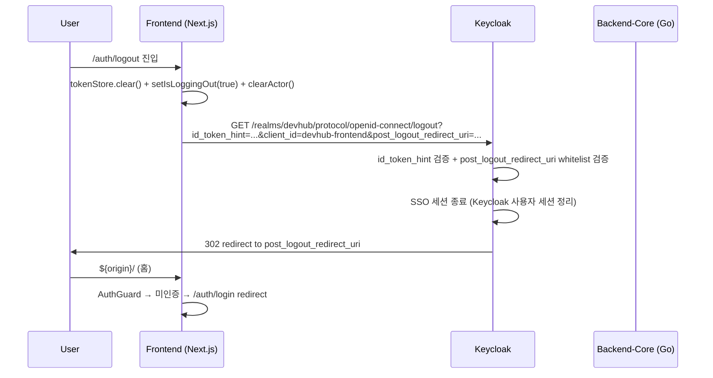

# Keycloak 운영 SOP (realm / client / role / JWKS rotation / user attribute)

- 문서 목적: [ADR-0019 Keycloak 단일화](../adr/0019-keycloak-only-idp.md) §5.3 carve out (1) Keycloak realm/client/role 운영 SOP + (2) JWKS rotation 운영 SOP + (3) Keycloak ↔ HRDB sync (admin user attribute 매핑) 의 단일 통합 운영 자산.
- 범위: Keycloak realm `devhub` 의 client 2종 + role 4종 + user attribute mapper + JWKS rotation policy + local embedded vs external 모드 분기 + 운영 SOP (생성/검증/회수/장애). MFA / SSO logout chain / failover / off-boarding 즉시성 / groups → RBAC 자동 매핑은 [ADR-0019 §5.3 잔여 carve](../adr/0019-keycloak-only-idp.md#53-잔여-carve-out) 로 별도 sprint.
- 대상 독자: 운영자 (SRE / IdP), Security, Backend / Frontend / IdP 담당자.
- 상태: draft (1차)
- 최종 수정일: 2026-05-19
- 결정 근거 sprint: `claude/work_260519-c`
- 관련 문서: [ADR-0019 Keycloak 단일화](../adr/0019-keycloak-only-idp.md), [ADR-0001 IdP (Hydra+Kratos, superseded)](../adr/0001-idp-selection.md), [keycloak_only_refactor_execution_plan §6](../planning/keycloak_only_refactor_execution_plan.md#6-keycloak-서버-구성-계획), [ADR-0008 HRDB production adapter](../adr/0008-hrdb-production-adapter.md), [test-server-deployment](./test-server-deployment.md), [environment-setup](./environment-setup.md).

## 1. 배경 + 책임 분리

DevHub 는 [ADR-0019](../adr/0019-keycloak-only-idp.md) 채택으로 Keycloak 을 **단일 IdP** 로 운영한다. 본 SOP 는 Keycloak 인스턴스 자체의 운영 자산 (realm 정의 / client / role / mapper / JWKS key) 의 결정 + 변경 SOP 를 source-of-truth 로 정합한다.

- **DevHub 저장소 (`devhub`)**: 의도 + 환경설정 계약 (env 변수) + 본 SOP 의 운영 정책 source-of-truth. realm/client 의 실 instance config (admin password, client_secret) 는 외부.
- **운영 자산 저장소 (별도)**: realm export JSON / client_secret / TLS 인증서 / agent 운영 스크립트가 deploy 되는 곳. **devhub git 외부**, 사내 vault 또는 ops git.

CLAUDE.md 의 docker = env-specific 정책 정합 — 환경 특화 자산 (Keycloak host 주소, realm 비밀번호, client_secret, JWKS private key) 은 devhub 저장소 외부.

## 2. realm 구조

| 항목 | 값 | 메모 |
| --- | --- | --- |
| realm name | `devhub` | local embedded + external 모드 동일 |
| display name | `DevHub` | 로그인 화면 표시 (Keycloak admin > Realm settings > General) |
| frontend URL | (env 별) — local `http://localhost:8080`, prod `https://devhub.example.com/devhub/auth/keycloak` ([ADR-0018](../adr/0018-single-port-reverse-proxy-policy.md) 단일 포트 정합) | issuer = `${frontend_url}/realms/devhub` |
| login theme | `keycloak` (default) | 사내 브랜딩은 별도 carve |
| session timeout | SSO Session Idle = `30 min`, SSO Session Max = `12 h` | 사내 정책 기반 (carve — 사내 보안팀 확정) |
| password policy | `length(8) and notUsername` 최소 | 사내 정책 (carve — Keycloak 표준 password policy 강도 확정) |

### 2.1 issuer URL 일관성

- backend `DEVHUB_OIDC_ISSUER_URL` + frontend `NEXT_PUBLIC_OIDC_ISSUER_URL` 가 동일한 issuer 가리킴
- ADR-0018 단일 포트 환경에서는 `https://devhub.example.com/devhub/auth/keycloak/realms/devhub` 형태
- nginx 가 `/devhub/auth/keycloak/*` prefix 를 Keycloak `:8080` 으로 strip-and-proxy

## 3. client 정의 (2종)

### 3.1 `devhub-frontend` (public, PKCE required)

| 항목 | 값 |
| --- | --- |
| Client ID | `devhub-frontend` |
| Client type | `OpenID Connect` |
| Access type | `public` (no client secret) |
| Standard flow | `enabled` (Authorization Code) |
| Direct access grants | `disabled` (보안 — Resource Owner Password Credentials 차단) |
| Service accounts | `disabled` |
| **PKCE** | `S256` **required** |
| Valid redirect URIs | local `http://localhost:3000/auth/callback`, prod `https://devhub.example.com/devhub/auth/callback` |
| Valid post-logout redirect URIs | local `http://localhost:3000/`, prod `https://devhub.example.com/` — **codex review #9**: 현재 frontend `auth.service.ts:116` 의 `${window.location.origin}/` 는 basePath 미포함 (origin = scheme + host + port). ADR-0018 basePath `/devhub` 환경에서도 frontend 가 `https://devhub.example.com/` 만 보냄 → whitelist 도 동일하게 정합. 향후 basePath 포함 logout URI 로 변경 시 frontend code 변경 carve (`auth.service.ts:116` 의 `post_logout_redirect_uri` 에 `${basePath}/` 추가). |
| Web Origins | local `http://localhost:3000`, prod `https://devhub.example.com` |
| Front-channel logout | `enabled` |

### 3.2 `devhub-backend` (confidential, service account)

| 항목 | 값 |
| --- | --- |
| Client ID | `devhub-backend` |
| Client type | `OpenID Connect` |
| Access type | `confidential` (client secret 발급) |
| Standard flow | `disabled` |
| Direct access grants | `disabled` |
| **Service accounts** | `enabled` (`client_credentials` grant) |
| Service account roles | realm-management 의 `view-users`, `manage-users` (admin operations 용 — Keycloak Admin Client) |
| Valid redirect URIs | (불필요 — service account only) |

client_secret 은 사내 vault 보관. 정기 rotation SOP 는 §6 JWKS rotation 과 별도 (vault 의 secret rotation 정책 따름).

## 4. role / group 정의

### 4.1 realm role 4종

[ADR-0011 RBAC row-scoping](../adr/0011-rbac-row-scoping.md) + DevHub `rbac_policies` seed (migration `000004_seed_rbac.up.sql`) 와 1:1 매핑:

| Role | Description | Keycloak naming |
| --- | --- | --- |
| `developer` | 일반 개발자 (default) | `devhub-developer` 또는 `developer` (DevHub backend role wire 와 일치) |
| `manager` | 부서 manager | `devhub-manager` 또는 `manager` |
| `pmo_manager` | PMO manager (Application/Project Owner 위양) | `devhub-pmo-manager` 또는 `pmo_manager` |
| `system_admin` | 시스템 관리자 (모든 권한) | `devhub-system-admin` 또는 `system_admin` |

**naming 결정**: DevHub backend 의 [`internal/auth/keycloak_verifier.go`](../../backend-core/internal/auth/keycloak_verifier.go) 가 token claim 의 role 을 그대로 wire format 으로 사용하므로, Keycloak role name 도 **`developer` / `manager` / `pmo_manager` / `system_admin`** 으로 prefix 없이 둔다. 사내 정책으로 prefix 필요 시 mapper 에서 strip 처리.

### 4.2 role mapping 위치

| 위치 | mapping |
| --- | --- |
| Realm Role | 위 4종 |
| Client Role (`devhub-frontend`) | (사용 안 함 — realm role 만 활용) |
| Composite Role | (carve — 사내 권한 위계 결정 후) |

### 4.3 group (composite realm role 1:1 매핑)

[docs/planning/keycloak_groups_rbac_mapping.md](../planning/keycloak_groups_rbac_mapping.md) 결정 — 옵션 B 채택. group 4개 ↔ realm role 4개 1:1 composite 매핑.

| Keycloak Group | Composite Realm Role | DevHub `users.role` |
| --- | --- | --- |
| `devhub-developers` | `developer` | `developer` |
| `devhub-managers` | `manager` | `manager` |
| `devhub-pmo-managers` | `pmo_manager` | `pmo_manager` |
| `devhub-system-admins` | `system_admin` | `system_admin` |

**Keycloak admin 설정 SOP** (1회):
1. Realm `devhub` → Groups → Create Group 4회 (위 표 group name)
2. 각 Group → Role Mappings 탭 → realm role 1개 assign (group ↔ role 매핑)
3. **Default Groups 미설정 권장** (codex review #9, [keycloak_groups_rbac_mapping §3.2](../planning/keycloak_groups_rbac_mapping.md) 결정) — Default Group 적용 시 신규 manager/pmo/admin 도 자동 `devhub-developers` 가입 → token multi-role → `extractKeycloakRole` order-dependency 위험. 명시 group 1개 가입 강제 (§8.1 step 3).

**backend 동작**: 변경 없음. group composite role 은 Keycloak 이 token 발급 시 `realm_access.roles` 에 자동 포함 → [keycloak_verifier.go:260-285](../../backend-core/internal/auth/keycloak_verifier.go) 의 추출 그대로 동작.

**user 운영**: §8.1 step 3 의 "Role Mapping" → "**Groups 탭 → group 1개 가입**" 으로 단순화 (다중 user 일괄 처리 가능).

**carve**: SCIM bridge / LDAP federation 자동 group sync + 옵션 C (groups claim mapper + multi-role) 확장 — design 문서 §8 잔여 carve.

## 5. user attribute mapper (token claim 매핑)

### 5.1 표준 claim (Keycloak 기본 제공)

| claim | source | DevHub 사용처 |
| --- | --- | --- |
| `sub` | Keycloak user UUID | `users.idp_subject` 1:1 매핑 (migration `000021_rename_kratos_identity_to_idp_subject`) |
| `preferred_username` | Keycloak username | `audit_logs.actor_login` ([ADR-0019 §4.5](../adr/0019-keycloak-only-idp.md#45-audit_logs-영향)) |
| `email` | Keycloak email attribute | `users.email` 동기화 |
| `email_verified` | Keycloak | (사내 정책 — 미검증 email 거부 carve) |
| `name` | Keycloak first+last name | `users.display_name` |
| `realm_access.roles` | Keycloak realm role | backend [`keycloak_verifier.go`](../../backend-core/internal/auth/keycloak_verifier.go) 의 role extraction |
| `resource_access.{client_id}.roles` | Keycloak client role | fallback (PR #167 KC-PR-B `resource_access` fallback 로직) |

### 5.2 custom claim — `employee_id` (HRDB sync 핵심)

[ADR-0008 HRDB production adapter](../adr/0008-hrdb-production-adapter.md) + [ADR-0019 §5.3 carve](../adr/0019-keycloak-only-idp.md#53-잔여-carve-out) 의 Keycloak ↔ HRDB sync (employee_id strict link).

**Keycloak admin console 설정**:

1. Realm `devhub` → Clients → `devhub-frontend` → Client Scopes 탭
2. 또는 Client Scopes → `profile` (default scope) → Mappers → Add Mapper → "By configuration"
3. Mapper type = **User Attribute**
4. 설정:
   - Name: `employee_id`
   - User Attribute: `employee_id`
   - Token Claim Name: `employee_id`
   - Claim JSON Type: `String`
   - Add to ID token: `ON`
   - Add to access token: `ON`
   - Add to userinfo: `ON`
5. 저장 후 jwt.io 등으로 access_token decode 해 `employee_id` claim 확인

**user attribute 입력 경로**:

- 운영팀 매뉴얼: Keycloak admin console → Users → 해당 user → Attributes → `employee_id` = HRDB primary key
- 자동화: SCIM bridge 또는 사내 HRDB ETL → Keycloak Admin API (carve — sprint 별도)

### 5.3 token claim 검증 체크리스트 (backend 측)

[`keycloak_verifier.go`](../../backend-core/internal/auth/keycloak_verifier.go) 의 verifier 가 검증하는 claim:

- `iss` ↔ `DEVHUB_OIDC_ISSUER_URL`
- `aud` ↔ `DEVHUB_OIDC_AUDIENCE` (또는 client_id)
- `exp` / `nbf` / `iat` ↔ clock skew 허용 (default 60s, env override 가능)
- `sub` ↔ `users.idp_subject` lookup
- `realm_access.roles` → DevHub role wire (fallback: `resource_access.{client_id}.roles`)
- `preferred_username` → audit_logs actor_login

## 6. JWKS rotation 운영 SOP

### 6.1 Keycloak 의 key rotation 기본 동작

- Keycloak realm 의 keys 는 **여러 active key 동시 보유** 가능 (active + passive)
- token 발급 시 active key 로 서명
- token 검증 시 모든 active + passive key 의 JWKS 가 노출 → 이전 active key 로 발급된 token 도 유효 기간 동안 검증 가능
- key rotation = active key 를 새로 생성 + 이전 key 를 passive 로 이동 (token TTL 까지 검증 유효)

### 6.2 rotation 주기 권장

| 환경 | active key rotation | passive key 보관 |
| --- | --- | --- |
| local embedded | 갱신 불필요 (개발) | — |
| staging | 90일 | 14일 (token TTL 보다 길게) |
| prod | 90일 (사내 보안 정책에 따름) | 14일 |

권장 = 90일 active rotation, 14일 passive retain. 단 사내 보안팀 정책이 더 짧으면 따름.

### 6.3 DevHub backend JWKS cache invalidation

[`keycloak_verifier.go:37`](../../backend-core/internal/auth/keycloak_verifier.go) 의 JWKS cache:

- TTL default = **5분** (`defaultJWKSTTL = 5 * time.Minute`)
- cache miss (TTL 만료 또는 빈 cache) 시 `${DEVHUB_OIDC_JWKS_URL}` 또는 issuer discovery 의 `/protocol/openid-connect/certs` fetch
- **kid mismatch 시 stale-while-error fallback** (sprint -r PR #186, 2026-05-19): `kid` mismatch (codex review #9 #3 carve resolved) 시 backend 가 자동 `invalidateCache` + JWKS forced refetch + 1회 retry. Keycloak key rotation 직후 새 kid 의 token 이 cache TTL 만료 전이라도 정합. signature/expired/issuer/audience 등 non-kid error 는 retry 안 함 (security 위협 회피).

**rotation 시 backend 동작** (sprint -r stale-while-error fallback 적용 후):
1. Keycloak 에서 new active key 생성 (이전 key passive 이동)
2. backend 가 새 kid token 받음 → 1차 parse 시 `errKidMismatch` → `invalidateCache` + JWKS forced refetch → 2차 parse 성공
3. **graceful window 0 — 사용자 영향 없음**
4. signature / expired / issuer / audience error 는 retry 안 함 (security)

### 6.4 rotation 운영 SOP (D-Day)

1. **사전 준비** (D-7)
   - 사내 보안팀에 rotation 일정 공지
   - backend cache TTL (10분) + token TTL (access 5분 권장) 확인
2. **rotation 당일 (D-Day)**
   - Keycloak admin console → Realm settings → Keys → Providers
   - 신규 key provider 추가 (rsa-generated, priority 100) — 자동 active 전환
   - 이전 key provider priority 감소 (passive)
3. **검증** (D+0, 30분 후)
   - backend `/health` + 1 test login → 새 token 의 `kid` 확인 (jwt.io decode)
   - backend log 의 JWKS refetch 발생 확인
4. **passive cleanup** (D+14, token TTL 보다 길게)
   - 이전 key provider disable (passive 종료)
   - 잔여 token 검증 실패 시 강제 재로그인 (모니터링)

### 6.5 비상 rotation (key 유출 의심 시)

1. **즉시 회수**: Keycloak admin → 의심 key provider disable
2. **모든 token 무효화**: Realm settings → Sessions → "Revoke all sessions" — 모든 활성 token 무효화 + 강제 재로그인
3. **신규 key**: 새 rsa-generated 추가 (priority 100)
4. **사후 audit**: Keycloak event listener log 의 `LOGIN_ERROR` + `INVALID_TOKEN` 패턴 추적

## 7. local embedded vs external 모드 분기

[`keycloak_only_refactor_execution_plan §6`](../planning/keycloak_only_refactor_execution_plan.md#6-keycloak-서버-구성-계획) 가 정의한 2 모드.

### 7.1 local embedded 모드

- 용도: 개발 환경 (개발자 로컬)
- 기동: 환경 특화 (docker-compose 또는 native binary — devhub git 외부)
- realm: `devhub` (위 §2 정의)
- clients: `devhub-frontend` + `devhub-backend` (위 §3)
- 사용자 seed: `alice` / `bob` / `charlie` (개발 편의)
- env (`.env.local`):
  ```
  DEVHUB_IDP_PROVIDER=keycloak
  DEVHUB_OIDC_ISSUER_URL=http://localhost:8080/realms/devhub
  DEVHUB_OIDC_CLIENT_ID=devhub-frontend
  # backend confidential
  DEVHUB_KEYCLOAK_ADMIN_URL=http://localhost:8080
  DEVHUB_KEYCLOAK_ADMIN_REALM=devhub
  DEVHUB_KEYCLOAK_ADMIN_CLIENT_ID=devhub-backend
  DEVHUB_KEYCLOAK_ADMIN_CLIENT_SECRET=<vault>
  ```

### 7.2 external 모드 (운영)

- 용도: staging / prod
- 기동: 사내 Keycloak (별도 운영팀 관리)
- 앱은 외부 issuer/discovery URL 신뢰 — local Keycloak 기동 안 함
- env: 사내 vault 주입 — realm/client/secret/issuer 모두 외부
- 운영 체크리스트:
  - `iss` / `aud` mismatch 검증 (backend log + 1 test login)
  - clock skew 허용 범위 (default 60s, 사내 NTP sync 상태 확인)
  - JWKS rotation/cache 설정 (§6)
  - TLS/CA 신뢰체인 (사내 SSL inspection 환경 시 root CA 주입 — `SSL_CERT_FILE` 또는 `/etc/ssl/certs` 에 사내 CA 추가)
  - [ADR-0018 단일 포트 reverse proxy](../adr/0018-single-port-reverse-proxy-policy.md) 환경에서는 nginx 의 `/devhub/auth/keycloak/*` strip-and-proxy 정합 검증

## 8. 운영 SOP (생성 / 검증 / 회수 / 장애 대응)

### 8.1 신규 user 생성

| 단계 | 위치 | 액션 |
| --- | --- | --- |
| 1. Keycloak admin | Users → Add user | username (= DevHub `users.user_id` 와 일치 권장), email, first/last name |
| 2. user attribute | Attributes 탭 | `employee_id` = HRDB primary key |
| 3. role (group 가입) | **Groups 탭** | **group 1개 가입** ([§4.3](#43-group-composite-realm-role-11-매핑) 4종 중 1개) — composite realm role 자동 상속. **Default Group 미설정 권장** (codex review #9 — multi-role order-dependency 위험). |
| 4. 초기 비밀번호 | Credentials 탭 | password 설정 + "Temporary" ON (첫 로그인 시 강제 변경) |
| 5. DevHub `users` sync | **(carve — 자동 sync 미구현)** | 현재 backend [`authenticateActor`](../../backend-core/internal/auth/keycloak_verifier.go) 는 token 검증 + actor context stash 만. `SetIdPSubject` 호출은 `accounts_admin.go:123` (관리자 발급/PATCH path) 에서만. **신규 user 의 `users.idp_subject` + HRDB lookup 자동 sync 는 별도 SOP 또는 backend 확장 필요** — codex review #9 carve. 임시 SOP: admin 이 신규 user 발급 시 별도 `/api/v1/accounts` 호출 또는 직접 DB UPSERT. |

### 8.2 user 회수 (off-boarding)

자세한 즉시성 design 은 [docs/planning/keycloak_offboarding_immediacy.md](../planning/keycloak_offboarding_immediacy.md) — HR ETL ↔ Keycloak ↔ DevHub propagation chain. 본 SOP 는 Phase 1 (옵션 C HR ETL push) 운영 절차.

#### 수동 즉시 회수 (긴급, Keycloak admin 직접)

| 단계 | 위치 | 액션 |
| --- | --- | --- |
| 1. user 비활성화 | Users → 해당 user → Details → Enabled = OFF | 이후 로그인 차단 |
| 2. 활성 session 무효화 | Sessions 탭 → "Logout all sessions" | 강제 logout (refresh token 까지). access_token 은 TTL (권장 5분, [§6.2](#62-rotation-주기-권장)) 동안 유효. |
| 3. DevHub `users.status` sync | (자동) | 다음 hourly HRDB ETL cron 에서 `users.status = deactivated` |
| 4. audit 검수 | Keycloak admin event log | `USER:UPDATE` (enabled=false) + `USER:ACTION` (LOGOUT) 발생 확인 ([keycloak_event_audit_integration.md §4.2](../planning/keycloak_event_audit_integration.md#42-admin-event) 매핑 정합) |

#### 자동 회수 (운영 cron, Phase 1)

| 단계 | 위치 | 액션 |
| --- | --- | --- |
| 1. HR 시스템 | 사내 HR system | 퇴사 / 비활성화 처리 |
| 2. HR ETL cron 실행 | 사내 운영 cron (**hourly**, [Phase 1 design §3.1](../planning/keycloak_offboarding_immediacy.md)) | `scripts/hrdb_etl_sync.sh` 실행 — (a) DevHub `hrdb` schema UPSERT + (b) Keycloak Admin API user disable + (c) force logout |
| 3. access_token TTL 만료 | (자동) | 권장 5분 TTL 후 새 token 발급 차단 → 실 권한 회수 |
| 4. **worst case latency** | — | ETL 주기 (1h) + token TTL (5분) ≈ **1시간** |

#### Phase 2 carve — LDAP/AD federation 도입 시

사내 LDAP/AD 운영 중이면 Keycloak User Federation 으로 worst case ≤ 15분 ([offboarding §4](../planning/keycloak_offboarding_immediacy.md) Phase 2).

### 8.3 client_secret rotation

| 단계 | 위치 | 액션 |
| --- | --- | --- |
| 1. 신규 secret | Clients → `devhub-backend` → Credentials → Regenerate | 신규 secret 발급 |
| 2. vault 갱신 | 사내 vault | `DEVHUB_KEYCLOAK_ADMIN_CLIENT_SECRET` 신규 값 |
| 3. backend 재기동 | (사내 ops) | env 재주입 + service restart |
| 4. 검증 | backend `/health` + admin API 호출 1회 | 200 OK 확인 |

### 8.4 장애 대응

자세한 failover design 은 [docs/planning/keycloak_failover.md](../planning/keycloak_failover.md). 본 SOP 는 Phase 1 (graceful degradation) 운영 절차.

#### 기본 시나리오

| 시나리오 | 즉시 대응 | 후속 |
| --- | --- | --- |
| Keycloak 자체 down (5분 미만) | best case 사용자 무영향 (JWKS cache + access_token 모두 fresh 시점 시작). **worst case 401 가능** (codex review #9 — cache 만료 + token 만료 시점 겹침) — 5분 미만이라도 alert 트리거 + 모니터링 | Keycloak 복구 후 자동 정상화 |
| Keycloak 자체 down (5-10분) | 사용자 공지 (status page) + Keycloak 복구 진행 알림 | 점진 logout 발생 — 복구 후 재로그인 안내 |
| Keycloak 자체 down (10분 이상) | Page on-call SRE + 사용자 영향 분석 | 사후 review + failover Phase 2 HA 도입 평가 ([keycloak_failover §4](../planning/keycloak_failover.md)) |
| JWKS endpoint 응답 timeout | backend cache TTL 동안 유효 (5분, [keycloak_verifier.go:37](../../backend-core/internal/auth/keycloak_verifier.go) `defaultJWKSTTL`) | cache TTL 초과 시 모든 인증 실패 — Keycloak 복구 우선 |
| `kid` mismatch (서명 검증 실패) | backend log 의 JWKS refetch 시도 확인 | 강제 cache invalidate (backend 재시작) 또는 Keycloak key rotation 검증 |
| token 유출 의심 | §6.5 비상 rotation 절차 진행 | audit_logs + Keycloak event log 분석 |

#### Phase 2 carve — Keycloak HA 도입 시

사내 인프라 결정 시 [keycloak_failover §4](../planning/keycloak_failover.md) 의 옵션 B (active-active cluster) 또는 옵션 C (active-passive) 로 RTO ≈ 0초 / 분 단위 단축. DevHub 측 변경 없음.

#### 권장 모니터링 metric (carve, [keycloak_event_audit_integration §5.3](../planning/keycloak_event_audit_integration.md) PR-C 와 정합)

- `devhub_jwks_fetch_total{status}` — JWKS fetch 성공/실패 counter
- `devhub_jwks_cache_age_seconds` — cache 잔여 시간 gauge
- alert: `devhub_jwks_fetch_total{status="failed"} > 0 for 2 minutes` → Keycloak 가용성 의심

### 8.5 SSO logout chain (RP-initiated logout)

[ADR-0019 §5.3](../adr/0019-keycloak-only-idp.md#53-잔여-carve-out) 의 SSO logout chain carve out. DevHub 가 OIDC RP (Relying Party) 로서 Keycloak 의 SSO 세션을 종료하는 [RP-initiated logout](https://openid.net/specs/openid-connect-rpinitiated-1_0.html) 표준 흐름 운영 SOP.

#### 8.5.1 현재 구현 패턴 (frontend)

`frontend/lib/services/auth.service.ts:100-126` 의 `logout()` 함수가 RP-initiated logout 표준 구현:

```ts
public async logout(): Promise<void> {
  const idToken = tokenStore.getIdToken();                                  // 1. id_token 사전 회수
  const runtimeConfig = await this.getRuntimeOIDCConfig();
  const discovery = await this.getDiscovery();

  tokenStore.clear();                                                       // 2. local 토큰 즉시 clear
  useStore.getState().setIsLoggingOut(true);                                //    (LogoutOverlay UX 활성화)
  useStore.getState().clearActor();                                         //    (actor 상태 초기화)

  const endSessionEndpoint =
    discovery.end_session_endpoint ||                                       // 3. OIDC discovery 우선
    `${runtimeConfig.oidcIssuerURL}/protocol/openid-connect/logout`;        //    fallback (Keycloak 표준 path)

  const url = new URL(endSessionEndpoint);
  url.searchParams.set("client_id", OIDC_CLIENT_ID);                        // 4. URL params 구성
  url.searchParams.set("post_logout_redirect_uri", `${window.location.origin}/`);
  if (idToken) {
    url.searchParams.set("id_token_hint", idToken);                         //    id_token_hint 권장 (silent logout)
  }
  window.location.assign(url.toString());                                   // 5. Keycloak 으로 redirect
}
```

**핵심 패턴**:

| Step | 동작 | 효과 |
| --- | --- | --- |
| 1 | `tokenStore.getIdToken()` 사전 회수 | clear 전에 `id_token_hint` 용 값 확보 |
| 2 | `tokenStore.clear()` 즉시 | local 토큰 무효화 — Keycloak redirect 실패 시에도 frontend 안전 |
| 3 | OIDC discovery → `end_session_endpoint` | Keycloak 표준 endpoint (default: `${issuer}/protocol/openid-connect/logout`) |
| 4 | `id_token_hint` + `client_id` + `post_logout_redirect_uri` 명시 | Keycloak 이 SSO 세션 종료 + post-logout redirect URI whitelist 검증 |
| 5 | `window.location.assign(url)` | Keycloak 으로 full redirect (SPA navigation 아님) |

#### 8.5.2 Keycloak admin console 설정 SOP

Keycloak 이 RP-initiated logout 을 받기 위한 client 설정:

1. Realm `devhub` → Clients → `devhub-frontend` → Settings
2. **Valid post-logout redirect URIs** 필드 (§3.1 client 정의 참조):
   - local: `http://localhost:3000/`
   - prod: `https://devhub.example.com/` — **codex review #9**: ADR-0018 basePath `/devhub` 환경에서도 frontend `auth.service.ts:116` 가 `${window.location.origin}/` (basePath 미포함) 만 보냄. basePath 포함 logout URI 사용 시 frontend code 변경 carve.
   - **wildcard 금지** — 정확한 URI 만 등록. `*` 사용 시 open redirect 취약점.
3. **Front-channel logout** (선택): `enabled` — Keycloak 이 admin force logout 시 모든 active client 의 front-channel logout URL 호출. DevHub 가 server-side session 미사용 (JWT only) 이므로 front-channel logout URL 등록 불필요 (carve — future SOP).
4. **Backchannel logout URL** (선택): 미사용 — DevHub 는 server-side session 없음.

#### 8.5.3 logout chain order



**chain 순서가 보장하는 invariant**:
- local 토큰 (access/refresh/id) clear 가 **Keycloak redirect 전에 발생** → redirect 실패 시에도 frontend 가 미인증 상태로 안전
- Keycloak SSO 세션 종료가 `id_token_hint` 로 사용자 확인 → CSRF 방지 (id_token 보유자만 logout 가능)
- post_logout_redirect_uri 가 Keycloak 의 whitelist 검증 통과 → open redirect 방지

#### 8.5.4 admin force logout (front-channel)

Keycloak admin 이 사용자 강제 logout 시 (§8.2 off-boarding 또는 §6.5 비상 rotation):

1. Keycloak admin console → Users → 해당 user → Sessions 탭 → "Logout all sessions"
2. **DevHub frontend 동작**: 다음 API 호출 시 access_token 만료 또는 invalid → backend 401 → frontend AuthGuard 가 `/auth/login` redirect
   - access_token 의 `exp` 가 짧으면 (권장 5분) 강제 logout 효과가 5분 내 모든 client 에 전파
   - refresh_token 도 무효화 → 재발급 불가
3. **DevHub 측 추가 처리 불필요** — server-side session 없음 + JWT 만료 기반 자연 종료

#### 8.5.5 보안 점검

| 위협 | mitigation |
| --- | --- |
| open redirect (`post_logout_redirect_uri` 위조) | Keycloak client 의 Valid post-logout redirect URIs whitelist (§8.5.2). wildcard 금지. |
| CSRF (타 사용자 logout 강제) | `id_token_hint` 필수 — Keycloak 이 id_token 의 `aud` + `sub` 검증 후 SSO 세션 종료 |
| token replay (logout 후 재사용) | `tokenStore.clear()` 즉시 (§8.5.1 Step 2) + access_token 짧은 TTL (권장 5분) + refresh_token rotation 활성화 (Keycloak Tokens 탭 → Refresh Token Max Reuse = 0) |
| LogoutOverlay UX 우회 | `useStore.getState().setIsLoggingOut(true)` 가 navigation 중에도 UI 잠금 — sprint `gemini/dreq_e2e_260515` (PR #134) 로 도입 |

#### 8.5.6 잔여 carve out (§8.5 의 sub-carve)

- **(carve)** Front-channel logout URL 등록 — Keycloak 의 admin force logout 시 DevHub 가 즉시 알람 받는 endpoint. 현재는 access_token TTL 기반 자연 종료. SLA 가 더 짧은 즉시 종료 요구 시 carve.
- **(carve)** Backchannel logout (`logout_token` 수신) — Keycloak → DevHub backend POST. server-side session 도입 시 의미 있음. 현재 미적용.
- **(carve)** Multi-tab logout 동기화 — `tokenStore` 가 sessionStorage 인 경우 tab 간 sync 안 됨. localStorage + `storage` event listener 또는 BroadcastChannel API 로 carve.

## 9. 보안 점검

### 9.1 잠재 위협 + mitigation

| 위협 | mitigation |
| --- | --- |
| client_secret leak | vault 보관 + rotation SOP (§8.3) + Keycloak admin event log 의 `CLIENT_*` 액션 audit |
| JWKS private key leak | §6.5 비상 rotation 절차 |
| token 재사용 (replay) | Keycloak token TTL 짧게 (access 5분 권장), refresh token rotation 활성화 (Keycloak Tokens 탭 → Refresh Token Max Reuse = 0) |
| user attribute 위조 (employee_id) | Keycloak admin event log + 사내 운영팀의 attribute 변경 권한 제한 (system_admin 한정) |
| brute force login | Keycloak Realm Settings → Security Defenses → Brute Force Detection ON (default) |

### 9.2 audit log 통합 (carve)

- Keycloak 의 event listener / admin event SPI 를 DevHub `audit_logs` 와 통합하는 SOP 는 별도 carve — [ADR-0019 §5.3 잔여 carve](../adr/0019-keycloak-only-idp.md#53-잔여-carve-out) 의 audit 항목.

## 10. 잔여 carve out

본 SOP 의 scope 외 — 별도 sprint:

| 항목 | 관련 ADR / 위치 | 비고 |
| --- | --- | --- |
| SSO logout chain (RP-initiated logout) | ADR-0019 §5.3 | Keycloak `end_session_endpoint` + DevHub frontend redirect chain |
| MFA 도입 | ADR-0019 §5.3 | Keycloak MFA / WebAuthn 표준 정책 활성화 |
| Keycloak failover (HA 구성 또는 backup IdP) | ADR-0019 §5.3 | 단일 장애점 회피 |
| off-boarding 즉시성 | ADR-0019 §5.3 | HR 시스템 → Keycloak → DevHub propagation chain |
| `groups` claim → DevHub RBAC role 자동 매핑 | ADR-0019 §5.3 (별도 ADR 후보) | composite role 또는 mapper 로 |
| Keycloak event SPI → DevHub `audit_logs` 통합 | ADR-0019 §5.3 + ADR-0019 §4.5 | event listener |
| 사내 LDAP/AD federation | ADR-0019 §5.4 RM-M4-09 | Keycloak User Federation |
| Gitea SSO via Keycloak identity broker | ADR-0019 §5.4 RM-M4-09 | M4 RM-M4 진입 시 |

## 11. 변경 이력

| 일자 | 변경 | sprint |
| --- | --- | --- |
| 2026-05-19 | 1차 draft — §2 realm + §3 client 2종 + §4 role 4종 + §5 user attribute mapper (preferred_username / email / realm_access.roles / employee_id custom) + §6 JWKS rotation 운영 SOP + §7 local embedded vs external 분기 + §8 운영 SOP (생성/회수/secret rotation/장애) + §9 보안 점검 + §10 잔여 carve out 8 항목. [ADR-0019 §5.3 carve out (1)+(2)+(3) resolved](../adr/0019-keycloak-only-idp.md#53-잔여-carve-out) 의 source-of-truth. | `claude/work_260519-c` |
